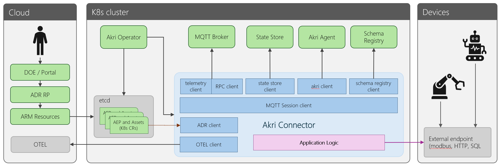

# Akri Connector

## Overview

The Akri Connector is an edge application that is responsible for connecting to asset endpoints, discovering assets, creating schemas, and performing protocol translation on asset payloads between the endpoint and the MQTT Broker.

## Deploying

The Akri Connector is deployed automatically by the Akri Operator, once an asset endpoint profile is defined. The asset endpoint profile describes the type of the endpoint and the associated endpoint connection and authentication configuration. The Akri Operator will then create the required pod on the cluster that is capable of connecting to the endpoint and provide the profile.

## Configuration

The connector has access to the following settings, which is used during configuration and execution.

1. [MQTT Broker](https://learn.microsoft.com/azure/iot-operations/manage-mqtt-broker/overview-iot-mq) configuration - The connection and authentication configuration for the MQTT broker.
1. [Asset endpoint](https://learn.microsoft.com/azure/iot-operations/discover-manage-assets/concept-assets-asset-endpoints#asset-endpoints) profile (AEP) - The connection and authentication configuration for the asset endpoint.
1. [Asset](https://learn.microsoft.com/azure/iot-operations/discover-manage-assets/concept-assets-asset-endpoints#assets_) - Information about each of the assets associated with the endpoint. This contains information about which events of the asset are to be collected as well as events to monitor for state changes, contained in *asset tags* and *asset events*.

## Operations

The connector performs two main functions:

### Asset discovery

Asset discovery involves interrogating the endpoint for potential assets, a component of the endpoint that is of potential interest to monitor or control. 

Once the asset is discovered, a schema is created to describe the asset and this schema is then uploaded to the schema registry. The connector will then notify the Akri Agent of the newly discovered asset.

### Protocol translation

Protocol translation consists of the passing information between the MQTT broker and the asset endpoint. During this transfer, the data will be converted from the json format stored by the broker, into the data format required by the endpoint.

When data arrives from the endpoint to the connector, the payload is decoded and associated with an asset. *Asset tags* and *asset events* are then used to understand which parts of the payload are of interest and what actions need to be performed. 

Payload contents not associated with and asset are discarded.

## Anatomy

The connector will communicate with the different services on the cluster using the Azure IoT Operations SDKs. Each SDK provides a set of clients which provide the means to securely and reliably communicate with each server.

The following is a summary of the SDK clients of interest. For more information, read the [Components](../components.md) documentation.

1. ADR (Azure Device Registry) client: Responsible for reading the asset definitions and asset endpoint profiles from a projected volume. 
1. Akri client: Notify of newly discovered assets.
1. Schema registry client: Set and get asset schemas.
1. State store client: Set and get key value pairs.
1. Telemetry client: Send a telemetry message via the MQTT broker
1. Command client: Send a command via the MQTT broker

## Next steps

Please read the [developing](developing.md) documentation to start building your a new Akri Connector.
