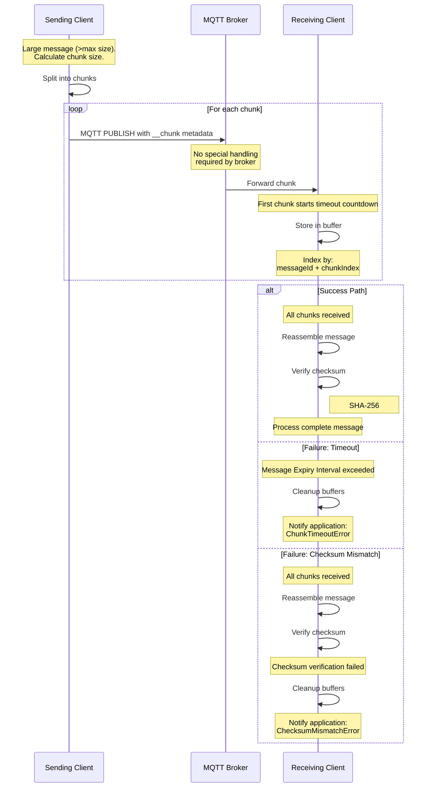

# ADR 23: Large Message Chunking in MQTT Protocol

## Status

Proposed

## Context

The MQTT protocol has inherent message size limitations imposed by brokers and network constraints. Azure IoT Operations scenarios often require transmitting payloads that exceed these limits (e.g., firmware updates, large telemetry batches, complex configurations). Without a standardized chunking mechanism, applications must implement their own fragmentation strategies, leading to inconsistent implementations and interoperability issues.

## Decision

We will implement sdk-level message chunking as part of the Protocol layer to transparently handle messages exceeding the MQTT broker's maximum packet size.

**The chunking mechanism will**:

- Be enabled/disabled by a configuration setting.
- Use standardized user properties for chunk metadata. The `__chunk` user property will contain a colon-separated string with chunking metadata: ```<messageId>:<chunkIndex>:<totalChunks>:<checksum>```. The string will include:
  - `messageId` - UUID string in the 8-4-4-4-12 format, present for every chunk.
  - `chunkIndex` - unsigned 32 bit integer in decimal format, present for every chunk;
  - `totalChunks` - unsigned 32 bit integer in decimal format, present only for the first chunk.
  - `checksum` - SHA-256 hash in hexadecimal format (64 characters long), present only for the first chunk.

**Chunk size calculation:**

- Maximum chunk size will be derived from the MQTT CONNECT packet's Maximum Packet Size.
- Message overhead (MQTT packet headers, topic name, user properties, and other metadata) value will be subtracted from the Maximum Packet Size.

**Chunk Timeout Mechanism**

> [MQTT-3.3.2-6] | The PUBLISH packet sent to a Client by the Server MUST contain a Message Expiry Interval set to the received value minus the time that the message has been waiting in the Server.

The receiving client uses the Message Expiry Interval from the first chunk as the timeout period for collecting all remaining chunks of the message. Chunking mechanism is relaying on the existing Protocol level requirement of having Message Expiry Interval to be set for every message to avoid "forever message" edge case (see below).

Edge case:
- Since the Message Expiry Interval is specified in seconds, chunked messages may behave differently than single messages when the expiry interval is very short (e.g., 1 second remaining). For a single large message, the QoS flow would complete even if the expiry interval expires during transmission. However, with chunking, if the remaining expiry interval is too short to receive all chunks, the message reassembly will fail due to timeout.
- In case of QoS 0 and no Message Expiry Interval (forever message) if any of the chunks lost during transmission client will never cleanup assembler buffer for this message.

**Checksum Algorithm for MQTT Message Chunking**

Chunking will use SHA-256 for checksum calculation.

**Implementation layer:**

- Sending Process:
  - When a payload exceeds the maximum packet size, the message is split into fixed-size chunks (with potentially smaller last chunk)
  - Each chunk is sent as a separate MQTT message with the same topic and with chunk metadata added.
  - Effort should be made to minimize user properties copied over to every chunk: first chunk will have full set of original user properties and the rest only those that are necessary to reassemble original message (ex.: ```$partition``` property to support shared subscriptions).
  - QoS settings are maintained across all chunks.
- Receiving Process:
  - The Chunking aware client receives messages and identifies chunked messages by the presence of chunk metadata.
  - Chunks are stored in a temporary buffer, indexed by message ID and chunk index.
  - When all chunks for a message ID are received, they are reassembled in order and message checksum verified (see Checksum Algorithm Options for MQTT Message Chunking).
  - The reconstructed message is then processed as a single message by the application.
- Receiving Failures:
  - Message timeout interval ended before all chunks received.
  - Calculated checksum does not match checksumm from chunk metadata.

**Configuration settings:**
- Enable/Disable

### Implementation Considerations

- **Error Handling:**
  - Chunk timeout mechanisms (see Chunk Timeout Mechanism)
  - Error propagation to application code
- **Performance Optimization:**
  - Concurrent chunk transmission
  - Efficient memory usage during reassembly

### Benefits

- **Property Preservation:** maintains topic, QoS, and other message properties consistently.
- **Network Optimized:** allows efficient transmission of large payloads over constrained networks.

### Compatibility

- Non-chunking-aware clients will receive individual chunks as separate messages. Chunks reassembly could be implemented on the application side, given described above chunking implementation is known to the application author.

## Appendix

### Message Flow Diagram


