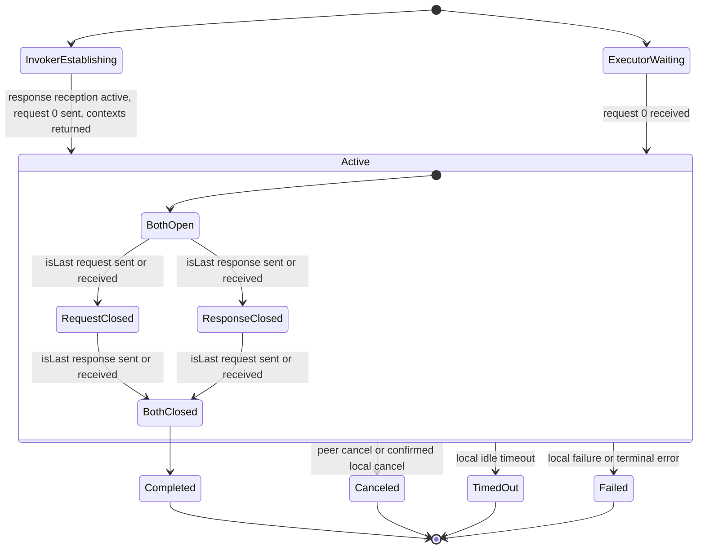
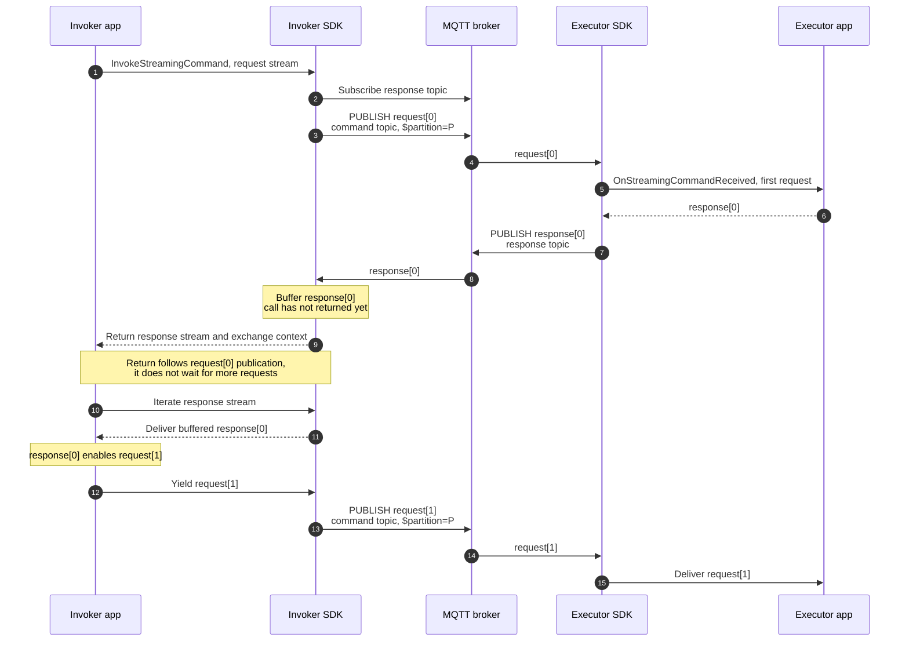
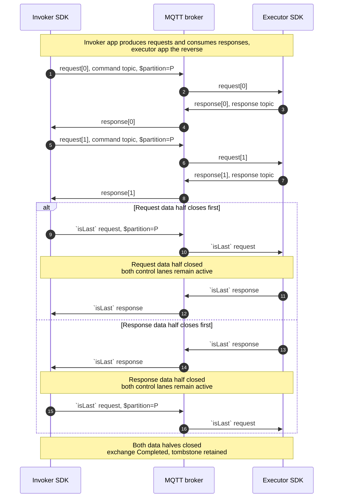
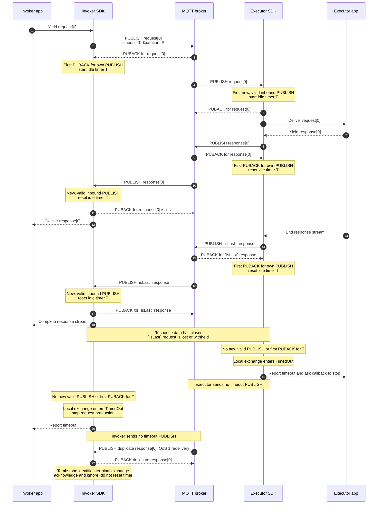
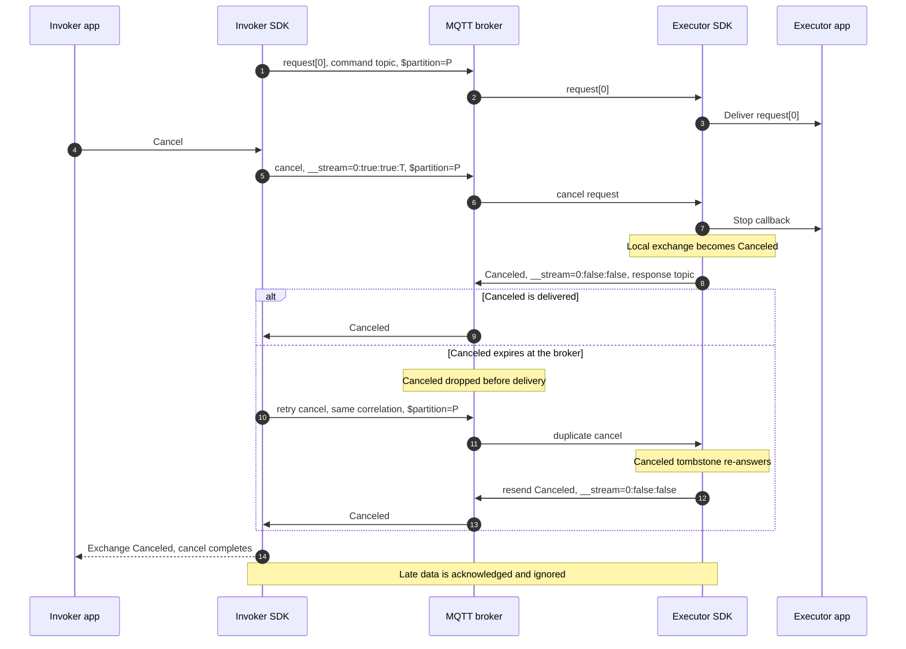
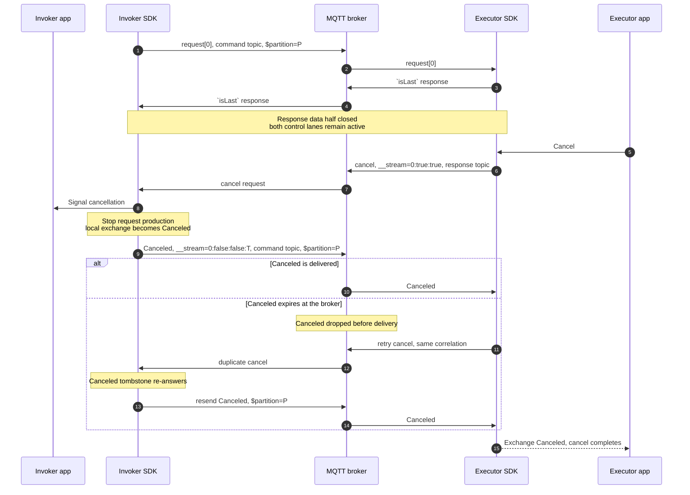
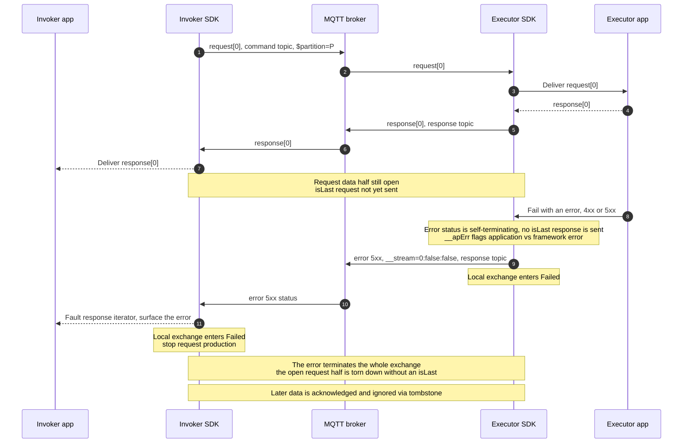
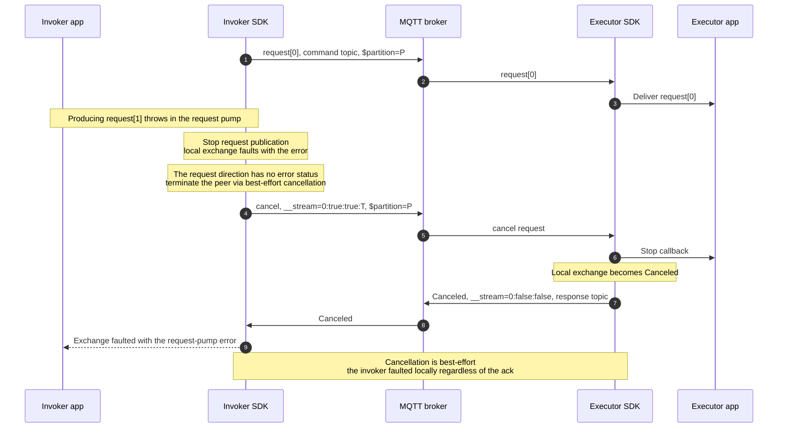
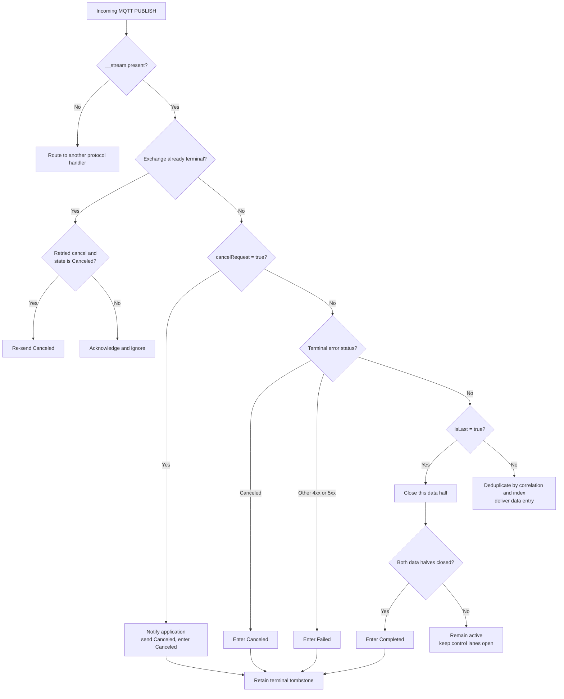

# RPC Streaming Lifecycle Diagrams

> Supplementary, non-authoritative visual reference for [ADR 25: RPC Streaming](0025-rpc-streaming.md).
> The ADR is the source of truth.

## 1. Shared Lifecycle

Read this as one local state machine per role. Sending and receiving in transition labels
mean the invoker and executor views, respectively.

| Data half closes | Invoker event | Executor event |
| --- | --- | --- |
| Request | Sends `isLast` request | Receives `isLast` request |
| Response | Receives `isLast` response | Sends `isLast` response |

`Completed` requires both data halves to close. Any non-success terminal transition ends
the whole exchange from any active half-close state.

## 2. Invoker Establishment and Full Duplex

The invocation returns after the mandatory first request is sent. It does not wait for a
second request or request-stream completion. A fast response can arrive through the broker
before the return and is retained until the application begins iteration.

## 3. Normal Bidirectional Exchange

Requests and responses may interleave. Either data half may close first, but both control
lanes continue carrying exchange controls until the exchange is terminal.

## 4. Exchange Timeout

The stream timeout is an **idle (inactivity)** timeout. The invoker starts its timer on the first
PUBACK for a request PUBLISH, while the executor starts on the first new, valid request PUBLISH it
receives. After that, each side resets its timer when it receives either a new, valid stream PUBLISH
or the first PUBACK for one of its own stream PUBLISH packets. Duplicate, malformed, and late packets
do not count as progress.

A side moves to `TimedOut` only after `T` elapses with no progress. Timeout is purely local: the SDK
reports it to its own application and sends no timeout status, so the peer reaches its own timeout
independently. The sequence below expands every timer-relevant event. It illustrates a broker ordering
in which the executor receives the PUBACK for its final response before the invoker receives that
response, so the executor's last reset occurs first. The roles reverse if the invoker has the earlier
last reset.

Because no timeout status is ever sent, each side simply retains a tombstone for as long as any
in-flight data packet could still arrive, acknowledging and ignoring late or duplicate messages.

## 5. Invoker-Initiated Cancellation

The cancellation request travels on the **command topic** and retains `$partition`. The `Canceled`
status travels on the **response topic**. A lost status can be recovered by retrying the cancellation
request and re-answering from terminal tombstone state.

## 6. Executor-Initiated Cancellation

This example starts after the executor has closed its response data half. The **response topic** still
carries the cancellation request, and the **command topic** still carries the invoker's `Canceled`
acknowledgement.

## 7. Executor Error Status

A response `__stat` error code (`4xx`/`5xx`) is **self-terminating**: the executor sends nothing
further — not even an `isLast` — and the receiver surfaces it as the terminal error. Because the status
is **exchange-scoped**, it ends the whole exchange, tearing down an open request half as well. `__apErr`
distinguishes an application error the command returned (`true`) from a framework or protocol error
(`false`). This is a **response-direction** terminal; the request direction has no equivalent (see §8).

If the invoker's response iterator has already completed via `isLast`, a later error is observed only
through the exchange context's completion rather than faulting the already-finished iterator.

## 8. Request-Side Failure and Cancellation

The request direction carries no outcome `__stat`, so a request-side failure — the request pump
throwing, or the application abandoning the exchange — cannot self-terminate with an error. Instead the
invoker faults its local exchange with the error, stops publishing, and terminates the peer through a
best-effort **cancellation**; the only terminal status the request direction ever carries is `Canceled`.

The cancellation is best-effort: the invoker has already faulted locally and surfaces the original
error regardless of whether the `Canceled` acknowledgement arrives.

## 9. Incoming Packet Classification and Terminal Races

This classifier assumes correlation lookup has found an active exchange or a retained
terminal tombstone. Initial request validation is outside this diagram. A timeout is never
received as a packet — it is a local idle event (see §4) — so it does not appear here.

## Coverage

| Diagram | ADR concern |
| --- | --- |
| Shared lifecycle | Core abstractions, graceful completion, terminal states |
| Invoker establishment | Full-duplex return semantics and early-response buffering |
| Normal exchange | Interleaving, independent half-close, control-lane lifetime |
| Timeout | Idle timers reset on progress, both sides terminate locally with no wire status, tombstones |
| Invoker cancellation | Command-topic affinity, retries, `Canceled` response |
| Executor cancellation | Control after half-close, request-direction `Canceled` |
| Executor error | Self-terminating response `__stat`, whole-exchange teardown, `__apErr` |
| Request-side failure | Request direction has no error status, best-effort cancellation |
| Packet classification | `__stream` routing, terminal precedence, late packets |
