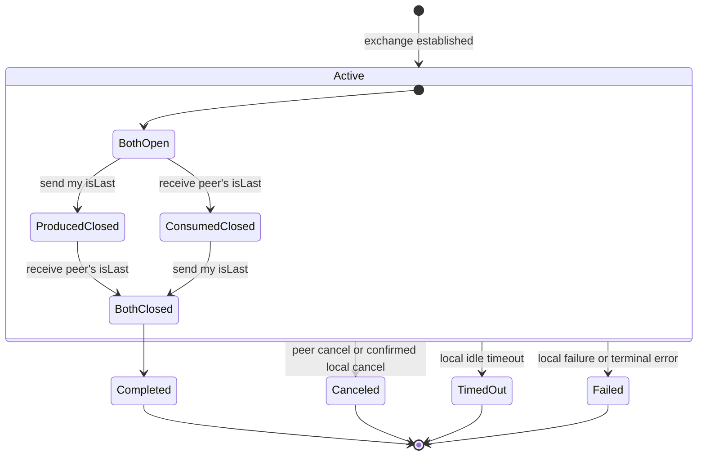
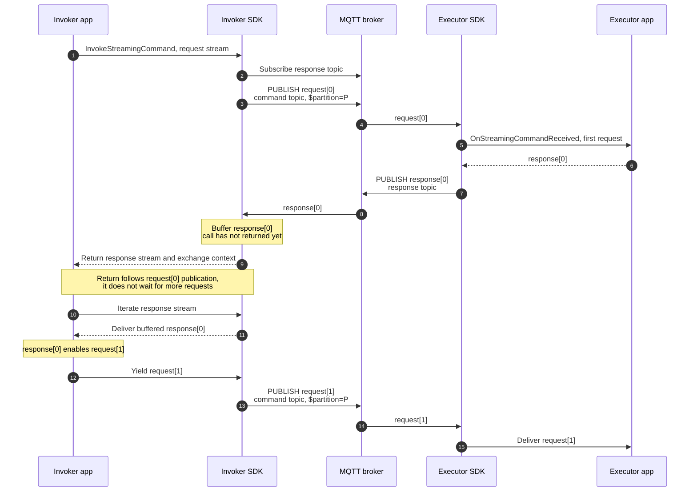
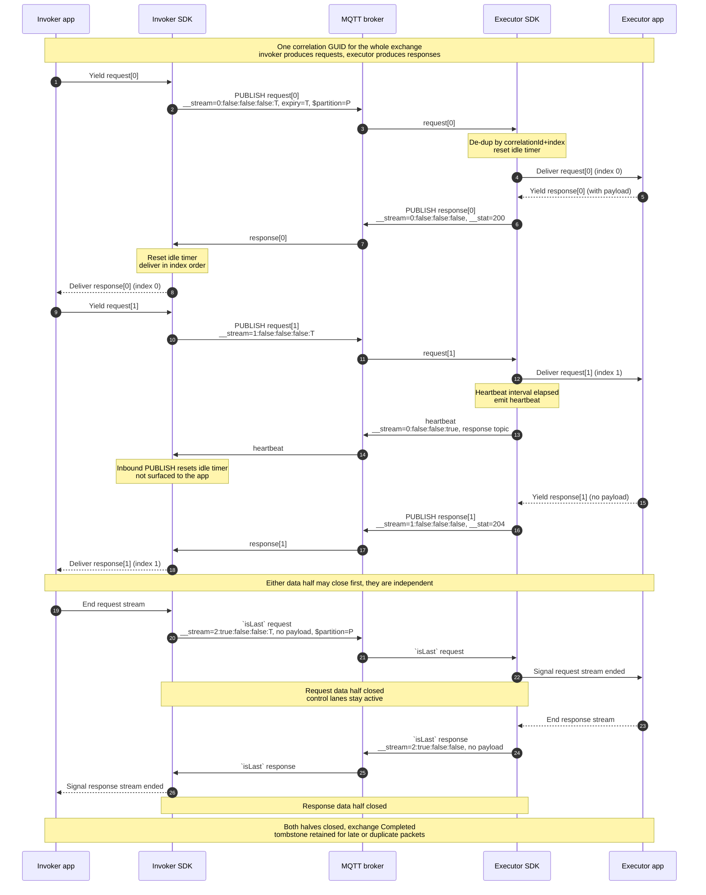
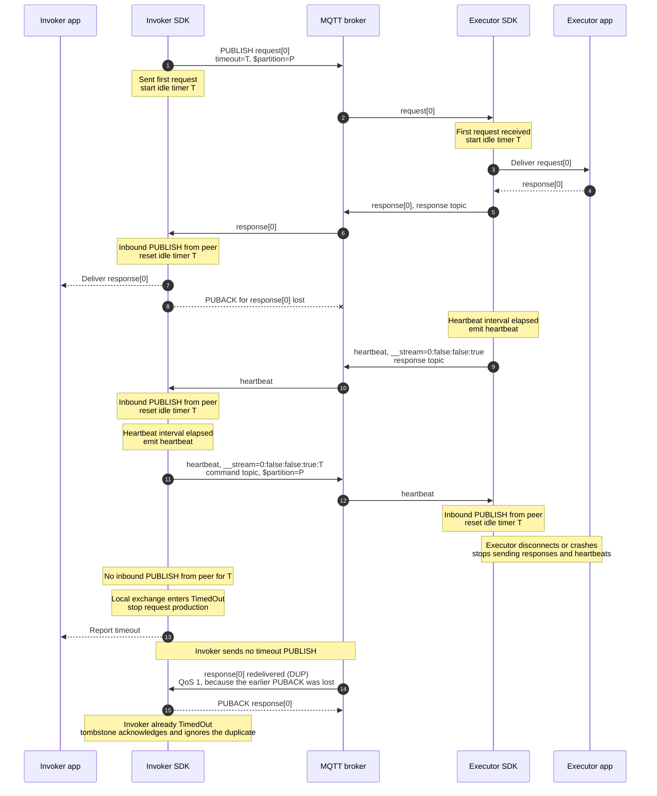
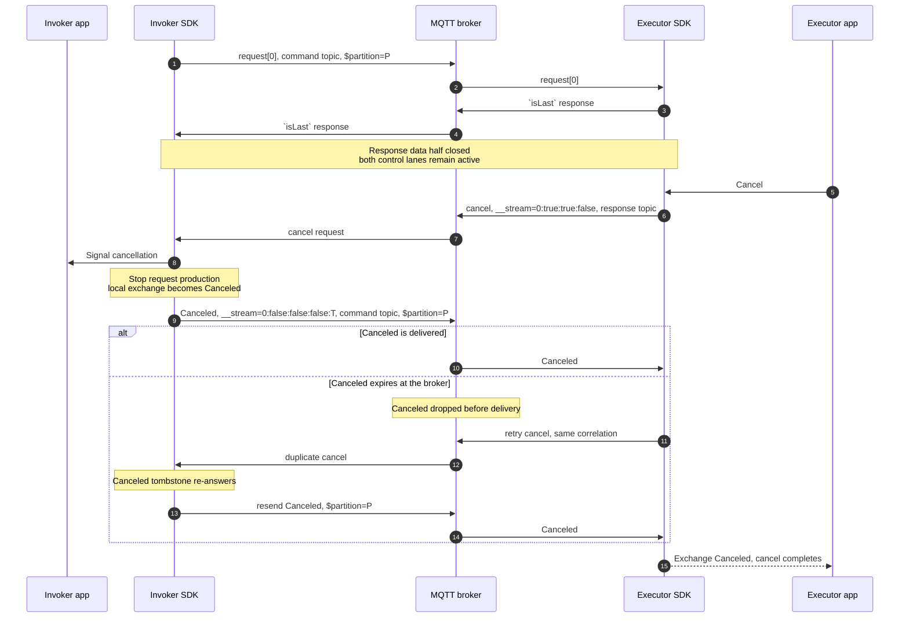
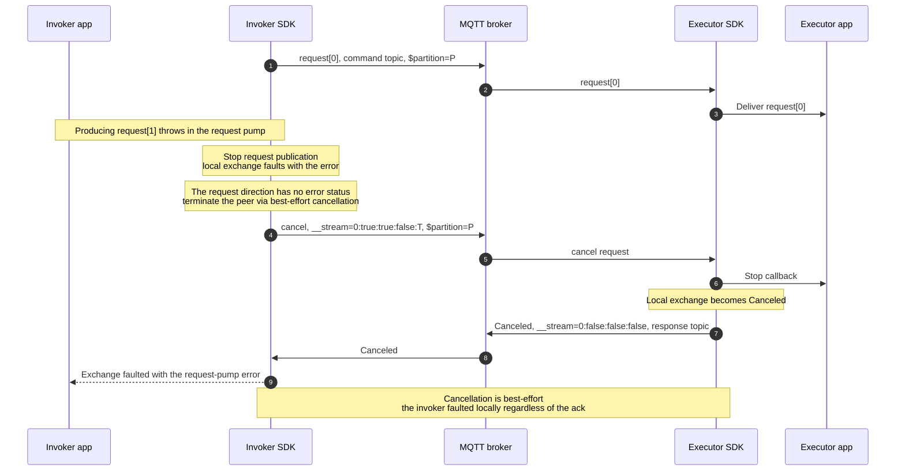
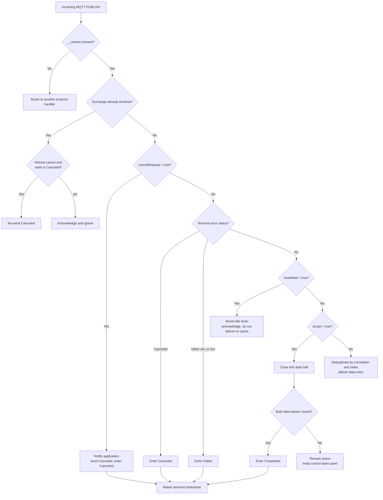

# RPC Streaming Lifecycle Diagrams

> Supplementary, non-authoritative visual reference for [ADR 25: RPC Streaming](0025-rpc-streaming.md).
> The ADR is the source of truth.

## 1. Shared Lifecycle

Both roles run the **same** local state machine. Each side **produces** one stream and **consumes** the
other, and the transition labels are written from that side's own view: *my* `isLast` closes the stream
I produce, and the *peer's* `isLast` closes the stream I consume. The exchange is **gracefully complete**
only once *both* halves are closed.

| Role | Produces — closed by *my* `isLast` | Consumes — closed by *peer's* `isLast` |
| --- | --- | --- |
| Invoker | request stream | response stream |
| Executor | response stream | request stream |

A non-success terminal — `Canceled`, `TimedOut`, or `Failed` — ends the whole exchange from any active
state, regardless of which halves are still open. Establishment is role-specific (the invoker sends
`request[0]`; the executor receives it); see §2.

## 2. Invoker Establishment and Full Duplex

The invocation returns after the mandatory first request is sent. It does not wait for a
second request or request-stream completion. A fast response can arrive through the broker
before the return and is retained until the application begins iteration.

## 3. Normal Bidirectional Exchange

A fuller happy path across both apps and SDKs. Beyond the interleaved data flow it shows per-entry
**indexes**, the `__stream` header, response **`__stat`** (`200` with a payload, `204` without), a
regular **heartbeat** filling a quiet gap, de-dup and idle-timer reset on receipt, standalone `isLast`,
and independent half-close. Requests and responses may interleave, either data half may close first, and
both control lanes stay active until the exchange is terminal.

## 4. Exchange Timeout

The stream timeout is an **idle (inactivity)** timeout. The invoker starts its timer when it sends its
first request; the executor starts when it receives the first request. After that, each side resets its
timer only on a valid PUBLISH **received from the peer** — a heartbeat, data, an `isLast`, or a
cancellation. A side's own sends, and the PUBACKs for them, do not reset it; duplicate, malformed, and
late packets do not count either.

Because each side emits [heartbeats](0025-rpc-streaming.md#stream-level-timeout) at a regular interval
(half of `T`, so about two per window), a live peer keeps resetting the timer even when it has no data
to send. A side moves to `TimedOut` only after `T` elapses with no inbound PUBLISH from the peer — that
is, once the peer stops both its data and its heartbeats (a crash, a disconnect, or completion with a
lost final message). Timeout is purely local: the SDK reports it to its own application and sends no
timeout status, so the peer reaches its own timeout independently. The sequence below shows the executor
going silent; the invoker then times out. The symmetric case — the invoker going silent and the
executor timing out — works identically.

Because no timeout status is ever sent, each side simply retains a tombstone for as long as any
in-flight data packet could still arrive. In the example, the invoker's PUBACK for `response[0]` is
lost, so the broker redelivers it (QoS 1, `DUP` set); arriving after the invoker has timed out, it is
matched to the tombstone, acknowledged, and ignored.

## 5. Invoker-Initiated Cancellation

The cancellation request travels on the **command topic** and retains `$partition`. The `Canceled`
status travels on the **response topic**. A lost status can be recovered by retrying the cancellation
request and re-answering from terminal tombstone state.

## 6. Executor-Initiated Cancellation

This example starts after the executor has closed its response data half. The **response topic** still
carries the cancellation request, and the **command topic** still carries the invoker's `Canceled`
acknowledgement.

## 7. Executor Error Status

A response `__stat` error code (`4xx`/`5xx`) is **self-terminating**: the executor sends nothing
further — not even an `isLast` — and the receiver surfaces it as the terminal error. Because the status
is **exchange-scoped**, it ends the whole exchange, tearing down an open request half as well. `__apErr`
distinguishes an application error the command returned (`true`) from a framework or protocol error
(`false`). This is a **response-direction** terminal; the request direction has no equivalent (see §8).

If the invoker's response iterator has already completed via `isLast`, a later error is observed only
through the exchange context's completion rather than faulting the already-finished iterator.

## 8. Request-Side Failure and Cancellation

The request direction carries no outcome `__stat`, so a request-side failure — the request pump
throwing, or the application abandoning the exchange — cannot self-terminate with an error. Instead the
invoker faults its local exchange with the error, stops publishing, and terminates the peer through a
best-effort **cancellation**; the only terminal status the request direction ever carries is `Canceled`.

The cancellation is best-effort: the invoker has already faulted locally and surfaces the original
error regardless of whether the `Canceled` acknowledgement arrives.

## 9. Incoming Packet Classification and Terminal Races

This classifier assumes correlation lookup has found an active exchange or a retained
terminal tombstone. Initial request validation is outside this diagram. A timeout is never
received as a packet — it is a local idle event (see §4) — so it does not appear here.

## Coverage

| Diagram | ADR concern |
| --- | --- |
| Shared lifecycle | Core abstractions, graceful completion, terminal states |
| Invoker establishment | Full-duplex return semantics and early-response buffering |
| Normal exchange | Interleaving, independent half-close, control-lane lifetime |
| Timeout | Idle timers reset on PUBLISHes received from the peer, heartbeats keep them alive, both sides terminate locally with no wire status, tombstones |
| Invoker cancellation | Command-topic affinity, retries, `Canceled` response |
| Executor cancellation | Control after half-close, request-direction `Canceled` |
| Executor error | Self-terminating response `__stat`, whole-exchange teardown, `__apErr` |
| Request-side failure | Request direction has no error status, best-effort cancellation |
| Packet classification | `__stream` routing, terminal precedence, late packets |
