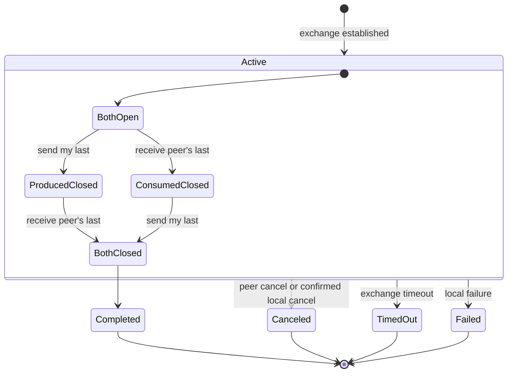
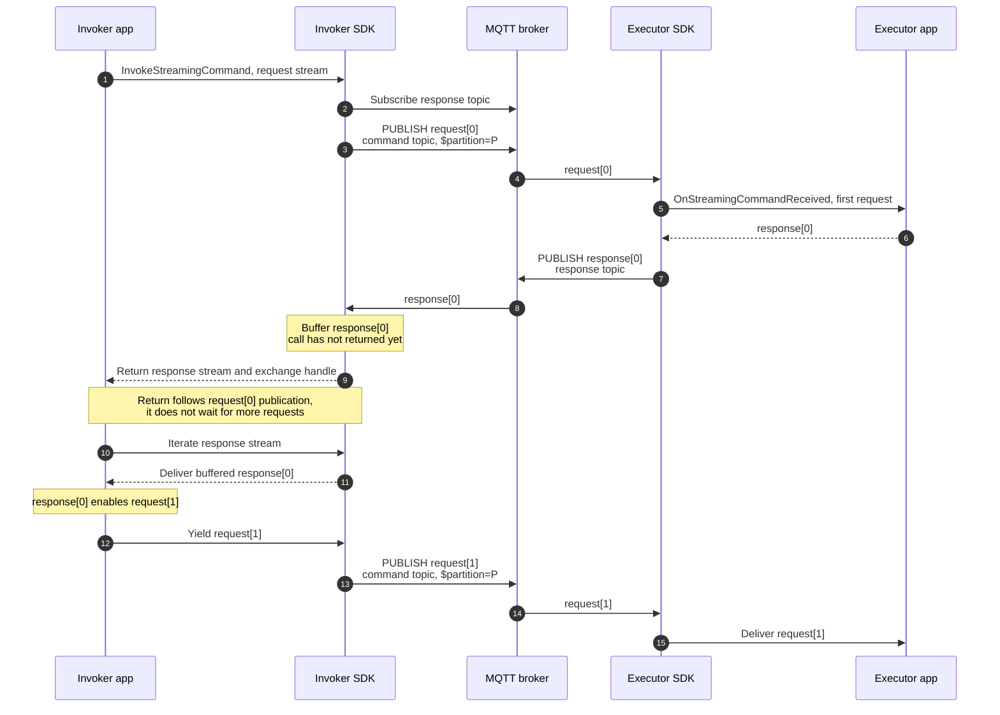
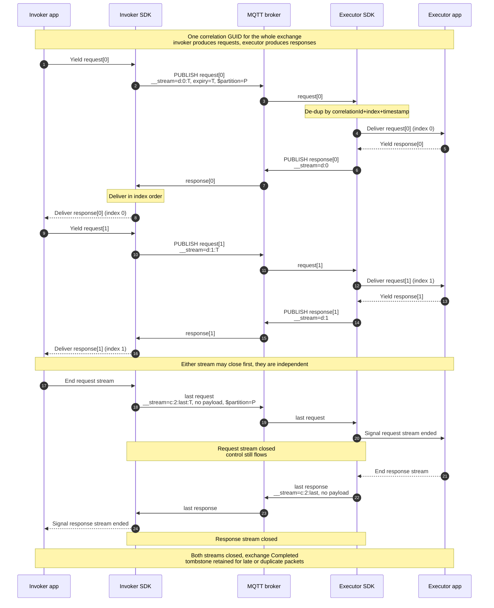
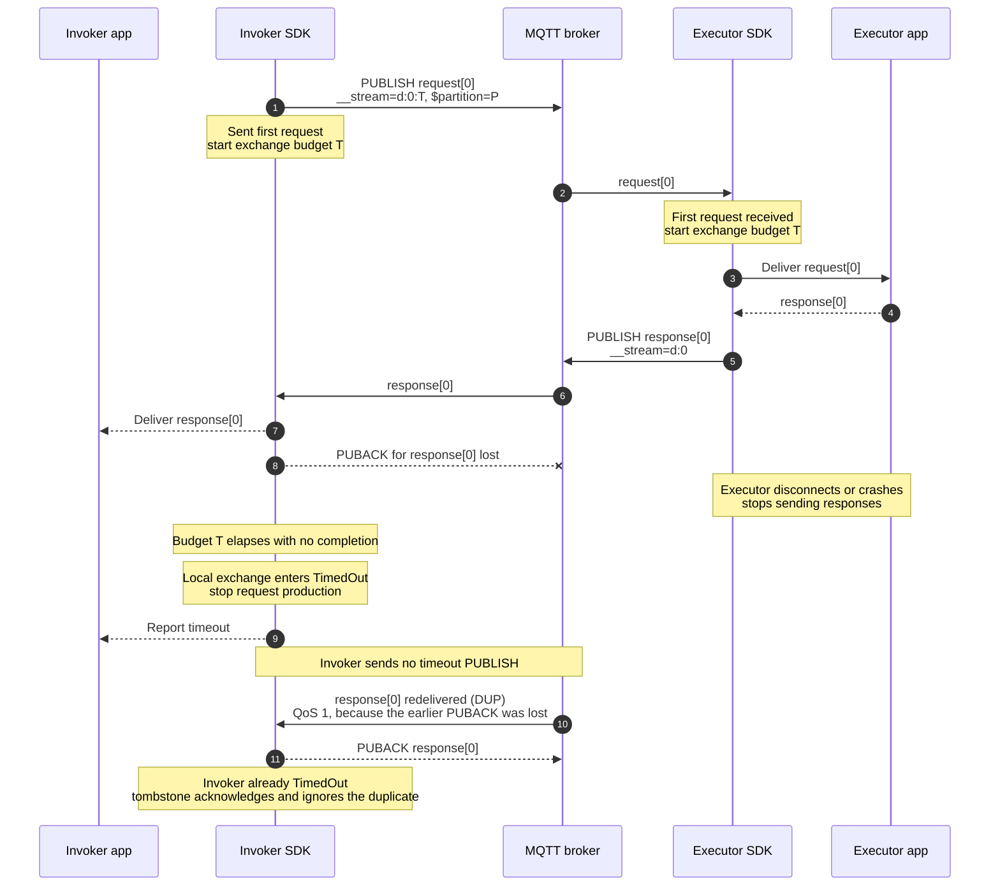
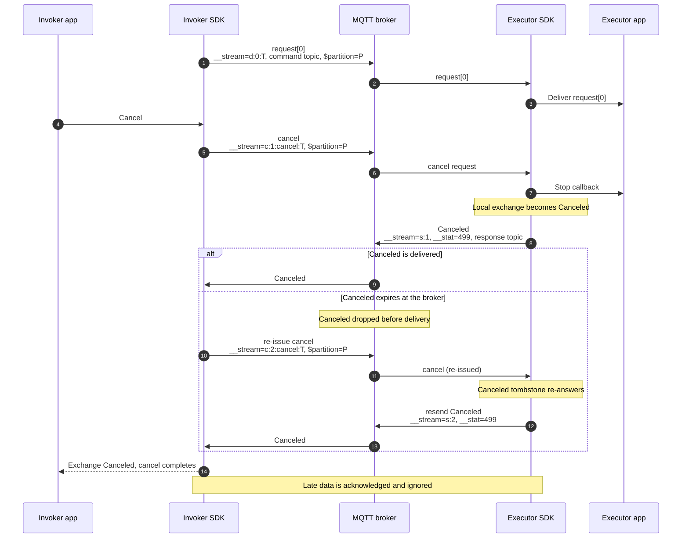
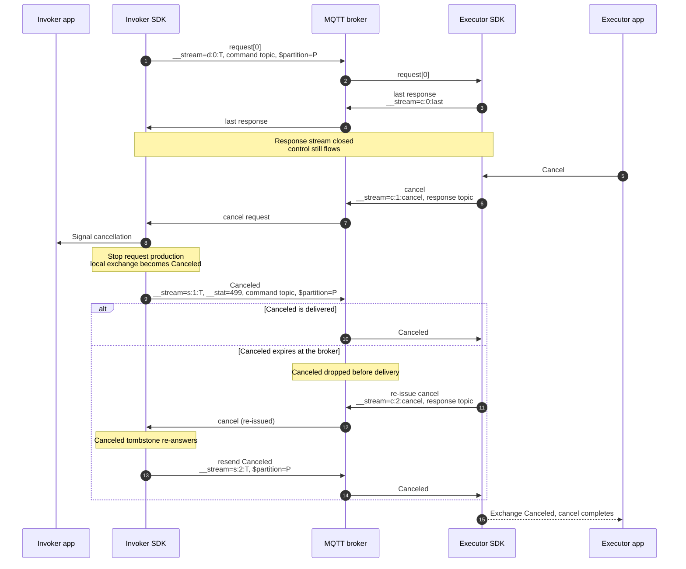
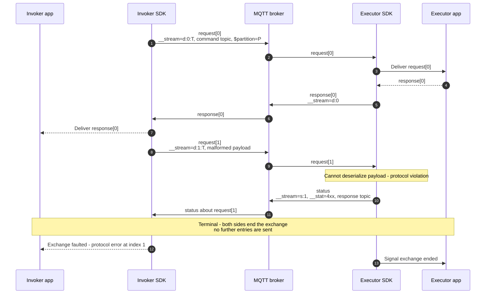
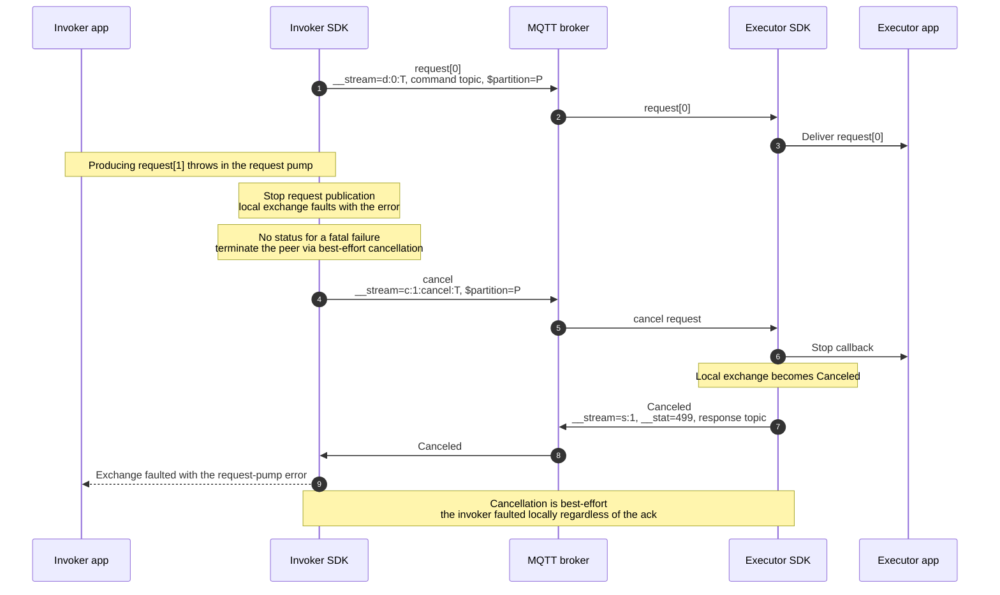
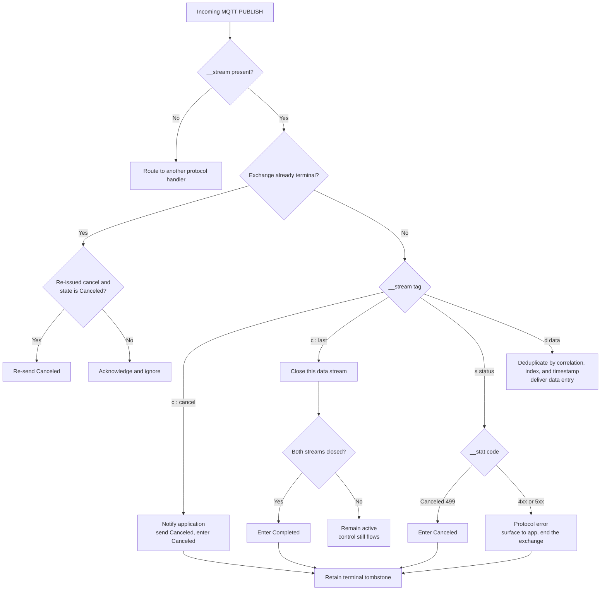
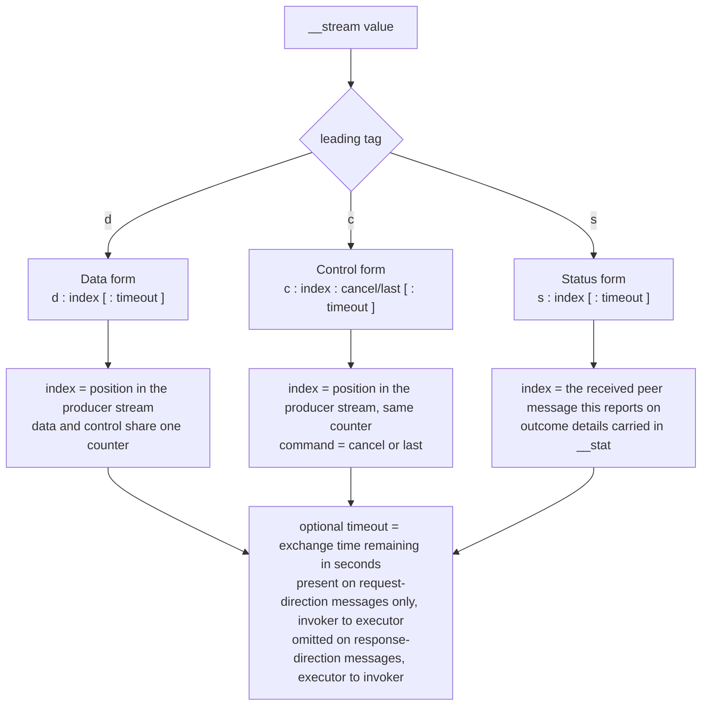

# RPC Streaming Lifecycle Diagrams

> Supplementary, non-authoritative visual reference for [ADR 25: RPC Streaming](0025-rpc-streaming.md).
> The ADR is the source of truth.

## 1. Shared Lifecycle

Both roles run the **same** local state machine. Each side **produces** one stream and **consumes** the
other, and the transition labels are written from that side's own view: *my* `last` closes the stream
I produce, and the *peer's* `last` closes the stream I consume. The exchange is **gracefully complete**
only once *both* streams are closed.

| Role | Produces — closed by *my* `last` | Consumes — closed by *peer's* `last` |
| --- | --- | --- |
| Invoker | request stream | response stream |
| Executor | response stream | request stream |

```mermaid
stateDiagram-v2
    [*] --> Active: exchange established

    state Active {
        [*] --> BothOpen
        BothOpen --> ProducedClosed: send my last
        BothOpen --> ConsumedClosed: receive peer's last
        ProducedClosed --> BothClosed: receive peer's last
        ConsumedClosed --> BothClosed: send my last
    }

    BothClosed --> Completed
    Active --> Canceled: peer cancel or confirmed local cancel
    Active --> TimedOut: exchange timeout
    Active --> Failed: local failure

    Completed --> [*]
    Canceled --> [*]
    TimedOut --> [*]
    Failed --> [*]
```

A non-success terminal — `Canceled`, `TimedOut`, or `Failed` — ends the whole exchange from any active
state, regardless of which streams are still open. A local `Failed` triggers a best-effort cancellation toward the peer, which observes `Canceled` or its own timeout. Establishment is role-specific (the invoker sends
`request[0]`; the executor receives it); see §2.

## 2. Invoker Establishment and Full Duplex

The invocation returns after the mandatory first request is sent. It does not wait for a
second request or request-stream completion. A fast response can arrive through the broker
before the return and is retained until the application begins iteration.

```mermaid
sequenceDiagram
    autonumber
    participant IA as Invoker app
    participant IS as Invoker SDK
    participant B as MQTT broker
    participant ES as Executor SDK
    participant EA as Executor app

    IA->>IS: InvokeStreamingCommand, request stream
    IS->>B: Subscribe response topic
    IS->>B: PUBLISH request[0]<br/>command topic, $partition=P
    B->>ES: request[0]
    ES->>EA: OnStreamingCommandReceived, first request
    EA-->>ES: response[0]
    ES->>B: PUBLISH response[0]<br/>response topic
    B->>IS: response[0]
    Note over IS: Buffer response[0]<br/>call has not returned yet
    IS-->>IA: Return response stream and exchange handle
    Note over IA,IS: Return follows request[0] publication,<br/>it does not wait for more requests
    IA->>IS: Iterate response stream
    IS-->>IA: Deliver buffered response[0]
    Note over IA: response[0] enables request[1]
    IA->>IS: Yield request[1]
    IS->>B: PUBLISH request[1]<br/>command topic, $partition=P
    B->>ES: request[1]
    ES->>EA: Deliver request[1]
```

## 3. Normal Bidirectional Exchange

A fuller happy path across both apps and SDKs. Beyond the interleaved data flow it shows per-entry
**indexes**, the `__stream` header, de-dup on receipt, standalone `last`, and independent stream-close.
Requests and responses may interleave, either stream may close first, and control still flows until the
exchange is terminal.

```mermaid
sequenceDiagram
    autonumber
    participant IA as Invoker app
    participant IS as Invoker SDK
    participant B as MQTT broker
    participant ES as Executor SDK
    participant EA as Executor app

    Note over IA,EA: One correlation GUID for the whole exchange<br/>invoker produces requests, executor produces responses

    IA->>IS: Yield request[0]
    IS->>B: PUBLISH request[0]<br/>__stream=d:0:T, expiry=T, $partition=P
    B->>ES: request[0]
    Note over ES: De-dup by correlationId+index+timestamp
    ES->>EA: Deliver request[0] (index 0)

    EA-->>ES: Yield response[0]
    ES->>B: PUBLISH response[0]<br/>__stream=d:0
    B->>IS: response[0]
    Note over IS: Deliver in index order
    IS-->>IA: Deliver response[0] (index 0)

    IA->>IS: Yield request[1]
    IS->>B: PUBLISH request[1]<br/>__stream=d:1:T
    B->>ES: request[1]
    ES->>EA: Deliver request[1] (index 1)

    EA-->>ES: Yield response[1]
    ES->>B: PUBLISH response[1]<br/>__stream=d:1
    B->>IS: response[1]
    IS-->>IA: Deliver response[1] (index 1)

    Note over IA,EA: Either stream may close first, they are independent

    IA->>IS: End request stream
    IS->>B: last request<br/>__stream=c:2:last:T, no payload, $partition=P
    B->>ES: last request
    ES->>EA: Signal request stream ended
    Note over IS,ES: Request stream closed<br/>control still flows

    EA-->>ES: End response stream
    ES->>B: last response<br/>__stream=c:2:last, no payload
    B->>IS: last response
    IS-->>IA: Signal response stream ended
    Note over IS,ES: Response stream closed

    Note over IA,EA: Both streams closed, exchange Completed<br/>tombstone retained for late or duplicate packets
```

## 4. Exchange Timeout

The exchange timeout is a single overall budget for the whole exchange, not an inactivity timer — it
does **not** reset on activity. The invoker starts its countdown when it sends its first request; the
executor starts when it receives the first request. Each request-direction message carries the invoker's
**remaining** budget in `__stream` (`d:0:T`, `c:…:T`, `s:…:T`), so a replacement executor can resume
mid-stream with the true time left.

A side moves to `TimedOut` once its budget elapses before [graceful completion](0025-rpc-streaming.md#exchange-completion)
— a lost final message, or a stalled or crashed peer. Timeout is purely local: the side reports it to
its own application and sends no timeout status, so the peer reaches its own timeout independently. The
sequence below shows the executor going silent; the invoker's budget then elapses. The symmetric case —
the invoker going silent and the executor timing out — works identically.

```mermaid
sequenceDiagram
    autonumber
    participant IA as Invoker app
    participant IS as Invoker SDK
    participant B as MQTT broker
    participant ES as Executor SDK
    participant EA as Executor app

    IS->>B: PUBLISH request[0]<br/>__stream=d:0:T, $partition=P
    Note over IS: Sent first request<br/>start exchange budget T
    B->>ES: request[0]
    Note over ES: First request received<br/>start exchange budget T
    ES->>EA: Deliver request[0]
    EA-->>ES: response[0]
    ES->>B: PUBLISH response[0]<br/>__stream=d:0
    B->>IS: response[0]
    IS-->>IA: Deliver response[0]
    IS--xB: PUBACK for response[0] lost

    Note over ES,EA: Executor disconnects or crashes<br/>stops sending responses
    Note over IS: Budget T elapses with no completion
    Note over IS: Local exchange enters TimedOut<br/>stop request production
    IS-->>IA: Report timeout
    Note over IS,B: Invoker sends no timeout PUBLISH

    B->>IS: response[0] redelivered (DUP)<br/>QoS 1, because the earlier PUBACK was lost
    IS-->>B: PUBACK response[0]
    Note over IS: Invoker already TimedOut<br/>tombstone acknowledges and ignores the duplicate
```

Because no timeout status is ever sent, each side simply retains a tombstone for as long as any
in-flight data packet could still arrive. In the example, the invoker's PUBACK for `response[0]` is
lost, so the broker redelivers it (QoS 1, `DUP` set); arriving after the invoker has timed out, it is
matched to the tombstone, acknowledged, and ignored.

## 5. Invoker-Initiated Cancellation

The cancellation request travels on the **command topic** and retains `$partition`; the `Canceled`
status travels on the **response topic**. A lost `Canceled` is recovered by re-issuing the cancellation
(a fresh index) and re-answering from terminal tombstone state.

```mermaid
sequenceDiagram
    autonumber
    participant IA as Invoker app
    participant IS as Invoker SDK
    participant B as MQTT broker
    participant ES as Executor SDK
    participant EA as Executor app

    IS->>B: request[0]<br/>__stream=d:0:T, command topic, $partition=P
    B->>ES: request[0]
    ES->>EA: Deliver request[0]
    IA->>IS: Cancel
    IS->>B: cancel<br/>__stream=c:1:cancel:T, $partition=P
    B->>ES: cancel request
    ES->>EA: Stop callback
    Note over ES: Local exchange becomes Canceled
    ES->>B: Canceled<br/>__stream=s:1, __stat=499, response topic

    alt Canceled is delivered
        B->>IS: Canceled
    else Canceled expires at the broker
        Note over B: Canceled dropped before delivery
        IS->>B: re-issue cancel<br/>__stream=c:2:cancel:T, $partition=P
        B->>ES: cancel (re-issued)
        Note over ES: Canceled tombstone re-answers
        ES->>B: resend Canceled<br/>__stream=s:2, __stat=499
        B->>IS: Canceled
    end

    IS-->>IA: Exchange Canceled, cancel completes
    Note over IS,ES: Late data is acknowledged and ignored
```

## 6. Executor-Initiated Cancellation

This example starts after the executor has closed its response stream. The **response topic** still
carries the cancellation request, and the **command topic** still carries the invoker's `Canceled`
acknowledgement — control still flows after `last`.

```mermaid
sequenceDiagram
    autonumber
    participant IA as Invoker app
    participant IS as Invoker SDK
    participant B as MQTT broker
    participant ES as Executor SDK
    participant EA as Executor app

    IS->>B: request[0]<br/>__stream=d:0:T, command topic, $partition=P
    B->>ES: request[0]
    ES->>B: last response<br/>__stream=c:0:last
    B->>IS: last response
    Note over IS,ES: Response stream closed<br/>control still flows
    EA->>ES: Cancel
    ES->>B: cancel<br/>__stream=c:1:cancel, response topic
    B->>IS: cancel request
    IS->>IA: Signal cancellation
    Note over IS: Stop request production<br/>local exchange becomes Canceled
    IS->>B: Canceled<br/>__stream=s:1:T, __stat=499, command topic, $partition=P

    alt Canceled is delivered
        B->>ES: Canceled
    else Canceled expires at the broker
        Note over B: Canceled dropped before delivery
        ES->>B: re-issue cancel<br/>__stream=c:2:cancel, response topic
        B->>IS: cancel (re-issued)
        Note over IS: Canceled tombstone re-answers
        IS->>B: resend Canceled<br/>__stream=s:2:T, $partition=P
        B->>ES: Canceled
    end

    ES-->>EA: Exchange Canceled, cancel completes
```

## 7. Protocol Error Terminates the Exchange

A **protocol violation** — a correlation-matched message that breaks the wire contract (an undeserializable
payload, a malformed `__stream`, an incompatible protocol version, a QoS 0 publish, or a sequencing break) —
is **terminal**. The recipient sends a status message (`s:<index>` + `__stat` `4xx`/`5xx`) back to the
sender identifying the offending entry, and **both parties then end the exchange** and send no further
entries. The index is diagnostic context only. Application-level outcomes are **out of scope** — the
protocol does not carry them, so an application signals one in its own `d` data entries, not as a status.

```mermaid
sequenceDiagram
    autonumber
    participant IA as Invoker app
    participant IS as Invoker SDK
    participant B as MQTT broker
    participant ES as Executor SDK
    participant EA as Executor app

    IS->>B: request[0]<br/>__stream=d:0:T, command topic, $partition=P
    B->>ES: request[0]
    ES->>EA: Deliver request[0]
    EA-->>ES: response[0]
    ES->>B: response[0]<br/>__stream=d:0
    B->>IS: response[0]
    IS-->>IA: Deliver response[0]

    IS->>B: request[1]<br/>__stream=d:1:T, malformed payload
    B->>ES: request[1]
    Note over ES: Cannot deserialize payload - protocol violation
    ES->>B: status<br/>__stream=s:1, __stat=4xx, response topic
    B->>IS: status about request[1]
    Note over IA,EA: Terminal - both sides end the exchange<br/>no further entries are sent
    IS-->>IA: Exchange faulted - protocol error at index 1
    ES->>EA: Signal exchange ended
```

A protocol violation ends the exchange for both parties (see §1 and the ADR
[error handling](0025-rpc-streaming.md#error-handling)). A message with no reported status was accepted —
success is implicit.

## 8. Fatal Failure and Best-Effort Cancellation

A **fatal failure** — the request pump throwing, an unhandled exception, or an application abandoning the
exchange — has no status of its own to send (unlike a protocol violation — see §7): it is handled by
faulting the local exchange and terminating the peer through a best-effort **cancellation**. The example
shows the invoker's request pump throwing.

```mermaid
sequenceDiagram
    autonumber
    participant IA as Invoker app
    participant IS as Invoker SDK
    participant B as MQTT broker
    participant ES as Executor SDK
    participant EA as Executor app

    IS->>B: request[0]<br/>__stream=d:0:T, command topic, $partition=P
    B->>ES: request[0]
    ES->>EA: Deliver request[0]
    Note over IA,IS: Producing request[1] throws in the request pump
    Note over IS: Stop request publication<br/>local exchange faults with the error
    Note over IS: No status for a fatal failure<br/>terminate the peer via best-effort cancellation
    IS->>B: cancel<br/>__stream=c:1:cancel:T, $partition=P
    B->>ES: cancel request
    ES->>EA: Stop callback
    Note over ES: Local exchange becomes Canceled
    ES->>B: Canceled<br/>__stream=s:1, __stat=499, response topic
    B->>IS: Canceled
    IS-->>IA: Exchange faulted with the request-pump error
    Note over IS,ES: Cancellation is best-effort<br/>the invoker faulted locally regardless of the ack
```

The cancellation is best-effort: the invoker has already faulted locally and surfaces the original
error regardless of whether the `Canceled` acknowledgement arrives.

## 9. Incoming Packet Classification and Terminal Races

This classifier assumes correlation lookup has found an active exchange or a retained
terminal tombstone. Initial request validation is outside this diagram. A timeout is never
received as a packet — it is a local event (see §4) — so it does not appear here.

```mermaid
flowchart TD
    P["Incoming MQTT PUBLISH"] --> S{"__stream present?"}
    S -- "No" --> O["Route to another protocol handler"]
    S -- "Yes" --> T{"Exchange already terminal?"}
    T -- "Yes" --> RC{"Re-issued cancel and<br/>state is Canceled?"}
    RC -- "Yes" --> RA["Re-send Canceled"]
    RC -- "No" --> AI["Acknowledge and ignore"]
    T -- "No" --> TAG{"__stream tag"}
    TAG -- "c : cancel" --> PC["Notify application<br/>send Canceled, enter Canceled"]
    TAG -- "c : last" --> HC["Close this data stream"]
    HC --> BC{"Both streams closed?"}
    BC -- "Yes" --> CO["Enter Completed"]
    BC -- "No" --> AC["Remain active<br/>control still flows"]
    TAG -- "s status" --> ST{"__stat code"}
    ST -- "Canceled 499" --> CAN["Enter Canceled"]
    ST -- "4xx or 5xx" --> PE["Protocol error<br/>surface to app, end the exchange"]
    TAG -- "d data" --> D["Deduplicate by correlation, index, and timestamp<br/>deliver data entry"]
    PC --> TS["Retain terminal tombstone"]
    CAN --> TS
    CO --> TS
    PE --> TS
```

## 10. `__stream` Property Anatomy

Every streaming PUBLISH carries a `__stream` user property whose value takes one of **three tagged
forms**, chosen by a leading tag: **data** (`d`) for a stream entry, **control** (`c`) for a
`last`/`cancel` signal, and **status** (`s`) for an outcome reported about a received message (details
in the companion `__stat`). Because the form is tagged, a value only ever carries the fields that apply
to it. Data and control messages share a single per-producer index counter; a status message's index
instead names the **received** (peer's) message it reports on. The optional trailing timeout — the
invoker's remaining exchange budget in whole seconds — appears **only on request-direction messages**
(invoker → executor) and is omitted on the response direction, since the invoker sets it and cannot be
recovered mid-stream. See [the ADR](0025-rpc-streaming.md#streaming-user-property) for the authoritative
grammar.

```mermaid
flowchart TD
    V["__stream value"] --> TAG{"leading tag"}

    TAG -->|d| D["Data form<br/>d : index [ : timeout ]"]
    TAG -->|c| C["Control form<br/>c : index : cancel/last [ : timeout ]"]
    TAG -->|s| S["Status form<br/>s : index [ : timeout ]"]

    D --> DN["index = position in the producer stream<br/>data and control share one counter"]
    C --> CN["index = position in the producer stream, same counter<br/>command = cancel or last"]
    S --> SN["index = the received peer message this reports on<br/>outcome details carried in __stat"]

    DN --> TN["optional timeout = exchange time remaining in seconds<br/>present on request-direction messages only, invoker to executor<br/>omitted on response-direction messages, executor to invoker"]
    CN --> TN
    SN --> TN
```

Concrete values — **request direction** (invoker → executor), timeout `T` present: `d:0:T` (data entry
0), `c:2:cancel:T` (cancel at producer index 2), `s:1:T` (status about received response 1).
**Response direction** (executor → invoker), timeout omitted: `d:0`, `c:7:last`, `s:3`.

## Coverage

| Diagram | ADR concern |
| --- | --- |
| Shared lifecycle | Core abstractions, graceful completion, terminal states |
| Invoker establishment | Full-duplex return semantics and early-response buffering |
| Normal exchange | Interleaving, independent stream-close, control lifetime after `last` |
| Timeout | Overall exchange budget from each side's start, no reset, both sides terminate locally with no wire status, tombstones |
| Invoker cancellation | Command-topic affinity, re-issue, `Canceled` status |
| Executor cancellation | Control after stream-close, request-direction `Canceled` |
| Protocol error | Terminal status about a violating message, ends the exchange for both sides |
| Fatal failure | No status of its own, best-effort cancellation |
| Packet classification | `__stream` tag routing, terminal precedence, late packets |
| `__stream` anatomy | The three tagged value forms, shared data/control index counter, status `__stat`, request-direction-only timeout |
