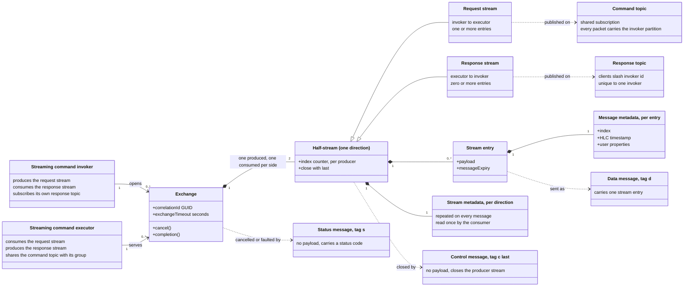
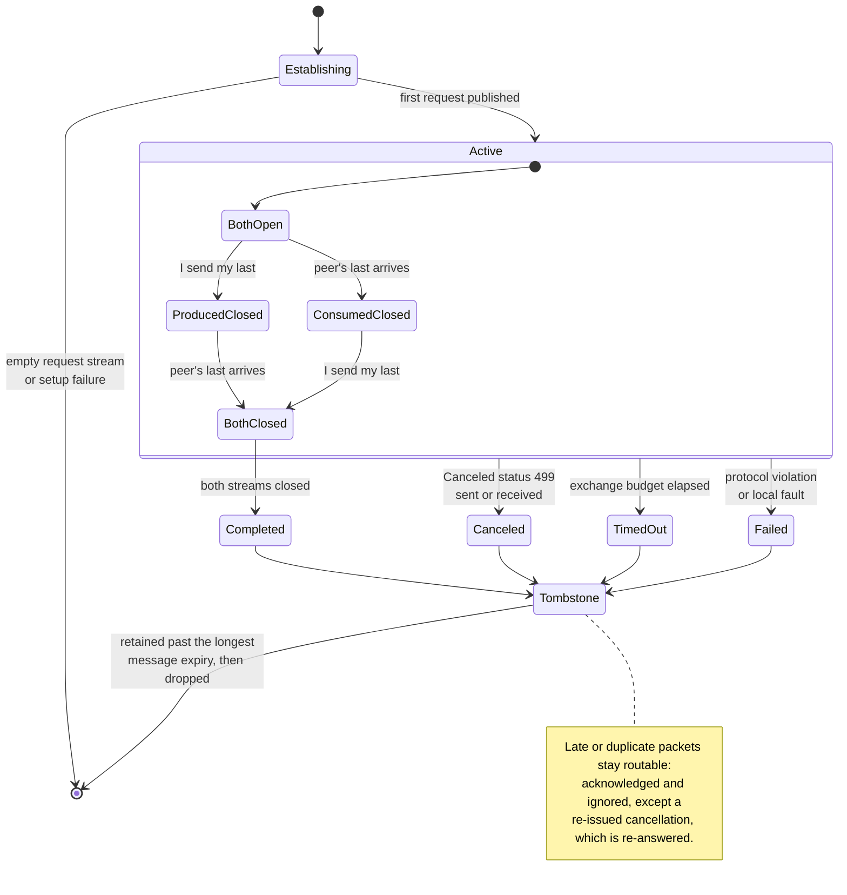
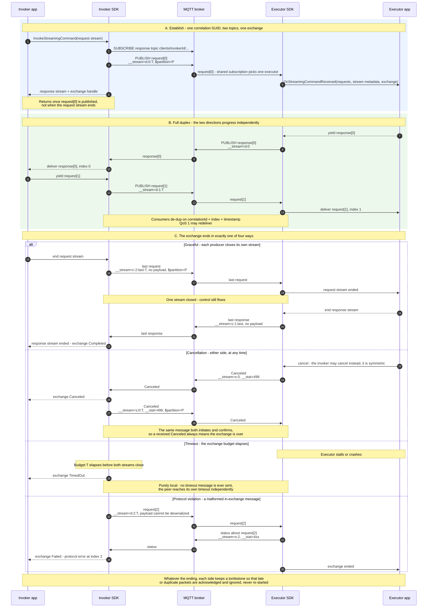

# RPC Streaming — Visual Introduction

> A three-diagram primer for readers who have **not** read [ADR 25: RPC Streaming](0025-rpc-streaming.md).
> The ADR is the source of truth; this page is non-authoritative and deliberately simplified.
> For the detailed per-scenario traces, see [the lifecycle diagrams](0025-rpc-streaming-lifecycle-diagrams.md).

Today a command is strictly unary: one request in, one response out. RPC streaming adds a **new**
communication pattern — a *streaming command invoker* and a *streaming command executor* — where a
single invocation carries **many** requests and **many** responses, in either direction, at arbitrary
times, over MQTT 5. It has its own protocol version (`1.0`) and does not change unary RPC.

Three diagrams cover it:

1. [The abstractions](#1-abstractions) — what the pieces are and how they relate.
2. [The state machine](#2-protocol-state-machine) — how one invocation lives and dies.
3. [The workflow](#3-protocol-workflow) — what actually goes over the wire, including every ending.

## 1. Abstractions

One invocation is an **exchange**: a single correlation GUID that owns exactly **two half-streams** —
requests (invoker → executor) and responses (executor → invoker). Each side **produces** one of them
and **consumes** the other. Everything scoped to the invocation as a whole — completion, cancellation,
timeout — belongs to the exchange, never to one direction.

| Term | What it means |
| --- | --- |
| **Exchange** | One invocation: one correlation GUID, two half-streams, one timeout, one cancellation. |
| **Half-stream** | One direction's ordered entries, with its own index counter, closed by its producer's `last`. |
| **Stream entry** | A user payload plus its per-entry metadata — index, HLC timestamp, user properties. |
| **Stream metadata** | Metadata for a whole direction. Request- and response-stream metadata are **different** (asymmetric). Repeated on every message so losing the first message does not lose it. |
| **`last`** | A standalone control message that closes the producer's own stream — no payload, no application user properties, so a stream can be ended at any moment. |
| **Status message** | No payload either — carries `499` (`Canceled`) for the whole exchange, or a `4xx`/`5xx` protocol error about a received message. |
| **Command topic** | Invoker → executor, a **shared** subscription so an executor crash does not strand the exchange. Every packet on it carries `$partition` = invoker client id, so the group keeps routing to the same executor. |
| **Response topic** | Executor → invoker, `clients/{invoker id}/...`, unique to that invoker and subscribed before the first publish. |

Every streaming PUBLISH carries a `__stream` user property in exactly one of three tagged forms, so a
message only ever carries the fields that apply to it:

| Form | Shape | Meaning |
| --- | --- | --- |
| Data | `d:<index>[:<timeout>]` | One stream entry at that index. |
| Control | `c:<index>:last[:<timeout>]` | The producer's stream ends here (shares the data index counter). |
| Status | `s:<index>[:<timeout>]` | An outcome, detailed in `__stat` — a protocol error about the received message at that index, or `499` to cancel the exchange (index then meaningless). |

The trailing `<timeout>` is the invoker's **remaining** exchange budget in seconds. It rides on
request-direction messages only, and is a live countdown — that is what lets a replacement executor
pick up an exchange mid-stream.

## 2. Protocol state machine

Both roles run the **same** local state machine; the labels are written from that side's own point of
view. The only asymmetry is which stream each side produces:

| Role | Produces — closed by *my* `last` | Consumes — closed by *peer's* `last` |
| --- | --- | --- |
| Invoker | request stream | response stream |
| Executor | response stream | request stream |

The one rule worth memorizing: **closing a stream is not ending the exchange.** A side that has sent
its `last` stays active — control traffic still flows — until the other stream closes too, or until a
non-graceful terminal fires.

| Terminal | Trigger | Reaches the peer as |
| --- | --- | --- |
| `Completed` | Both producers sent `last`. | Its own `last` messages. |
| `Canceled` | Either side sent or received a `Canceled` (`499`) status. | The same `Canceled` message — it both initiates and confirms. |
| `TimedOut` | This side's exchange budget elapsed before completion. | Nothing. Timeout is purely local, and the peer times out independently. |
| `Failed` | A correlation-matched message broke the wire contract, or the local side faulted. | A `4xx`/`5xx` status message, or — for a local fault, which has no status of its own — a best-effort cancellation. |

## 3. Protocol workflow

One trace, from establishment through full duplex, then branching into each of the four ways an
exchange can end. `T` is the invoker's remaining exchange budget and `P` its client id.

Reading notes for section **A**: the invocation returns as soon as the mandatory first request is
published — not when the request stream ends. Otherwise a full-duplex application deadlocks, because
request *n+1* may depend on response *n*, which the app cannot read until the call returns.

Reading notes for section **C**: only *cancellation* and *protocol violation* put anything on the wire
to end the exchange. Graceful completion is just both `last` messages having arrived, and timeout is
never announced at all. A **protocol violation** means a correlation-matched message broke the wire
contract — an undeserializable payload, a malformed `__stream`, an incompatible protocol version, a
QoS 0 publish, or a sequencing break such as data after `last`. **Application** errors are out of
scope: an app that wants to report one sends it as an ordinary data entry.

## Where to go next

| You want | Go to |
| --- | --- |
| The normative decision, grammar, and rationale | [ADR 25](0025-rpc-streaming.md) |
| Per-scenario traces: recovery, re-issued cancellation, packet classification | [Lifecycle diagrams](0025-rpc-streaming-lifecycle-diagrams.md) |
| An illustrative C# API shape | [ADR 25 appendix](0025-rpc-streaming.md#illustrative-net-api) |
| How unary RPC does the same job today | [RPC protocol reference](../../reference/rpc-protocol.md) |
