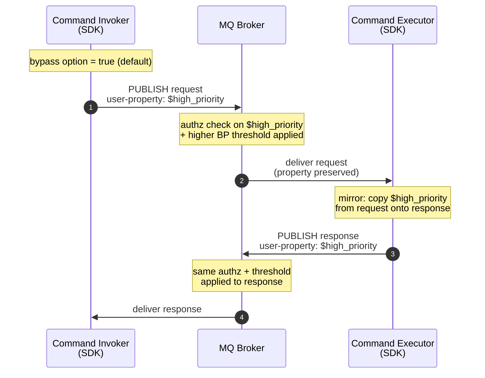

# ADR 31: MQ Backpressure Bypass for SDK Traffic

> **Status:** Proposed.

## Context

The MQ broker [is adding][mq-adr] a high-priority backpressure-bypass
mechanism so control-plane traffic (mRPC, State Store) is not starved when
data-plane traffic fills the broker's buffer pool. The mark is an MQTT 5
**user property on each PUBLISH** (broker owns the exact name, e.g.
`$high_priority`); the broker also gets a CRD kill switch and an authz
policy gating who may set the flag.

The flag is set by the *publisher* of each PUBLISH &mdash; the broker
does not infer it. The MQ ADR notes *"we expect the mRPC code generator
to set the property in requests and responses"*. We follow that
guidance: every mRPC PUBLISH the SDK produces carries the flag by
default, and the SDK exposes an option to turn it off. The motivation
is that mRPC is the SDK's control-plane RPC layer (and is used heavily
by first-party services, including AI scenarios); having a single
customer-tunable escape hatch is preferred over an opt-in-everywhere
design that risks leaving important callers behind under load.

### How `$high_priority` travels through an mRPC call

The diagram below shows the property's lifecycle across one request /
response.

If the customer turns the invoker's option off (or the broker's authz
rejects the property, or the CRD kill switch is on), the request
travels without the property and the executor has nothing to mirror
&mdash; both legs fall back to normal-priority backpressure with no
SDK changes.

## Decision

### Wire

- The example name `$high_priority` is broker-owned and sits outside
  the SDK-reserved `__` prefix from
  [ADR 4](./0004-reserved-user-properties.md). SDKs must not validate
  against or reject `$`-prefixed user properties.
- No other MQTT semantics change: QoS, expiry, topic, correlation, and
  cache behavior are all unaffected.

### mRPC

- **Invoker: default ON, customer-tunable OFF.** A single boolean on
  the invoker options surface, set once at construction, defaulting to
  `true`. Customers turn it off when they need their mRPC traffic to
  follow normal-priority backpressure (e.g., for fairness testing or
  when the broker's authz policy denies them the flag and they want to
  avoid the rejected-PUBLISH path). No per-invocation toggle.
- **Executor mirrors, no option.** The executor copies the bypass user
  property from the incoming request onto the response. There is no
  corresponding executor option. This matches the intent of the MQ
  ADR's chosen design and keeps response priority bound to request
  priority.
- **SDK-shipped service clients inherit the default.** State Store,
  Lease Lock, Schema Registry, Azure Device Registry, and the
  connector framework use the same default-ON invoker; they
  re-expose the toggle on their public options so customers can turn
  it off there too.

### Codegen

- No DTDL annotation. Bypass is a property of the caller, not the
  contract. Generated wrappers must surface the underlying options
  object so callers can flip the flag without forking generated code.

### Compatibility

- No protocol-version bump. Brokers that don't recognize the property
  (or have the kill switch on) treat it as opaque &mdash; safe fallback
  to normal-priority backpressure.
- Existing SDK consumers will see their mRPC traffic marked
  `$high_priority` after upgrading. This is intentional and aligned
  with the MQ ADR. The broker's authz policy and CRD kill switch are
  the operator-side controls if a deployment needs to claw the
  capability back.

[mq-adr]: https://msazure.visualstudio.com/One/_git/Azure-MQ?path=/docs-dev/adr/dmqtt/0093-backpressure-bypass.md&_a=preview
