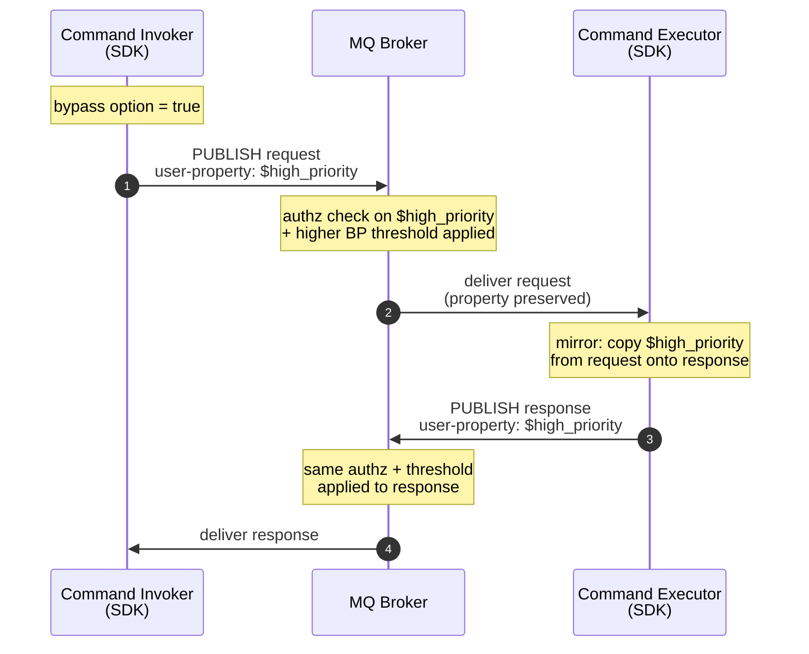
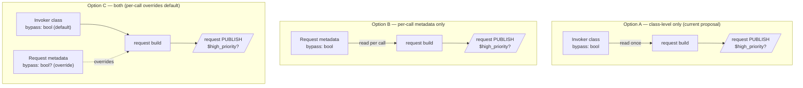
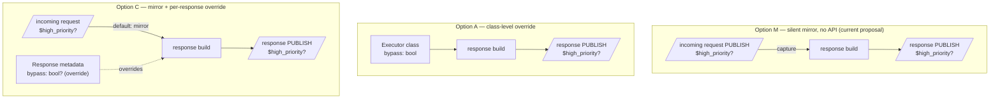
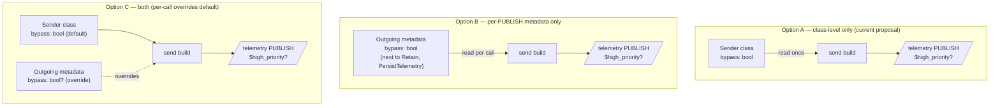

# ADR 31: MQ Backpressure Bypass for SDK Traffic

> **Status:** Draft / for discussion. Aligns SDK implementations on a single
> behavior before any code lands. Naming and surface details are left to each
> language to render idiomatically.

## Context

The MQ broker [is adding][mq-adr] a high-priority backpressure-bypass
mechanism so control-plane traffic (mRPC, State Store) is not starved when
data-plane traffic fills the broker's buffer pool. The mark is an MQTT 5
**user property on each PUBLISH** (broker owns the exact name, e.g.
`$high_priority`); the broker also gets a CRD kill switch and an authz
policy gating who may set the flag.

The flag is set by the *publisher* of each PUBLISH &mdash; the broker
does not infer it. The MQ ADR notes *"we expect the mRPC code generator
to set the property in requests and responses"* &mdash; we read this as
"the SDK is the layer that owns the capability," not "every generated
client sets it unconditionally."

This ADR specifies how the SDKs expose and set the flag. It does not
change broker semantics.

### How `$high_priority` travels through an mRPC call

The diagram below shows the property's lifecycle across one request /
response.

If the invoker's option is OFF (or the broker's authz rejects the
property, or the CRD kill switch is on), the request travels without
the property and the executor has nothing to mirror &mdash; both legs
fall back to normal-priority backpressure with no SDK changes.

## Decision (proposed)

The items below are the current proposal. The trade-offs that drive each
choice are worked through in [Integration options](#integration-options-for-review)
further down; pick that section first if you want to push back on any of
these.

### Wire

- The example name `$high_priority` is broker-owned and sits outside
  the SDK-reserved `__` prefix from
  [ADR 4](./0004-reserved-user-properties.md). SDKs must not validate
  against or reject `$`-prefixed user properties.
- No other MQTT semantics change: QoS, expiry, topic, correlation, and
  cache behavior are all unaffected.

### mRPC

- **Invoker option (default OFF).** A single boolean on the invoker
  options surface, set once at construction. No per-invocation toggle.
  Each language picks an idiomatic name (suggested: "bypass broker
  backpressure").
- **Executor mirrors, no option.** The executor copies the bypass user
  property from the incoming request onto the response. There is no
  corresponding executor option. This matches the intent of the MQ
  ADR's chosen design.
- **SDK-shipped service clients opt themselves in.** State Store,
  Lease Lock, Schema Registry, ADR, health reporter, and the connector
  framework set the option on their internal invokers and re-expose the
  toggle on their public options for diagnostics / authz compliance.

### Telemetry

- One boolean on the sender options, default OFF, same conceptual name
  as on the invoker.
- The health-status reporter ([ADR 28](./0028-health-status-reporting.md))
  opts in; other senders do not.

### Codegen

- No DTDL annotation. Bypass is a property of the caller, not the
  contract. Generated wrappers must surface the underlying options
  object so callers can flip the flag without forking generated code.

### Compatibility

- No protocol-version bump. Brokers that don't recognize the property
  (or have the kill switch on) treat it as opaque &mdash; safe fallback
  to normal-priority backpressure.

## Integration options (for review)

The broker mechanism is per-PUBLISH, but an SDK can expose it at three
granularities:

- **Class-level only** &mdash; one boolean on the invoker / executor /
  sender, set once at construction. Existing precedents:
  `IsIdempotent`, `ExecutionTimeout`, `ResponseTopicPattern`.
- **Per-PUBLISH only** &mdash; one boolean on the per-call metadata
  object. Existing precedents: `Retain`, `PersistTelemetry`,
  `MessageExpiryInterval`.
- **Both** &mdash; class-level default with a nullable per-PUBLISH
  override. Existing precedent: topic-token map + additional
  topic-token map (per-call wins when set).

The sub-sections below show the seams for each component and weigh the
three placements. Diagrams use language-neutral names; each language
renders these as idiomatic options/builder/struct fields.

### Invoker (request leg)

| Option | Pros | Cons |
|---|---|---|
| A &mdash; class-level only | Smallest surface; matches "this client is/isn't control plane"; trivially mirrored by the executor | Cannot vary per call (e.g. mixed cold-path/hot-path requests on one invoker) |
| B &mdash; per-call only | Closest match to the broker's per-PUBLISH model; mirrors the shape of `Retain` / `PersistTelemetry` on telemetry today | Easy to misuse ("set it whenever I want priority"); every call site has to set it; bloats codegen wrappers |
| C &mdash; both | Sensible default once, override per call when needed; precedent in topic-token maps | Largest surface; two places to look; resolution rule must be documented |

### Executor (response leg)

The executor has an extra option that the others don't: silent mirror.

| Option | Pros | Cons |
|---|---|---|
| M &mdash; silent mirror | Response priority always matches request priority; no API surface; matches the intent of the MQ ADR's rejected topic-filter option | No way for service code to opt out of mirroring (e.g., to deliberately downgrade a response) |
| A &mdash; class-level override | Service author controls response posture | Decouples response priority from request priority; needs coordination with every caller; defeats mirroring intent |
| C &mdash; mirror + per-response override | Mirrors by default, allows opt-out where justified | Larger surface; mostly speculative use case |

### Telemetry sender

Telemetry's existing precedents lean per-PUBLISH (`Retain`,
`PersistTelemetry`), so option B has stronger pull here than on the
invoker.

| Option | Pros | Cons |
|---|---|---|
| A &mdash; class-level only | Symmetric with the invoker proposal | Inconsistent with `Retain` / `PersistTelemetry`, which live on metadata only |
| B &mdash; per-PUBLISH only | Consistent with existing per-PUBLISH telemetry knobs; matches broker's per-PUBLISH model | Asymmetric with the invoker if the invoker stays class-level only |
| C &mdash; both | Consistent with both the invoker (class-level default) and telemetry precedent (per-PUBLISH knob) | Largest surface |

### Cross-cutting points for the team

- Whichever placement is chosen for the invoker should drive the
  telemetry choice for symmetry, unless reviewers want telemetry to
  follow its own (`Retain`/`PersistTelemetry`-style) precedent.
- The executor's choice is largely independent: the question there is
  whether mirroring is enough or whether service authors need an
  override.
- Per-PUBLISH knobs (Options B / C) require codegen wrappers to forward
  the metadata field to underlying generated method calls; the codegen
  templates for both languages would need a small change. Class-level
  knobs (Option A) require no codegen template change.

## Questions to resolve

Items below restate the decision as a checklist for reviewers; flag any
you want to revise.

1. **Set on all mRPC by default?** No &mdash; default OFF; SDK-shipped
   control-plane clients opt in.
2. **How to opt in/out?** Single boolean on the invoker / sender options,
   default `false`. SDK-shipped clients re-expose it on their own options.
3. **Client-level or invocation-level?** Client level only.
4. **Apply to telemetry?** Optional, default OFF; opt-in by control-plane
   senders (e.g., health reporter).
5. **Executor: mirror or independent?** Mirror, unconditionally, no
   executor-side option. Override may be added later as an enum.
6. **Cache / dedup interaction?** None &mdash; cache keys on correlation
   ID, ignores user properties.
7. **QoS / expiry / shared subs?** None &mdash; flag does not change MQTT
   semantics.
8. **Logging / observability?** Debug log once at construction when the
   option is enabled. No metric in v1.
9. **Security.** Broker is authoritative (authz + CRD kill switch). SDK
   docs must say enabling the option does not guarantee the broker will
   honor it.
10. **Names.** Each language picks an idiomatic name; the user-property
    name on the wire is taken from [the MQ ADR][mq-adr].
11. **Testing.** METL cases under `eng/test/test-cases/Protocol/` that
    assert presence/absence of the user property on requests and on
    mirrored responses, given the invoker option's value.

## Alternatives considered

- **Default ON for all mRPC.** Rejected: bypass is a privileged
  capability gated by broker authz; defaulting on would silently elevate
  every generated client to control-plane status.
- **Independent executor-side option.** Rejected: decouples response
  priority from request priority, defeating the mirroring intent of the
  MQ ADR's chosen design.
- **Per-invocation flag.** Rejected: invites misuse, bloats codegen
  signatures, no concrete use case.
- **MQTT-session-wide flag.** Rejected: too coarse; a process may host
  both control-plane and application clients on one session.
- **DTDL/codegen annotation.** Rejected: posture belongs to the caller,
  not the contract.

[mq-adr]: https://msazure.visualstudio.com/One/_git/Azure-MQ?path=/docs-dev/adr/dmqtt/0093-backpressure-bypass.md&_a=preview
