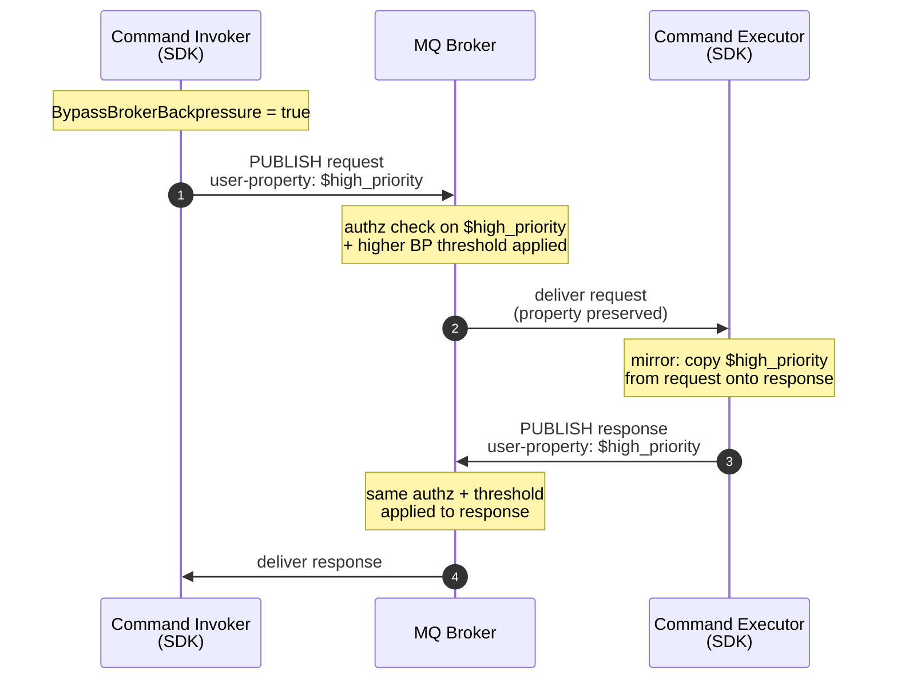

# ADR 31: MQ Backpressure Bypass for SDK Traffic

> **Status:** Draft / for discussion. Aligns .NET and Rust on a single
> implementable behavior before any code lands.

## Context

The MQ broker [is adding][mq-adr] a high-priority backpressure-bypass
mechanism so control-plane traffic (mRPC, State Store) is not starved when
data-plane traffic fills the broker's buffer pool. The mark is an MQTT 5
**user property on each PUBLISH** (broker owns the exact name, e.g.
`$high_priority`); the broker also gets a CRD kill switch and an authz
policy gating who may set the flag.

The *publisher* of the response must set the flag. The MQ ADR notes *"we expect the mRPC
code generator to set the property in requests and responses"* &mdash; we
read this as "the SDK is the layer that owns the capability," not "every
generated client sets it unconditionally."

This ADR specifies how the .NET and Rust SDKs expose and set the flag.
It does not change broker semantics.

### How `$high_priority` travels through an mRPC call

The diagram below shows the property's lifecycle across one request /
response. The broker is shown as a single box for clarity; in reality
each PUBLISH passes through the publisher's session chain and the topic
chain, and backpressure is evaluated on the topic chain.

If the invoker's option is OFF (or the broker's authz rejects the
property, or the CRD kill switch is on), the request travels without
the property and the executor has nothing to mirror &mdash; both legs
fall back to normal-priority backpressure with no SDK changes.

## Decision

### Wire

- One MQTT 5 user property on the PUBLISH; name and value owned by
  [the MQ ADR][mq-adr], referenced from a single shared constant per
  language.
- The example name `$high_priority` is broker-owned, so it sits outside
  the SDK-reserved `__` prefix from
  [ADR 4](./0004-reserved-user-properties.md). The SDK must not validate
  against or reject `$`-prefixed user properties.
- No other MQTT semantics change: QoS, expiry, topic, correlation, and
  cache behavior are all unaffected.

### mRPC

- **Invoker option (default OFF).** A single boolean on the invoker
  options surface, set once at construction; no per-invocation toggle.
  - .NET: `CommandInvokerOptions.BypassBrokerBackpressure`
  - Rust: `CommandInvokerOptionsBuilder::bypass_broker_backpressure(bool)`
- **Executor mirrors, no option.** The executor copies the bypass user
  property from the incoming request onto the response. No
  `CommandExecutorOptions.BypassBrokerBackpressure`. This matches the
  intent of the MQ ADR's chosen design: the rejected topic-filter option
  would have mirrored automatically inside the broker, so SDK mirroring
  is the equivalent on the publisher side. The decision of "is this call
  control plane?" stays with the requester. An override knob can be
  added later as an enum if a real use case appears.
- **SDK-shipped service clients opt themselves in.** State Store,
  Lease Lock, Schema Registry, ADR, health reporter, and the connector
  framework set the option on their internal invokers and re-expose the
  toggle on their public options for diagnostics / authz compliance.

### Telemetry

- One boolean on the sender options, default OFF (same name).
- The health-status reporter ([ADR 28](./0028-health-status-reporting.md))
  opts in; other senders do not.

### Codegen

- No DTDL annotation. Bypass is a property of the caller, not the
  contract. Generated wrappers must surface the underlying options
  object so callers can flip the flag without forking generated code.

### Compatibility

- No protocol-version bump. Brokers that don't recognize the property
  (or have the kill switch on) treat it as opaque &mdash; safe fallback
  to normal-priority backpressure.

## Questions to resolve

Items below restate the decision as a checklist for reviewers; flag any
you want to revise.

1. **Set on all mRPC by default?** No &mdash; default OFF; SDK-shipped
   control-plane clients opt in.
2. **How to opt in/out?** Single boolean on the invoker / sender options,
   default `false`. SDK-shipped clients re-expose it on their own options.
3. **Client-level or invocation-level?** Client level only.
4. **Apply to telemetry?** Optional, default OFF; opt-in by control-plane
   senders (e.g., health reporter).
5. **Executor: mirror or independent?** Mirror, unconditionally, no
   executor-side option. Override may be added later as an enum.
6. **Cache / dedup interaction?** None &mdash; cache keys on correlation
   ID, ignores user properties.
7. **QoS / expiry / shared subs?** None &mdash; flag does not change MQTT
   semantics.
8. **Logging / observability?** Debug log once at construction when the
   option is enabled. No metric in v1.
9. **Security.** Broker is authoritative (authz + CRD kill switch). SDK
   docs must say enabling the option does not guarantee the broker will
   honor it.
10. **Names.** .NET `BypassBrokerBackpressure`, Rust
    `bypass_broker_backpressure`, user-property name from
    [the MQ ADR][mq-adr].
11. **Testing.** METL cases under `eng/test/test-cases/Protocol/` that
    assert presence/absence of the user property on requests and on
    mirrored responses, given the invoker option's value.

## Alternatives considered

- **Default ON for all mRPC.** Rejected: bypass is a privileged
  capability gated by broker authz; defaulting on would silently elevate
  every generated client to control-plane status.
- **Independent executor-side option.** Rejected: decouples response
  priority from request priority, defeating the mirroring intent of the
  MQ ADR's chosen design.
- **Per-invocation flag.** Rejected: invites misuse, bloats codegen
  signatures, no concrete use case.
- **MQTT-session-wide flag.** Rejected: too coarse; a process may host
  both control-plane and application clients on one session.
- **DTDL/codegen annotation.** Rejected: posture belongs to the caller,
  not the contract.

[mq-adr]: https://msazure.visualstudio.com/One/_git/Azure-MQ?path=/docs-dev/adr/dmqtt/0093-backpressure-bypass.md&_a=preview
