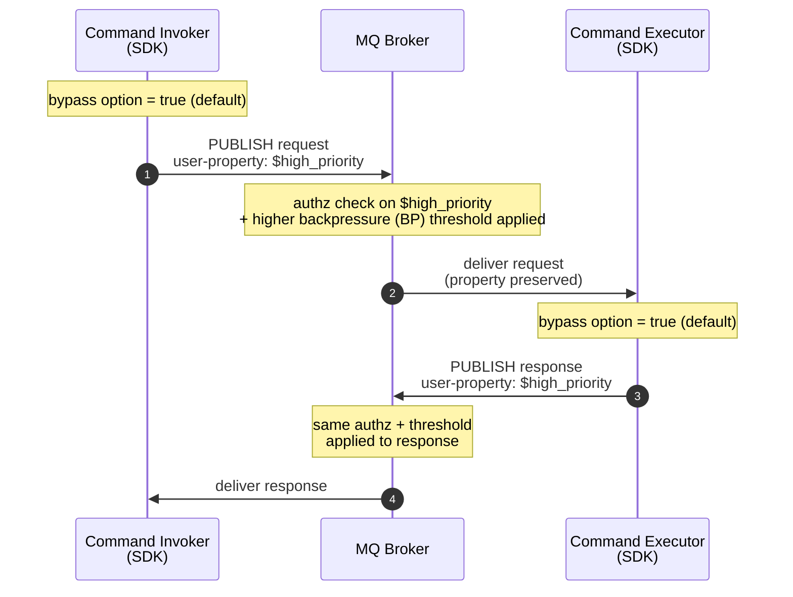

# ADR 31: MQ Backpressure Bypass for SDK Traffic

> **Status:** Proposed.

## Context

The MQ broker is adding a high-priority backpressure-bypass
mechanism so control-plane traffic (ex.: State Store) is not starved when
data-plane traffic fills the broker's buffer pool. The mark is an MQTT 5
**user property on each PUBLISH** (broker owns the exact name, e.g.
`$high_priority`); the broker also gets a CRD kill switch and an authorization (authz)
policy gating who may set the flag.

The flag is set by the *publisher* of each PUBLISH &mdash; the broker
does not infer it. The MQ ADR notes *"we expect the mRPC code generator
to set the property in requests and responses"*. We follow that
guidance: every mRPC PUBLISH the SDK produces carries the flag by
default, and the SDK exposes an option to turn it off. The motivation
is that mRPC is the SDK's control-plane RPC layer (and is used heavily
by first-party services, including AI scenarios); having a single
customer-tunable escape hatch is preferred over an opt-in-everywhere
design that risks leaving important callers behind under load.

### How `$high_priority` travels through an mRPC call

The diagram below shows the property's lifecycle across one request /
response.

If the customer turns the invoker's option off for a specific invocation
(or the broker's authz rejects the property, or the CRD kill switch is
on), the request travels without the property. The executor independently
decides whether to set the property on the response based on its own
default-ON option, allowing high-priority responses even when requests
lack the flag.

## Decision

### Wire

- The example name `$high_priority` is broker-owned and sits outside
  the SDK-reserved `__` prefix from
  [ADR 4](./0004-reserved-user-properties.md). SDKs must not validate
  against or reject `$`-prefixed user properties.
- No other MQTT semantics change: QoS, expiry, topic, correlation, and
  cache behavior are all unaffected.

### mRPC

- **Invoker: default ON, per-invocation toggle.** A boolean option on
  each invocation, defaulting to `true`. Customers turn it off when they
  need their mRPC traffic to follow normal-priority backpressure (e.g.,
  for fairness testing or when the broker's authz policy denies them the
  flag and they want to avoid the rejected-PUBLISH path).
- **Executor: default ON, per-response toggle.** A boolean option on
  each response, defaulting to `true`. The executor can independently
  control the bypass flag on responses, allowing high-priority responses
  even when the request didn't have the flag set (e.g., when the invoker
  lacked permission but the executor has it).
- **SDK-shipped service clients inherit the default.** State Store,
  Lease Lock, Schema Registry, and Azure Device Registry (ADR) use the
  same default-ON invoker. These service clients do not expose the
  toggle on their public options; all service operations are treated as
  high-priority control-plane traffic.

### Codegen

- No DTDL annotation. Bypass is a property of the caller, not the
  contract. Generated wrappers must surface the underlying options
  object so callers can flip the flag without forking generated code.

### Compatibility

- No protocol-version bump. Brokers that don't recognize the property
  (or have the kill switch on) treat it as opaque &mdash; safe fallback
  to normal-priority backpressure.
- Existing SDK consumers will see their mRPC traffic marked
  `$high_priority` after upgrading. This is intentional and aligned
  with the MQ ADR. The broker's authz policy and CRD kill switch are
  the operator-side controls if a deployment needs to claw the
  capability back.
