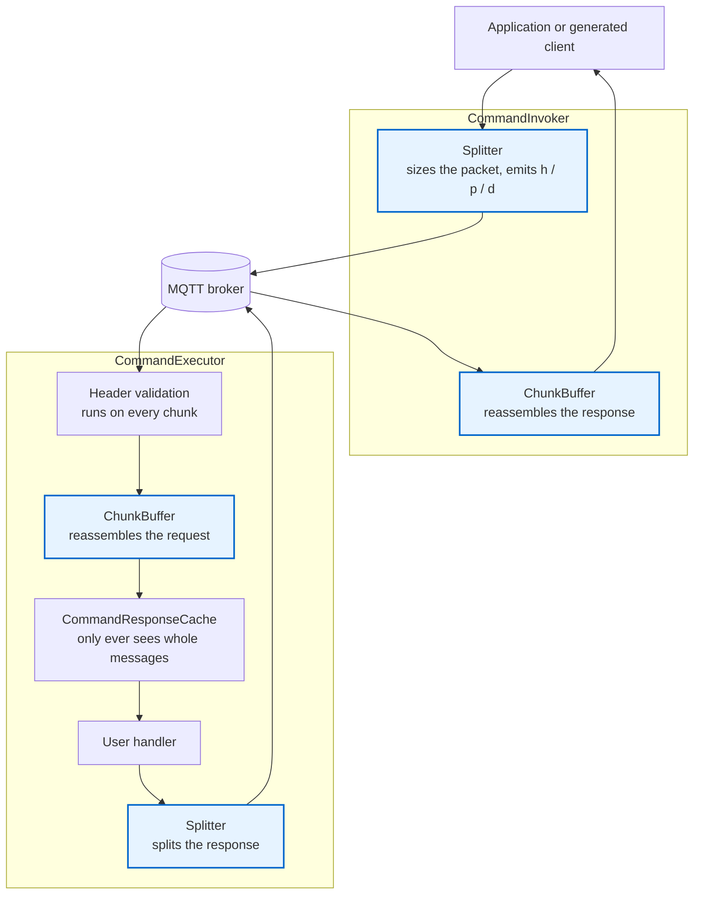
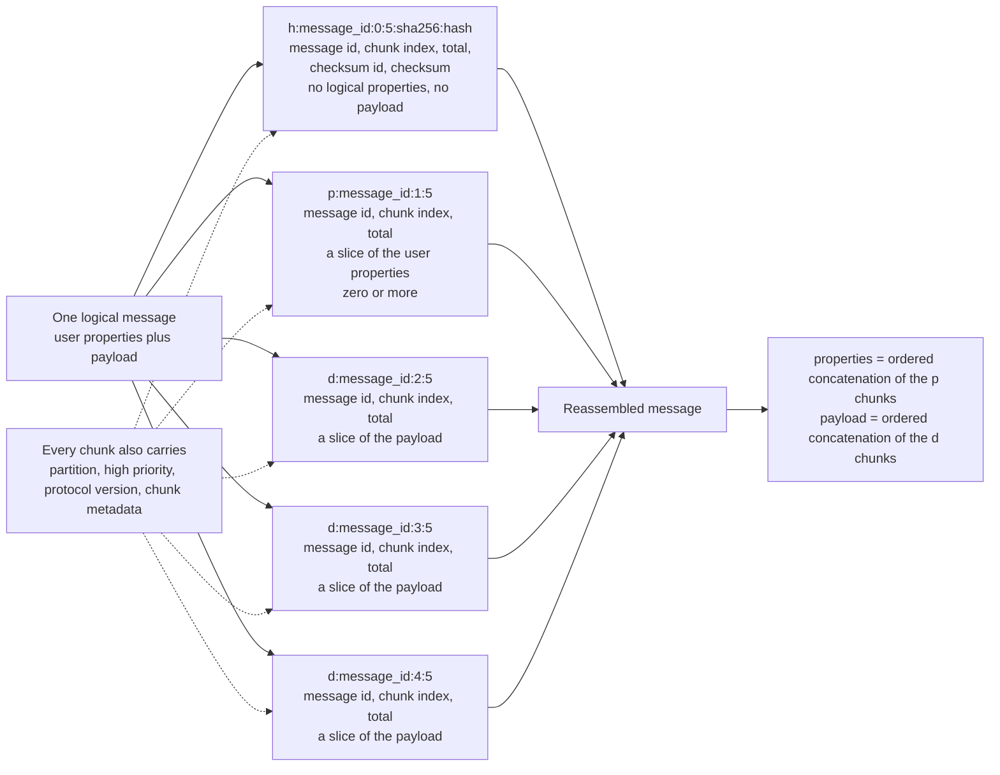
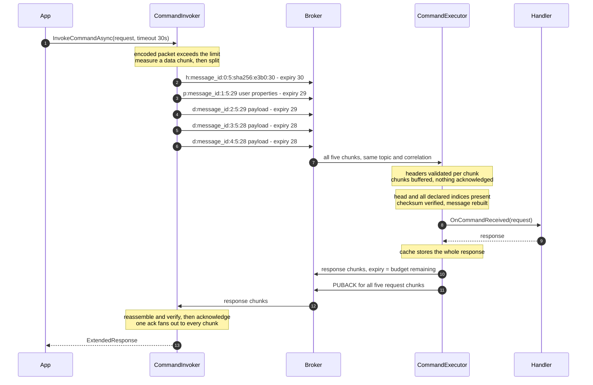
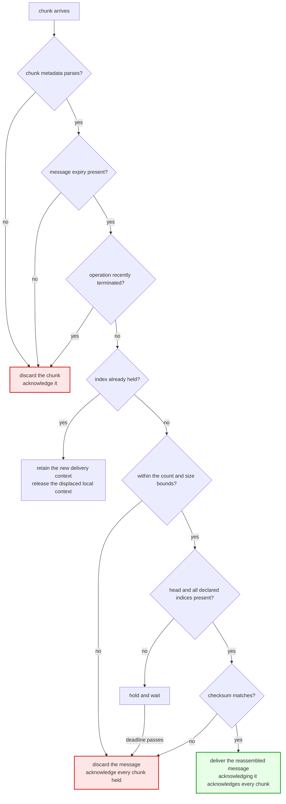
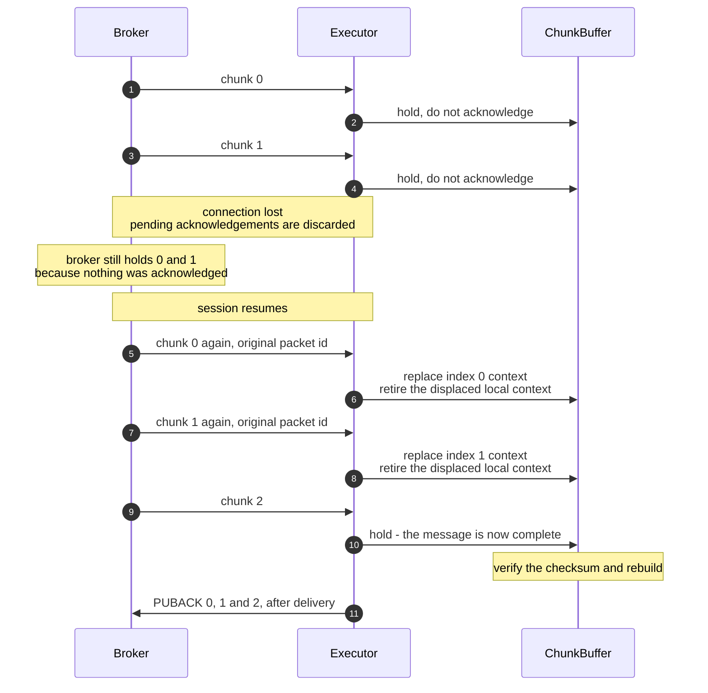

# Large Message Chunking Diagrams

Companion to [ADR 33](./0033-large-message-chunking.md). Each diagram illustrates one decision in
that document and adds nothing to it.

## 1. Where chunking sits

Splitting and reassembly live inside the envoys, above the response cache, so the cache and the
correlation map only ever see whole messages.

## 2. What one message becomes

A header chunk carries the message-level metadata, property chunks carry the user property set, and
data chunks carry the payload. Every chunk additionally carries what routing and per-chunk
validation need.

## 3. Happy path on the wire

Both directions split independently. Each chunk's expiry is the invocation budget remaining when
that chunk is published, so the values shrink across the sequence.

## 4. How a receiver classifies a chunk

Discarding a chunk releases that one packet. Discarding a message releases every chunk held for it,
which is what keeps a client that acknowledges in order from stalling.

## 5. Reconnect during a transfer

Because no chunk is acknowledged until the message completes, a reconnect redelivers the whole
transfer. Reassembly continues rather than restarting: the payload already buffered stays valid and
only the acknowledgement handles are replaced.

## Coverage

| Diagram | Illustrates |
|---|---|
| 1 | Layering, and why the buffer sits above the cache |
| 2 | Wire format and chunk roles |
| 3 | Sizing, timeouts and acknowledgement on the happy path |
| 4 | Error handling, including what is deliberately not an error |
| 5 | Disconnection and recovery |
