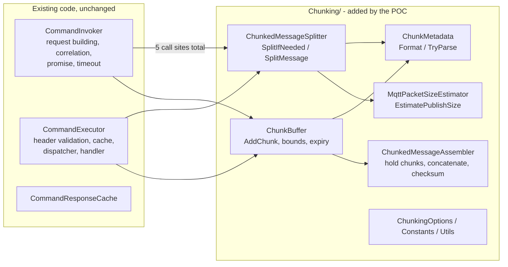
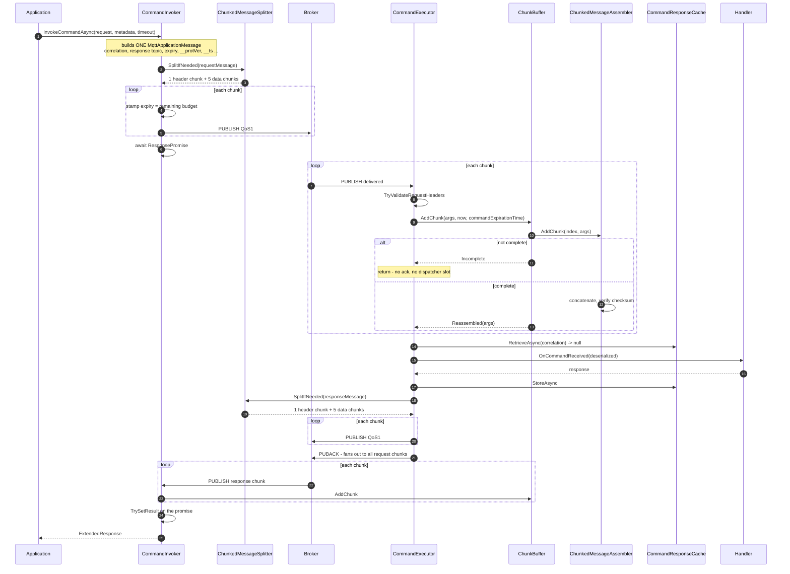
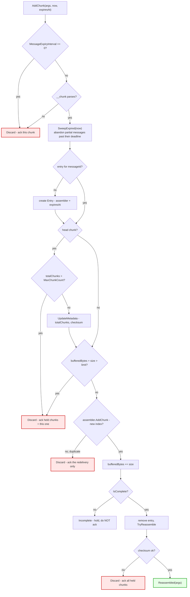

# RPC Chunking POC — Implementation Walkthrough

> **Purpose:** a step-by-step reading guide to the happy-path implementation, meant to be read
> next to the code.
> **Companions:** [rpc-chunking-poc-plan.md](rpc-chunking-poc-plan.md) for decisions and plan,
> [rpc-chunking-working-doc.md](rpc-chunking-working-doc.md) for the review of the pre-existing RPC
> code that motivated the design.

Line numbers are accurate at the time of writing and will drift; the symbol names will not.

---

## 1. What was added, and what was not

Chunking lives **inside the RPC envoys, above the response cache**. Nothing below the envoys knows
it exists, and the application-facing API is unchanged.



### The five touchpoints in existing code

Everything else is new files under `Chunking/`.

| # | File | Line | What it does |
|---|---|---|---|
| 1 | `RPC/CommandInvoker.cs` | 41 | `private readonly ChunkBuffer _chunkBuffer = new(new ChunkingOptions());` |
| 2 | `RPC/CommandInvoker.cs` | 241 | Reassemble hook in `MessageReceivedCallbackAsync` — response chunks |
| 3 | `RPC/CommandInvoker.cs` | 636 | `SplitIfNeeded` + per-chunk publish loop — request chunks |
| 4 | `RPC/CommandExecutor.cs` | 37, 149 | Field + reassemble hook in `MessageReceivedCallbackAsync` — request chunks |
| 5 | `RPC/CommandExecutor.cs` | 623 | `SplitIfNeeded` + per-chunk publish loop in `PublishResponseAsync` — response chunks |

---

## 2. End-to-end happy path



---

## 3. Stage by stage

### Stage 1 — The invoker builds one ordinary message

`CommandInvoker.InvokeCommandAsync`, roughly lines 500–630. **Entirely unchanged.** It resolves the
timeout, registers the `ResponsePromise` in `_requestIdMap` *before* publishing, resolves topics,
serializes the payload, and adds `__protVer`, `$partition`, `__srcId`, `__invId`, `__ts` and
`$high_priority`.

The key point: at line 632 there is still exactly **one** `MqttApplicationMessage`. Chunking has not
entered the picture, so everything about correlation, metadata and expiry is decided the same way it
always was.

### Stage 2 — `SplitIfNeeded` decides

`CommandInvoker.cs:636` → `ChunkedMessageSplitter.SplitIfNeeded`:

```csharp
int maxPacketSize = ChunkingConstants.PlaceholderMaxPacketSize;

return MqttPacketSizeEstimator.EstimatePublishSize(message) <= maxPacketSize
    ? [message]
    : new ChunkedMessageSplitter(new ChunkingOptions()).SplitMessage(message, maxPacketSize);
```

The test is on the **encoded packet size, not the payload length**. A broker's maximum applies to
the whole PUBLISH, and user properties are unbounded and user-controlled, so a modest payload with a
large property set can exceed the limit while a payload-only check waves it through.
`MqttPacketSizeEstimator.EstimatePublishSize` walks the MQTT 5 PUBLISH encoding — fixed header,
variable-byte remaining length, topic, packet identifier, each property present, and the payload —
and returns the byte count. At or below the limit the original message is returned in a one-element
list and **nothing downstream changes**, which is what keeps the ordinary path byte-identical.

### Stage 3 — `SplitMessage` produces a header chunk plus data chunks

Chunk 0 is a **header chunk: all of the user properties, none of the payload.** Chunks 1..n carry
the payload and only the few properties needed to route and validate them.

The reason is that it makes the chunk size *measurable*. The properties a caller may attach are
unbounded, so as long as they ride on the payload-bearing chunks, the per-chunk overhead can only be
guessed — and the guess has to be pessimistic enough to be safe, which wastes payload space on every
single chunk. Quarantining them into one message means every data chunk has a property set the SDK
controls completely, so its overhead can be measured exactly, while the unbounded part is confined
to one message whose size is simply checked once.

`ChunkedMessageSplitter.SplitMessage`:

1. Generates a fresh `messageId` (`Guid.NewGuid().ToString("D")`) and computes the **SHA-256
   checksum over the whole payload**, once.
2. Partitions the properties:

   ```csharp
   var perChunkUserProperties = userProperties
       .Where(p => ChunkingConstants.PerChunkUserProperties.Contains(p.Name, StringComparer.Ordinal))
       .ToList();
   ```

3. `GetMaxDataChunkSize` **measures** a data chunk's overhead by building an empty probe chunk and
   sizing it (see below), then `dataChunks = ceil(len / maxChunkSize)` and
   `totalChunks = dataChunks + 1`.
4. Builds chunk 0 with `ReadOnlySequence<byte>.Empty` and the full property list, then checks it
   fits. If the properties alone exceed the packet size the message is undeliverable and this throws
   — chunking cannot split properties across chunks.
5. For each data index, `ExtractChunkPayload` slices the `ReadOnlySequence<byte>` — a slice, not a
   copy — and `CreateChunk` builds a message that copies every MQTT-level property (topic, QoS,
   content type, response topic, correlation data, expiry, retain, format indicator) and attaches
   `__chunk`.

The payload offset is shifted by one because chunk 0 carries none of it:

```csharp
var chunkStart = (long)(chunkIndex - 1) * maxChunkSize;
```

The few properties that must survive on **every** chunk:

| Property | Why it must be on every chunk |
|---|---|
| `$partition` | Shared-subscription routing — all chunks must reach the same executor |
| `$high_priority` | Backpressure bypass. If only chunk 0 bypassed it, later chunks could be dropped and reassembly would never finish |
| `__protVer` | `TryValidateRequestHeaders` runs on every chunk, before the buffer sees it |

Everything else — `__ts`, `__srcId`, `__invId`, cloud events, application metadata — rides on chunk
0 alone. Reassembly uses chunk 0 as the template, so the reassembled message inherits them.

#### Measuring the overhead instead of guessing it

```csharp
var probe = CreateChunk(message, ReadOnlySequence<byte>.Empty, perChunkUserProperties,
                        messageId, _options.MaxChunkCount, _options.MaxChunkCount, string.Empty);
var overhead = MqttPacketSizeEstimator.EstimatePublishSize(probe) + _options.StaticOverhead;

return (int)(maxPacketSize - overhead);
```

There is a small circularity to resolve: the chunk index appears inside `__chunk`, and a larger
index encodes to a longer string, but the chunk count is not known until the chunk size is. The
probe sidesteps it by using `MaxChunkCount` — the widest index the configuration permits — so the
measurement is an upper bound for every index that can actually occur.

`StaticOverhead` survives only as a small **safety margin** (64 bytes) covering imprecision in the
estimator, rather than as the whole allowance (1024 bytes) it used to be.

Against a 64 KiB limit this yields a measured budget of **~65,165–65,251 bytes** per data chunk,
compared with the flat `65536 − 1024 = 64512` of the previous guess. The variation is real: request
chunks carry a response topic and so measure slightly larger than response chunks, and the splitter
now accounts for that instead of assuming the worst for both.

### Stage 4 — The publish loop stamps expiry per chunk

`CommandInvoker.cs:636–690`:

```csharp
bool isChunked = outgoingMessages.Count > 1;
DateTime invocationDeadline = WallClock.UtcNow + reifiedCommandTimeout;

for (int chunkIndex = 0; chunkIndex < outgoingMessages.Count; chunkIndex++)
{
    if (isChunked)
    {
        uint remaining = Utils.RemainingExpirySeconds(invocationDeadline, WallClock.UtcNow);
        if (remaining == 0) { throw ... Timeout naming the chunk index ... }
        outgoing.MessageExpiryInterval = remaining;
    }
    // ... PublishAsync, check PUBACK ...
}
```

Two clocks, not one — the **invocation budget** (the deadline) and each chunk's **message expiry**
(the budget still remaining when that chunk goes out). See §7 of the plan for the reasoning, which
is borrowed from the streaming ADR.

`isChunked` guards the write so a single-message publish keeps exactly the expiry it always had.

### Stage 5 — The executor receives a chunk

`CommandExecutor.MessageReceivedCallbackAsync`, line 120 onward. Order matters:

1. Topic filter match.
2. `args.AutoAcknowledge = false` — pre-existing.
3. `commandTimeout` and `commandExpirationTime` computed from **this** chunk's
   `MessageExpiryInterval`.
4. `TryValidateRequestHeaders` — runs per chunk. Passes because every chunk carries correlation
   data, response topic, expiry and `__protVer`.
5. **Line 149: the chunk hook.**

The hook sits *above* the `Debug.Assert`s for response topic and correlation data. That is
deliberate: reassigning `args` resets the compiler's null-flow analysis, and moving the hook up was
cleaner than asserting twice.

```csharp
if (ChunkBuffer.IsChunk(args.ApplicationMessage))
{
    ChunkBufferResult chunkResult = _chunkBuffer.AddChunk(args, messageReceivedTime, commandExpirationTime);

    foreach (MqttApplicationMessageReceivedEventArgs chunk in chunkResult.ToAcknowledge)
    {
        await chunk.AcknowledgeAsync(CancellationToken.None).ConfigureAwait(false);
    }

    if (chunkResult.ReassembledMessage == null)
    {
        return;
    }

    args = chunkResult.ReassembledMessage;
    args.AutoAcknowledge = false;
}
```

For an incomplete message this returns **before** the dispatcher is involved, so a partially
received message holds no `ExecutionDispatcher` slot and sends no PUBACK.

### Stage 6 — `ChunkBuffer.AddChunk`



Points worth internalising:

* **Keyed on `messageId`, not correlation data.** Correlation data is shared by every chunk *and* by
  the response, so it cannot distinguish messages. `messageId` is unique per split, which also lets
  the same buffer serve telemetry later.
* **Out-of-order tolerant.** The entry is created by whichever chunk arrives first;
  `ChunkedMessageAssembler.IsComplete` is `_totalChunks > 0 && _chunks.Count == _totalChunks`, so a
  data chunk arriving before the head chunk simply waits for the count to be learned.
* **`ChunkBufferResult` carries an ack list.** Every unhappy exit hands back the affected chunks so
  the caller can acknowledge them. Nothing is ever left unacknowledged — important because
  `OrderedAckMqttClient` serialises acks, so one stuck chunk would block every later ack on that
  client.
* **Bounds are enforced here**, not at the edges: `MaxChunkCount` (100) and
  `ReassemblyBufferSizeLimit` (10 MB across *all* in-flight messages).
* **Expiry is a lazy sweep**, run on each add rather than by a background timer, so there is nothing
  to dispose and the clock is injectable for tests.

### Stage 7 — Reassembly

`ChunkedMessageAssembler.TryReassemble` concatenates the chunk payloads in index order into a
`MemoryStream`, verifies the SHA-256 checksum, and builds a new `MqttApplicationMessage` from
**chunk 0 as the template** with `__chunk` stripped. It then wraps it in a synthetic
`MqttApplicationMessageReceivedEventArgs` whose acknowledge handler fans out to every retained
chunk.

That fan-out is what makes deferred acknowledgement correct for free — see §5 of the plan.

### Stage 8 — The reassembled message rejoins the ordinary path

Execution continues at `CommandExecutor.cs:170` as if a single message had arrived: cache
`RetrieveAsync`, deserialize, `OnCommandReceived`, `StoreAsync`, `PublishResponseAsync`, then the
dispatcher acknowledges.

**This is the whole point of the layering.** Every chunk shares `(responseTopic, correlationData)`,
so if chunks reached `RetrieveAsync` individually, chunk 1 would look like a duplicate of chunk 0
and get swallowed — see §2.8 of the working document for why that would deadlock.

### Stage 9 — The response is split the same way

`PublishResponseAsync` (line 609) is the single choke point every response passes through —
including the cached-response replay path, so a replayed large response is chunked too. The loop
mirrors stage 4, with the deadline derived from the response's own expiry.

### Stage 10 — The invoker reassembles the response

`CommandInvoker.MessageReceivedCallbackAsync:241`. The hook sits **after** the `_requestIdMap`
lookup, so chunks for an unknown correlation are auto-acknowledged and dropped as before.

```csharp
if (ChunkBuffer.IsChunk(args.ApplicationMessage))
{
    args.AutoAcknowledge = false;
    // ... AddChunk, ack the discard list ...
    if (chunkResult.ReassembledMessage == null) { return; }

    args = chunkResult.ReassembledMessage;
    await args.AcknowledgeAsync(CancellationToken.None).ConfigureAwait(false);
}
```

The invoker acknowledges the reassembled message **explicitly**, because the synthetic args is never
seen by the MQTT client layer and nothing else would ack it. That one call fans out to every
response chunk.

The invoker uses **one buffer for the whole envoy**, not one per invocation: `messageId` is globally
unique, so concurrent invocations sharing a buffer cannot collide.

---

## 4. A worked example

From an integration test run, 300 KB in each direction:

```txt
Chunking: split a 305918 byte payload for topic 'rpc/chunking/poc/echo'
          into a header chunk plus 5 data chunk(s) of at most 65165 bytes as message 'fc8d80db-...'.
Command 'echo': publishing request chunk 1/6 (0 bytes, expiry 120s) ...
Command 'echo': publishing request chunk 6/6 (45093 bytes, expiry 120s) ...
Chunking: buffered chunk 0 of message 'fc8d80db-...', 1 chunk(s) held, 0 byte(s) buffered in total.
Chunking: buffered chunk 3 of message 'fc8d80db-...', 4 chunk(s) held, 195495 byte(s) buffered in total.
Chunking: reassembled message 'fc8d80db-...' from 6 chunk(s) into 305918 byte(s).
Chunking: split a 305918 byte payload for topic 'clients/.../rpc/chunking/poc/echo'
          into a header chunk plus 5 data chunk(s) of at most 65251 bytes as message 'c45b8c8e-...'.
```

`ceil(305918 / 65165) = 5` data chunks — four full plus a remainder — preceded by the header chunk,
so six messages in total. The expiry dropping between request and response is the two-clock model
visible on the wire.

Two details worth noticing:

* **Chunk 1/6 carries 0 bytes.** That is the header chunk doing its job.
* **The request budget (65,165) differs from the response budget (65,251).** Request chunks carry a
  response topic and so measure slightly larger. Under the old flat 1024-byte allowance both would
  have been capped at 64,512; measuring recovers ~650–740 bytes on every chunk.

On the wire the `__chunk` values were:

```txt
h:fc8d80db-1fea-434f-9156-93c1500f08ee:0:6:65e3f17b...
d:fc8d80db-1fea-434f-9156-93c1500f08ee:1
d:fc8d80db-1fea-434f-9156-93c1500f08ee:2
d:fc8d80db-1fea-434f-9156-93c1500f08ee:3
d:fc8d80db-1fea-434f-9156-93c1500f08ee:4
d:fc8d80db-1fea-434f-9156-93c1500f08ee:5
```

Grammar, per §3.2 of the plan — the leading tag alone determines the parse:

```txt
chunk_metadata ::= head_chunk | data_chunk
head_chunk     ::= "h" ":" message_id ":" chunk_index ":" total_chunks ":" checksum
data_chunk     ::= "d" ":" message_id ":" chunk_index
```

`h` now means "header, carries properties and no payload" as well as "carries the total and
checksum"; the grammar itself did not change.

### The cost

One extra message per chunked transfer. For the 1 MB round trip that is 17 messages where the
previous design sent 16. Partly offset by the ~1% larger payload budget per data chunk, and paid in
exchange for a chunk size that is correct by measurement rather than by hoping 1024 bytes was
enough.

---

## 5. POC shortcuts

Every one is deliberate and time-boxed. The full table with repayment paths is §3 of the plan.

| # | Shortcut | Where | Why it is safe for the POC | What it blocks |
|---|---|---|---|---|
| 1 | **The packet size limit is hardcoded** at `PlaceholderMaxPacketSize` = 64 KB | `ChunkingConstants.cs` | Deliberately below any realistic broker limit, so chunking always happens and never overflows. The chunk size *within* that limit is now measured, not guessed | Real deployments: the broker's negotiated maximum is invisible to the envoys (gap G1) |
| 2 | **No protocol version bump** | — | The POC controls both ends | A POC binary talking to a released 1.0 peer will misbehave. **Never point this at a real deployment.** |
| 3 | **Chunk metadata is not versioned or negotiated** | `ChunkMetadata` | Same reason | A 1.0 executor receiving a chunk sees an unknown `__chunk` property and tries to deserialize one chunk's bytes as the whole payload |
| 4 | **Errors are logged and discarded, never reported to the peer** | `ChunkBuffer` | Happy path does not exercise them | The invoker just times out with no indication chunking was involved. `ChunkTimeoutError`, `BufferLimitExceededError`, `ChecksumMismatchError` exist but are never thrown (gap G6) |
| 5 | **`ChunkingOptions` is constructed with defaults inline** | Both envoys | Nothing needs tuning yet | No way to configure bounds per envoy |
| 6 | **.NET only** | — | Prior POC code was .NET | Rust and Go are untouched; the wire format is not yet cross-language |
| 7 | **Reassembly deadline comes from `MessageExpiryInterval`** | `CommandExecutor.cs:151` | Works, and is bounded | Conflates the message clock with the operation clock — the misuse the streaming ADR rejects. §7.3 of the plan proposes a countdown field in `__chunk` instead |

---

## 6. Limitations that are not shortcuts

These are properties of the design, not things left undone.

**No mid-transfer cancellation.** Once the executor starts publishing a chunked response, the
invoker cannot tell it to stop. Unsubscribing does not signal the peer, and "no matching
subscribers" is unreliable. Accepted (gap G7).

**A lost chunk loses the whole message.** There is no partial recovery and no selective
retransmission. If one chunk expires at the broker, reassembly never completes and the buffer
abandons the message at its deadline. Reasonable: if one chunk expired, the operation as a whole
has expired.

**Memory is proportional to the payload, twice.** The assembler holds every chunk, then
`TryReassemble` builds a full contiguous copy. Peak is roughly 2× the payload per in-flight message,
bounded by `ReassemblyBufferSizeLimit` across all of them.

**The response cache stores reassembled payloads.** A large response occupies the cache — which is a
process-wide singleton with a 10 MB budget — and under the default `IsIdempotent = false` those
entries are **not evictable** until they expire. See §2.6 F2 in the working document; deliberate, but
a real interaction with chunking.

**Packet IDs are held for the duration.** No chunk is acknowledged until the whole message is
reassembled, so an N-chunk message holds N unacknowledged packet IDs. `MaxChunkCount = 100` bounds
it, well short of the 65535 ceiling, but the interaction is real (gap G5).

**Timeouts must now cover much more.** The invocation timeout has to span split, transmit,
reassemble, execute, respond and reassemble again. A timeout that worked for a small payload can
stop working once the payload crosses the threshold — and the failure looks like an ordinary
timeout, with nothing pointing at chunking.

---

## 7. Reading the code yourself

Suggested order, following one request through:

1. `RPC/CommandInvoker.cs:636` — the publish loop. Start here; it is the smallest complete picture.
2. `Chunking/ChunkedMessageSplitter.cs` — `SplitIfNeeded`, then `SplitMessage`.
3. `Chunking/ChunkMetadata.cs` — `Format` and `TryParse`; short, and it defines the wire contract.
4. `RPC/CommandExecutor.cs:149` — the receive hook, then read *upward* to see what already ran.
5. `Chunking/ChunkBuffer.cs` — `AddChunk`, then `AddChunkUnderLock`.
6. `Chunking/ChunkedMessageAssembler.cs` — `TryReassemble` and `AcknowledgeHandler`.
7. `RPC/CommandInvoker.cs:241` — the response hook, which mirrors step 4.

Useful breakpoints: `ChunkedMessageSplitter.SplitMessage` (see the chunk count decided),
`ChunkBuffer.AddChunkUnderLock` (watch `_bufferedBytes` climb), and
`ChunkedMessageAssembler.TryReassemble` (the checksum comparison).

To watch a live transfer, run the integration tests — they forward the SDK's own `Trace` output into
the test log:

```powershell
docker start aio-mosquitto
$env:MQTT_TEST_BROKER_CS="HostName=localhost;TcpPort=1883;UseTls=false;ClientId=ChunkingPoc"
dotnet test dotnet/test/Azure.Iot.Operations.Protocol.IntegrationTests/Azure.Iot.Operations.Protocol.IntegrationTests.csproj `
  --filter "FullyQualifiedName~LargeRequestAndLargeResponse" --logger "console;verbosity=detailed"
```

For the unit-level view, `ChunkBufferTests` covers the branches of the stage 6 diagram one at a time
and is the fastest way to see each unhappy path in isolation.
