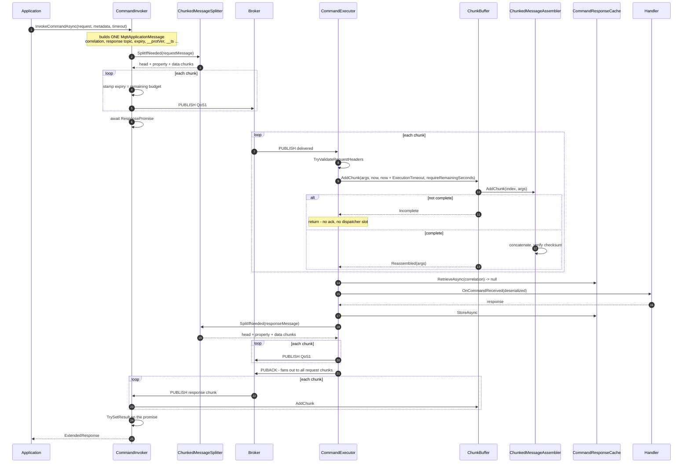
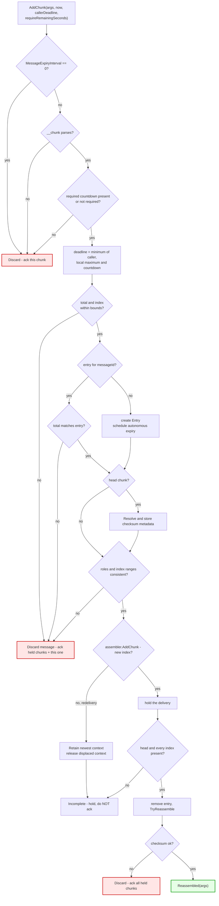

# RPC Chunking POC — Implementation Walkthrough

> **Purpose:** a step-by-step reading guide to the happy-path implementation, meant to be read
> next to the code.
> **Companions:** [rpc-chunking-poc-plan.md](rpc-chunking-poc-plan.md) for decisions and plan,
> [rpc-chunking-working-doc.md](rpc-chunking-working-doc.md) for the review of the pre-existing RPC
> code that motivated the design.

Line numbers are accurate at the time of writing and will drift; the symbol names will not.

---

## 1. What was added, and what was not

Chunking lives **inside the RPC envoys, above the response cache**. Nothing below the envoys knows
it exists, and the application-facing API is unchanged.


### The five touchpoints in existing code

Everything else is new files under `Chunking/`.

| # | File | What it does |
|---|---|---|
| 1 | `RPC/CommandInvoker.cs` | Builds capability-aware `ChunkingOptions` and a buffer with an expiry callback |
| 2 | `RPC/CommandInvoker.cs` | Topic/version-gated reassembly hook for response chunks |
| 3 | `RPC/CommandInvoker.cs` | Capability advertisement, `SplitIfNeeded` and per-chunk request publish loop |
| 4 | `RPC/CommandExecutor.cs` | Countdown-bounded reassembly hook and failure responses for request chunks |
| 5 | `RPC/CommandExecutor.cs` | Capability-aware split and per-chunk response publish loop |

---

## 2. End-to-end happy path



---

## 3. Stage by stage

### Stage 1 — The invoker builds one ordinary message

`CommandInvoker.InvokeCommandAsync`. It resolves the
timeout, registers the `ResponsePromise` in `_requestIdMap` *before* publishing, resolves topics,
serializes the payload, and adds `__protVer`, `$partition`, `__srcId`, `__invId`, `__ts` and
`$high_priority`. It also advertises acceptable response majors (`__supProtMajVer = "1 2"`), so a
small 1.0 request can receive a large response as 2.0 chunks.

The key point: immediately before `SplitIfNeeded` there is still exactly **one**
`MqttApplicationMessage`. Chunking has not
entered the picture, so everything about correlation, metadata and expiry is decided the same way it
always was.

### Stage 2 — `SplitIfNeeded` decides

`CommandInvoker.InvokeCommandAsync` → `ChunkedMessageSplitter.SplitIfNeeded`:

```csharp
int maxPacketSize = ChunkingConstants.PlaceholderMaxPacketSize;
options ??= new ChunkingOptions();

return MqttPacketSizeCalculator.CalculatePublishSize(message) <= maxPacketSize
    ? [message]
    : new ChunkedMessageSplitter(
        options,
        includeRemainingSeconds ? uint.MaxValue : null).SplitMessage(message, maxPacketSize);
```

The test is on the **encoded packet size, not the payload length**. A broker's maximum applies to
the whole PUBLISH, and user properties are unbounded and user-controlled, so a modest payload with a
large property set can exceed the limit while a payload-only check waves it through.
`MqttPacketSizeCalculator.CalculatePublishSize` walks the MQTT 5 PUBLISH encoding — fixed header,
variable-byte remaining length, topic, packet identifier, each property present, and the payload —
and returns the byte count. At or below the limit the original message is returned in a one-element
list and **nothing downstream changes**, which is what keeps the ordinary path byte-identical.

### Stage 3 — `SplitMessage` produces head, property and data chunks

Chunk 0 is the **head**: checksum metadata, no payload and no logical user properties. Property
chunks carry the original user properties in order, with no payload. Data chunks carry only the
payload. Routing and validation properties are repeated on every chunk.

Each role can be sized exactly. The splitter sizes each candidate property chunk while packing the
caller properties, and sizes an empty data-chunk probe to calculate the remaining payload budget.
A single property that cannot fit in one property chunk makes the message undeliverable.

`ChunkedMessageSplitter.SplitMessage`:

1. Generates a fresh `messageId` (`Guid.NewGuid().ToString("D")`) and computes the **SHA-256
   checksum over the whole payload**, once.
2. Partitions the properties:

   ```csharp
   var perChunkUserProperties = userProperties
       .Where(p => ChunkingConstants.PerChunkUserProperties.Contains(p.Name, StringComparer.Ordinal))
       .ToList();
   ```

3. Greedily packs the original properties into zero-payload property chunks, sizing each candidate
    PUBLISH and preserving the original order.
4. `GetMaxDataChunkSize` measures an empty data chunk and gives the remaining bytes to payload.
5. Computes `totalChunks = 1 + propertyChunks + dataChunks`; that total travels on every chunk.
6. Builds the head, then the property chunks, then slices the `ReadOnlySequence<byte>` into data
    chunks without copying it.

The few properties that must survive on **every** chunk:

| Property | Why it must be on every chunk |
|---|---|
| `$partition` | Shared-subscription routing — all chunks must reach the same executor |
| `$high_priority` | Backpressure bypass. If only chunk 0 bypassed it, later chunks could be dropped and reassembly would never finish |
| `__protVer` | `TryValidateRequestHeaders` runs on every chunk, before the buffer sees it |
| `__supProtMajVer` | Every request chunk independently advertises that response chunks may use 2.0 |

Everything else — `__ts`, `__srcId`, `__invId`, cloud events, application metadata — rides in the
ordered property chunks and is reconstructed before the handler sees the message.

#### Measuring the overhead instead of guessing it

```csharp
propertyFits = CalculatePublishSize(propertyChunkCandidate) <= maxPacketSize;
dataPayloadBudget = BinarySearchLargestPayloadWhoseEncodedPacketFits(emptyDataChunkProbe);
```

There is a small circularity to resolve: the chunk index appears inside `__chunk`, and a larger
index encodes to a longer string, but the chunk count is not known until the chunk size is. The
probe sidesteps it by using `MaxChunkCount` — the widest index the configuration permits — so the
measurement is an upper bound for every index that can actually occur.

The binary search sizes the final candidate payload, so growth in MQTT's Remaining Length encoding
is included rather than hidden by a margin. `MqttPacketSizeCalculatorTests` pins the arithmetic
byte-for-byte against the MQTT client's encoder. Nothing is reserved for bytes the broker adds on
delivery; that allowance is deferred with G1. See §3.6 of the plan.

Against a 64 KiB limit this yields a measured budget of **~65,165–65,251 bytes** per data chunk,
compared with the flat `65536 − 1024 = 64512` of the previous guess. The variation is real: request
chunks carry a response topic and so measure slightly larger than response chunks, and the splitter
now accounts for that instead of assuming the worst for both.

### Stage 4 — The publish loop stamps expiry per chunk

`CommandInvoker.InvokeCommandAsync` publish loop:

```csharp
bool isChunked = outgoingMessages.Count > 1;
DateTime invocationDeadline = WallClock.UtcNow + effectiveCommandTimeout;

for (int chunkIndex = 0; chunkIndex < outgoingMessages.Count; chunkIndex++)
{
    if (isChunked)
    {
        uint remaining = Utils.RemainingExpirySeconds(invocationDeadline, WallClock.UtcNow);
        if (remaining == 0) { throw ... Timeout naming the chunk index ... }
        outgoing.MessageExpiryInterval = remaining;
        StampRemainingOperationBudget(outgoing, remaining);
    }
    // ... PublishAsync, check PUBACK ...
}
```

Two clocks, not one — the **invocation budget** (the deadline) and each chunk's **message expiry**
(the budget still remaining when that chunk goes out). See §7 of the plan for the reasoning, which
is borrowed from the streaming ADR.

`isChunked` guards the write so a single-message publish keeps exactly the expiry it always had.

### Stage 5 — The executor receives a chunk

`CommandExecutor.MessageReceivedCallbackAsync`. Order matters:

1. Topic filter match.
2. `args.AutoAcknowledge = false` — pre-existing.
3. `commandTimeout` is read for ordinary request handling; the reassembly deadline comes from the
    required `remaining_seconds` field in this chunk's `__chunk` metadata.
4. `TryValidateRequestHeaders` — runs per chunk. Passes because every chunk carries correlation
   data, response topic, expiry and `__protVer`.
5. The chunk hook.

The hook sits *above* the `Debug.Assert`s for response topic and correlation data. That is
deliberate: reassigning `args` resets the compiler's null-flow analysis, and moving the hook up was
cleaner than asserting twice.

```csharp
if (ChunkBuffer.IsChunk(args.ApplicationMessage))
{
    ChunkBufferResult chunkResult = _chunkBuffer.AddChunk(
        args,
        messageReceivedTime,
        messageReceivedTime + ExecutionTimeout,
        requireRemainingSeconds: true);

    await ChunkBuffer.AcknowledgeDiscardedAsync(chunkResult);

    if (chunkResult.ReassembledMessage == null)
    {
        return;
    }

    args = chunkResult.ReassembledMessage;
}
```

For an incomplete message this returns **before** the dispatcher is involved, so a partially
received message holds no `ExecutionDispatcher` slot and sends no PUBACK.

### Stage 6 — `ChunkBuffer.AddChunk`



Points worth internalising:

* **Scoped beyond `messageId`.** The key combines `messageId` with MQTT topic, response topic and
    correlation data. Chunks of one operation still meet, while unrelated operations cannot collide
    if a peer deliberately reuses a UUID.
* **Out-of-order tolerant.** Every chunk declares the same total, so whichever arrives first can be
    validated and create the entry. A data or property chunk arriving before the head waits for index
    0 and the checksum metadata, not for the count.
* **`ChunkBufferResult` carries a discard list.** Every unhappy exit hands back the affected chunks
  so the caller can acknowledge them. They will never form a message, but nothing may be left
  unacknowledged — `OrderedAckMqttClient` serialises acks, so one stuck chunk would block every
  later ack on that client. The list is named `DiscardedChunks` rather than for the obligation it
  creates, so that acknowledging them does not read like a second acknowledgement of the
  reassembled message.
* **Bounds are enforced here**, not at the edges: `MaxChunkCount` (100) is checked on every chunk,
    and `MaxReassemblyWindow` caps every local hold. There is no aggregate memory or active-message
    cap in the POC.
* **Expiry is autonomous.** Creating an entry schedules its deadline; expiry releases every held
    delivery even when no later traffic arrives. It publishes no error — the caller fails on its own
    timeout.

### Stage 7 — Reassembly

`ChunkedMessageAssembler.TryReassemble` concatenates data-chunk payloads and property-chunk user
properties in index order, verifies the SHA-256 checksum, and builds a new
`MqttApplicationMessage` from **chunk 0 as the template** without `__chunk`. It then wraps it in a synthetic
`MqttApplicationMessageReceivedEventArgs` whose acknowledge handler fans out to every retained
chunk.

That fan-out is what makes deferred acknowledgement correct for free — see §5 of the plan.

### Stage 8 — The reassembled message rejoins the ordinary path

Execution continues in `CommandExecutor.MessageReceivedCallbackAsync` as if a single message had arrived: cache
`RetrieveAsync`, deserialize, `OnCommandReceived`, `StoreAsync`, `PublishResponseAsync`, then the
dispatcher acknowledges.

**This is the whole point of the layering.** Every chunk shares `(responseTopic, correlationData)`,
so if chunks reached `RetrieveAsync` individually, chunk 1 would look like a duplicate of chunk 0
and get swallowed — see §2.8 of the working document for why that would deadlock.

### Stage 9 — The response is split the same way

`PublishResponseAsync` is the single choke point every response passes through —
including the cached-response replay path, so a replayed large response is chunked too. The loop
mirrors stage 4, with the deadline derived from the response's own expiry.

### Stage 10 — The invoker reassembles the response

`CommandInvoker.MessageReceivedCallbackAsync`. Topic, correlation and expected protocol version are
validated **before** the hook, so a request chunk observed on a shared client cannot enter the
invoker's response buffer.

```csharp
if (ChunkBuffer.IsChunk(args.ApplicationMessage))
{
    args.AutoAcknowledge = false;
    // ... AddChunk, ack the discard list ...
    if (chunkResult.ReassembledMessage == null) { return; }

    args = chunkResult.ReassembledMessage;
    await args.AcknowledgeAsync(CancellationToken.None).ConfigureAwait(false);
}
```

The invoker acknowledges the reassembled message **explicitly**, because the synthetic args is never
seen by the MQTT client layer and nothing else would ack it. That one call fans out to every
response chunk.

The invoker uses **one buffer for the whole envoy**, not one per invocation. The key combines
`messageId` with MQTT operation identity, so concurrent invocations cannot collide.

---

## 4. A worked example

Suppose response packing produces one head, one property chunk and three data chunks. Their
`__chunk` values are:

```txt
h:fc8d80db-1fea-434f-9156-93c1500f08ee:0:5:sha256:65e3f17b...
p:fc8d80db-1fea-434f-9156-93c1500f08ee:1:5
d:fc8d80db-1fea-434f-9156-93c1500f08ee:2:5
d:fc8d80db-1fea-434f-9156-93c1500f08ee:3:5
d:fc8d80db-1fea-434f-9156-93c1500f08ee:4:5
```

The head and property chunk have no payload. The property chunk carries the logical user-property
slice after `__chunk`; the data chunks carry the payload in index order. Every form declares total
`5`, so any arrival can be checked against `MaxChunkCount` before it is retained.

Grammar, per §3.2 of the plan — the leading tag alone determines the role:

```txt
chunk_metadata         ::= response_chunk | request_chunk
response_chunk         ::= head_chunk | property_chunk | data_chunk
request_chunk          ::= head_request_chunk | property_request_chunk | data_request_chunk
head_chunk             ::= "h" ":" message_id ":" chunk_index ":" total_chunks ":" checksum_id ":" checksum
property_chunk         ::= "p" ":" message_id ":" chunk_index ":" total_chunks
data_chunk             ::= "d" ":" message_id ":" chunk_index ":" total_chunks
head_request_chunk     ::= head_chunk ":" remaining_seconds
property_request_chunk ::= property_chunk ":" remaining_seconds
data_request_chunk     ::= data_chunk ":" remaining_seconds
```

Request and response chunks can have different payload budgets because their MQTT metadata differs;
each side measures its own packet shape.

### The cost

Every transfer adds one head plus as many property chunks as its property set requires. In exchange,
each packet is bounded by measurement rather than by a guessed overhead constant.

---

## 5. POC shortcuts

Every one is deliberate and time-boxed. The full table with repayment paths is §3 of the plan.

| # | Shortcut | Where | Why it is safe for the POC | What it blocks |
|---|---|---|---|---|
| 1 | **The packet size limit is hardcoded** at `PlaceholderMaxPacketSize` = 64 KB | `ChunkingConstants.cs` | Deliberately below any realistic broker limit, so chunking always happens and never overflows. The chunk size *within* that limit is now measured, not guessed | Real deployments: the broker's negotiated maximum is invisible to the envoys (gap G1) |
| 2 | **Reassembly bounds use internal defaults** | Both envoys | A single chunk-count bound and a reassembly deadline | No per-message memory cap and no public tuning |
| 3 | **.NET only** | — | Prior POC code was .NET | Rust and Go are untouched; METL interoperability is not yet exercised |

The resolved former shortcuts are now enforced: ordinary RPC remains 1.0, actual chunks use 2.0, and
request chunks carry an operation countdown. An oversized legacy response receives `503` rather than
incompatible chunks. Reassembly failures are not reported as RPC errors — held deliveries are
released and the caller fails on its own timeout.

---

## 6. Limitations that are not shortcuts

These are properties of the design, not things left undone.

**No mid-transfer cancellation.** Once the executor starts publishing a chunked response, the
invoker cannot tell it to stop. Unsubscribing does not signal the peer, and "no matching
subscribers" is unreliable. Accepted (gap G7).

**A lost chunk loses the whole message.** There is no partial recovery and no selective
retransmission. If one chunk expires at the broker, reassembly never completes and the buffer
abandons the message at its deadline. Reasonable: if one chunk expired, the operation as a whole
has expired.

**Memory is proportional to the payload, twice.** The assembler holds every chunk, then
`TryReassemble` builds a full contiguous copy. Peak is roughly 2× the payload per in-flight message,
and the POC places no aggregate cap across concurrent messages.

**The response cache stores reassembled payloads.** A large response occupies the cache — which is a
process-wide singleton with a 10 MB budget — and under the default `IsIdempotent = false` those
entries are **not evictable** until they expire. See §2.6 F2 in the working document; deliberate, but
a real interaction with chunking.

**Packet IDs are held for the duration.** No chunk is acknowledged until the whole message is
reassembled, so an N-chunk message holds N unacknowledged packet IDs. `MaxChunkCount = 100` bounds
it, well short of the 65535 ceiling, but the interaction is real (gap G5).

**Timeouts must now cover much more.** The invocation timeout has to span split, transmit,
reassemble, execute, respond and reassemble again. A timeout that worked for a small payload can
stop working once the payload crosses the threshold — and the failure looks like an ordinary
timeout, with nothing pointing at chunking.

---

## 7. Reading the code yourself

Suggested order, following one request through:

1. `RPC/CommandInvoker.cs` — `InvokeCommandAsync` and its publish loop.
2. `Chunking/ChunkedMessageSplitter.cs` — `SplitIfNeeded`, then `SplitMessage`.
3. `Chunking/ChunkMetadata.cs` — `Format` and `TryParse`; short, and it defines the wire contract.
4. `RPC/CommandExecutor.cs` — the chunk receive hook in `MessageReceivedCallbackAsync`.
5. `Chunking/ChunkBuffer.cs` — `AddChunk`, then `AddChunkUnderLock`.
6. `Chunking/ChunkedMessageAssembler.cs` — `TryReassemble` and `AcknowledgeHandler`.
7. `RPC/CommandInvoker.cs` — the response hook, which mirrors step 4.

Useful breakpoints: `ChunkedMessageSplitter.SplitMessage` (see the chunk count decided),
`ChunkBuffer.AddChunkUnderLock` (watch `_bufferedBytes` climb), and
`ChunkedMessageAssembler.TryReassemble` (the checksum comparison).

To watch a live transfer, run the integration tests — they forward the SDK's own `Trace` output into
the test log:

```powershell
docker start aio-mosquitto
$env:MQTT_TEST_BROKER_CS="HostName=localhost;TcpPort=1883;UseTls=false;ClientId=ChunkingPoc"
dotnet test dotnet/test/Azure.Iot.Operations.Protocol.IntegrationTests/Azure.Iot.Operations.Protocol.IntegrationTests.csproj `
  --filter "FullyQualifiedName~LargeRequestAndLargeResponse" --logger "console;verbosity=detailed"
```

For the unit-level view, `ChunkBufferTests` covers the branches of the stage 6 diagram one at a time
and is the fastest way to see each unhappy path in isolation.
