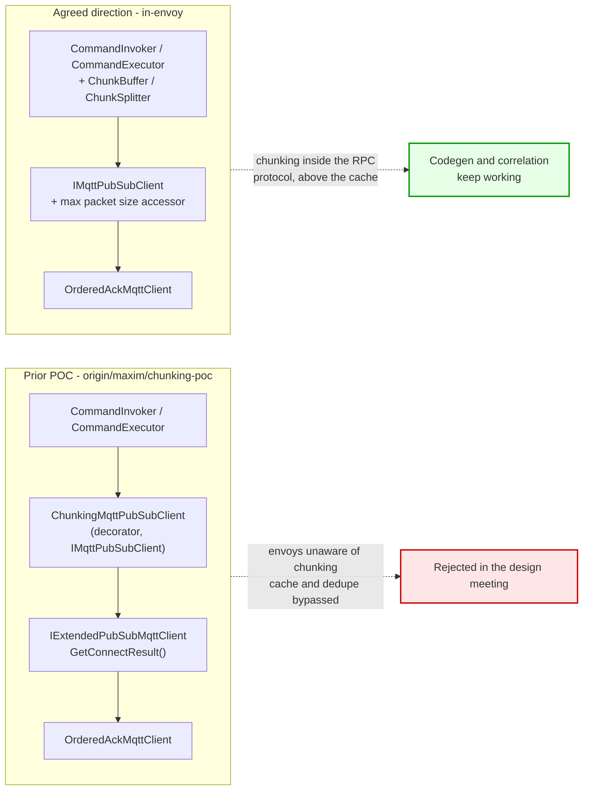
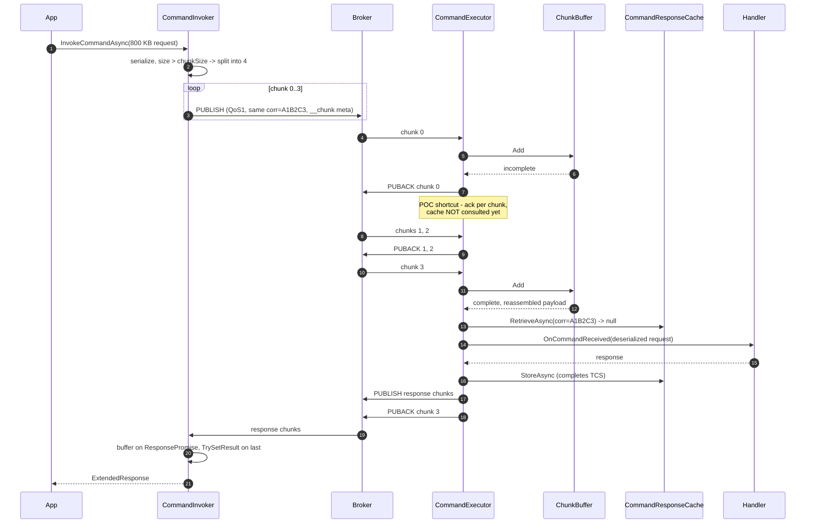
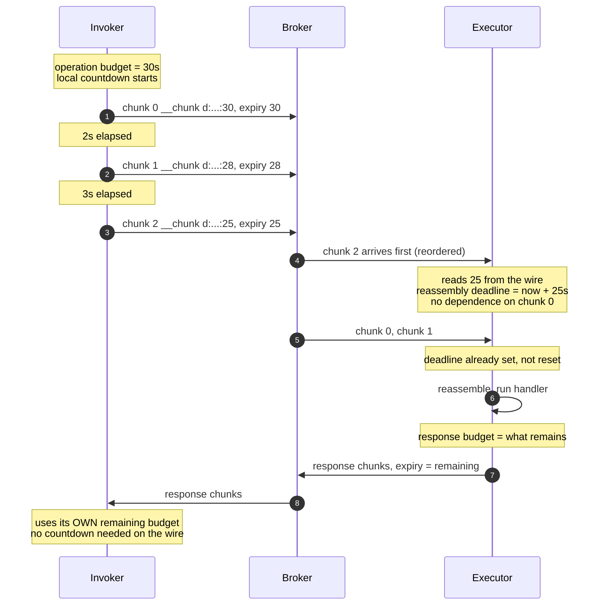

# RPC Chunking POC — Design Decisions and Plan

> **Status:** Planning. Scope is a **golden-happy-path proof of concept**, not production code.
> **Companion:** [rpc-chunking-working-doc.md](rpc-chunking-working-doc.md) holds the review of the
> current implementation and the gap list (G1–G8, F1–F3) referenced throughout.

## Goal

Demonstrate end-to-end that a payload larger than the broker's maximum packet size can be sent
through the **existing** `CommandInvoker` / `CommandExecutor` and reassembled transparently, with
no API change visible to the application.

Explicitly **out of scope** for the POC: failure paths, cross-language parity, telemetry,
production-grade packet-size negotiation, and fixing F3.

---

## 1. Prior art

### 1.1 The earlier ADR

[ADR 0023 — Large Message Chunking in MQTT Protocol](https://github.com/Azure/iot-operations-sdks/blob/maxim/chunking/doc/dev/adr/0023-large-message-chunking.md)
(branch `maxim/chunking`, status *Proposed*) was largely agreed. It is **strong input but not
binding**, because requirements changed after it was written — most importantly the decision to
keep chunking inside the RPC envoys rather than under them.

What carries forward:

| ADR 0023 decision | POC stance |
|---|---|
| Single `__chunk` user property carrying chunk metadata | **Adopt** |
| `messageId` + `chunkIndex` on every chunk; `totalChunks` + `checksum` only on the first | **Adopt** |
| Chunk size derived from CONNACK Maximum Packet Size minus overhead | **Defer** — hardcode for the POC (§3.1) |
| Receiver uses first chunk's `MessageExpiryInterval` as the reassembly deadline | **Adopt** |
| First chunk carries all user properties, later chunks only what reassembly needs (e.g. `$partition`) | **Adopt** |
| QoS preserved across all chunks | **Adopt** |
| Buffer indexed by `messageId` + `chunkIndex` | **Adopt**, but see §3.3 on the key |
| SHA-256 checksum over the reassembled payload | **Adopt**, cheap and catches reassembly bugs early |
| Chunking support is implied by the protocol version, no feature negotiation or opt-out | **Adopt** — no version bump in the POC at all (§3.4) |
| Enable/disable configuration setting | **Drop** — contradicts "automatic and opaque" from the meeting |

What does **not** carry forward:

* **Layering.** ADR 0023 was implemented as a client decorator (§1.2). The meeting rejected
  chunking below the envoys.
* **Non-chunking-aware clients reassembling in application code.** The ADR's compatibility story;
  superseded by wire-protocol versioning.

### 1.2 The existing .NET POC branch

`origin/maxim/chunking-poc` already contains ~2,600 lines of working .NET code and tests:

```
dotnet/src/Azure.Iot.Operations.Protocol/Chunking/
    ChunkMetadata.cs              ChunkedMessageAssembler.cs
    ChecksumCalculator.cs         ChunkedMessageSplitter.cs
    ChunkingConstants.cs          ChunkingOptions.cs
    ChunkingMqttPubSubClient.cs   ChunkingChecksumAlgorithm.cs
    Exceptions/  ChunkAssemblyError, ChunkTimeoutError, ChecksumMismatchError,
                 BufferLimitExceededError, ChunkingException
dotnet/test/.../Chunking/
    ChunkedMessageAssemblerTests.cs   ChunkedMessageSplitterTests.cs
    ChunkingMqttClientTests.cs        ChunkingMqttClientIntegrationTests.cs
```

The layering is a decorator over `IMqttPubSubClient`:

```csharp
public class ChunkingMqttPubSubClient : IMqttPubSubClient
{
    private readonly IExtendedPubSubMqttClient _innerClient;
    // ...
    public async Task<MqttClientPublishResult> PublishAsync(MqttApplicationMessage m, ...)
    {
        if (!_chunkingOptions.Enabled || m.Payload.Length <= Utils.GetMaxChunkSize(...))
            return await _innerClient.PublishAsync(m, cancellationToken);
        return await PublishChunkedMessageAsync(m, cancellationToken);
    }
}
```



**Salvage assessment:**

| Component | Verdict |
|---|---|
| `ChunkedMessageSplitter`, `ChunkedMessageAssembler` | **Reuse.** Layering-agnostic; they operate on payload bytes and metadata. |
| `ChunkMetadata`, `ChunkingConstants`, `ChecksumCalculator` | **Reuse as-is.** Note `ChunkingConstants` is `public` with a TODO to make it `internal`. |
| `Exceptions/*` | **Reuse.** Already models the error classes G6 anticipates. |
| `IExtendedPubSubMqttClient.GetConnectResult()` | **Reuse — this is the G1 plumbing.** Already solves "envoy cannot see the CONNACK". Keep it even though the POC hardcodes chunk size. |
| `ChunkingMqttPubSubClient` | **Do not reuse.** Wrong layer. Its logic moves into the envoys. |
| `ChunkingOptions.Enabled` | **Drop.** Chunking is automatic and opaque. |
| Assembler/splitter unit tests | **Reuse.** They test the salvaged components directly. |
| `ChunkingMqttClientTests`, integration tests | **Rewrite** against the envoys. |

---

## 2. Layering decision

Chunking lives **inside the envoys, above the response cache**. The rationale and the deadlock it
avoids are in [§2.8 of the working doc](rpc-chunking-working-doc.md); the short version is that
letting individual chunks reach `CommandResponseCache.RetrieveAsync` turns F3 into a guaranteed
happy-path deadlock, because all chunks share `(responseTopic, correlationData)`.

### POC happy path



Invoker side is the mirror image: `MessageReceivedCallbackAsync` locates the `ResponsePromise`, adds
the chunk to a buffer hanging off it, and calls `TrySetResult` only on the final chunk. This is the
`ChunkBuffer`-on-`ResponsePromise` change that motivates renaming `_requestIdMap` (working doc §2.2).

---

## 3. POC shortcuts

Every one of these is a deliberate, time-boxed simplification. They must all be listed in the POC
write-up.

| Gap | Shortcut | Why acceptable | Repayment |
|---|---|---|---|
| **G1** negotiated max packet size | Hardcode a conservative *packet* size (64 KB) against a broker known to allow more. How that limit is divided into chunks is measured, not guessed (§3.5) | Biggest scope saver; avoids three languages of plumbing | Wire up `GetConnectResult()` (§1.2) |
| **.NET `ValidateMessageSize`** | Leave `MqttClientOptions.MaximumPacketSize` at default `0` | The check is `if (_maximumPacketSize > 0 && ...)`, so `0` disables it | Fix to use the CONNACK value and full packet size |
| **G8** delayed acks | ~~Ack each chunk as it is buffered~~ **Withdrawn in Phase 1** — not needed | `ChunkedMessageAssembler.AcknowledgeHandler` already fans an ack out to every chunk, so correct deferred acks came for free | Nothing to repay |
| **G5** packet IDs | Cap at 100 chunks, fail fast beyond | Nowhere near the 65535 ceiling | Bound derived from the negotiated receive maximum |
| **Protocol version** | No 2.0 bump; just add `__chunk` | The POC controls both ends | Full version bump plus a legacy 1.0 path |
| **G6** error kinds | Reuse the POC branch's `ChunkingException` hierarchy locally; do not touch `AkriMqttErrorKind` | No cross-language error contract needed yet | Decide reuse-vs-new-kind, incl. the Rust breaking change |
| **Expiry** | Same `MessageExpiryInterval` on every chunk | Matches ADR 0023 | Open question for the ADR |
| **F3** | Not fixed | Unreachable on the happy path once the buffer sits above the cache | Separate PR with the §2.6 repro tests |
| **Languages** | .NET only | Prior POC code is .NET | Rust and Go after the ADR |

### 3.1 Withdrawn — ack-per-chunk is not being used

This was to be the one shortcut that was *incorrect* rather than merely incomplete. Phase 1 showed
it was unnecessary: the salvaged assembler already retains each chunk's event args and acknowledges
them all when the reassembled message is acknowledged. The POC therefore has correct deferred-ack
semantics, and every remaining shortcut in the table above is an *incomplete* one.

### 3.2 Settled — metadata encoding: tagged, colon-separated

ADR 0023 says colon-separated; the POC branch implemented JSON. Colon-separated wins: it is smaller
on the wire (it rides on every chunk) and simpler to parse identically in three languages.

The form is additionally **introduced by a tag**, mirroring the streaming protocol's `__stream`
property, so the parser never infers the shape from how many fields arrived:

```txt
chunk_metadata ::= head_chunk | data_chunk
head_chunk     ::= "h" ":" message_id ":" chunk_index ":" total_chunks ":" checksum
data_chunk     ::= "d" ":" message_id ":" chunk_index
```

| Field | Type | Meaning |
|---|---|---|
| `message_id` | UUID, 8-4-4-4-12 | Identifies the message being reassembled. Present on every chunk. |
| `chunk_index` | uint | Position within the message. Always `0` on a head chunk. |
| `total_chunks` | uint, `>= 1` | Number of chunks the message was split into, counting the head chunk. Head chunk only. |
| `checksum` | SHA-256, lowercase hex | Over the whole reassembled payload. Head chunk only. |

Examples:

* `h:8ac7a0e4-1b3d-4f9a-9a3f-0d2f6c5b7e11:0:4:e3b0c442...` — the head chunk of a four-chunk
  message, i.e. one header chunk plus three data chunks.
* `d:8ac7a0e4-1b3d-4f9a-9a3f-0d2f6c5b7e11:3` — its final chunk.

A head chunk is always index `0`, and index `0` must always use the head form; either violation is
a parse failure rather than something to interpret. Because the tag fixes the field count, the
optional countdown proposed in §7.3 can be appended to either form later without ambiguity.

Per §3.5 the head chunk carries **no payload**, so `h` now means "header" as well as "carries the
total and checksum". The grammar itself is unchanged.

### 3.3 Settled — buffer key: `messageId`

ADR 0023 keys the buffer on `messageId`. Inside the envoys, `(responseTopic, correlationData)` is
already the identity used by the cache and is available without a new field. Options:

1. Key on `messageId` only — matches the ADR, keeps the buffer independent of RPC concepts, and is
   what telemetry will need later.
2. Key on `(responseTopic, correlationData)` — no new wire field needed on the RPC path.

**Recommendation: option 1**, because `ChunkBuffer` is meant to be shared with telemetry, which has
no correlation data. `messageId` stays on the wire as ADR 0023 specifies. Nothing to change in
Phase 0 — `messageId` is already carried on every chunk; the lookup key lands in Phase 1.

### 3.5 Settled — the head chunk carries properties only, and the chunk size is measured

This replaces the original "guess a flat 1024 bytes of overhead" approach, and is the change that
largely answers §5 question 1.

**The problem.** A chunk's size budget is `maxPacketSize` minus everything in the packet that is not
payload. Some of that is SDK-controlled and knowable; the rest is the caller's user properties,
which are unbounded and arbitrary. While the properties ride on payload-bearing chunks, the overhead
can only be *guessed*, and the guess has to be pessimistic enough to be safe on every chunk. The POC
used `StaticOverhead = 1024` for exactly this reason — a number with no derivation, simultaneously
too large for the common case and not provably large enough for the worst one.

**The change.** Chunk 0 becomes a **header chunk**: the full user property set, zero payload. Chunks
1..n carry the payload and only `PerChunkUserProperties` (`$partition`, `$high_priority`,
`__protVer`).

This splits the problem in two, and each half becomes easy:

* A data chunk's property set is now **entirely SDK-controlled**, so its overhead can be *measured*
  rather than guessed — `GetMaxDataChunkSize` builds an empty probe chunk, sizes it with
  `MqttPacketSizeCalculator`, and subtracts. The chunk size is correct by construction.
* The unbounded, user-controlled part is confined to a single message, whose size merely has to be
  *checked*. It has to fit in one packet anyway — properties cannot be split across chunks — so if
  it does not fit, the message is undeliverable and the splitter says so instead of emitting an
  oversized packet.

The probe uses chunk index `MaxChunkCount`, the widest index the configuration allows, because the
index appears in `__chunk` and a larger index encodes longer, while the real chunk count is not
known until the chunk size is. Using the widest possible index resolves that circularity with an
upper bound.

`StaticOverhead` survives only as a 64-byte **safety margin**. It is not covering arithmetic error:
the size calculation is exact, and is pinned byte-for-byte against the MQTT client's own encoder by
`MqttPacketSizeCalculatorTests` across the cases where the two could plausibly disagree — the
omit-when-default property rules, variable byte integer boundaries, UTF-8 width, and subscription
identifiers. What the margin actually covers is §3.6.

**Related change: the trigger is now the whole packet, not the payload.** `SplitIfNeeded` compares
`MqttPacketSizeCalculator.CalculatePublishSize(message)` against the limit. A broker's maximum applies
to the entire PUBLISH, so a moderate payload with a large property set could previously pass a
payload-only check and then be rejected on the wire.

**Cost:** one extra message per chunked transfer. Partly offset by the larger payload budget —
against a 64 KiB limit the measured budget is 65,165–65,251 bytes versus the flat 64,512 before, so
roughly 1% more payload per chunk. For a 1 MB transfer that is 17 messages where there were 16.

**Not addressed:** the calculated size is still checked against a *hardcoded* limit rather than the
broker's negotiated maximum. G1 remains open; what is now closed is how to divide a known limit.

### 3.6 The packet published and the packet delivered are not the same size

Packet size accounting is **not** broker-specific. MQTT 5 §2.1.4 defines the packet size as the
total bytes in the control packet, and both CONNECT's and CONNACK's Maximum Packet Size reference
that definition, so any compliant broker — the AIO broker, Mosquitto, EMQX, HiveMQ — counts the
same bytes. There is no "this broker measures differently" case to defend against.

What a server may alter when forwarding is equally well specified, and most of the packet is
**required to survive untouched**:

| Property | Normative statement |
|---|---|
| Payload Format Indicator | MUST send unaltered — \[MQTT-3.3.2-4\] |
| Response Topic | MUST send unaltered — \[MQTT-3.3.2-15\] |
| Correlation Data | MUST send unaltered — \[MQTT-3.3.2-16\] |
| **User Properties** | MUST send **all** unaltered, **in order** — \[MQTT-3.3.2-17\], \[MQTT-3.3.2-18\] |
| Content Type | MUST send unaltered — \[MQTT-3.3.2-20\] |

**The user-property guarantee is what makes chunking viable at all.** `__chunk`, and the whole
property set riding on the head chunk, are guaranteed to reach the subscriber verbatim.

What can change, and by how much:

| Change | Spec | Size effect |
|---|---|---|
| **Subscription identifier added** | \[MQTT-3.3.4-3\] | **+2 to +5 bytes each** |
| **Topic alias** | \[MQTT-3.3.2-10\] | +3 on first use, then shrinks |
| Message expiry interval decremented | \[MQTT-3.3.2-6\] | 0 — always 4 bytes when present |
| QoS downgraded to the subscription maximum | \[MQTT-3.8.4-8\] | −2, the packet identifier is dropped |
| DUP / RETAIN flags | — | 0, bits in the fixed header |
| Packet identifier reassigned | — | 0 |

Only two can *grow* the packet, and one of them is already closed here:

* **Topic alias — closed.** `MqttClientOptions.TopicAliasMaximum` defaults to `0` and the
  `MqttConnectionSettings` constructor never sets it. \[MQTT-3.3.2-10\] forbids the server sending an
  alias above that value and \[MQTT-3.3.2-8\] forbids alias `0`, so the server cannot send one.
* **Subscription identifier — the live vector.** Not one per message but one *per matching
  subscription*: \[MQTT-3.3.4-3\] requires the server to include the identifiers for **all** matching
  subscriptions when it sends a single copy. Overlapping wildcard subscriptions on one client each
  contribute, which is why the margin is sized for about a dozen rather than one.

So the asymmetry the safety margin exists for is:

> Chunking sizes the packet it **publishes**, but the limit that decides whether a chunk survives
> applies to the packet the subscriber **receives**.

This matters more than a few bytes suggests, because of \[MQTT-3.1.2-25\]: where a packet is too
large to send to a client, the server **must discard it and behave as if it had completed sending**.
A silently dropped chunk is the worst failure mode chunking has — reassembly never completes and the
caller sees only a timeout, with nothing indicating chunking was involved.

**Not currently reachable in this SDK:** the envoys subscribe with a bare topic filter and never set
`MqttClientSubscribeOptions.SubscriptionIdentifier`, so nothing is added on delivery today. The
margin is defending a latent hazard, not an active one — but it becomes active the moment anything
subscribes with an identifier, and 64 bytes absorbs roughly a dozen of them at up to five bytes each.

**For the ADR:** the negotiated limit that chunking needs is therefore not simply "the broker's
maximum packet size." It is that maximum *minus what the broker will add on delivery*. A design that
plumbs G1 through without accounting for this would size chunks to exactly the limit and have them
dropped.

### 3.4 No protocol version bump in the POC

The eventual design bumps the RPC wire protocol to 2.0. The POC skips it because both ends are our
own build. This means a POC binary talking to a released 1.0 peer will misbehave — acceptable for a
lab demo, and it must be stated plainly so the POC is never pointed at a real deployment.

---

## 4. Plan

### Phase 0 — Prepare ✅ done

1. Cherry-picked the salvageable `Chunking/` components from `origin/maxim/chunking-poc`:
   `ChunkedMessageSplitter`, `ChunkedMessageAssembler`, `ChunkMetadata`, `ChecksumCalculator`,
   `ChunkingChecksumAlgorithm`, `ChunkingConstants`, `ChunkingOptions`, `Utils`, `Exceptions/*`,
   plus `ChunkedMessageSplitterTests` and `ChunkedMessageAssemblerTests`.
2. Left behind: `ChunkingMqttPubSubClient`, `IExtendedPubSubMqttClient`, `ExtendedPubSubMqttClient`,
   `ChunkingMqttClientTests`, `ChunkingMqttClientIntegrationTests`, and the placeholder
   `AssemblyInfo.cs` (`InternalsVisibleTo` for the unit tests already exists in
   `BuildConfiguration.cs`). No `.csproj` changes were needed — the POC branch's additions were
   empty-folder scaffolding plus a `Moq` reference that turned out to be an unused `using`.
3. Applied the decisions:
   * **§3.2 settled — colon-separated.** `ChunkMetadata` lost its `System.Text.Json` attributes and
     gained `Format()` / `TryParse()` in the style of `ProtocolVersion.TryParseProtocolVersion`.
     Wire form is `messageId:chunkIndex:totalChunks:checksum` for the first chunk and
     `messageId:chunkIndex` for the rest. The parser enforces that four fields imply index 0 and
     two fields imply a non-zero index.
   * **§3.3 settled — `messageId`.** Already carried on every chunk; nothing to change here. The
     assembler-lookup key lands in Phase 1.
   * **`ChunkingOptions.Enabled` dropped.**
   * **All chunking types made `internal`.** The POC adds no public API surface;
     `InternalsVisibleTo` covers the tests. Removes the pre-existing
     `//TODO: public for testing purposes, should be internal`.
4. Added `ChunkMetadataTests` for the new format/parse code.

Verified: solution builds with 0 warnings (`TreatWarningsAsErrors` is on), 38 chunking tests pass,
full Protocol unit suite 336 passed / 2 pre-existing skips.

#### Carry-forward found during Phase 0

| Finding | Impact |
|---|---|
| **The buffer bound is not enforced.** `ChunkingOptions.ReassemblyBufferSizeLimit` (10 MB), `ChunkedMessageAssembler.CurrentBufferSize` and `HasExpired()` all exist, but nothing calls them — the enforcement lived in the dropped `ChunkingMqttPubSubClient`. Likewise `BufferLimitExceededError`, `ChunkTimeoutError` and `ChecksumMismatchError` are defined but never thrown. | **Phase 1, mandatory.** This is exactly the unbounded-buffer hazard called out in working doc §2.8. |
| **The splitter does not implement the ADR's property optimization.** `CreateChunk` copies the full user-property list onto *every* chunk; ADR 0023 says the first chunk carries everything and later chunks only what reassembly needs (e.g. `$partition`). | **Phase 2.** Pure overhead until then, not a correctness issue. |
| **`TryReassemble` returns `false` for both "incomplete" and "checksum mismatch."** Error information is lost despite `ChecksumMismatchError` existing. | Phase 1 when wiring error propagation. |
| **`ChunkedMessageAssembler` stores whole `MqttApplicationMessageReceivedEventArgs`,** not payload bytes. Its `AcknowledgeHandler` already acks *all* chunks when the reassembled message is acked. | Useful: both envoy callbacks receive exactly those args, and the G8-correct ack behaviour is already implemented — the ack-per-chunk shortcut (§3.1) may be cheaper to skip than assumed. Re-evaluate in Phase 1. |
| `HasExpired()` returns `false` when no timeout is set. | Safe for RPC, which requires `MessageExpiryInterval`. Matters if `ChunkBuffer` is later shared with telemetry. |

### Phase 1 — Executor receive path ✅ done

4. Added `ChunkBuffer` (`Chunking/ChunkBuffer.cs`) and hooked it into
   [`CommandExecutor.MessageReceivedCallbackAsync`](../../dotnet/src/Azure.Iot.Operations.Protocol/RPC/CommandExecutor.cs),
   after `TryValidateRequestHeaders` and before `RetrieveAsync`. The hook sits just *above* the
   `Debug.Assert`s for response topic and correlation data, so the reassembled message re-satisfies
   the compiler's null-flow analysis without duplicating the asserts.
5. Bounds and expiry are enforced **in this phase**:
   * `ChunkingOptions.MaxChunkCount` (new, default 100) — bounds reassembly memory and packet
     identifier consumption.
   * `ChunkingOptions.ReassemblyBufferSizeLimit` (10 MB) — now actually enforced, across all
     in-flight messages, not just one.
   * Per-message deadline supplied by the caller (the executor passes `commandExpirationTime`),
     with a lazy sweep on each add. No background timer, so nothing to dispose and the clock is
     injectable for tests.
6. Added `ChunkBufferTests` (11 cases): in-order and out-of-order reassembly, property
   preservation, chunk-property stripping, ack fan-out, unparsable metadata, duplicate chunk,
   `MaxChunkCount`, buffer limit, and expiry.

Verified: solution builds with 0 warnings, 49 chunking tests pass, full Protocol unit suite
347 passed / 2 pre-existing skips.

#### The G8 shortcut turned out to be unnecessary

The Phase 0 carry-forward was right. `ChunkedMessageAssembler` retains the whole
`MqttApplicationMessageReceivedEventArgs` for each chunk and its `AcknowledgeHandler` fans an ack
out to all of them, so the POC gets **correct deferred acks for free**:

* Incomplete chunks are buffered, not acknowledged, and return before the dispatcher is invoked —
  so no `ExecutionDispatcher` slot is held while a message is partially received.
* The final chunk flows through the normal executor path. When that path acknowledges the
  reassembled message, every chunk is acknowledged.

**§3.1 is withdrawn** — ack-per-chunk is not being used, so the one shortcut that was actually
*wrong* is gone from the POC.

`ChunkBufferResult.ToAcknowledge` exists to preserve this invariant on the unhappy paths: whenever
the buffer drops a partial message (malformed metadata, duplicate, over a limit, or expired) it
hands the affected chunks back so the executor can acknowledge them. Nothing is left unacknowledged,
which matters because `OrderedAckMqttClient` serializes acks — one stuck chunk would block every
later ack on that client.

#### Deviations and deferrals from Phase 1

| Item | Status |
|---|---|
| `ChunkingOptions` is constructed with defaults inside `CommandExecutor` | Chunk size is not yet read from it; that arrives with the invoker split in Phase 2. |
| `ChunkTimeoutError`, `BufferLimitExceededError`, `ChecksumMismatchError` still unthrown | The buffer logs and discards instead. Wiring them into an error *response* to the invoker needs the error-model decision (G6), so it is deferred to Phase 3. |
| `TryReassemble` still collapses "incomplete" and "checksum mismatch" into `false` | The buffer only calls it when `IsComplete`, so a `false` there means checksum mismatch. Good enough for the POC; worth splitting when G6 is settled. |
| `commandTimeout` / `commandExpirationTime` are computed from the *arriving* chunk, not the reassembled message | Deliberate and more accurate: the broker decrements `MessageExpiryInterval` per hop, so the last chunk carries the freshest deadline, whereas the reassembled message inherits the first chunk's staler value. |
| Reassembled args carry `PacketIdentifier = 1` | Pre-existing TODO in the salvaged assembler. Harmless — the synthetic args is never sent to the broker. |

### Phase 2 — Invoker send path ✅ done

7. `CommandInvoker.InvokeCommandAsync` now splits before publishing. The publish call became a loop
   over `SplitIfNeeded(requestMessage)`, which returns either the single original message or the
   chunks. Each chunk's PUBACK is checked exactly as the single publish was. Split point is
   immediately before `PublishAsync`, once the message is fully built — the plan said "after
   `ToBytes`", but several user properties are added after serialization, so this is the correct
   spot.
8. Implemented the ADR 0023 property distribution that the salvaged splitter never had: the first
   chunk carries the full user-property set, later chunks carry only
   `ChunkingConstants.PerChunkUserProperties`.
9. Added `ChunkedCommandTests` — five end-to-end cases through the real invoker and executor over
   `MockMqttPubSubClient`.

Verified: solution builds with 0 warnings, 54 chunking tests pass, full Protocol unit suite
352 passed / 2 pre-existing skips.

#### Which properties ride on every chunk

| Property | Why it cannot wait for reassembly |
|---|---|
| `$partition` | Shared-subscription routing — every chunk must reach the same executor. |
| `$high_priority` | Backpressure bypass. If only the first chunk bypassed backpressure, later chunks could be dropped and reassembly would never complete. |
| `__protVer` | `TryValidateRequestHeaders` runs on every chunk, before the buffer sees it. |

Everything else — `__srcId`, `__invId`, `__ts`, cloud-event headers, application metadata — rides on
the first chunk only, and the reassembled message inherits the first chunk's properties.

#### Notes from Phase 2

* **Chunk size is `ChunkingConstants.PlaceholderMaxPacketSize` (64 KB).** This is the G1 shortcut
  made explicit and greppable. The name is deliberately unattractive so it cannot be mistaken for a
  negotiated value.
* **Two salvaged splitter tests had to change.** `SplitMessage_LargeMessage_ReturnsMultipleChunks`
  and `SplitMessage_PreservesMessageProperties` both asserted that the original user properties
  appear on *every* chunk. They now assert the ADR distribution instead. Worth knowing that the
  inherited tests encoded the un-optimized behaviour.
* **Two test hazards worth remembering**, both of which produced real failures before being fixed:
  * `ExecutionDispatcher` queues handlers with `ThreadPool.UnsafeQueueUserWorkItem`, so
    `SimulateNewMessage` returns before the handler runs. Acknowledgement is the only observable
    completion signal, hence `WaitForAllAcknowledgementsAsync`.
  * The invoke timeout becomes the chunks' `MessageExpiryInterval`. A 1 second timeout — used so
    the harvesting invocation terminates promptly — left the chunks already expired, and the
    executor correctly dropped the response. The test now resets the expiry after harvesting.

### Phase 3 — Response direction ✅ done

10. The invoker gained its own `ChunkBuffer`, hooked into `MessageReceivedCallbackAsync` right after
    the correlation lookup. Incomplete chunks are held with `AutoAcknowledge = false`; the
    reassembled message is acknowledged explicitly, which fans out to every chunk.
11. The executor splits in `PublishResponseAsync`, the single choke point through which every
    response goes — including the cached-response replay path, so a replayed large response is
    chunked too.
12. Added `LargeResponse_IsSplitByExecutor` and `LargeResponse_IsReassembledByInvoker`, the latter
    being the full loop: oversized request chunked, reassembled, handled, oversized response
    chunked, reassembled, delivered to the caller.

Verified: solution builds with 0 warnings, 56 chunking tests pass, full Protocol unit suite
354 passed / 2 pre-existing skips.

#### Design note — one buffer per envoy, not one per invocation

The plan called for a `ChunkBuffer` hanging off `ResponsePromise`. A single invoker-level buffer is
simpler and mirrors the executor exactly: `ChunkBuffer` keys on `messageId`, which is globally
unique, so concurrent invocations cannot collide even though they share the buffer.

This weakens the §2.2 rename argument in the working document — `ResponsePromise` does *not* grow a
`ChunkBuffer` after all, so `_pendingResponses` would now be as accurate as `_pendingInvocations`.
Still worth renaming, but the deciding argument has gone.

`ChunkedMessageSplitter.SplitIfNeeded` was promoted to a static on the splitter so both envoys call
the same helper.

---

## Exit criteria — met

* ✅ A request **and** a response, each several times `PlaceholderMaxPacketSize`, complete
  successfully through the unmodified public API.
* ✅ No change to `InvokeCommandAsync` / `OnCommandReceived` signatures.
* ✅ Chunking types are all `internal`; no public API surface was added.
* ✅ Every shortcut in §3 is documented with its repayment path.
* ⬜ Codegen output verified unmodified against the chunking-enabled envoys — not yet exercised.

### Phase 4 — Demonstrate

13. End-to-end sample with a payload well above the broker limit, in both directions.
14. Measure: latency vs payload size, peak memory during reassembly, chunk count.
15. Write up the results **and the §3 shortcut list**.

#### Integration tests ✅ done

`ChunkingPocTests` in `dotnet/test/Azure.Iot.Operations.Protocol.IntegrationTests` runs the POC
against a real broker, modelled on `StreamingPocTests` from the streaming branch. Six scenarios:
oversized request, oversized response, both directions at once, a small payload that must **not**
chunk, the wire format, and a real file carried as one payload. One test per scenario — payload
size alone does not change the code path, so the size variations were collapsed.

The chunking code paths emit `System.Diagnostics.Trace` information, matching how the rest of the
Protocol package logs, and each test attaches a `TraceCapture` listener that forwards it into the
xUnit output. A run therefore shows the SDK's own view of the transfer, not just the test's.

To run locally against the mosquitto container:

```powershell
docker start aio-mosquitto
$env:MQTT_TEST_BROKER_CS="HostName=localhost;TcpPort=1883;UseTls=false;ClientId=ChunkingPoc"
dotnet test dotnet/test/Azure.Iot.Operations.Protocol.IntegrationTests/Azure.Iot.Operations.Protocol.IntegrationTests.csproj `
  --filter "FullyQualifiedName~ChunkingPocTests" --logger "console;verbosity=detailed"
```

Abridged output for the both-directions scenario:

```txt
[sdk Information] Chunking: split a 305918 byte payload for topic 'rpc/chunking/poc/echo'
                  into a header chunk plus 5 data chunk(s) of at most 65165 bytes as message 'fc8d80db-...'.
[sdk Information] Command 'echo': publishing request chunk 1/6 (0 bytes, expiry 120s) ...
[sdk Information] Command 'echo': publishing request chunk 6/6 (45093 bytes, expiry 120s) ...
[sdk Information] Chunking: buffered chunk 0 of message 'fc8d80db-...', 1 chunk(s) held, 0 byte(s) buffered in total.
[sdk Information] Chunking: reassembled message 'fc8d80db-...' from 6 chunk(s) into 305918 byte(s).
[sdk Information] Chunking: split a 305918 byte payload for topic 'clients/.../rpc/chunking/poc/echo'
                  into a header chunk plus 5 data chunk(s) of at most 65251 bytes as message 'c45b8c8e-...'.
```

The expiry dropping from 120s on the request to 119s on the response is the §7 two-clock model
visible on the wire. Chunk 1/6 carrying 0 bytes is the §3.5 header chunk. The request and response
budgets differ (65,165 vs 65,251) because request chunks carry a response topic — that difference is
measured per message rather than absorbed into a worst-case constant.

The tests deliberately reach for **no internals** — the integration project has no
`InternalsVisibleTo` — so everything is asserted through the ordinary public API plus what a
bystander MQTT client can see on the wire. `ObserveRequestTopicAsync` subscribes a third client to
the request topic, which is how the wire-format assertions are made without touching
`ChunkingConstants`.

Observed on the wire for a 300 KB request, confirming the §3.2 grammar end to end:

```txt
h:fc8d80db-1fea-434f-9156-93c1500f08ee:0:6:65e3f17b17e884a1b9a7a490ce16f6642cb2745ce1d669c6d1f0a41d05895d2c
d:fc8d80db-1fea-434f-9156-93c1500f08ee:1
d:fc8d80db-1fea-434f-9156-93c1500f08ee:2
d:fc8d80db-1fea-434f-9156-93c1500f08ee:3
d:fc8d80db-1fea-434f-9156-93c1500f08ee:4
d:fc8d80db-1fea-434f-9156-93c1500f08ee:5
```

First timings against mosquitto on localhost, which start to answer §5 question 2. Chunk counts
include the header chunk:

| Scenario | Payload | Chunks | Round trip |
|---|---|---|---|
| Large request | 1 MB | 17 | ~309 ms |
| Large response | 1 MB | 17 | ~298 ms |
| Both directions | 300 KB each way | 6 each way | ~52 ms |

> A test-authoring trap worth remembering: the file-transfer scenario originally returned the plan
> document as-is, which at ~34 KB is **below** the 64 KB threshold — so it round-tripped happily
> while chunking nothing. Every large-payload scenario now asserts that its payload actually
> crosses the threshold, so none of them can silently stop testing chunking.

#### Header chunk and measured chunk size ✅ done

Implements §3.5. Changes:

* **New `MqttPacketSizeCalculator`** — walks the MQTT 5 PUBLISH encoding (fixed header, variable-byte
  remaining length, topic, packet identifier, each property present, payload) and returns the
  encoded size. Exact, not approximate: `MqttPacketSizeCalculatorTests` pins it byte-for-byte
  against the MQTT client's own serializer across 22 cases.
* **`SplitIfNeeded` now triggers on calculated packet size**, not payload length.
* **`SplitMessage` emits a header chunk** at index 0 carrying the full property set and no payload,
  then data chunks at 1..n. `ExtractChunkPayload` offsets by `(chunkIndex - 1)`.
* **`GetMaxDataChunkSize` measures** a data chunk's overhead with a probe chunk instead of assuming
  a constant. Throws if the overhead leaves no room for payload.
* **A head-size guard** throws when the properties alone exceed one packet, since they cannot be
  split.
* **`ChunkingOptions.StaticOverhead` reframed** from the whole allowance (1024) to a safety margin
  (`DefaultSafetyMargin` = 64). `Utils.GetMaxChunkSize` deleted — nothing guesses any more.
* `ChunkedMessageAssembler` needed **no change**: `TryReassemble` already iterated all indices
  writing each payload, so a zero-length chunk 0 simply contributes nothing.

Verified: solution builds with 0 warnings; Protocol unit suite 401 passed / 2 pre-existing skips
(103 chunking tests, including a new `MqttPacketSizeCalculatorTests`); all 6 integration tests pass
against mosquitto.

---

## 5. What the POC is meant to answer

These feed directly into the ADR's open questions (working doc, Part 3).

1. Is packet-size estimation tractable in practice, or is resize-and-retry unavoidable? (G3)
   **Answered — see §3.5.** Not merely tractable: it is *exact*. Sizing an MQTT 5 PUBLISH is
   straightforward arithmetic over the encoding, and a test pins it byte-for-byte against the
   client's own serializer, so resize-and-retry is unnecessary. The condition is that the thing
   being sized is under your control — which is what the header chunk arranges, by giving data
   chunks a property set the SDK sets in full. What remains open is obtaining the real limit (G1),
   not dividing it.
2. What does peak memory actually look like during reassembly of a large payload?
3. Does `$partition` on later chunks genuinely preserve shared-subscription routing?
4. Does per-chunk overhead justify colon-separated over JSON? (§3.2)
5. How badly does the ordered-ack path degrade under correctly deferred end-of-message acks, now
   that Phase 1 has them?
6. Is SHA-256 over multi-MB payloads a meaningful cost on constrained hardware?

---

## 6. Findings so far, for the ADR

Beyond the §5 questions, the phases surfaced these:

1. **The invoke timeout must now cover far more.** It becomes the chunks' `MessageExpiryInterval`,
   and therefore has to cover split, transmit, reassemble, execute, respond, and reassemble again.
   A short timeout that worked for an unchunked payload can silently stop working once the payload
   crosses the chunking threshold — the executor correctly refuses to publish an already-expired
   response, so the caller sees a timeout with no indication that chunking was involved.
2. **Correct deferred acknowledgement was cheaper than expected**, because retaining the received
   event args per chunk makes the ack fan-out trivial. Worth checking whether Rust and Go can do
   the same before assuming G8 is expensive there.
3. **The buffer needs a deadline supplied from outside.** `ChunkBuffer` cannot derive one safely:
   the first chunk to *arrive* is not necessarily chunk 0, so its metadata may not carry anything
   useful. The caller passing an explicit deadline avoids the F3-shaped hazard of an entry that
   nothing can reclaim.
4. **A guessed overhead constant is a design smell worth removing early.** `StaticOverhead = 1024`
   looked like a harmless placeholder, but it was silently deciding the chunk size for every
   transfer, was not derived from anything, and could not be made both safe and efficient at once.
   Restructuring the message so the overhead became *measurable* (§3.5) removed the guess entirely,
   and cost one extra message per transfer. The ADR should specify the header chunk rather than a
   per-implementation overhead constant, or the three languages will pick three different numbers.
5. **A chunking trigger must test the encoded packet size, not the payload length.** The broker's
   limit applies to the whole PUBLISH. Testing the payload alone lets a moderate payload with a
   large property set through, to be rejected on the wire.
6. **Sizing is exact, and it is not broker-specific — but publish size ≠ delivery size.** See §3.6.
   The asymmetry is the thing the ADR has to carry across all three languages, because the failure
   it causes is a silent drop rather than an error.
7. **The pre-existing `.NET ValidateMessageSize` check is wrong in two ways**, both now visible next
   to a correct implementation. `OrderedAckMqttClient.ValidateMessageSize` compares
   `message.Payload.Length` (payload only) against `_maximumPacketSize`, which it takes from the
   **CONNECT** options — the maximum this client is willing to *accept*, not what the broker will
   let it *send*. The value it should use, CONNACK's maximum, is already captured into
   `MqttClientConnectResult.MaximumPacketSize` and then ignored. `GetMaximumPacketSize()` is
   documented as "the maximum packet size that this client can send," which is not what it returns.
   Left alone deliberately: it sits in `Azure.Iot.Operations.Mqtt`, outside the POC's blast radius,
   and tightening it is a behaviour change that belongs with the G1 work.

Findings 1 and 3 both have an answer in the streaming ADR — see §7.

---

## 7. Borrowing the timeout model from the streaming ADR

[ADR 25 — RPC Streaming](https://github.com/Azure/iot-operations-sdks/blob/maxim/streaming-adr-2/doc/dev/adr/0025-rpc-streaming.md)
solves a very similar problem for streams, and its timeout design transfers to chunking almost
directly. Notably, ADR 25 lists chunking as an explicit non-requirement and points at
`0033-large-message-chunking-options.md`, so the two are meant to be complementary.

### 7.1 What ADR 25 does

It splits one conflated clock into **two independent ones**:

| | Scope | Source |
|---|---|---|
| **Exchange timeout** | Total budget for the whole exchange | Configured by the invoker. Each side runs its **own** countdown and never resets it — the invoker starts on first request sent, the executor on first request received. |
| **Message expiry** | A single MQTT message | Defaults to the exchange timeout's **current remaining value** at the moment that message is sent, and a manually set value is **capped** at it, so no message can outlive the exchange. |

The link between them is a `timeout_length` field carried in the `__stream` user property: the
invoker's current remaining budget, in seconds, **repeated on every request-direction message** so
it survives the loss of earlier messages and lets a different executor recover the exchange
mid-stream. Response-direction messages omit it, because the invoker already knows its own budget.

ADR 25 also explicitly **rejects** the approach we currently use:

> Use the message expiry interval of the first received message in a stream to indicate the
> exchange timeout — Misuses the message expiry interval's purpose and could lead to the broker
> storing messages for extended periods of time unintentionally.

### 7.2 Applied to chunking



**Finding 1 — the overloaded invoke timeout.** Today every chunk carries the *same* full
`commandTimeout` as its expiry, so an N-chunk message asks the broker to hold N messages for the
full budget each. Adopting ADR 25's rule — each chunk's expiry is the **remaining** budget at the
moment that chunk is published, capped at it — makes the expiry shrink across the sequence and
guarantees no chunk outlives the operation. This is strictly better than current behaviour and
needs **no wire change**.

**Finding 3 — the buffer's deadline.** The real defect is not that the deadline comes from outside;
it is *where the caller gets it from*. `MessageExpiryInterval` is a **message** clock that the
broker decrements per hop, so using it as a reassembly deadline conflates the two clocks — exactly
the misuse ADR 25 rejects. A `timeout_length`-style countdown in `__chunk` fixes it:

* it is an **operation** deadline, not a message deadline;
* it is on **every** chunk, so the executor reads it from whichever chunk arrives first — removing
  the "first to arrive is not necessarily chunk 0" problem entirely;
* it survives chunk loss and lets a **different executor** recover a partially received message,
  which matters because the request topic is a shared subscription.

The `ChunkBuffer.AddChunk(args, now, expiresAt)` signature stays as it is. The buffer remains
transport-agnostic and reusable for telemetry; only the *source* of the caller's deadline changes —
the executor reads the wire countdown, the invoker uses its own local remaining budget.

### 7.3 Proposed changes

| Change | Wire impact | Status |
|---|---|---|
| Per-chunk expiry = remaining operation budget at publish time, capped | None | ✅ **Implemented** |
| Reject any chunk with a zero or absent expiry | None | ✅ **Implemented** |
| Add a countdown field to `__chunk`, request-direction only | **Format change** | Needs ADR ratification |
| Executor derives its reassembly deadline from that field, not from `MessageExpiryInterval` | Depends on the above | Needs ADR ratification |
| Response-direction chunks omit the countdown; the invoker uses its local budget | None | Follows ADR 25 |
| Dedupe/response-cache lifetime keyed to the operation budget rather than one chunk's expiry | None | Needs ADR ratification |

With the countdown added, the two forms gain an optional trailing field —
`h:messageId:chunkIndex:totalChunks:checksum[:remainingSeconds]` and
`d:messageId:chunkIndex[:remainingSeconds]`. Because the leading tag already fixes which form is
being read (§3.2), accepting one extra field per form is unambiguous.

#### What the implemented pair changed

* `Utils.RemainingExpirySeconds(deadline, now)` returns whole seconds remaining, rounded up, and
  `0` once the deadline has passed — `0` being the "already expired" signal both envoys already
  use, so it must never be published.
* The invoker sets its deadline when the publish loop starts (ADR 25: "the invoker starts its timer
  when it sends its first request") and stamps each chunk with the budget remaining at that moment.
  If the budget runs out mid-publish it now throws a `Timeout` naming the chunk index, which is far
  better diagnostics than the caller later seeing a bare "timed out waiting for a response".
* The executor does the same in `PublishResponseAsync`, deriving its deadline from the response's
  own expiry and abandoning the remaining chunks if the budget lapses mid-publish.
* **The unchunked path is untouched.** Both loops only rewrite the expiry when
  `SplitIfNeeded` actually split, so single-message publishes behave exactly as before.
* `ChunkBuffer` now discards any chunk carrying a zero expiry, since there would be no bound on how
  long the partial message could be retained. That removed a `Math.Max(1, ...)` workaround in the
  invoker that had been papering over the same case.

### 7.4 What does not transfer

* **`last` control messages** — chunking knows `totalChunks` up front, so there is nothing to
  signal.
* **Cancellation / `Canceled` status** — G7 already accepts that chunking has no mid-transfer
  backchannel. ADR 25's status-message form is worth revisiting if G6 ever wants to report a
  missing chunk to the peer, but that is an error-model decision, not a timeout one.
* **Index + HLC de-dup to detect a restarted producer** — chunking's checksum covers integrity, and
  a restarted producer generates a fresh `messageId`.
* **"No replay cache because streams grow without bound"** — chunked messages are bounded by
  `MaxChunkCount`, so vanilla RPC's response cache still applies (subject to the §2.7 memory
  concerns in the working doc).
