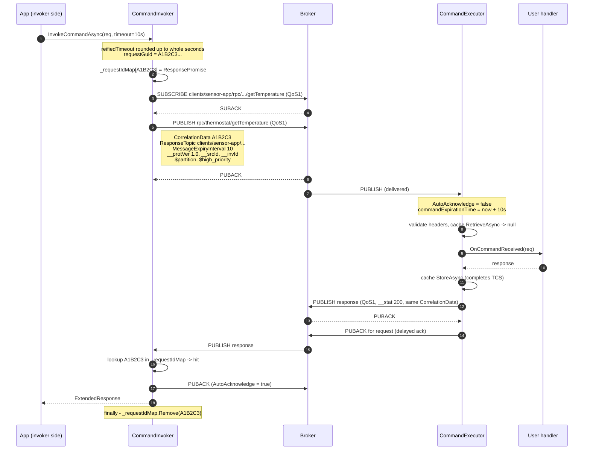
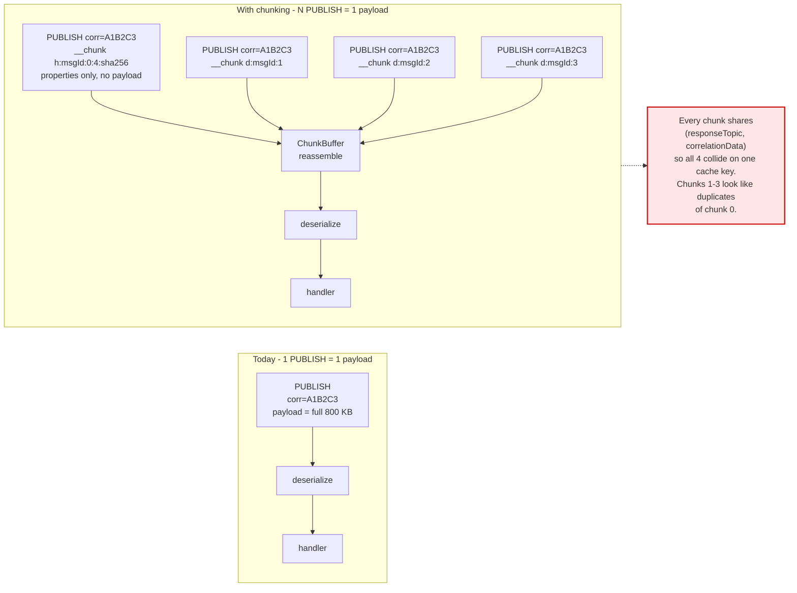
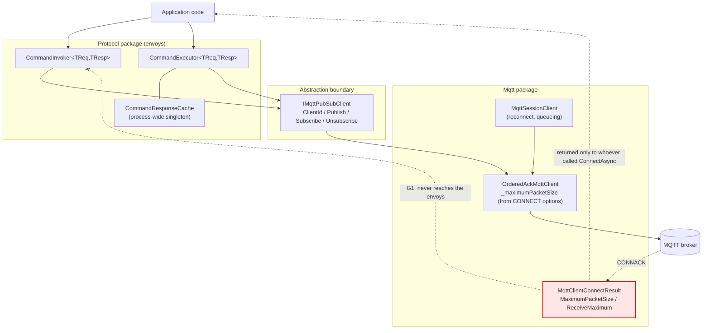
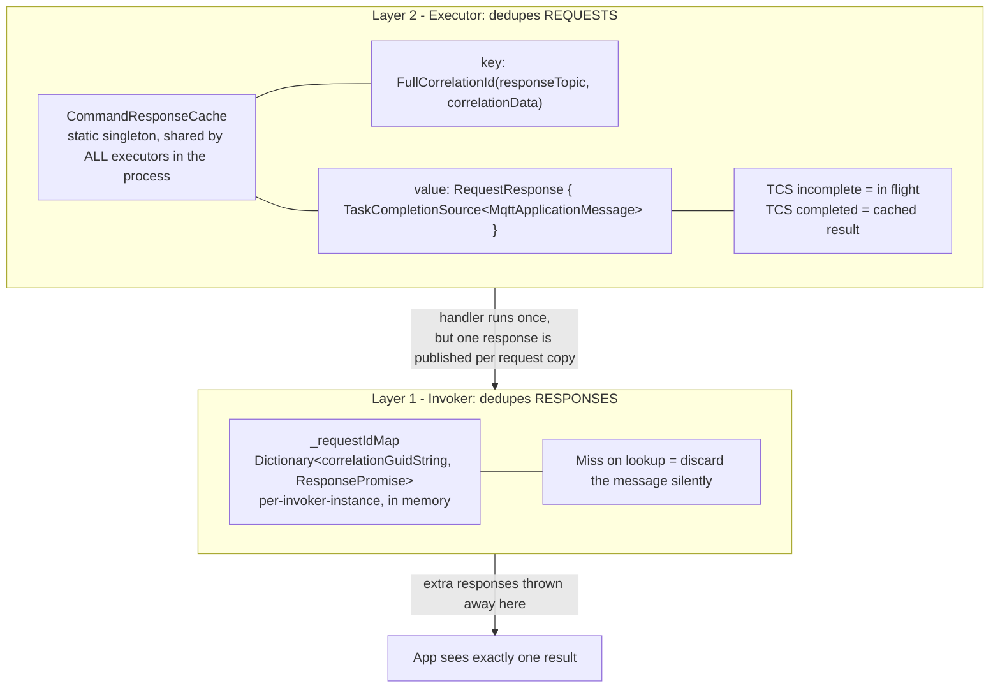
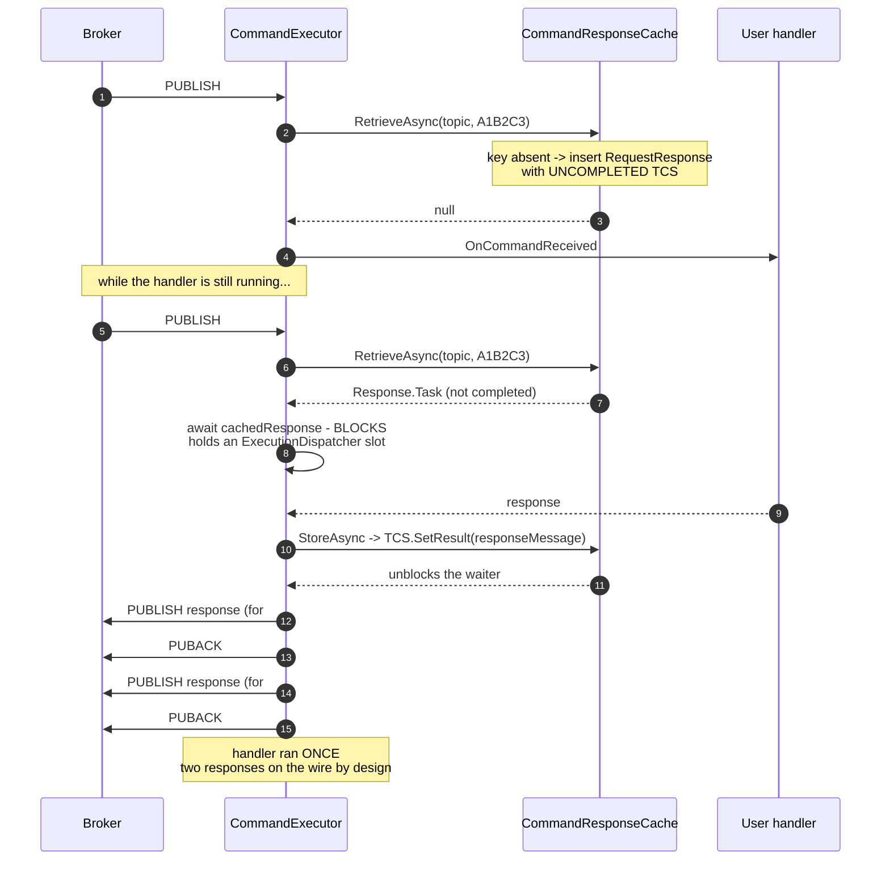
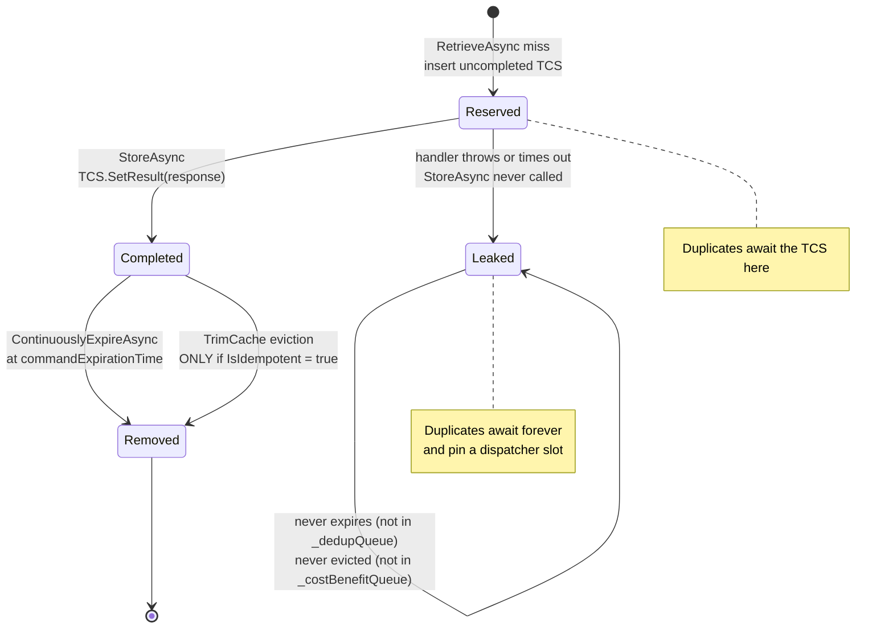
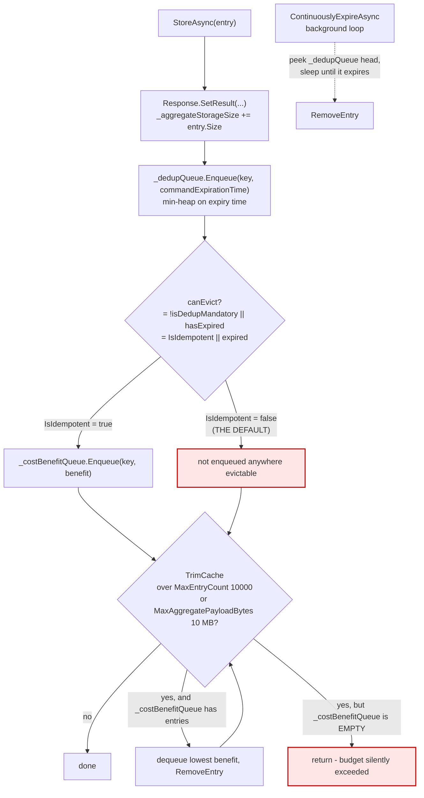
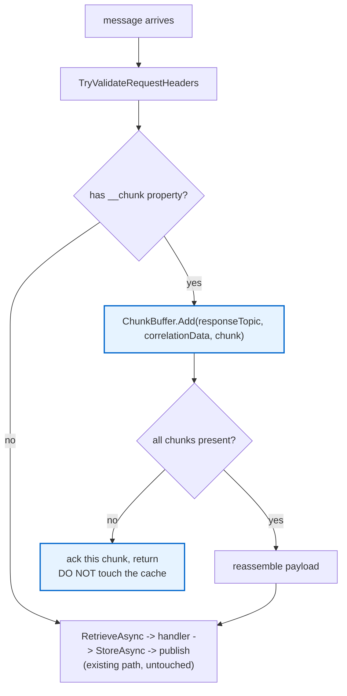

# RPC Chunking — Working Document

> **Status:** Working draft. Not an ADR yet.
> **Purpose:** Capture the review of the current RPC implementation and the .NET caching/dedupe
> machinery, so that the chunking design (and the eventual ADR) starts from verified facts rather
> than assumptions.

## Background

Per the RPC Chunking design meeting, the agreed direction is:

* Add chunking **in place**, inside the existing RPC invoker/executor — not below the envoys, not
  on top of a new streaming protocol, and not in a separate "chunking envoy".
* Bump the RPC **wire protocol version to 2.0**, keeping a legacy 1.0 path.
* Chunking is **automatic and opaque** to the user. No user-facing chunk-size knob for now.
* **Streaming is shelved.** Telemetry chunking is deferred.
* Reuse the same topics — no separate chunking topics.

Rejected alternatives and the reasoning behind them are in the meeting notes; this document is
concerned only with *what the code looks like today* and *what that implies for the design*.

---

# Part 1 — Current RPC Implementation, Review for Chunking

## 1.1 Where the code lives

| | Rust | .NET | Go |
|---|---|---|---|
| Invoker | [invoker.rs](../../rust/azure_iot_operations_protocol/src/rpc_command/invoker.rs) | [CommandInvoker.cs](../../dotnet/src/Azure.Iot.Operations.Protocol/RPC/CommandInvoker.cs) | [command_invoker.go](../../go/protocol/command_invoker.go) |
| Executor | [executor.rs](../../rust/azure_iot_operations_protocol/src/rpc_command/executor.rs) | [CommandExecutor.cs](../../dotnet/src/Azure.Iot.Operations.Protocol/RPC/CommandExecutor.cs) | [command_executor.go](../../go/protocol/command_executor.go) |
| Cache | inline in `executor.rs` | [CommandResponseCache.cs](../../dotnet/src/Azure.Iot.Operations.Protocol/RPC/CommandResponseCache.cs) | [cache.go](../../go/protocol/internal/caching/cache.go) |
| Wire properties | [user_properties.rs](../../rust/azure_iot_operations_protocol/src/common/user_properties.rs) | [AkriSystemProperties.cs](../../dotnet/src/Azure.Iot.Operations.Protocol/AkriSystemProperties.cs) | [metadata.go](../../go/protocol/internal/constants/metadata.go) |
| Errors | [aio_protocol_error.rs](../../rust/azure_iot_operations_protocol/src/common/aio_protocol_error.rs) | [AkriMqttErrorKind.cs](../../dotnet/src/Azure.Iot.Operations.Protocol/AkriMqttErrorKind.cs) | [errors.go](../../go/protocol/errors/errors.go) |
| Version constants | [rpc_command.rs](../../rust/azure_iot_operations_protocol/src/rpc_command.rs) | [CommandVersion.cs](../../dotnet/src/Azure.Iot.Operations.Protocol/RPC/CommandVersion.cs) | [version.go](../../go/protocol/internal/version/version.go) |

> **This was anticipated.** `ChunkBuffer` TODO comments already exist in the Rust invoker response
> parser ([invoker.rs#L490](../../rust/azure_iot_operations_protocol/src/rpc_command/invoker.rs#L490),
> [#L497](../../rust/azure_iot_operations_protocol/src/rpc_command/invoker.rs#L497)) and in
> [telemetry/receiver.rs#L82](../../rust/azure_iot_operations_protocol/src/telemetry/receiver.rs#L82).
> They note that user properties are already copied out of the `Publish` into a `HashMap`
> specifically so a future `ChunkBuffer` won't have to retain whole `Publish` objects.

## 1.2 The current round trip

All three languages implement the same shape. Using .NET names:



Two details worth calling out because they help us:

* The invoker **registers the correlation promise before publishing**, so a very fast response
  cannot race ahead of its slot.
* The invoker **always subscribes before it publishes**. This means a CONNACK has necessarily
  happened before we ever need to size a chunk — which defuses the "how do we chunk while offline
  queueing" worry raised in the meeting.

## 1.3 The invariants chunking breaks



Three assumptions are load-bearing today and all three break:

1. **One PUBLISH == one complete serialized payload.** Correlation dispatch, deserialization, and
   cache keying all depend on this.
2. **Correlation data is the unit of both correlation and dedupe.** Every chunk carries the same
   correlation data, so the executor's cache key collides across chunks.
3. **`MessageExpiryInterval` is the single clock** driving broker TTL, executor handler timeout,
   *and* dedupe cache lifetime.

## 1.4 The layering problem (G1)

The negotiated maximum packet size is not reachable from any envoy, in any language.



Per language:

* **Rust** — the CONNACK *is* captured (`ConnectionState::Connected { connack }` in
  `azure_mqtt/client/session.rs`, with `maximum_packet_size` / `receive_maximum` parsed and
  defaulted in `mqtt_proto/connack.rs`). But `SessionMonitor` exposes only a connected bool and
  `SessionManagedClient` has no accessor. There is **no client-side size check on publish at all** —
  the packet goes out and the broker rejects it.
* **.NET** — `MaximumPacketSize` *is* mapped into `MqttClientConnectResult`, but envoys depend on
  `IMqttPubSubClient`, which has no connect result.
  [`ValidateMessageSize`](../../dotnet/src/Azure.Iot.Operations.Mqtt/OrderedAckMqttClient.cs#L167)
  has two defects for our purposes: it compares against `options.MaximumPacketSize` (the **inbound**
  limit this client advertises in CONNECT, not the broker's outbound limit from CONNACK), and it
  compares `message.Payload.Length` only — ignoring topic, correlation data, and user properties,
  which all count toward the packet.
* **Go** — CONNACK properties are never captured at all. `connect.go` reads only `AuthMethod`;
  `ConnectEvent` carries only a reason code.

## 1.5 Gap list

| # | Gap | Notes |
|---|---|---|
| **G1** | Negotiated max packet size unreachable by envoys (all 3 languages) | .NET's existing check also uses the wrong field and ignores property overhead. |
| **G2** | No chunk metadata on the wire | Needs new `__` reserved user properties plus parsing on both sides. Also worth resolving the `__invId` asymmetry — .NET sends it, Rust and Go do not. |
| **G3** | Packet size estimation is hard | Topic, correlation data, response topic and all user properties count. In Rust the wire packet is built by a bespoke buffer not exposed through the API. Expect reserved headroom plus a resize-and-retry fallback. **Update: largely closed in .NET.** Sizing a PUBLISH turned out to be exact arithmetic over the MQTT 5 encoding — see §3.5 of the POC plan — so no resize-and-retry is needed there. Rust and Go still need to confirm the same is reachable. |
| **G4** | Cache blowup | See Part 2. Reassembled multi-MB payloads land in a 10 MB process-wide budget, and the default configuration is the un-evictable one. |
| **G5** | Packet ID exhaustion | Rust has an explicit `PkidPool`; exhaustion returns `None` and the session loop **blocks** (backpressure, no error). .NET and Go delegate to MQTTnet/paho with no repo-level policy. Combined with delayed acks this is a real risk for large N. |
| **G6** | New error kinds | `AIOProtocolErrorKind` is a plain enum with **no `#[non_exhaustive]`** — adding `IncompleteChunk` is a Rust breaking change. `AkriMqttErrorKind` and Go's `errors.Kind` absorb a new value more cheaply. Cheapest cross-language option is reusing `PayloadInvalid` (→ 400) or `HeaderMissing`/`HeaderInvalid`, at the cost of diagnostics. |
| **G7** | No backchannel to cancel a chunked *response* | Unsubscribe does not signal the peer, and "no matching subscribers" is unreliable (not treated as an error in Rust, may not be sent at all). Accepted and to be documented. |
| **G8** | Delayed-ack window widens | No chunk may be acked until the reassembled payload reaches the user, or a crash mid-reassembly silently loses data. Interacts with .NET's `ExecutionDispatcher` (ordered process-then-ack, default concurrency 10 per client id) and `OrderedAckMqttClient`'s strict ack ordering, where an unacked chunk blocks all subsequent ACKs. |

## 1.6 Cross-language divergence to reconcile first

The three implementations already disagree about in-flight duplicate handling. A chunking spec that
assumes uniform behaviour will not hold:

| | In-flight duplicate | Cached entry expiry |
|---|---|---|
| **Rust** | Delays the ack until the original's `CancellationToken` fires | `command_expiration + 60s`; caches error responses too |
| **.NET** | Coalesces onto the same `Task` (blocks the dispatcher slot) | `commandExpirationTime` |
| **Go** | Returns `nil, nil` — **drops** the duplicate | `now + MessageExpiry` |

This needs settling before the METL tests in `eng/test/test-cases/Protocol/` can be written.

---

# Part 2 — .NET Caching & Dedupe, Walkthrough

There are **two independent dedupe layers**, one on each side. Neither is a hit-rate optimization —
both exist purely to make QoS1 at-least-once look like exactly-once to the application.



## 2.1 The running example

```
Command:        getTemperature
Invoker:        client id "sensor-app"
Executor:       client id "thermostat"
Request topic:  rpc/thermostat/getTemperature
Response topic: clients/sensor-app/rpc/thermostat/getTemperature
Correlation:    GUID A1B2C3… (16 bytes)
Timeout:        10s  →  MessageExpiryInterval = 10
```

## 2.2 Layer 1 — Invoker `_requestIdMap`

A `Dictionary<string, ResponsePromise>` keyed by the correlation GUID string.

```
InvokeCommandAsync
  ├─ requestGuid = A1B2C3…
  ├─ if _requestIdMap already contains it → throw StateInvalid           (L501)
  ├─ _requestIdMap["A1B2C3…"] = new ResponsePromise(responseTopic)       (L540)  ← BEFORE publish
  ├─ subscribe → publish → await promise (10s)
  └─ finally: _requestIdMap.Remove("A1B2C3…")                            (L703)
```

The dedupe itself is the early return in
[`MessageReceivedCallbackAsync`](../../dotnet/src/Azure.Iot.Operations.Protocol/RPC/CommandInvoker.cs#L221):

```csharp
if (!_requestIdMap.TryGetValue(requestGuidString, out responsePromise))
{
    return;          // unknown or already-completed correlation — discard
}
```

**When two responses arrive for `A1B2C3…`:**

* 1st → found → `TrySetResult(...)` → `InvokeCommandAsync` returns → `finally` removes the entry.
* 2nd → either the entry is already gone (`return`, discarded), or it is still present but the TCS
  is complete and
  [`TrySetResult` returns false](../../dotnet/src/Azure.Iot.Operations.Protocol/RPC/CommandInvoker.cs#L371)
  → warning logged, discarded.

This map is per-invoker-instance and in-memory only. It does not survive a process restart.

### Naming note

`_requestIdMap` describes only its key and says nothing about its value — which is *not* a request,
but a `ResponsePromise` (the awaited `TaskCompletionSource` plus the response topic to validate
against). The field actually serves four roles:

1. Correlation dispatch table — routes an incoming response to the right waiter (L229).
2. Response dedupe — a miss means discard silently, which is how the second copy of a response is
   dropped.
3. Concurrent-invocation guard — L501 rejects a second invoke with the same correlation ID while
   the first is outstanding. Only reachable when the caller supplies `metadata.CorrelationId`.
4. Shutdown cancellation list — dispose iterates it to cancel every waiting caller (L791).

`_inFlightRequestMap` would improve the lifetime clarity but keeps the wrong noun. The codebase
already has its own vocabulary here — the type is `ResponsePromise` and the log messages say "the
command response promise" — and .NET is the odd one out cross-language:

| Rust | `dispatcher`, with `register_receiver` / `unregister_receiver` |
|---|---|
| **Go** | **`pending`, via `initPending` / `sendPending`** |
| .NET | `_requestIdMap` |

`_pendingResponses` aligns with both. One caveat for chunking: the invoker will need somewhere to
accumulate response chunks per correlation ID, most naturally a `ChunkBuffer` field on
`ResponsePromise`. At that point the value becomes all per-invocation state, so `_pendingInvocations`
survives the change, `_pendingResponses` narrows slightly, and `_inFlightRequestMap` gets *more*
wrong. Deferred — not worth a rename until we touch the file for chunking.

## 2.3 Layer 2 — Executor `CommandResponseCache`

A **process-wide singleton** —
[`CommandResponseCache.GetCache()`](../../dotnet/src/Azure.Iot.Operations.Protocol/RPC/CommandExecutor.cs#L104)
returns a `static instance`, so every `CommandExecutor` in the process shares one cache and one
10 MB budget.

* **Key** — `FullCorrelationId(responseTopic, correlationData)`. The response topic is part of the
  key so one invoker cannot read another's cached response.
* **Value** — `RequestResponse`, whose core is a `TaskCompletionSource<MqttApplicationMessage>`.
  That TCS is the whole trick: it doubles as both the "in-flight" marker and the cached result.

### Case A — first request, happy path

```
1. Request arrives, AutoAcknowledge = false                     (L124)
2. commandExpirationTime = now + 10s
3. RetrieveAsync(key)
     key not present → insert RequestResponse with UNCOMPLETED TCS
     → returns null                                             (L150)
4. null ⇒ not a duplicate ⇒ deserialize, run OnCommandReceived
5. GenerateResponseAsync → response message, __stat = 200
6. StoreAsync                                                   (L237)
     ├─ Response.SetResult(responseMessage)     ← TCS now completed
     ├─ _aggregateStorageSize += entry.Size
     ├─ _dedupQueue.Enqueue(key, commandExpirationTime)   ← expiry at T+10s
     ├─ canEvict = !isDedupMandatory  → false (IsIdempotent defaults to false)
     │     so NOT enqueued into _costBenefitQueue
     └─ TrimCache()
7. PublishResponseAsync
8. ACK the request  ← only now                                  (L291)
```

### Case B — duplicate arrives while the handler is still running

The reconnect / invoker-retry case. Second PUBLISH, same correlation data, same response topic.



The handler runs **once**, but **two responses are published** — layer 1 discards the second. That
is the documented tradeoff in [rpc-protocol.md](../reference/rpc-protocol.md): dedupe the execution,
not the response traffic, because it simplifies the "response send failed" case.

Note the blocking `await` occupies an
[`ExecutionDispatcher`](../../dotnet/src/Azure.Iot.Operations.Protocol/ExecutionDispatcher.cs#L24)
slot (default 10 per client id) for the whole duration.

### Case C — duplicate arrives after the original completed

Identical code path, except `Response.Task` is already complete, so `await` returns immediately and
the cached payload is re-published under the *current* request's correlation data and response
topic. The handler is not re-run.

### Case D — expiry

The background loop
[`ContinuouslyExpireAsync`](../../dotnet/src/Azure.Iot.Operations.Protocol/RPC/CommandResponseCache.cs#L200)
peeks `_dedupQueue` (a min-heap on `commandExpirationTime`), sleeps until the head expires, then
removes it. At **T+10s** our entry is gone and a later duplicate would execute the handler again.

**Cache lifetime is driven entirely by the request's `MessageExpiryInterval`** — a 10-second command
buys 10 seconds of dedupe protection.

## 2.4 Entry lifecycle



## 2.5 Eviction and expiry mechanics



## 2.6 Findings

Two behaviours below look like defects at first reading but are deliberate. Only F3 is a real bug.

### F1 — Payload-equivalence reuse is unimplemented (by contract, optional)

```csharp
IsIdempotent = ...?.IsIdempotent ?? false;                       // L111
CacheTtl     = ...?.CacheTtl ?? "PT0H0M0S";                      // L112 → zero
// and validation:
if (!IsIdempotent && CacheTtl != TimeSpan.Zero) throw ...;       // L664
```

`isCacheable: CacheTtl > TimeSpan.Zero` is therefore **false by default**. All it controls is
whether a `FullRequest` object gets built — and `FullRequest` is stored but **never matched
anywhere** in `RetrieveAsync`. `canReuseAcrossInvokers` is accepted and ignored. The
`ReuseReference` type is entirely unused. The `ttl` computed at
[CommandExecutor.cs#L131](../../dotnet/src/Azure.Iot.Operations.Protocol/RPC/CommandExecutor.cs#L131)
is never passed to the cache.

**Not a bug.** [`ICommandResponseCache`](../../dotnet/src/Azure.Iot.Operations.Protocol/RPC/ICommandResponseCache.cs#L12)
makes dedupe "REQUIRED for non-idempotent commands" but says reuse **"MAY be returned instead of
executing the command"**. An unimplemented `MAY` is dead code and misleading API surface, not a
correctness defect.

Worth knowing why the test suite never flagged it — every reuse test is negative:

| Dedupe tests | Reuse tests |
|---|---|
| `...IsRetrievableForDedup` | `...IsNotRetrievableForReuse` |
| `DedupBySameTopicSucceeds...` | `ReuseByDifferentInvokerFails...` |
| `SecondRetrieveReturnsFutureForDedup...` | `SecondRetrieveReturnsNullForReuse...` |

Every reuse assertion is `Assert.Null(...)`, which passes whether or not the feature exists. No
test would fail if reuse were deleted outright.

### F2 — Non-idempotent entries are un-evictable (deliberate)

```csharp
bool isDedupMandatory = !isIdempotent;            // true by default
bool canEvict = !isDedupMandatory || hasExpired;  // false by default
```

Non-idempotent entries are never placed in `_costBenefitQueue`, and
[`TrimCache`](../../dotnet/src/Azure.Iot.Operations.Protocol/RPC/CommandResponseCache.cs#L193) only
evicts from that queue. Under default settings `TrimCache` finds an empty queue and simply
`return`s — the cache exceeds `MaxAggregatePayloadBytes` (10 MB) and stays over budget until
entries expire on the clock.

**Not a bug — this is tested intent.** `CacheNotTrimmedOnStoreWhenNoEntriesEligibleForEviction`
stores three non-idempotent entries with `MaxEntryCount = 2` and asserts all three survive. Dedupe
correctness for non-idempotent commands is deliberately ranked above the memory budget, because
dropping a dedupe entry means re-executing a non-idempotent command. Still a chunking hazard
(§2.7), just not a defect.

### F3 — Orphaned cache placeholder wedges the dispatcher (**real bug**)

`RetrieveAsync` inserts the placeholder unconditionally, but `StoreAsync` is only called on the
**success** path. Three executor paths reach `RetrieveAsync` (L155) and then skip `StoreAsync`,
because their `catch` blocks call `GenerateAndPublishResponseAsync` directly:

* request deserialization failure ([CommandExecutor.cs#L188](../../dotnet/src/Azure.Iot.Operations.Protocol/RPC/CommandExecutor.cs#L188)) — easiest repro, just send a malformed payload
* handler throws
* handler times out

The entry then becomes unreclaimable, and it takes **both** halves to get there:

1. **`RetrieveAsync` creates the entry but `StoreAsync` supplies the deadline.**
   `_dedupQueue.Enqueue(fullCorrelationId, commandExpirationTime)` happens only inside `StoreAsync`,
   so an entry that never reaches it has no expiry time at all — the cache does not know when it
   should die.
2. **Neither reclamation path can see it.** `ContinuouslyExpireAsync` walks only `_dedupQueue`;
   `TrimCache` walks only `_costBenefitQueue`. `RequestResponse.Size` also returns `0` while the TCS
   is incomplete, so it never counts toward `_aggregateStorageSize` to trigger a trim either.

**Blast radius is larger than a memory leak.** A redelivery takes the cache-hit branch and does
`await cachedResponse` with no timeout and no cancellation token, inside
[`ExecutionDispatcher.SubmitAsync`](../../dotnet/src/Azure.Iot.Operations.Protocol/ExecutionDispatcher.cs#L24):

```csharp
await _semaphore.WaitAsync().ConfigureAwait(false);
ThreadPool.UnsafeQueueUserWorkItem(async (_) =>
{
    try { if (process is not null) await process(); }   // hangs here forever
    catch (Exception e) { ... }
    try { await acknowledge(); }                        // never runs
    catch (Exception e) { ... }
    _semaphore.Release();                               // never runs
}, 0, preferLocal: false);
```

So one orphaned entry plus one redelivery permanently consumes a dispatcher slot **and** never
sends the PUBACK. After 10 of those (the default concurrency) the dispatcher is wedged — and
`ExecutionDispatcherCollection` shares it **per MQTT client id**, so every executor on that client
stops. The missing PUBACK also blocks all subsequent ACKs, since `OrderedAckMqttClient` serializes
them.

Likely fix: have the executor's `catch` paths release the reservation — either an
`ICommandResponseCache.AbandonAsync(topic, correlationData)`, or a `StoreAsync` of the error
response so the entry completes and picks up an expiry.

### F3 repro tests — to add

Not committed yet; they are red until F3 is fixed. Land them green in the fix PR, or add them now
as `[Fact(Skip = "Exposes cache placeholder leak, see #NNN")]`.

**Unit level** — belongs in
[CommandResponseCacheUnitTests.cs](../../dotnet/test/Azure.Iot.Operations.Protocol.UnitTests/CommandResponseCacheUnitTests.cs),
reusing that file's existing fixtures:

```csharp
[Fact]
public async Task RetrieveWithoutStoreDoesNotLeaveUncompletableEntry()
{
    var commandResponseCache = new TestCommandResponseCache();
    await commandResponseCache.StartAsync();

    // First request reserves the slot.
    Assert.Null(await commandResponseCache.RetrieveAsync(
        CommandName1, MqttTopic1, _correlationData01, _requestPayload01,
        isCacheable: false, canReuseAcrossInvokers: false));

    // Handler threw or the payload failed to deserialize, so StoreAsync is never called.
    // A redelivery of the same request now finds the orphaned placeholder.
    Task<MqttApplicationMessage>? duplicate = await commandResponseCache.RetrieveAsync(
        CommandName1, MqttTopic1, _correlationData01, _requestPayload01,
        isCacheable: false, canReuseAcrossInvokers: false);

    if (duplicate is not null)
    {
        // Either the entry should have been evicted (duplicate == null, re-execute)
        // or its task must complete. It must not hang.
        Task winner = await Task.WhenAny(duplicate, Task.Delay(_temporalTestQuiescenceDelay));
        Assert.Same(duplicate, winner);
    }

    await commandResponseCache.StopAsync();
}
```

Today `duplicate` is non-null and the `Task.Delay` wins, so `Assert.Same` fails. The assertion is
deliberately fix-agnostic — it accepts either remedy.

**Executor level** — belongs in
[CommandExecutorTests.cs](../../dotnet/test/Azure.Iot.Operations.Protocol.UnitTests/CommandExecutorTests.cs),
since it needs the dispatcher and the mock MQTT client. This is the test that shows the real blast
radius; the unit test alone understates it.

```
Arrange: executor whose serializer throws on FromBytes (or a handler that throws)
Act:     deliver request corr=X, then redeliver the identical request corr=X
Assert:  the second delivery is acknowledged within a bounded time
```

## 2.7 Why this matters for chunking

| Current assumption | What chunking does to it |
|---|---|
| Key = (response topic, correlation data) | Every chunk shares both → all N chunks collide on one key. Chunk 2 looks like a duplicate of chunk 1 and gets swallowed by the cache-hit path. |
| Cached value = one complete response payload | A reassembled multi-MB payload now sits in a 10 MB process-wide budget. |
| Un-evictable non-idempotent entries (F2) | Deliberate, but exactly the path that pins large payloads until expiry. |
| Expiry = `MessageExpiryInterval` | A chunked transfer takes longer; the window must cover reassembly of all N chunks, not one round trip. |
| Duplicate → re-publish cached response | Now means re-publishing *all N chunks*, with no way for the invoker to say "stop" (G7). |
| Handler failure leaks an entry (F3) | Chunking adds many new failure modes — missing chunk, expired chunk, partial reassembly — so many more ways to orphan a placeholder and wedge the dispatcher. |

## 2.8 F3 becomes a happy-path deadlock under chunking

F3 today needs a failure to trigger: a placeholder that never reaches `StoreAsync`, plus a
redelivery. Chunking produces both conditions **on the golden path**, if chunks reach the cache
individually:

```
chunk 0 → RetrieveAsync → null → placeholder inserted
          can't run the handler yet, just buffer and return   ← StoreAsync never called
chunk 1 → RetrieveAsync → returns chunk 0's INCOMPLETE Task
          → cache-hit branch → await cachedResponse → deadlock
```

Every chunk shares `(responseTopic, correlationData)`. This is §1.3's assumption 2 and the first row
of §2.7 seen from the other side.

**Mitigation — put the chunk buffer in front of the cache.** Reassemble first, then run the
existing flow once with the reassembled payload, so the placeholder is created and completed within
a single operation exactly as it is today:



The hook belongs between `TryValidateRequestHeaders` and `RetrieveAsync` at
[CommandExecutor.cs#L155](../../dotnet/src/Azure.Iot.Operations.Protocol/RPC/CommandExecutor.cs#L155).
Header validation stays per-chunk, which is fine — every chunk carries correlation data, response
topic, expiry and `__protVer`.

This is not a workaround to be repaid later; it is the placement production needs, which is why
"design `ChunkBuffer` first" leads Part 3. Note it does **not** fix F3 itself — the orphaned-entry
bug remains reachable through the three failure paths in §2.6.

> The chunk buffer needs its own expiry and chunk-count bound from day one, or a message that
> stalls after chunk 0 recreates F3's exact shape in new code: an entry with no deadline that
> nothing reclaims.

See [rpc-chunking-poc-plan.md](rpc-chunking-poc-plan.md) for the POC scope built on this.

---

# Part 3 — Proposed next steps

1. **Design `ChunkBuffer` first**, and share it between RPC and telemetry. Both the existing TODO
   comments and the meeting discussion point that way, and telemetry will need it later.
2. **Plumb the negotiated max packet size to the envoys** as a separate, self-contained change
   (G1). Three different insertion points per language; land this before the chunking protocol so
   the protocol can assume it exists.
3. **Fix .NET `ValidateMessageSize`** to use the CONNACK value and account for full packet size —
   a latent bug independent of chunking.
4. **Reconcile dedupe-cache semantics** across the three languages (§1.6) before writing the spec,
   otherwise the METL tests in `eng/test/test-cases/Protocol/` cannot be written.
5. **Fix F3** (§2.6) — orphaned cache placeholder wedges the dispatcher and blocks ACKs. A real
   hang, independent of chunking. Add the two repro tests with the fix.
6. **Rename `_requestIdMap`** (§2.2) when the invoker is touched for chunking, once the final shape
   of the per-invocation state is known.
7. **Write the ADR.** Next number is 0033, following
   [0031-backpressure-bypass.md](adr/0031-backpressure-bypass.md). Also update
   [rpc-protocol.md](../reference/rpc-protocol.md) (which already promises streaming "soon") and
   [protocol-versioning.md](../reference/protocol-versioning.md) for the 2.0 bump.

## Open questions for the ADR

* Chunk metadata schema — index + count only, or also total byte length and a per-message id?
* Does the chunk count go on every chunk, or only the first?
* Does the executor reject up front when chunk count exceeds a locally acceptable bound
  (packet-ID and memory protection, G5)?
* How is `MessageExpiryInterval` distributed across N chunks — same value on each, or a decreasing
  countdown as discussed for streaming?
* Which existing error kind absorbs incomplete-chunk failures, versus taking the Rust breaking
  change (G6)?
