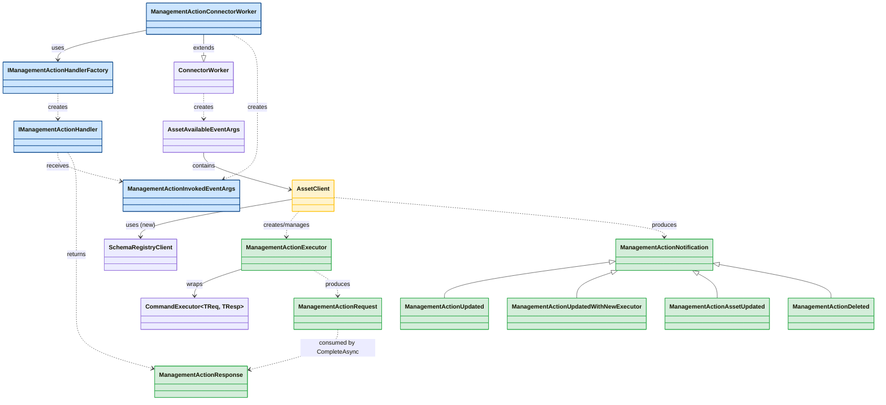
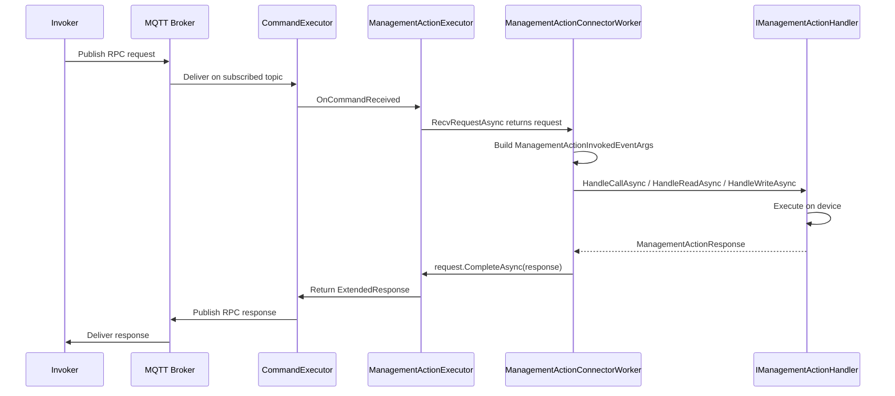

# Management Action Support in .NET SDK — Design Onepager
**Author:** Maxim Semenov  
**Date:** 2026-04-17 (revised 2026-04-30)  
**Status:** Proposed (revised per review feedback) — Part 1 scaffolding landed on `maxim/management-action`  
**Full design:** [management-action-implementation-design.md](management-action-implementation-design.md)  
**Gap analysis:** [management-action-gap-analysis.md](management-action-gap-analysis.md)  

---

## Implementation status (branch `maxim/management-action`, 2026-04-30)

The branch lands **Part 1: invocation pipeline scaffolding**. All public types in the table below exist with full XML doc comments and have been compiled clean against the rest of `Azure.Iot.Operations.Connector`. **Method bodies are stubs that throw `NotImplementedException`** — the goal of the branch is to lock the public surface and the user-facing flow before wiring the internals. The `ManagementActionConnectorWorker` orchestration logic itself is fully written (per-action loop, notification handling, drain/dispose, health/config reporting) and will start working as soon as the underlying `AssetClient` methods get bodies.

| Area | Status on branch |
|------|------------------|
| `IManagementActionHandler`, `IManagementActionHandlerFactory`, `ManagementActionInvokedEventArgs` | Implemented |
| `ManagementActionResponse`, `ManagementActionApplicationError` (records) | Implemented |
| `ManagementActionExecutor`, `ManagementActionRequest` (public surface) | Class shells with `NotImplementedException` bodies |
| `ManagementActionNotification` + 4 derived records | Implemented |
| `ManagementActionConnectorWorker` (per-action loop, dispatch, drain, status reporting) | **Implemented** — calls into `AssetClient` stubs, so will throw at runtime until those are wired |
| `AssetClient.GetManagementActionExecutorAsync` / `RecvManagementActionNotificationAsync` / `PauseManagementActionRuntimeHealthReportingAsync` | Public stubs (`NotImplementedException`) |
| `AssetClient.ReportManagementAction{Request,Response}MessageSchemaAsync` (Part 2) | **Deliberately deferred** to a follow-up; not on this branch |
| `ConnectorWorker` modifications (inject `SchemaRegistryClient`, push notifications) | **Not yet done** — deferred along with the corresponding `AssetClient` bodies |
| Sample connector (`dotnet/samples/Connectors/ManagementActionConnector`) | Compiles and starts; will fault on the first asset/action because `AssetClient` stubs throw |

> Deviations from the original onepager table:
> - `PauseManagementActionRuntimeHealthReportingAsync` was added to `AssetClient` (it isn't called out in the table below); it is the per-action analog of the existing `AssetRuntimeHealthReporter.PauseReportingManagementActionAsync` and is invoked by `ManagementActionConnectorWorker` on every definition update.
> - Schema reporting (`ReportManagementAction{Request,Response}MessageSchemaAsync`, `SchemaRegistryClient` injection on `AssetClient`) is split out as Part 2 and deferred to a follow-up.

---
## Context
The Rust SDK fully supports management actions — callable operations (read/write/call) on assets exposed as RPC endpoints over MQTT. The .NET SDK only supports health reporting for management actions today. The core execution pipeline (receiving invocations, responding, lifecycle management, schema registration) is missing entirely.
**Rust reference implementation:**
- `ManagementActionExecutor` — receives RPC requests over MQTT
- `ManagementActionClient` — lifecycle management, schema reporting, notifications
- Two working sample connectors demonstrating end-to-end management action handling
---
## Proposal
Add management action execution support to `Azure.Iot.Operations.Connector`. No changes to the Protocol, Services, or Mqtt layers. No new NuGet dependencies.
### New Types (all in Connector layer)
| Type | Purpose |
|------|---------|
| **IManagementActionHandler** | User-implemented interface with `HandleCallAsync`, `HandleReadAsync`, `HandleWriteAsync` — one method per action type. Extends `IAsyncDisposable`. |
| **IManagementActionHandlerFactory** | Factory creating per-action handler instances (mirrors `IDatasetSamplerFactory`). Receives full action context at creation time. |
| **ManagementActionInvokedEventArgs** | Event args passed to handler methods — contains group/action name, action type, payload, content-type, metadata, topic tokens. |
| **ManagementActionConnectorWorker** | Base class extending `ConnectorWorker` (mirrors `PollingTelemetryConnectorWorker`). Internalizes all per-action lifecycle: executor management, notifications, drain, health/config reporting. |
| **ManagementActionExecutor** | Wraps `CommandExecutor<byte[], byte[]>` with `PassthroughSerializer` — receives RPC requests over MQTT |
| **ManagementActionRequest** | Incoming invocation — exposes payload, metadata; completed via `CompleteAsync(response)` |
| **ManagementActionResponse** | `record` with `required` Payload, ContentType, CloudEvent; optional ApplicationError |
| **ManagementActionApplicationError** | `record` with ErrorCode + ErrorPayload |
| **ManagementActionNotification** | Abstract `record` base with 4 derived types: Updated, UpdatedWithNewExecutor, AssetUpdated, Deleted (internal to base connector) |
### Modified Types
| Type | Change |
|------|--------|
| **AssetClient** | New methods: `GetManagementActionExecutorAsync`, `RecvManagementActionNotificationAsync`, `ReportManagementAction{Request/Response}MessageSchemaAsync`. New internal state: per-action notification channels. New dependency: `SchemaRegistryClient` |
| **ConnectorWorker** | Injects `SchemaRegistryClient` into `AssetClient`; pushes management action notifications to `AssetClient` when asset definitions change |
### Class Relationships

**Legend:** Blue = user-facing types (interface + base class). Green = internal types. Yellow = modified existing types.
---
## Key Design Decisions
### 1. IManagementActionHandler interface with three methods (Call/Read/Write)
Per review feedback, the base connector should manage all per-action threading and lifecycle internally. Users implement `IManagementActionHandler` with three methods matching the `AssetManagementGroupActionType` enum:
- `HandleCallAsync` — general RPC (payload in, payload out)
- `HandleReadAsync` — minimal request, value out
- `HandleWriteAsync` — value in, minimal response
This follows the SDK's existing pattern: interfaces for multi-method user logic (`IDatasetSampler`), `Func<>` delegates for single-method lifecycle hooks (`WhileAssetIsAvailable`). Three related methods ? interface is the idiomatic choice.
### 2. IManagementActionHandlerFactory for per-action context
Mirrors `IDatasetSamplerFactory`. The factory receives the full `AssetManagementGroupAction` (including `TargetUri`, `ActionConfiguration`, `TimeoutInSeconds`), `Device`, `Asset`, and `EndpointCredentials` at creation time. Handlers capture what they need in their constructor — no need to plumb action metadata through every request.
### 3. ManagementActionConnectorWorker base class
Mirrors `PollingTelemetryConnectorWorker`. Extends `ConnectorWorker` and internalizes:
- Per-action task spawning and cancellation
- Executor acquisition, swap (drain old + adopt new)
- All 4 notification types (Updated, UpdatedWithNewExecutor, AssetUpdated, Deleted)
- Health + config-status reporting (respects `Error` field — reports Unavailable on error)
- Exception-to-error-response translation (unhandled handler exceptions ? `InternalError`)
- Drain-and-dispose with timeout budget
### 4. Notification model (internal, not user-facing)
`ManagementActionNotification` with its 4 variants (Updated, UpdatedWithNewExecutor, AssetUpdated, Deleted) is internal to `ManagementActionConnectorWorker`. Users never interact with notifications directly — the base class handles them and calls the user's handler methods only when actual invocations arrive. CancellationToken signals lifecycle events to the handler.
> **Alignment note:** When per-component notifications are added for datasets/events/streams, the shared variants (Updated, AssetUpdated, Deleted) should be extracted into a common base or generic type.
### 5. Management action methods on AssetClient (low-level API)
All management action functionality also lives on `AssetClient` for advanced scenarios. The `IManagementActionHandler` path is the recommended default; direct use of `AssetClient.GetManagementActionExecutorAsync` / `RecvManagementActionNotificationAsync` remains available for connectors needing custom lifecycle control.
### 6. Records for request/response (not fluent builder)
`ManagementActionResponse` is a `public record` with `required` properties — matching the dominant codebase pattern (45+ ADR model records). Compile-time enforcement of required fields via `required` keyword.
### 7. Schema reporting on AssetClient
Management actions have **two** schemas (request + response), per-action not per-asset. Explicit `ReportManagementActionRequestMessageSchemaAsync` / `ReportManagementActionResponseMessageSchemaAsync` methods on `AssetClient`.
### 8. Health reporting unchanged
Existing `AssetClient.ReportManagementActionRuntimeHealthAsync()` remains as-is — consistent with how datasets/events/streams report health. The base `ManagementActionConnectorWorker` calls it automatically.
---
## User-Facing API (Simplified)
```csharp
// Program.cs — DI registration
services.AddSingleton<IManagementActionHandlerFactory, MyHandlerFactory>();
services.AddHostedService<MyConnectorWorker>();
// MyConnectorWorker.cs — thin BackgroundService
public sealed class MyConnectorWorker : BackgroundService
{
    private readonly ManagementActionConnectorWorker _connector;
    public MyConnectorWorker(
        ApplicationContext ctx,
        ILogger<ConnectorWorker> logger,
        IMqttClient mqtt,
        IManagementActionHandlerFactory handlerFactory,
        IMessageSchemaProvider schemas,
        IAzureDeviceRegistryClientWrapperProvider adr)
    {
        _connector = new ManagementActionConnectorWorker(
            ctx, logger, mqtt, handlerFactory, schemas, adr);
    }
    protected override Task ExecuteAsync(CancellationToken ct)
        => _connector.RunConnectorAsync(ct);
}
// MyHandlerFactory.cs — creates handlers per action
public class MyHandlerFactory : IManagementActionHandlerFactory
{
    public IManagementActionHandler CreateHandler(
        string deviceName, Device device, string inboundEndpointName,
        string assetName, Asset asset, string groupName,
        AssetManagementGroupAction action, EndpointCredentials? credentials)
    {
        // Capture TargetUri, ActionConfiguration, credentials for device I/O
        return new MyHandler(action.TargetUri, credentials);
    }
}
// MyHandler.cs — the only code the user must write
public class MyHandler : IManagementActionHandler
{
    private readonly string _targetUri;
    private readonly EndpointCredentials? _creds;
    public MyHandler(string targetUri, EndpointCredentials? creds)
    {
        _targetUri = targetUri;
        _creds = creds;
    }
    public async Task<ManagementActionResponse> HandleCallAsync(
        ManagementActionInvokedEventArgs args, CancellationToken ct)
    {
        // Execute RPC on device, build response
        byte[] result = await DeviceClient.InvokeAsync(_targetUri, args.Payload, ct);
        return new ManagementActionResponse
        {
            Payload = new ReadOnlySequence<byte>(result),
            ContentType = "application/json",
            CloudEvent = null,
        };
    }
    public Task<ManagementActionResponse> HandleReadAsync(
        ManagementActionInvokedEventArgs args, CancellationToken ct)
    {
        // Read value from device
        ...
    }
    public Task<ManagementActionResponse> HandleWriteAsync(
        ManagementActionInvokedEventArgs args, CancellationToken ct)
    {
        // Write value to device
        ...
    }
    public ValueTask DisposeAsync() => ValueTask.CompletedTask;
}
```
---
## Request Flow

---
## What's Not Changing
- **Protocol layer** — `CommandExecutor<TReq, TResp>`, `ExtendedRequest/Response`, `PassthroughSerializer` used as-is
- **Services layer** — `IAzureDeviceRegistryClient`, `SchemaRegistryClient`, `AssetRuntimeHealthReporter` used as-is
- **Health reporting** — existing `AssetClient.ReportManagementActionRuntimeHealthAsync()` unchanged
- **No new NuGet packages** — all dependencies already present
---
## Open Items
- **Update diffing logic:** When `AssetChanged` fires, `ConnectorWorker` must diff old vs. new management action definitions to determine added/removed/updated actions. Caching strategy and comparison fields TBD during implementation.
- **Notification alignment:** When per-component notifications are added for datasets/events/streams, the shared variants (Updated, AssetUpdated, Deleted) should be extracted into a common base type.
