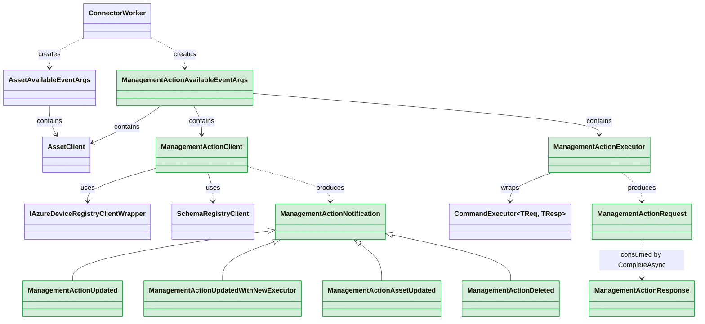
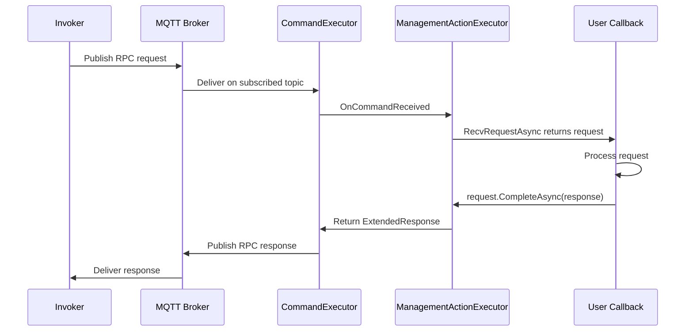

# Management Action Support in .NET SDK — Design Onepager

**Author:** Maxim Semenov  
**Date:** 2026-04-16  
**Status:** Proposed  
**Full design:** [management-action-implementation-design.md](management-action-implementation-design.md)  
**Gap analysis:** [management-action-gap-analysis.md](management-action-gap-analysis.md)

---

## Context

The Rust SDK fully supports management actions — callable operations (read/write/call) on assets exposed as RPC endpoints over MQTT. The .NET SDK only supports health reporting for management actions today. The core execution pipeline (receiving invocations, responding, lifecycle management, schema registration) is missing entirely.

**Rust reference implementation:**
- `ManagementActionExecutor` — receives RPC requests over MQTT
- `ManagementActionClient` — lifecycle management, schema reporting, notifications
- Two working sample connectors demonstrating end-to-end management action handling

---

## Proposal

Add management action execution support to `Azure.Iot.Operations.Connector`. No changes to the Protocol, Services, or Mqtt layers. No new NuGet dependencies.

### New Types (all in Connector layer)

| Type | Purpose |
|------|---------|
| **ManagementActionClient** | Lifecycle manager — receives notifications (Updated, Deleted, etc.), reports request/response schemas to ADR via Schema Registry |
| **ManagementActionExecutor** | Wraps `CommandExecutor<byte[], byte[]>` with `PassthroughSerializer` — receives RPC requests over MQTT |
| **ManagementActionRequest** | Incoming invocation — exposes payload, metadata; completed via `CompleteAsync(response)` |
| **ManagementActionResponse** | `record` with `required` Payload, ContentType, CloudEvent; optional ApplicationError |
| **ManagementActionApplicationError** | `record` with ErrorCode + ErrorPayload |
| **ManagementActionNotification** | Abstract `record` base with 4 derived types: Updated, UpdatedWithNewExecutor, AssetUpdated, Deleted |
| **ManagementActionAvailableEventArgs** | Delivered to user callback — contains Client, Executor, AssetClient, identity, definitions |

### Modified Types

| Type | Change |
|------|--------|
| **ConnectorWorker** | New `WhileManagementActionIsAvailable` callback field, per-action task tracking, management action discovery from asset definitions |

### Class Relationships



---

## Key Design Decisions

### 1. Dedicated ManagementActionClient (not on AssetClient)

Management action execution is **inbound** (receive RPC requests), fundamentally different from AssetClient's **outbound** concerns (forward data, report health). Each action has its own lifecycle (create/update/delete, executor replacement) that doesn't map to "one client per asset." A dedicated type keeps both types focused.

### 2. Hybrid notification model

**Outer lifecycle:** `WhileManagementActionIsAvailable` callback on `ConnectorWorker` — matches existing `WhileAssetIsAvailable` / `WhileDeviceIsAvailable` pattern. CancellationToken fires only on true termination (delete, shutdown).

**Inner notifications:** `ManagementActionClient.RecvNotificationAsync()` delivers fine-grained updates (Updated, UpdatedWithNewExecutor, AssetUpdated) without tearing down the callback. User coordinates requests and notifications inside the callback via `Task.WhenAny` or similar.

### 3. Records for request/response (not fluent builder)

`ManagementActionResponse` is a `public record` with `required` properties — matching the dominant codebase pattern (45+ ADR model records). Compile-time enforcement of required fields via `required` keyword. No public fluent builders exist in the SDK.

### 4. Schema reporting on ManagementActionClient

Management actions have **two** schemas (request + response), per-action not per-asset. No data-forwarding trigger exists to piggyback on (unlike datasets where `ForwardSampledDatasetAsync` implicitly registers schemas). Explicit `ReportRequestMessageSchemaAsync` / `ReportResponseMessageSchemaAsync` methods on the client.

### 5. Health reporting stays on AssetClient

`AssetClient` is exposed on `ManagementActionAvailableEventArgs`. User calls the existing `AssetClient.ReportManagementActionRuntimeHealthAsync()` — consistent with how datasets/events/streams report health.

---

## User-Facing API (Sketch)

```csharp
// In connector setup:
connectorWorker.WhileManagementActionIsAvailable = async (args, ct) =>
{
    // Register schemas
    await args.ManagementActionClient.ReportRequestMessageSchemaAsync(requestSchema, ct);
    await args.ManagementActionClient.ReportResponseMessageSchemaAsync(responseSchema, ct);

    var executor = args.InitialExecutor;

    while (!ct.IsCancellationRequested)
    {
        // Wait for either a request or a lifecycle notification
        var recvTask = executor?.RecvRequestAsync(ct) ?? Task.Delay(Timeout.Infinite, ct);
        var notifyTask = args.ManagementActionClient.RecvNotificationAsync(ct);

        await Task.WhenAny(recvTask, notifyTask);

        if (recvTask.IsCompleted)
        {
            var request = await recvTask;
            if (request != null)
            {
                // Process and respond
                var response = new ManagementActionResponse
                {
                    Payload = resultBytes,
                    ContentType = "application/json",
                    CloudEvent = null,
                };
                await request.CompleteAsync(response, ct);

                // Report health
                await args.AssetClient.ReportManagementActionRuntimeHealthAsync(
                    args.ManagementGroupName, args.ManagementActionName,
                    ConnectorRuntimeHealth.Available, ct: ct);
            }
        }

        if (notifyTask.IsCompleted)
        {
            switch (await notifyTask)
            {
                case ManagementActionUpdatedWithNewExecutor n:
                    // Drain old executor, switch to new
                    executor = n.NewExecutor;
                    break;
                case ManagementActionDeleted:
                    return; // Exit callback
            }
        }
    }
};
```

---

## Request Flow



---

## What's Not Changing

- **Protocol layer** — `CommandExecutor<TReq, TResp>`, `ExtendedRequest/Response`, `PassthroughSerializer` used as-is
- **Services layer** — `IAzureDeviceRegistryClient`, `SchemaRegistryClient`, `AssetRuntimeHealthReporter` used as-is
- **Health reporting** — existing `AssetClient.ReportManagementActionRuntimeHealthAsync()` unchanged
- **No new NuGet packages** — all dependencies already present

---

## Open Items

- **Update diffing logic:** When `AssetChanged` fires, `ConnectorWorker` must diff old vs. new management action definitions to determine added/removed/updated actions. Caching strategy and comparison fields TBD during implementation.
