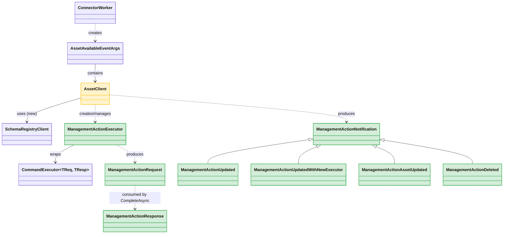
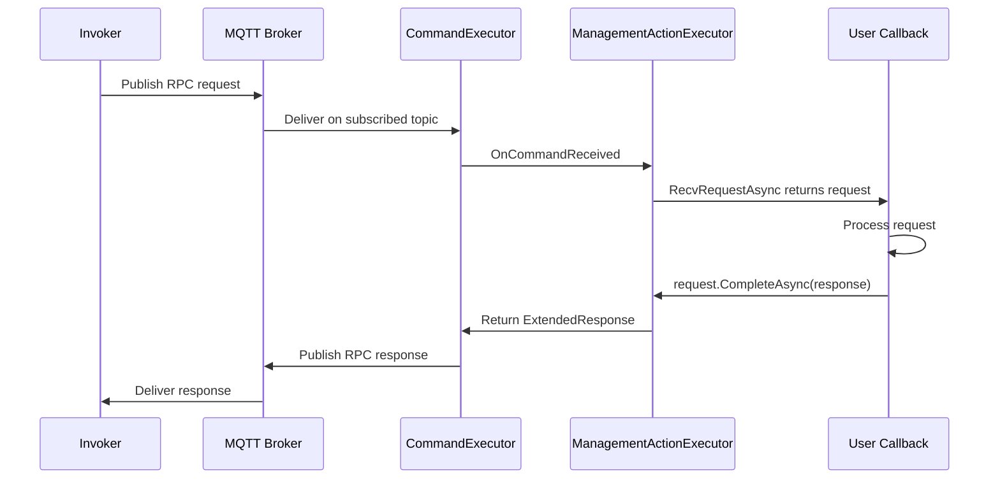

# Management Action Support in .NET SDK — Design Onepager

**Author:** Maxim Semenov  
**Date:** 2026-04-17  
**Status:** Proposed (revised per review feedback)  
**Full design:** [management-action-implementation-design.md](management-action-implementation-design.md)  
**Gap analysis:** [management-action-gap-analysis.md](management-action-gap-analysis.md)

---

## Context

The Rust SDK fully supports management actions — callable operations (read/write/call) on assets exposed as RPC endpoints over MQTT. The .NET SDK only supports health reporting for management actions today. The core execution pipeline (receiving invocations, responding, lifecycle management, schema registration) is missing entirely.

**Rust reference implementation:**
- `ManagementActionExecutor` — receives RPC requests over MQTT
- `ManagementActionClient` — lifecycle management, schema reporting, notifications
- Two working sample connectors demonstrating end-to-end management action handling

---

## Proposal

Add management action execution support to `Azure.Iot.Operations.Connector`. No changes to the Protocol, Services, or Mqtt layers. No new NuGet dependencies.

### New Types (all in Connector layer)

| Type | Purpose |
|------|---------|
| **ManagementActionExecutor** | Wraps `CommandExecutor<byte[], byte[]>` with `PassthroughSerializer` — receives RPC requests over MQTT |
| **ManagementActionRequest** | Incoming invocation — exposes payload, metadata; completed via `CompleteAsync(response)` |
| **ManagementActionResponse** | `record` with `required` Payload, ContentType, CloudEvent; optional ApplicationError |
| **ManagementActionApplicationError** | `record` with ErrorCode + ErrorPayload |
| **ManagementActionNotification** | Abstract `record` base with 4 derived types: Updated, UpdatedWithNewExecutor, AssetUpdated, Deleted |

### Modified Types

| Type | Change |
|------|--------|
| **AssetClient** | New methods: `GetManagementActionExecutorAsync`, `RecvManagementActionNotificationAsync`, `ReportManagementAction{Request/Response}MessageSchemaAsync`. New internal state: per-action notification channels. New dependency: `SchemaRegistryClient` |
| **ConnectorWorker** | Injects `SchemaRegistryClient` into `AssetClient`; pushes management action notifications to `AssetClient` when asset definitions change |

### Class Relationships



**Legend:** Green = new types. Yellow = modified existing types.

---

## Key Design Decisions

### 1. Management action methods on AssetClient (not a dedicated ManagementActionClient)

Per review feedback, all management action functionality lives on the existing `AssetClient`. The user already receives `AssetClient` through the `WhileAssetIsAvailable` callback — adding management action methods there keeps the API surface unified. No new callback pattern on `ConnectorWorker` is needed. The `managementGroupName` + `managementActionName` parameters on each method serve as the action identifier.

### 2. Notification model via RecvManagementActionNotificationAsync

`AssetClient.RecvManagementActionNotificationAsync(groupName, actionName)` returns fine-grained lifecycle notifications (Updated, UpdatedWithNewExecutor, AssetUpdated, Deleted). Internally backed by `Channel<ManagementActionNotification>` per action. The user coordinates requests and notifications inside the existing `WhileAssetIsAvailable` callback via `Task.WhenAny` or similar select-style pattern.

### 3. Records for request/response (not fluent builder)

`ManagementActionResponse` is a `public record` with `required` properties — matching the dominant codebase pattern (45+ ADR model records). Compile-time enforcement of required fields via `required` keyword. No public fluent builders exist in the SDK.

### 4. Schema reporting on AssetClient

Management actions have **two** schemas (request + response), per-action not per-asset. Explicit `ReportManagementActionRequestMessageSchemaAsync` / `ReportManagementActionResponseMessageSchemaAsync` methods on `AssetClient`. Unlike dataset/event schemas (implicit via `ConnectorWorker` forwarding), management action schemas are reported explicitly — reflecting the real difference in data flow (inbound RPC vs outbound telemetry).

### 5. Health reporting unchanged

Existing `AssetClient.ReportManagementActionRuntimeHealthAsync()` remains as-is — consistent with how datasets/events/streams report health.

---

## User-Facing API (Sketch)

```csharp
// In connector setup (within WhileAssetIsAvailable callback):
connectorWorker.WhileAssetIsAvailable = async (args, ct) =>
{
    var assetClient = args.AssetClient;
    var asset = args.Asset;

    // Spawn a task per management action
    var actionTasks = new List<Task>();
    foreach (var group in asset.ManagementGroups ?? [])
    {
        foreach (var action in group.Actions ?? [])
        {
            actionTasks.Add(HandleManagementAction(
                assetClient, group.Name, action.Name, ct));
        }
    }

    // Also handle datasets, events, etc. alongside...
    await Task.WhenAll(actionTasks);
};

async Task HandleManagementAction(
    AssetClient assetClient, string groupName, string actionName,
    CancellationToken ct)
{
    // Register schemas
    await assetClient.ReportManagementActionRequestMessageSchemaAsync(
        groupName, actionName, requestSchema, ct);
    await assetClient.ReportManagementActionResponseMessageSchemaAsync(
        groupName, actionName, responseSchema, ct);

    // Get initial executor
    var executor = await assetClient.GetManagementActionExecutorAsync(
        groupName, actionName, ct);

    while (!ct.IsCancellationRequested)
    {
        // Wait for either a request or a lifecycle notification
        var recvTask = executor.RecvRequestAsync(ct);
        var notifyTask = assetClient.RecvManagementActionNotificationAsync(
            groupName, actionName, ct);

        await Task.WhenAny(recvTask, notifyTask);

        if (recvTask.IsCompleted)
        {
            var request = await recvTask;
            if (request != null)
            {
                var response = new ManagementActionResponse
                {
                    Payload = resultBytes,
                    ContentType = "application/json",
                    CloudEvent = null,
                };
                await request.CompleteAsync(response, ct);
            }
        }

        if (notifyTask.IsCompleted)
        {
            switch (await notifyTask)
            {
                case ManagementActionUpdatedWithNewExecutor n:
                    executor = n.NewExecutor;
                    break;
                case ManagementActionDeleted:
                    return;
            }
        }
    }
}
```

---

## Request Flow



---

## What's Not Changing

- **Protocol layer** — `CommandExecutor<TReq, TResp>`, `ExtendedRequest/Response`, `PassthroughSerializer` used as-is
- **Services layer** — `IAzureDeviceRegistryClient`, `SchemaRegistryClient`, `AssetRuntimeHealthReporter` used as-is
- **Health reporting** — existing `AssetClient.ReportManagementActionRuntimeHealthAsync()` unchanged
- **No new NuGet packages** — all dependencies already present
- **No new callback on ConnectorWorker** — reuses existing `WhileAssetIsAvailable`

---

## Open Items

- **Update diffing logic:** When `AssetChanged` fires, `ConnectorWorker` must diff old vs. new management action definitions to determine added/removed/updated actions. Caching strategy and comparison fields TBD during implementation.
