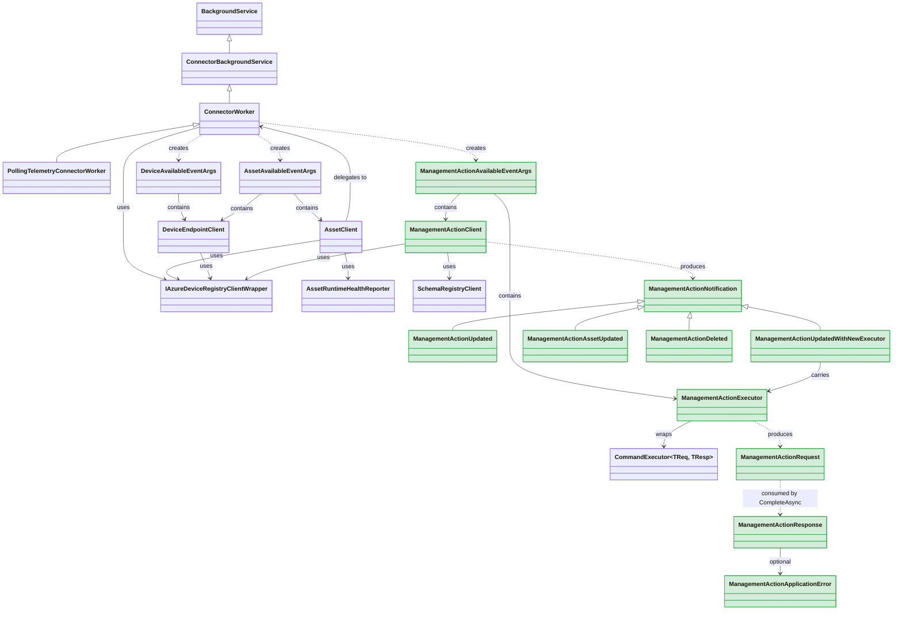
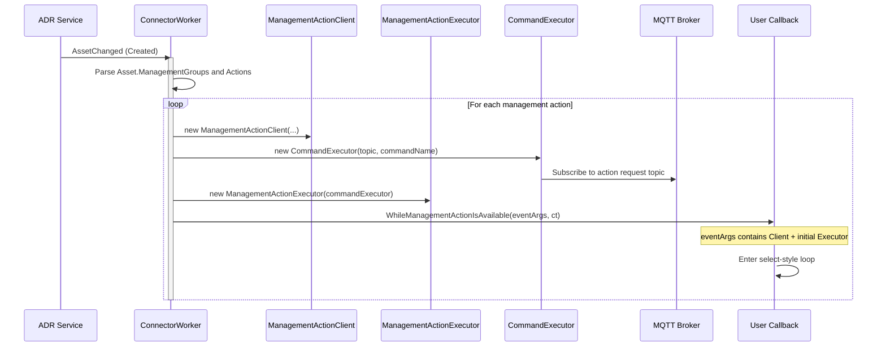
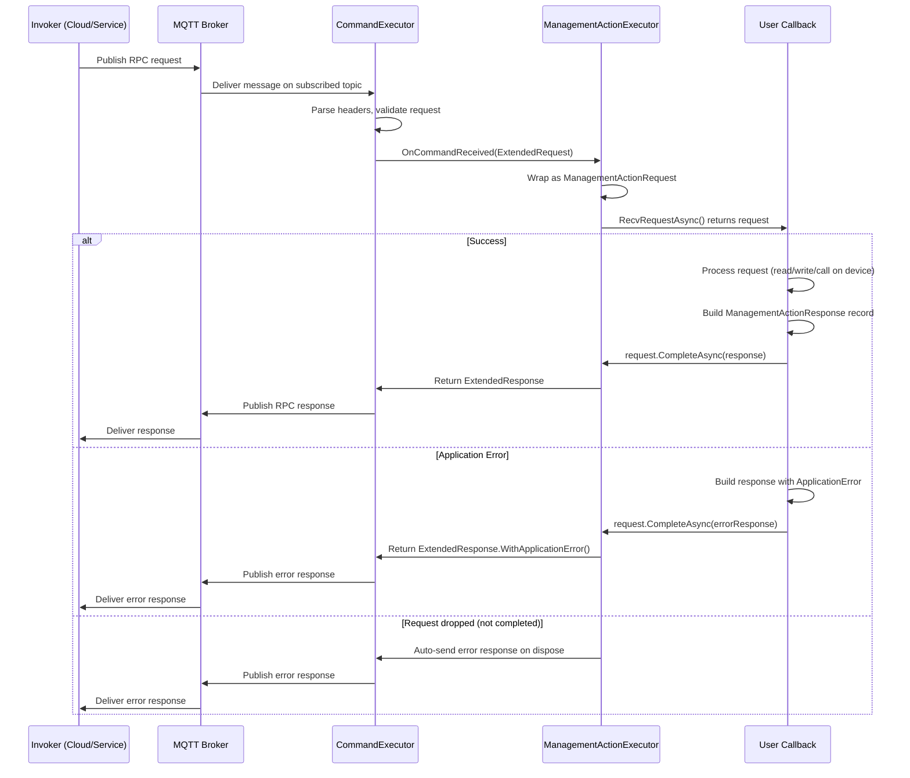
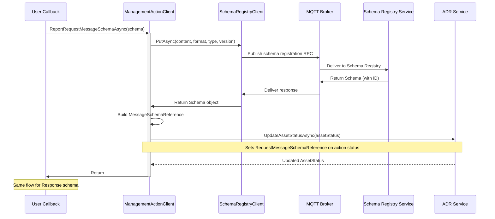
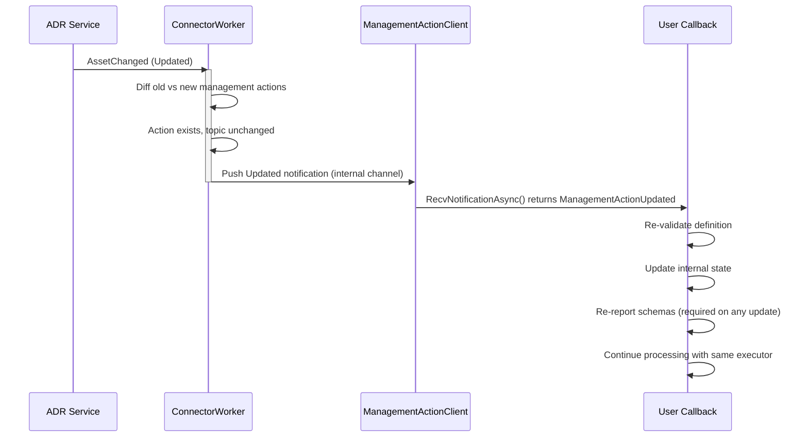
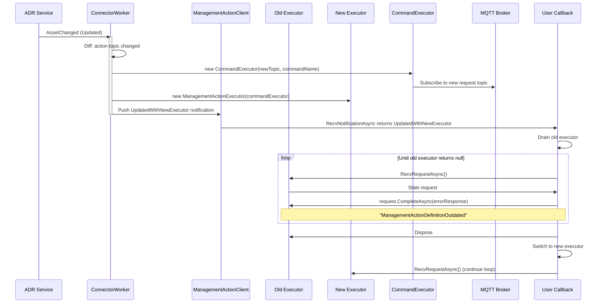
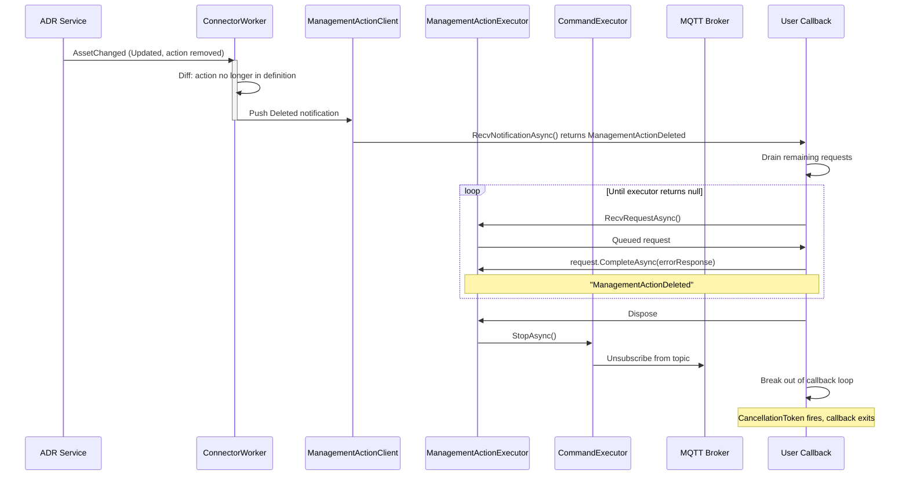
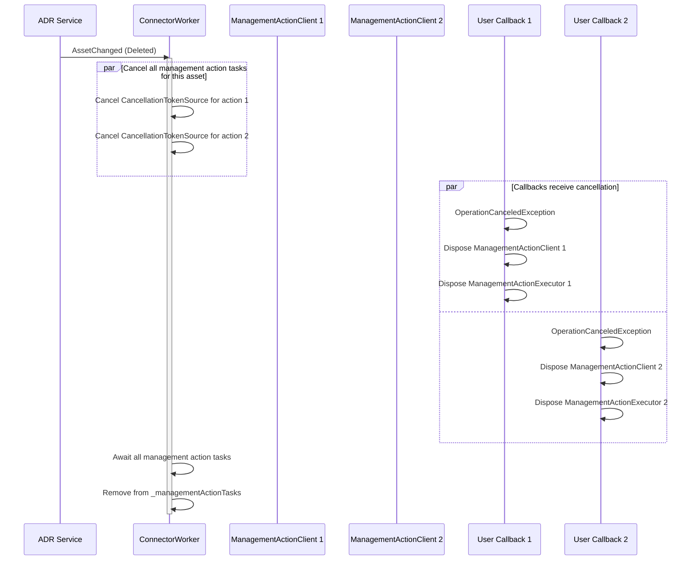
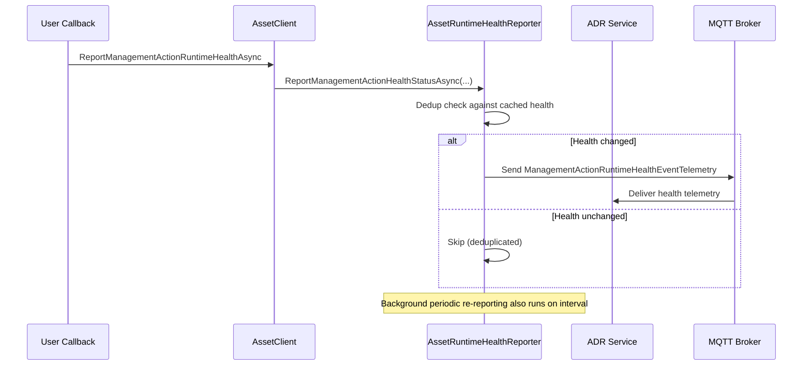

# Management Action .NET Implementation — Design

**Date:** 2026-04-14  
**Prerequisite:** [Gap Analysis](management-action-gap-analysis.md)

---

## Class Diagrams

### Simplified: Relationships Overview

New types in green. Shows only how types relate — no internal details.



### Detailed: Full Class Members

```mermaid
classDiagram
    direction TB

    %% ============================================================
    %% LAYER: Microsoft.Extensions.Hosting
    %% ============================================================
    class BackgroundService {
        <<abstract>>
        +ExecuteAsync(CancellationToken) Task*
    }

    %% ============================================================
    %% LAYER: Azure.Iot.Operations.Protocol
    %% ============================================================
    class CommandExecutor~TReq, TResp~ {
        <<abstract>>
        +OnCommandReceived : Func
        +RequestTopicPattern : string
        +TopicTokenMap : Dictionary~string, string~
        +ServiceGroupId : string
        +ExecutionTimeout : TimeSpan
        +StartAsync() Task
        +StopAsync() Task
        +DisposeAsync() ValueTask
    }

    class ExtendedRequest~TReq~ {
        <<struct>>
        +Request : TReq
        +RequestMetadata : CommandRequestMetadata
    }

    class ExtendedResponse~TResp~ {
        <<struct>>
        +Response : TResp
        +ResponseMetadata : CommandResponseMetadata?
        +WithApplicationError(code, payload) ExtendedResponse
    }

    %% ============================================================
    %% LAYER: Azure.Iot.Operations.Services
    %% ============================================================
    class IAzureDeviceRegistryClientWrapper {
        <<interface>>
        +AssetChanged : EventHandler~AssetChangedEventArgs~
        +DeviceChanged : EventHandler~DeviceChangedEventArgs~
        +ObserveDevices()
        +ObserveAssets(deviceName, endpoint)
        +GetAssetStatusAsync() Task~AssetStatus~
        +UpdateAssetStatusAsync() Task~AssetStatus~
        +ReportManagementActionRuntimeHealthAsync() Task
    }

    class SchemaRegistryClient {
        +PutAsync(content, format, type, ...) Task~Schema~
        +GetAsync(schemaId, version) Task~Schema~
    }

    class AssetRuntimeHealthReporter {
        +ReportManagementActionHealthStatusAsync() Task
        +PauseReportingManagementActionAsync() Task
    }

    %% ============================================================
    %% LAYER: Azure.Iot.Operations.Connector (EXISTING)
    %% ============================================================
    class ConnectorBackgroundService {
        <<abstract>>
        +RunConnectorAsync(CancellationToken) Task*
    }
    BackgroundService <|-- ConnectorBackgroundService

    class ConnectorWorker {
        +WhileDeviceIsAvailable : Func~DeviceAvailableEventArgs, CancellationToken, Task~?
        +WhileAssetIsAvailable : Func~AssetAvailableEventArgs, CancellationToken, Task~?
        +WhileManagementActionIsAvailable* : Func
        -_adrClient : IAzureDeviceRegistryClientWrapper
        -_mqttClient : IMqttClient
        -_applicationContext : ApplicationContext
        -_deviceTasks : ConcurrentDictionary
        -_assetTasks : ConcurrentDictionary
        -_managementActionTasks* : ConcurrentDictionary
        #ExecuteAsync(CancellationToken) Task
        -OnAssetChanged(sender, AssetChangedEventArgs)
        -ManagementActionAvailable()*
        -ManagementActionUnavailableAsync()*
    }
    ConnectorBackgroundService <|-- ConnectorWorker

    class PollingTelemetryConnectorWorker {
        -_datasetSamplerFactory : IDatasetSamplerFactory
    }
    ConnectorWorker <|-- PollingTelemetryConnectorWorker

    class DeviceAvailableEventArgs {
        +DeviceName : string
        +Device : Device
        +InboundEndpointName : string
        +LeaderElectionClient : ILeaderElectionClient?
        +DeviceEndpointClient : DeviceEndpointClient
    }

    class AssetAvailableEventArgs {
        +DeviceName : string
        +Device : Device
        +InboundEndpointName : string
        +AssetName : string
        +Asset : Asset
        +LeaderElectionClient : ILeaderElectionClient?
        +AssetClient : AssetClient
        +DeviceEndpointClient : DeviceEndpointClient
    }

    class AssetClient {
        -_adrClient : IAzureDeviceRegistryClientWrapper
        -_connector : ConnectorWorker
        -_healthReporter : AssetRuntimeHealthReporter
        +GetAndUpdateAssetStatusAsync() Task~AssetStatus~
        +ForwardSampledDatasetAsync() Task
        +ForwardReceivedEventAsync() Task
        +ReportManagementActionRuntimeHealthAsync() Task
        +DisposeAsync() ValueTask
    }

    class DeviceEndpointClient {
        -_adrClient : IAzureDeviceRegistryClientWrapper
        -_healthReporter : DeviceEndpointRuntimeHealthReporter
        +GetAndUpdateDeviceStatusAsync() Task~DeviceStatus~
        +ReportRuntimeHealthAsync() Task
        +DisposeAsync() ValueTask
    }

    %% ============================================================
    %% LAYER: Azure.Iot.Operations.Connector (NEW)
    %% ============================================================
    class ManagementActionAvailableEventArgs {
        <<new>>
        +DeviceName : string
        +InboundEndpointName : string
        +AssetName : string
        +ManagementGroupName : string
        +ManagementActionName : string
        +Asset : Asset
        +Device : Device
        +ActionDefinition : AssetManagementGroupAction
        +GroupDefinition : AssetManagementGroup
        +ManagementActionClient : ManagementActionClient
        +InitialExecutor : ManagementActionExecutor?
        +LeaderElectionClient : ILeaderElectionClient?
        +DisposeAsync() ValueTask
    }

    class ManagementActionClient {
        <<new>>
        -_adrClient : IAzureDeviceRegistryClientWrapper
        -_schemaRegistryClient : SchemaRegistryClient
        -_notificationChannel : Channel~ManagementActionNotification~
        +ManagementActionName : string
        +ManagementGroupName : string
        +AssetName : string
        +DeviceName : string
        +InboundEndpointName : string
        +Definition : AssetManagementGroupAction
        +GroupDefinition : AssetManagementGroup
        +RecvNotificationAsync(CancellationToken) Task~ManagementActionNotification~
        +ReportRequestMessageSchemaAsync(schema, ct) Task
        +ReportResponseMessageSchemaAsync(schema, ct) Task
        +ReportRequestMessageSchemaReferenceAsync(ref, ct) Task
        +ReportResponseMessageSchemaReferenceAsync(ref, ct) Task
        +DisposeAsync() ValueTask
    }

    class ManagementActionExecutor {
        <<new>>
        -_commandExecutor : CommandExecutor
        +RecvRequestAsync(CancellationToken) Task~ManagementActionRequest?~
        +DisposeAsync() ValueTask
    }

    class ManagementActionRequest {
        <<new>>
        +Payload : byte[]
        +ContentType : string
        +FormatIndicator : FormatIndicator
        +CustomUserData : Dictionary~string, string~
        +Timestamp : HybridLogicalClock?
        +InvokerId : string?
        +TopicTokens : Dictionary~string, string~
        +IsCancelled : bool
        +CompleteAsync(ManagementActionResponse, ct) Task
        +DisposeAsync() ValueTask
    }

    class ManagementActionResponse {
        <<new>>
        <<record>>
        +Payload : byte[]
        +ContentType : string
        +CloudEvent : CloudEvent?
        +FormatIndicator : FormatIndicator
        +CustomUserData : Dictionary~string, string~?
        +ApplicationError : ManagementActionApplicationError?
    }

    class ManagementActionApplicationError {
        <<new>>
        <<record>>
        +ErrorCode : string
        +ErrorPayload : string
    }

    class ManagementActionNotification {
        <<new>>
        <<abstract record>>
    }
    class ManagementActionUpdated {
        <<new>>
        +Error : ConfigError?
    }
    class ManagementActionUpdatedWithNewExecutor {
        <<new>>
        +NewExecutor : ManagementActionExecutor?
        +Error : ConfigError?
    }
    class ManagementActionAssetUpdated {
        <<new>>
        +Error : ConfigError?
    }
    class ManagementActionDeleted {
        <<new>>
    }
    ManagementActionNotification <|-- ManagementActionUpdated
    ManagementActionNotification <|-- ManagementActionUpdatedWithNewExecutor
    ManagementActionNotification <|-- ManagementActionAssetUpdated
    ManagementActionNotification <|-- ManagementActionDeleted

    %% ============================================================
    %% RELATIONSHIPS: Existing
    %% ============================================================
    ConnectorWorker --> IAzureDeviceRegistryClientWrapper : _adrClient
    ConnectorWorker ..> DeviceAvailableEventArgs : creates
    ConnectorWorker ..> AssetAvailableEventArgs : creates
    AssetAvailableEventArgs --> AssetClient : contains
    AssetAvailableEventArgs --> DeviceEndpointClient : contains
    DeviceAvailableEventArgs --> DeviceEndpointClient : contains
    AssetClient --> IAzureDeviceRegistryClientWrapper : _adrClient
    AssetClient --> ConnectorWorker : _connector
    AssetClient --> AssetRuntimeHealthReporter : _healthReporter
    DeviceEndpointClient --> IAzureDeviceRegistryClientWrapper : _adrClient

    %% ============================================================
    %% RELATIONSHIPS: New
    %% ============================================================
    ConnectorWorker ..> ManagementActionAvailableEventArgs : creates
    ManagementActionAvailableEventArgs --> ManagementActionClient : contains
    ManagementActionAvailableEventArgs --> ManagementActionExecutor : contains (initial)
    ManagementActionClient --> IAzureDeviceRegistryClientWrapper : _adrClient
    ManagementActionClient --> SchemaRegistryClient : _schemaRegistryClient
    ManagementActionClient ..> ManagementActionNotification : produces
    ManagementActionExecutor --> CommandExecutor~TReq, TResp~ : wraps
    ManagementActionExecutor ..> ManagementActionRequest : produces
    ManagementActionRequest ..> ManagementActionResponse : consumed by CompleteAsync
    ManagementActionResponse --> ManagementActionApplicationError : optional
    ManagementActionUpdatedWithNewExecutor --> ManagementActionExecutor : carries new executor

    %% ============================================================
    %% STYLE: Highlight new types
    %% ============================================================
    style ManagementActionAvailableEventArgs fill:#d4edda,stroke:#28a745
    style ManagementActionClient fill:#d4edda,stroke:#28a745
    style ManagementActionExecutor fill:#d4edda,stroke:#28a745
    style ManagementActionRequest fill:#d4edda,stroke:#28a745
    style ManagementActionResponse fill:#d4edda,stroke:#28a745
    style ManagementActionApplicationError fill:#d4edda,stroke:#28a745
    style ManagementActionNotification fill:#d4edda,stroke:#28a745
    style ManagementActionUpdated fill:#d4edda,stroke:#28a745
    style ManagementActionUpdatedWithNewExecutor fill:#d4edda,stroke:#28a745
    style ManagementActionAssetUpdated fill:#d4edda,stroke:#28a745
    style ManagementActionDeleted fill:#d4edda,stroke:#28a745
```

New types are marked with `<<new>>`. Existing types shown for context.



**Legend:** Green-highlighted types are new. Existing types shown in default style. Members marked with `*` are new additions to existing classes.

---

## Architecture Overview

The management action execution pipeline spans three existing .NET layers, plus a new callback surface on `ConnectorWorker`:

```
┌─────────────────────────────────────────────────────────────┐
│  User Code (connector implementation)                       │
│  WhileManagementActionIsAvailable callback                  │
│    - receives ManagementActionAvailableEventArgs             │
│    - processes requests via ManagementActionExecutor          │
│    - reports schemas via ManagementActionClient               │
│    - runs until CancellationToken fires (deleted/shutdown)   │
└────────────────────────┬────────────────────────────────────┘
                         │ uses
┌────────────────────────▼────────────────────────────────────┐
│  Azure.Iot.Operations.Connector                             │
│                                                             │
│  New types:                                                 │
│  ┌─────────────────────────────────────────────────────┐    │
│  │ ManagementActionClient                               │    │
│  │  - ReportRequestMessageSchemaAsync()                 │    │
│  │  - ReportResponseMessageSchemaAsync()                │    │
│  │  - ReportRequestMessageSchemaReferenceAsync()        │    │
│  │  - ReportResponseMessageSchemaReferenceAsync()       │    │
│  │  - RecvNotificationAsync()                           │    │
│  │  - GetStatusReporter() ?                             │    │
│  │  - Definition, AssetName, GroupName, ActionName       │    │
│  └─────────────────────────────────────────────────────┘    │
│  ┌─────────────────────────────────────────────────────┐    │
│  │ ManagementActionExecutor                             │    │
│  │  - RecvRequestAsync() → ManagementActionRequest?     │    │
│  │  - wraps CommandExecutor<BypassPayload, BypassPayload│    │
│  └─────────────────────────────────────────────────────┘    │
│  ┌─────────────────────────────────────────────────────┐    │
│  │ ManagementActionRequest                              │    │
│  │  - CompleteAsync(ManagementActionResponse)            │    │
│  │  - IsCancelled, Payload, ContentType, etc.           │    │
│  └─────────────────────────────────────────────────────┘    │
│  ┌─────────────────────────────────────────────────────┐    │
│  │ ManagementActionResponse (record)                    │    │
│  │  - required Payload, ContentType, CloudEvent         │    │
│  │  - optional CustomUserData, FormatIndicator          │    │
│  │  - .WithApplicationError() convenience               │    │
│  └─────────────────────────────────────────────────────┘    │
│  ┌─────────────────────────────────────────────────────┐    │
│  │ ManagementActionApplicationError (record)            │    │
│  │  - ErrorCode, ErrorPayload                           │    │
│  └─────────────────────────────────────────────────────┘    │
│  ┌─────────────────────────────────────────────────────┐    │
│  │ ManagementActionNotification (enum/union)            │    │
│  │  - Updated, UpdatedWithNewExecutor,                  │    │
│  │    AssetUpdated, Deleted                             │    │
│  └─────────────────────────────────────────────────────┘    │
│  ┌─────────────────────────────────────────────────────┐    │
│  │ ManagementActionAvailableEventArgs                   │    │
│  │  - ManagementActionClient, initial Executor          │    │
│  │  - asset/device/group/action identity                │    │
│  └─────────────────────────────────────────────────────┘    │
│                                                             │
│  Modified types:                                            │
│  ┌─────────────────────────────────────────────────────┐    │
│  │ ConnectorWorker                                      │    │
│  │  + WhileManagementActionIsAvailable callback          │    │
│  │  + management action discovery from Asset.Mgmt Groups │    │
│  │  + per-action task tracking (_managementActionTasks)  │    │
│  └─────────────────────────────────────────────────────┘    │
└────────────────────────┬────────────────────────────────────┘
                         │ depends on
┌────────────────────────▼────────────────────────────────────┐
│  Azure.Iot.Operations.Services                              │
│                                                             │
│  Existing types used (no changes expected):                 │
│  - IAzureDeviceRegistryClient / AzureDeviceRegistryClient   │
│  - SchemaRegistryClient (PutAsync for schema registration)  │
│  - AssetRuntimeHealthReporter (management action health)    │
│  - AssetStatus, AssetManagementGroupStatus,                 │
│    AssetManagementGroupActionStatus                         │
│  - MessageSchemaReference                                   │
│  - ManagementActionRuntimeHealthEventTelemetrySender        │
└────────────────────────┬────────────────────────────────────┘
                         │ depends on
┌────────────────────────▼────────────────────────────────────┐
│  Azure.Iot.Operations.Protocol                              │
│                                                             │
│  Existing types used (no changes expected):                 │
│  - CommandExecutor<TReq, TResp> (RPC executor base)         │
│  - ExtendedRequest<T>, ExtendedResponse<T>                  │
│  - CommandResponseMetadata                                  │
│  - ApplicationContext, IMqttPubSubClient                    │
└────────────────────────┬────────────────────────────────────┘
                         │ depends on
┌────────────────────────▼────────────────────────────────────┐
│  Azure.Iot.Operations.Mqtt                                  │
│  - IMqttClient (MQTT connection)                            │
└─────────────────────────────────────────────────────────────┘
```

---

## New Types to Introduce

All new types live in **Azure.Iot.Operations.Connector** (the top-level, user-facing layer).

### 1. ManagementActionExecutor

Wraps `CommandExecutor<TReq, TResp>` from the Protocol layer to receive management action RPC requests over MQTT.

```
Dependencies:
  - ApplicationContext (from ConnectorWorker)
  - IMqttPubSubClient (from ConnectorWorker)
  - MQTT topic derived from management action definition
  - Command name: "{managementGroupName}::{actionName}"
```

**Responsibilities:**
- Subscribe to the management action's MQTT request topic
- Receive incoming RPC requests as `ManagementActionRequest`
- Handle graceful shutdown (drain remaining requests)

**Key question:** The Protocol layer's `CommandExecutor` uses generic `TReq`/`TResp` with serialization. Rust uses `BypassPayload` (raw bytes passthrough). .NET needs an equivalent — either use raw `byte[]` with a no-op serializer, or add a `BypassPayload` type. Need to check if `CommandExecutor` supports a passthrough mode.

### 2. ManagementActionRequest

Represents an incoming management action invocation. Created internally by `ManagementActionExecutor`.

```
Properties (read-only):
  - byte[] Payload
  - string ContentType
  - FormatIndicator FormatIndicator
  - Dictionary<string, string> CustomUserData
  - HybridLogicalClock? Timestamp
  - string? InvokerId
  - Dictionary<string, string> TopicTokens
  - bool IsCancelled

Methods:
  - Task CompleteAsync(ManagementActionResponse response, CancellationToken ct)
```

**Auto-error on dispose:** If `CompleteAsync` is never called, disposal should send an error response back (matching Rust's Drop impl).

### 3. ManagementActionResponse (record)

```csharp
public record ManagementActionResponse
{
    public required byte[] Payload { get; set; }
    public required string ContentType { get; set; }
    public required CloudEvent? CloudEvent { get; set; }
    public FormatIndicator FormatIndicator { get; set; } = FormatIndicator.UnspecifiedBytes;
    public Dictionary<string, string>? CustomUserData { get; set; }
    public ManagementActionApplicationError? ApplicationError { get; set; }
}
```

### 4. ManagementActionApplicationError (record)

```csharp
public record ManagementActionApplicationError
{
    public required string ErrorCode { get; set; }
    public string ErrorPayload { get; set; } = string.Empty;
}
```

### 5. ManagementActionNotification

C# doesn't have Rust-style enums. Options:
- Abstract base class + derived types (pattern matching via `switch` on type)
- Single class with a `NotificationType` enum + nullable `Executor` property

```csharp
// Option: discriminated union via base class
public abstract record ManagementActionNotification;

public record ManagementActionUpdated(ConfigError? Error) : ManagementActionNotification;
public record ManagementActionUpdatedWithNewExecutor(
    ManagementActionExecutor? NewExecutor, 
    ConfigError? Error) : ManagementActionNotification;
public record ManagementActionAssetUpdated(ConfigError? Error) : ManagementActionNotification;
public record ManagementActionDeleted : ManagementActionNotification;
```

### 6. ManagementActionClient

The lifecycle manager. Created internally by `ConnectorWorker` when a management action is discovered.

```
Constructor dependencies (all internal):
  - IAzureDeviceRegistryClientWrapper (for status get/update)
  - SchemaRegistryClient (for schema registration)
  - ApplicationContext
  - IMqttPubSubClient
  - Asset model data (device name, endpoint, asset name, group, action)

Properties (read-only, public):
  - string ManagementActionName
  - string ManagementGroupName
  - string AssetName
  - string DeviceName
  - string InboundEndpointName
  - AssetManagementGroupAction Definition
  - AssetManagementGroup GroupDefinition

Methods (public):
  - Task<ManagementActionNotification> RecvNotificationAsync(CancellationToken ct)
  - Task ReportRequestMessageSchemaAsync(ConnectorMessageSchema schema, CancellationToken ct)
  - Task ReportResponseMessageSchemaAsync(ConnectorMessageSchema schema, CancellationToken ct)
  - Task ReportRequestMessageSchemaReferenceAsync(MessageSchemaReference ref, CancellationToken ct)
  - Task ReportResponseMessageSchemaReferenceAsync(MessageSchemaReference ref, CancellationToken ct)
```

**Notification delivery mechanism:** Internally, `ManagementActionClient` needs to receive updates from `ConnectorWorker` when ADR raises `AssetChanged` events that affect this action's definition. This could use an internal `Channel<ManagementActionNotification>` or `TaskCompletionSource` pattern, even though `Channel<T>` has no current codebase precedent — it would be internal-only, not user-facing.

### 7. ManagementActionAvailableEventArgs

Delivered to the user's `WhileManagementActionIsAvailable` callback.

```csharp
public class ManagementActionAvailableEventArgs : IAsyncDisposable
{
    // Identity
    public string DeviceName { get; }
    public string InboundEndpointName { get; }
    public string AssetName { get; }
    public string ManagementGroupName { get; }
    public string ManagementActionName { get; }

    // Model data
    public Asset Asset { get; }
    public Device Device { get; }
    public AssetManagementGroupAction ActionDefinition { get; }
    public AssetManagementGroup GroupDefinition { get; }

    // Clients
    public ManagementActionClient ManagementActionClient { get; }
    public ManagementActionExecutor? InitialExecutor { get; }

    // Optional
    public ILeaderElectionClient? LeaderElectionClient { get; }
}
```

---

## Modifications to Existing Types

### ConnectorWorker

```
New fields:
  + WhileManagementActionIsAvailable : Func<ManagementActionAvailableEventArgs, CancellationToken, Task>?
  + _managementActionTasks : ConcurrentDictionary<string, UserTaskContext>
    Key: "{deviceName}_{inboundEndpointName}_{assetName}_{groupName}_{actionName}"

Modified methods:
  ~ OnAssetChanged / AssetAvailable:
    When an asset becomes available (Created/Updated), iterate
    Asset.ManagementGroups[].Actions[] and spawn a task per action
    if WhileManagementActionIsAvailable is set.

  ~ AssetUnavailableAsync:
    Cancel all management action tasks belonging to the removed asset.

New internal methods:
  + ManagementActionAvailable(deviceName, endpoint, assetName, group, action, ...)
  + ManagementActionUnavailableAsync(...)
```

**Key design choice:** Management action tasks are children of asset availability. When an asset is deleted/updated, all its management action tasks are cancelled. When a management action definition changes within an asset update, only that action's task is cancelled and reinvoked (or a notification is sent via the client's internal channel).

---

## External Dependencies

No new NuGet packages required. All dependencies are already present:

| Dependency | Package | Used For |
|---|---|---|
| `CommandExecutor<TReq, TResp>` | Azure.Iot.Operations.Protocol | RPC executor base for receiving requests |
| `SchemaRegistryClient` | Azure.Iot.Operations.Services | Registering request/response schemas |
| `IAzureDeviceRegistryClient` | Azure.Iot.Operations.Services | Asset status get/update for schema refs |
| `AssetRuntimeHealthReporter` | Azure.Iot.Operations.Services | Health reporting (already used) |
| `IMqttPubSubClient` | Azure.Iot.Operations.Protocol | MQTT communication |
| `MQTTnet` | (transitive) | MQTT transport |

---

## Data Flow

### 1. Startup: Management Action Discovery



### 2. Inbound: Management Action Request/Response



### 3. Schema Registration



### 4. Lifecycle: Definition Update (Same Topic)



### 5. Lifecycle: Definition Update (New Topic → New Executor)



### 6. Lifecycle: Management Action Deleted



### 7. Lifecycle: Asset Deleted (Cascading Cleanup)



### 8. Health Reporting (Existing — No Changes)



---

## Open Questions

1. **BypassPayload / raw passthrough in CommandExecutor:** Does `CommandExecutor<TReq, TResp>` support a raw byte[] passthrough mode (no serialization), or do we need a no-op serializer? The Rust side uses `BypassPayload` for this.
   - **RESOLVED: Already supported.** Use `CommandExecutor<byte[], byte[]>` with the existing `PassthroughSerializer` (found in `Services/StateStore/Generated/Common/` and `samples/Protocol/TestEnvoys/`). Bytes pass through unchanged in both directions. Content-Type and Format Indicator metadata flow through `CommandRequestMetadata` / `CommandResponseMetadata` separately from the serializer, so the serializer's hardcoded `application/octet-stream` default is harmless — it gets overridden by the metadata objects. The user reads content-type from `ManagementActionRequest.ContentType` and sets it on `ManagementActionResponse.ContentType`.

2. **Topic extraction:** How to derive the MQTT request topic from `AssetManagementGroupAction.Topic` / `AssetManagementGroup.DefaultTopic`? The Rust side has `try_executor_topic_from_management_topics()`. Need to understand the topic format and how it maps to `CommandExecutor`'s `RequestTopicPattern`.
   - **RESOLVED: Dynamic topic configuration at runtime.** The topic comes from the asset definition: `AssetManagementGroupAction.Topic` with fallback to `AssetManagementGroup.DefaultTopic` (fallback not yet implemented in Rust, but should be in .NET). The `CommandExecutor` supports setting `RequestTopicPattern` at construction time without the `[CommandTopic]` attribute — so `ManagementActionExecutor` creates a `CommandExecutor<byte[], byte[]>` and configures topic properties dynamically. `TopicTokenMap` is populated with known values (device name, endpoint, etc.), and unresolved tokens become `+` (MQTT wildcard). The executor subscribes to `$share/{ServiceGroupId}/{resolved topic}`.

3. **Notification channel internals:** `ManagementActionClient.RecvNotificationAsync()` needs an internal delivery mechanism. `Channel<T>` is the natural choice but has no codebase precedent. Alternative: `SemaphoreSlim` + queue, or `TaskCompletionSource` chain.
   - **Decision: `Channel<ManagementActionNotification>` (Option A).**
   - `ConnectorWorker` pushes notifications via `_channel.Writer.TryWrite()`, user consumes via `_channel.Reader.ReadAsync()` inside `RecvNotificationAsync()`. `Writer.Complete()` signals end-of-life (deletion). Internal-only — the user never sees the channel, only the `RecvNotificationAsync()` method.
   - Alternatives considered:
     - `TaskCompletionSource` chain: simpler but fragile — doesn't handle queuing if multiple notifications arrive before user reads; needs manual synchronization; easy to get wrong.
     - `SemaphoreSlim` + `ConcurrentQueue<T>`: uses patterns already in the codebase (`SemaphoreSlim` is in `AssetClient`), but reinvents `Channel<T>` with more code and more edge cases (disposal, completion signaling).
   - Rationale: `Channel<T>` is a standard BCL type (`System.Threading.Channels`) purpose-built for async producer-consumer. It handles queuing, cancellation, completion, and thread safety out of the box. No new NuGet dependency. The lack of codebase precedent is a weak objection — it's internal-only plumbing.

4. **Health reporting ownership:** Health reporting currently lives on `AssetClient`. Should `ManagementActionClient` also expose health reporting methods, or should users continue using `AssetClient.ReportManagementActionRuntimeHealthAsync()` alongside the new client?
   - **Decision: Expose `AssetClient` on `ManagementActionAvailableEventArgs` (Option B).** The user calls the existing `AssetClient.ReportManagementActionRuntimeHealthAsync(groupName, actionName, health)` method. `ManagementActionAvailableEventArgs` will include an `AssetClient` property so the user has access within the callback.
   - Alternative considered: Add `ReportRuntimeHealthAsync(health)` directly to `ManagementActionClient` — cleaner UX since the client already knows its group/action names, simplifying the call to a single argument. Internally delegates to the same `AssetRuntimeHealthReporter`. Rejected to avoid duplicating health reporting surface across two types and to stay consistent with how datasets/events/streams report health (all via `AssetClient`).

5. **Concurrency model for updates:** When `AssetChanged` fires with updated management actions, `ConnectorWorker` needs to diff old vs. new action definitions to determine which actions were added/removed/updated. This diffing logic needs to be defined.
   - **DEFERRED.** Requires decisions on: where to cache old asset definitions, what fields to compare (topic only vs full definition), and how to handle non-topic changes. Will resolve during implementation.
