# Management Action .NET Implementation — Design

**Date:** 2026-04-14 (status updated 2026-04-30)
**Prerequisite:** [Gap Analysis](management-action-gap-analysis.md)
**Onepager:** [management-action-design-onepager.md](management-action-design-onepager.md)
**Part 2 stash:** [management-action-part2-stash.md](management-action-part2-stash.md)

---

## Implementation status (branch `maxim/management-action`, 2026-04-30)

This document captures the **full** target design. The branch implements **Part 1** only:

- All new public types in `Azure.Iot.Operations.Connector` exist with the signatures and XML docs shown below; method bodies are `NotImplementedException` stubs except where noted.
- The `ManagementActionConnectorWorker` orchestration logic (per-action loop, notification dispatch, drain-and-dispose, health + config-status reporting, exception-to-error-response translation) is fully written. It calls into the `AssetClient` stubs, so it will throw at runtime until those are wired.
- The new methods on `AssetClient` (`GetManagementActionExecutorAsync`, `RecvManagementActionNotificationAsync`, `PauseManagementActionRuntimeHealthReportingAsync`) are public stubs.
- `ConnectorWorker` has **not** been modified yet. Notification fan-out into `AssetClient`'s per-action channels and `SchemaRegistryClient` injection are deferred together with the corresponding `AssetClient` bodies.
- Schema reporting (section §6 below: `ReportManagementAction{Request,Response}MessageSchemaAsync`, `SchemaRegistryClient` dependency on `AssetClient`, §3 *Schema Registration* sequence) is **Part 2**. It is deliberately not on this branch — see [management-action-part2-stash.md](management-action-part2-stash.md) for the full snippet to paste back when Part 2 lands.
- One new method appears in the implementation that the onepager doesn't list: `AssetClient.PauseManagementActionRuntimeHealthReportingAsync` (per-action analog of the existing `AssetRuntimeHealthReporter.PauseReportingManagementActionAsync`). It is invoked by `ManagementActionConnectorWorker` on every definition update so the next health event reflects the re-validated definition.

---

## Class Diagrams

### Simplified: Relationships Overview

New types in green. Shows only how types relate — no internal details.


### Detailed: Full Class Members

New types are marked with `<<new>>`. Existing types shown for context.


**Legend:** Green = new types. Yellow = modified existing types. Members marked with `*` are new additions.

---

## Architecture Overview

The management action execution pipeline spans four existing .NET layers. User code lives at the top: an `IManagementActionHandler` per action plus an `IManagementActionHandlerFactory` that produces them. Everything below — per-action executor lifecycle, notification fan-out, drain/dispose, health/config reporting — is owned by the new `ManagementActionConnectorWorker` base class. New management action methods on `AssetClient` are the low-level surface the worker calls into; advanced connectors can use them directly.

```mermaid
flowchart TB
    subgraph User["User code (your connector binary)"]
        BG["BackgroundService shell<br/>(awaits ManagementActionConnectorWorker.RunConnectorAsync)"]
        Factory["IManagementActionHandlerFactory<br/>(your impl)"]
        Handler["IManagementActionHandler<br/>(your impl: HandleCallAsync / HandleReadAsync / HandleWriteAsync)"]
    end

    subgraph Connector["Azure.Iot.Operations.Connector"]
        direction TB
        MACW["<b>ManagementActionConnectorWorker</b> (new)<br/>per-action loop, notification dispatch,<br/>drain &amp; dispose, health + config reporting"]
        MAE["<b>ManagementActionExecutor</b> (new)<br/>wraps CommandExecutor&lt;byte[], byte[]&gt;"]
        MAR["<b>ManagementActionRequest</b> (new)<br/>Payload (ROSeq&lt;byte&gt;), ContentType,<br/>CompleteAsync(response)"]
        MAResp["<b>ManagementActionResponse</b> (new, record)<br/>required Payload, ContentType, CloudEvent;<br/>optional ApplicationError, CustomUserData"]
        MANot["<b>ManagementActionNotification</b> (new, abstract record)<br/>Updated · UpdatedWithNewExecutor ·<br/>AssetUpdated · Deleted"]
        AC["<b>AssetClient</b> (modified)<br/>+ GetManagementActionExecutorAsync<br/>+ RecvManagementActionNotificationAsync<br/>+ PauseManagementActionRuntimeHealthReportingAsync<br/>+ ReportManagementAction&#123;Request,Response&#125;MessageSchemaAsync (Part 2)<br/>internal: per-action notification channels;<br/>new dep: SchemaRegistryClient"]
        CW["<b>ConnectorWorker</b> (modified)<br/>~ injects SchemaRegistryClient into AssetClient<br/>~ pushes mgmt action notifications to AssetClient"]
    end

    subgraph Services["Azure.Iot.Operations.Services (unchanged)"]
        ADR["IAzureDeviceRegistryClient<br/>+ AzureDeviceRegistryClient"]
        SR["SchemaRegistryClient<br/>(PutAsync for schema registration)"]
        HR["AssetRuntimeHealthReporter<br/>(mgmt action health)"]
        Models["AssetStatus · AssetManagementGroup&#123;,Action&#125;Status<br/>MessageSchemaReference<br/>ManagementActionRuntimeHealthEventTelemetrySender"]
    end

    subgraph Protocol["Azure.Iot.Operations.Protocol (unchanged)"]
        CE["CommandExecutor&lt;TReq, TResp&gt;<br/>ExtendedRequest&lt;T&gt; · ExtendedResponse&lt;T&gt;<br/>CommandResponseMetadata · ApplicationContext"]
        Pass["PassthroughSerializer<br/>(byte[] in/out)"]
    end

    subgraph Mqtt["Azure.Iot.Operations.Mqtt (unchanged)"]
        MqttClient["IMqttClient / IMqttPubSubClient"]
    end

    BG --> MACW
    MACW -->|CreateHandler per action| Factory
    Factory ==> Handler
    MACW -->|HandleCallAsync / HandleReadAsync / HandleWriteAsync| Handler

    MACW --> AC
    MACW -. consumes .-> MAR
    MACW -. consumes .-> MANot
    MACW -. uses for executor lifecycle .-> MAE
    Handler -. returns .-> MAResp

    AC ==> MAE
    AC ==> MANot
    MAE --> CE
    MAE --> Pass
    MAR -. completed by Worker via CompleteAsync .-> CE

    CW --> AC
    CW --> ADR
    AC --> ADR
    AC --> HR
    AC --> SR
    HR --> Models
    ADR --> Models

    CE --> MqttClient
    SR --> MqttClient
    ADR --> MqttClient

    classDef new fill:#d4edda,stroke:#28a745,color:#000
    classDef mod fill:#fff3cd,stroke:#ffc107,color:#000
    classDef user fill:#cce5ff,stroke:#004085,color:#000
    class MACW,MAE,MAR,MAResp,MANot new
    class AC,CW mod
    class BG,Factory,Handler user
```

**Legend:** Blue = user-implemented. Green = new types in `Azure.Iot.Operations.Connector`. Yellow = modified existing types. Heavy arrows (`==>`) indicate "produces / creates"; thin arrows are "uses".

### System Context: Connector and External Dependencies

Black-box view of a Connector application built on `Azure.Iot.Operations.Connector` and the external systems it communicates with. Captures the object network at deployment scope, without internal class structure. The two AIO services have no special wire protocol of their own — they are reached via in-process proxy clients (`IAzureDeviceRegistryClient`, `SchemaRegistryClient`) that issue RPC over MQTT, so those proxies are shown explicitly to make the object network match reality.

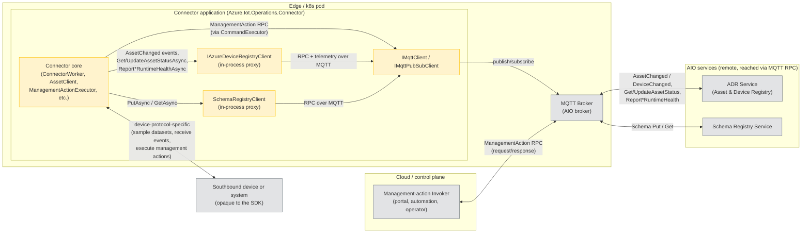

**What flows where:**

| Edge | Direction | Purpose |
|---|---|---|
| Connector core ↔ `IAzureDeviceRegistryClient` | in-process | Proxy for ADR. Subscribes to `AssetChanged` / `DeviceChanged`, exposes `GetAssetStatusAsync` / `UpdateAssetStatusAsync`, and forwards `Report*RuntimeHealth` telemetry. Owned by `ConnectorWorker`; injected into `AssetClient` and `DeviceEndpointClient`. |
| Connector core ↔ `SchemaRegistryClient` | in-process | Proxy for Schema Registry. Exposes `PutAsync` / `GetAsync`. Used by `AssetClient` during `ReportManagementAction{Request,Response}MessageSchemaAsync`. |
| Both proxies ↔ `IMqttClient` | in-process | Both proxies (and the management-action `CommandExecutor`) share the single MQTT client owned by `ConnectorWorker`. |
| MQTT Broker ↔ ADR Service | over MQTT | Materializes the proxy calls as RPC and telemetry on AIO topic conventions. |
| MQTT Broker ↔ Schema Registry Service | over MQTT | Materializes `PutAsync` / `GetAsync` as RPC on AIO topic conventions. |
| Invoker ↔ MQTT | bidirectional | Cloud-side caller publishes management-action RPC requests and receives responses. The connector responds via the same broker. |
| Connector core ↔ Device | bidirectional | Out of scope of the SDK. Each connector implements its own southbound protocol (HTTP polling, Modbus, OPC UA, custom TCP, etc.) and translates it into dataset samples, received events, and management-action invocations. |

**Object-network correspondence:** the in-process proxy boxes are exactly the dependencies declared in the `External Dependencies` table — `IAzureDeviceRegistryClient` and `SchemaRegistryClient` (Azure.Iot.Operations.Services), both running on top of `IMqttPubSubClient` (Azure.Iot.Operations.Protocol). The proxies are co-located with the connector in the same process; ADR and Schema Registry are out-of-process AIO services reached only via MQTT. The southbound `Device` edge has no SDK type — it is whatever the connector author plugs in.

---

## New Types to Introduce

All new types live in **Azure.Iot.Operations.Connector** (the top-level, user-facing layer).

### 1. ManagementActionExecutor

Wraps `CommandExecutor<TReq, TResp>` from the Protocol layer to receive management action RPC requests over MQTT.

```
Dependencies:
  - ApplicationContext (from ConnectorWorker)
  - IMqttPubSubClient (from ConnectorWorker)
  - MQTT topic derived from management action definition
  - Command name: "{managementGroupName}::{actionName}"
```

**Responsibilities:**
- Subscribe to the management action's MQTT request topic
- Receive incoming RPC requests as `ManagementActionRequest`
- Handle graceful shutdown (drain remaining requests)

**Serialization:** Use `CommandExecutor<byte[], byte[]>` with the existing
`PassthroughSerializer` (found in `Services/StateStore/Generated/Common/`
and `samples/Protocol/TestEnvoys/`). Bytes pass through unchanged in both
directions. `ContentType` and `FormatIndicator` flow via
`CommandRequestMetadata` / `CommandResponseMetadata`, not via the
serializer, so the serializer's hardcoded `application/octet-stream`
default is harmless — it is overridden by the metadata objects. No new
`BypassPayload` type is required on the .NET side. See Open Question #1
for full resolution.

**Public surface — `StopAsync` vs `DisposeAsync` (open):** The branch
currently exposes both `StopAsync(CancellationToken)` (unsubscribe + stop
delivering) and `DisposeAsync()` (release local resources, requires
`StopAsync` already done). The XML doc on `StopAsync` says *"User code
generally should not call this; call `DisposeAsync` after draining
instead"* — i.e. the only legitimate caller is the SDK itself, in
`ManagementActionConnectorWorker.DrainAndDisposeExecutorAsync`.
That is a strong signal that `StopAsync` should be **`internal`**, not
`public`: making it public lets user code corrupt the worker's per-action
bookkeeping (the doc explicitly calls this out as "out of sync"). Two
options when the bodies are wired:

- **Make `StopAsync` `internal`** and have `DisposeAsync` call it
  itself if it hasn't already run. User code drains via the existing
  `RecvRequestAsync` returning `null` pattern, then calls `DisposeAsync`.
  Matches the *Stop is an SDK-internal lifecycle step* mental model and
  prevents misuse. **Recommended.**
- **Keep `StopAsync` public** and document a precise contract: callers
  must own the executor exclusively (i.e. they obtained it directly from
  `AssetClient.GetManagementActionExecutorAsync` rather than via the
  `IManagementActionHandler` path). This preserves a hatch for
  advanced/custom-lifecycle connectors at the cost of a sharper edge.

The same reasoning applies to `ManagementActionRequest`: `CompleteAsync`
is intended for both the worker and (in advanced mode) user code, so it
stays `public`. `DisposeAsync` stays `public` because it is the natural
`await using` partner. No `StopAsync` exists on `ManagementActionRequest`
and none should be added.

### 2. ManagementActionRequest

Represents an incoming management action invocation. Created internally by `ManagementActionExecutor`.

```
Properties (read-only):
  - ReadOnlySequence<byte> Payload  // non-contiguous-friendly; .ToArray() if a byte[] is needed
  - string ContentType
  - FormatIndicator FormatIndicator
  - Dictionary<string, string> CustomUserData
  - HybridLogicalClock? Timestamp
  - string? InvokerId
  - Dictionary<string, string> TopicTokens
  - bool IsCancelled

Methods:
  - Task CompleteAsync(ManagementActionResponse response, CancellationToken ct)
```

**Auto-error on dispose:** If `CompleteAsync` is never called, disposal should send an error response back (matching Rust's Drop impl).

### 3. ManagementActionResponse (record)

```csharp
public record ManagementActionResponse
{
    public required ReadOnlySequence<byte> Payload { get; set; }
    public required string ContentType { get; set; }
    public required CloudEvent? CloudEvent { get; set; }
    public FormatIndicator FormatIndicator { get; set; } = FormatIndicator.UnspecifiedBytes;
    public Dictionary<string, string>? CustomUserData { get; set; }
    public ManagementActionApplicationError? ApplicationError { get; set; }
}
```

### 4. ManagementActionApplicationError (record)

```csharp
public record ManagementActionApplicationError
{
    public required string ErrorCode { get; set; }
    public string ErrorPayload { get; set; } = string.Empty;
}
```

### 5. ManagementActionNotification

C# doesn't have Rust-style enums. Options:
- Abstract base class + derived types (pattern matching via `switch` on type)
- Single class with a `NotificationType` enum + nullable `Executor` property

```csharp
// Option: discriminated union via base class
public abstract record ManagementActionNotification;

public record ManagementActionUpdated(ConfigError? Error) : ManagementActionNotification;
public record ManagementActionUpdatedWithNewExecutor(
    ManagementActionExecutor? NewExecutor, 
    ConfigError? Error) : ManagementActionNotification;
public record ManagementActionAssetUpdated(ConfigError? Error) : ManagementActionNotification;
public record ManagementActionDeleted : ManagementActionNotification;
```

### 6. New Methods on AssetClient (Modifications)

`AssetClient` gains management action methods. Internally, it maintains per-action state (notification channels, cached executors) keyed by `"{managementGroupName}::{managementActionName}"`.

```
New dependencies (injected internally by ConnectorWorker):
  - SchemaRegistryClient (for schema registration)

New internal state:
  - _managementActionChannels : ConcurrentDictionary<string, Channel<ManagementActionNotification>>
  - _schemaRegistryClient : SchemaRegistryClient

New methods (public):
  - Task<ManagementActionExecutor?> GetManagementActionExecutorAsync(
        string managementGroupName, string managementActionName, CancellationToken ct)
        // Returns null if no valid executor exists right now (e.g. the current definition
        // was rejected with a ConfigError). Callers should await
        // RecvManagementActionNotificationAsync for the next definition and retry.
  - Task<ManagementActionNotification> RecvManagementActionNotificationAsync(
        string managementGroupName, string managementActionName, CancellationToken ct)
  - Task ReportManagementActionRequestMessageSchemaAsync(
        string managementGroupName, string managementActionName,
        ConnectorMessageSchema schema, CancellationToken ct)
  - Task ReportManagementActionResponseMessageSchemaAsync(
        string managementGroupName, string managementActionName,
        ConnectorMessageSchema schema, CancellationToken ct)
  - Task ReportManagementActionRequestMessageSchemaReferenceAsync(
        string managementGroupName, string managementActionName,
        MessageSchemaReference schemaRef, CancellationToken ct)
  - Task ReportManagementActionResponseMessageSchemaReferenceAsync(
        string managementGroupName, string managementActionName,
        MessageSchemaReference schemaRef, CancellationToken ct)
```

**Notification delivery:** Internally, `AssetClient` uses `Channel<ManagementActionNotification>` per action. `ConnectorWorker` pushes notifications when ADR raises `AssetChanged` events. The user reads via `RecvManagementActionNotificationAsync()`. `Writer.Complete()` signals deletion.

**Why on AssetClient:** Review feedback — keeping all asset concerns in one place avoids a nested `ManagementActionClient` within `AssetClient`. The user already has `AssetClient` from `AssetAvailableEventArgs` in the `WhileAssetIsAvailable` callback; management action methods are a natural extension of it. The `managementGroupName` + `managementActionName` parameters serve as the action identifier (replacing the per-action client's implicit identity).


---

## User-Facing Layer: IManagementActionHandler Pattern (Added per Review)

Per review feedback, the low-level types above (ManagementActionExecutor, ManagementActionRequest, ManagementActionNotification) are **internal implementation details** consumed by a new base connector worker class. Users interact with a simplified interface-based pattern instead.

### 7. IManagementActionHandler (interface)

User-implemented interface with three methods - one per `AssetManagementGroupActionType`:

```csharp
public interface IManagementActionHandler : IAsyncDisposable
{
    Task<ManagementActionResponse> HandleCallAsync(ManagementActionInvokedEventArgs args, CancellationToken ct);
    Task<ManagementActionResponse> HandleReadAsync(ManagementActionInvokedEventArgs args, CancellationToken ct);
    Task<ManagementActionResponse> HandleWriteAsync(ManagementActionInvokedEventArgs args, CancellationToken ct);
}
```

**Rationale:** The SDK uses interfaces for multi-method user logic (`IDatasetSampler` has `SampleDatasetAsync` + `GetSamplingIntervalAsync`) and `Func<>` delegates for single-method hooks (`WhileAssetIsAvailable`). Three related methods -> interface.

**IAsyncDisposable:** The base connector disposes the handler when the action is deleted or the asset becomes unavailable. Handlers can release device connections or other resources.

### 8. IManagementActionHandlerFactory (interface)

Factory creating per-action handler instances. Mirrors `IDatasetSamplerFactory`.

```csharp
public interface IManagementActionHandlerFactory
{
    IManagementActionHandler CreateHandler(
        string deviceName,
        Device device,
        string inboundEndpointName,
        string assetName,
        Asset asset,
        string groupName,
        AssetManagementGroupAction action,
        EndpointCredentials? endpointCredentials);
}
```

**Why a factory:** Each management action may target a different device endpoint (`TargetUri`), have different configuration (`ActionConfiguration`), or require different timeout (`TimeoutInSeconds`). The factory receives the full context at creation time so handlers can capture whatever they need in their constructor.

**DI Registration:** `services.AddSingleton<IManagementActionHandlerFactory, MyFactory>()`

### 9. ManagementActionInvokedEventArgs (class)

Event args passed to handler methods containing the full invocation context:

```csharp
public class ManagementActionInvokedEventArgs : EventArgs
{
    public required string GroupName { get; init; }
    public required string ActionName { get; init; }
    public required AssetManagementGroupActionType ActionType { get; init; }
    public required ReadOnlySequence<byte> Payload { get; init; }
    public required string ContentType { get; init; }
    public MqttPayloadFormatIndicator FormatIndicator { get; init; }
    public IReadOnlyDictionary<string, string> CustomUserData { get; init; }
    public HybridLogicalClock? Timestamp { get; init; }
    public string? InvokerId { get; init; }
    public IReadOnlyDictionary<string, string> TopicTokens { get; init; }
    public required string AssetName { get; init; }
    public required string DeviceName { get; init; }
}
```

**Fields mirror `ManagementActionRequest`** properties plus asset/device context so the handler has everything needed to dispatch to the correct device operation.

### 10. ManagementActionConnectorWorker (class)

Base class extending `ConnectorWorker` (mirrors `PollingTelemetryConnectorWorker`). Internalizes the full per-action lifecycle so users never touch executors, notifications, or drain logic.

```csharp
public class ManagementActionConnectorWorker : ConnectorWorker
{
    public ManagementActionConnectorWorker(
        ApplicationContext applicationContext,
        ILogger<ConnectorWorker> logger,
        IMqttClient mqttClient,
        IManagementActionHandlerFactory handlerFactory,
        IMessageSchemaProvider messageSchemaProvider,
        IAzureDeviceRegistryClientWrapperProvider adrClientFactory,
        IConnectorLeaderElectionConfigurationProvider? leaderElectionConfigurationProvider = null);
}
```

**Internalized responsibilities:**
- Sets `WhileAssetIsAvailable` to iterate `asset.ManagementGroups` and spawn per-action tasks
- Creates `IManagementActionHandler` via factory for each action, passing full context
- Acquires executor via `AssetClient.GetManagementActionExecutorAsync()`
- Runs per-action `WhenAny` loop (request vs notification)
- Dispatches to `HandleCallAsync` / `HandleReadAsync` / `HandleWriteAsync` based on `action.ActionType`
- On handler exception: catches, logs, sends `ManagementActionApplicationError` with code `InternalError` back to invoker
- On `ManagementActionUpdated`: pauses health, reports config status (using `Error` field), reports Available/Unavailable
- On `ManagementActionUpdatedWithNewExecutor`: drains old executor, swaps to new, reports status
- On `ManagementActionDeleted`: drains executor, disposes handler, exits loop
- On asset unavailable (cancellation): disposes executor + handler
- Drain budget: 5 seconds, then force-dispose (stale requests get generic error response)

**Error field handling:** If `notification.Error` is non-null, the base connector reports the config error via `GetAndUpdateAssetStatusAsync` and reports health as `Unavailable` (not `Available`).

**CancellationToken propagation:** The token passed to handler methods is the per-asset cancellation token from `WhileAssetIsAvailable`. It signals when the asset is no longer available or the connector is shutting down -- replacing the `IsCancelled` property that was removed from `ManagementActionRequest`.
---

## Modifications to Existing Types

### AssetClient

See section 6 above for full details. Summary of additions:

```
New dependency:
  + SchemaRegistryClient _schemaRegistryClient

New internal state:
  + ConcurrentDictionary<string, Channel<ManagementActionNotification>> _managementActionChannels

New public methods:
  + GetManagementActionExecutorAsync(groupName, actionName) -> ManagementActionExecutor?
  + RecvManagementActionNotificationAsync(groupName, actionName) -> ManagementActionNotification
  + ReportManagementActionRequestMessageSchemaAsync(groupName, actionName, schema)
  + ReportManagementActionResponseMessageSchemaAsync(groupName, actionName, schema)
  + ReportManagementActionRequestMessageSchemaReferenceAsync(groupName, actionName, ref)
  + ReportManagementActionResponseMessageSchemaReferenceAsync(groupName, actionName, ref)

New internal methods (called by ConnectorWorker):
  + PushManagementActionNotification(groupName, actionName, notification)
  + InitManagementActionChannel(groupName, actionName)
```

### ConnectorWorker

```
Modified methods:
  ~ AssetClient construction:
    Now also injects SchemaRegistryClient into AssetClient.

  ~ OnAssetChanged / AssetAvailable:
    When an asset becomes available (Created/Updated), iterate
    Asset.ManagementGroups[].Actions[] and initialize notification
    channels on the AssetClient. On definition changes, push
    appropriate notifications (Updated, UpdatedWithNewExecutor,
    Deleted) to AssetClient's internal channels.

  ~ AssetUnavailableAsync:
    Complete all management action notification channels on the
    AssetClient being removed (signals deletion to user code).
```

**Key design choice:** Management action lifecycle is scoped to asset lifetime. When an asset is deleted, all its management action notification channels are completed, causing `RecvManagementActionNotificationAsync` to return `ManagementActionDeleted`. When a management action definition changes within an asset update, `ConnectorWorker` pushes the appropriate notification type (Updated or UpdatedWithNewExecutor) to the corresponding channel on `AssetClient`.

---

## External Dependencies

No new NuGet packages required. All dependencies are already present:

| Dependency | Package | Used For |
|---|---|---|
| `CommandExecutor<TReq, TResp>` | Azure.Iot.Operations.Protocol | RPC executor base for receiving requests |
| `SchemaRegistryClient` | Azure.Iot.Operations.Services | Registering request/response schemas |
| `IAzureDeviceRegistryClient` | Azure.Iot.Operations.Services | Asset status get/update for schema refs |
| `AssetRuntimeHealthReporter` | Azure.Iot.Operations.Services | Health reporting (already used) |
| `IMqttPubSubClient` | Azure.Iot.Operations.Protocol | MQTT communication |
| `MQTTnet` | (transitive) | MQTT transport |

---

## Data Flow

### 1. Startup: Management Action Discovery

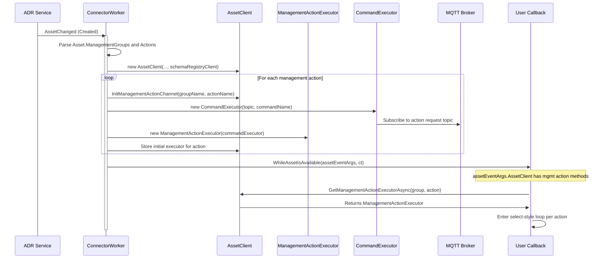

### 2. Inbound: Management Action Request/Response

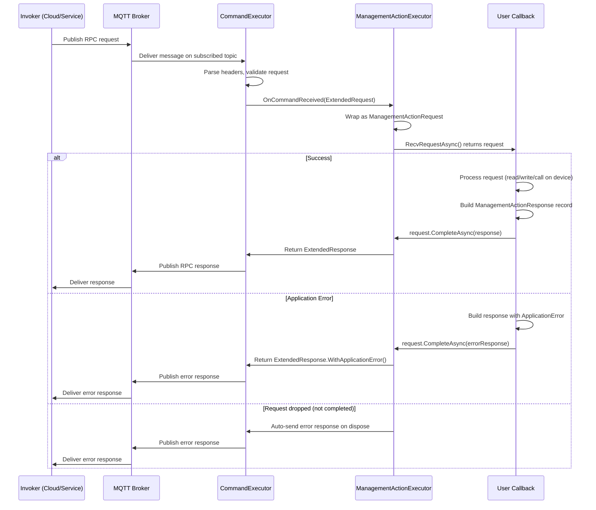

### 3. Schema Registration

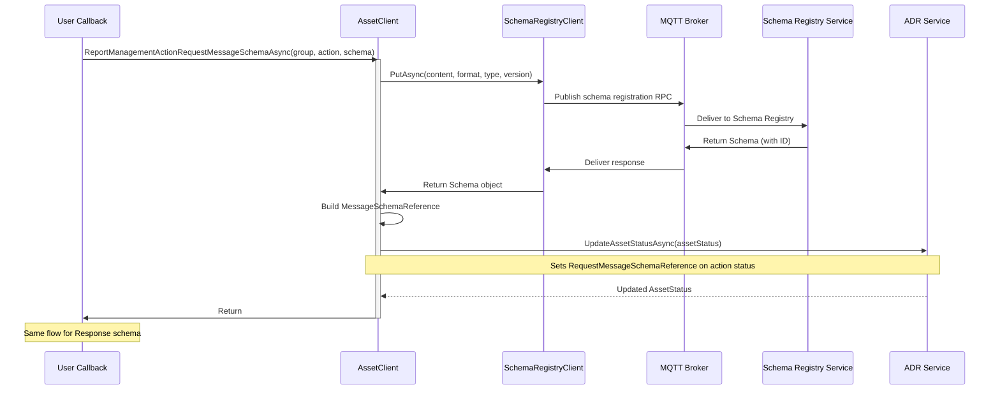

### 4. Lifecycle: Definition Update (Same Topic)

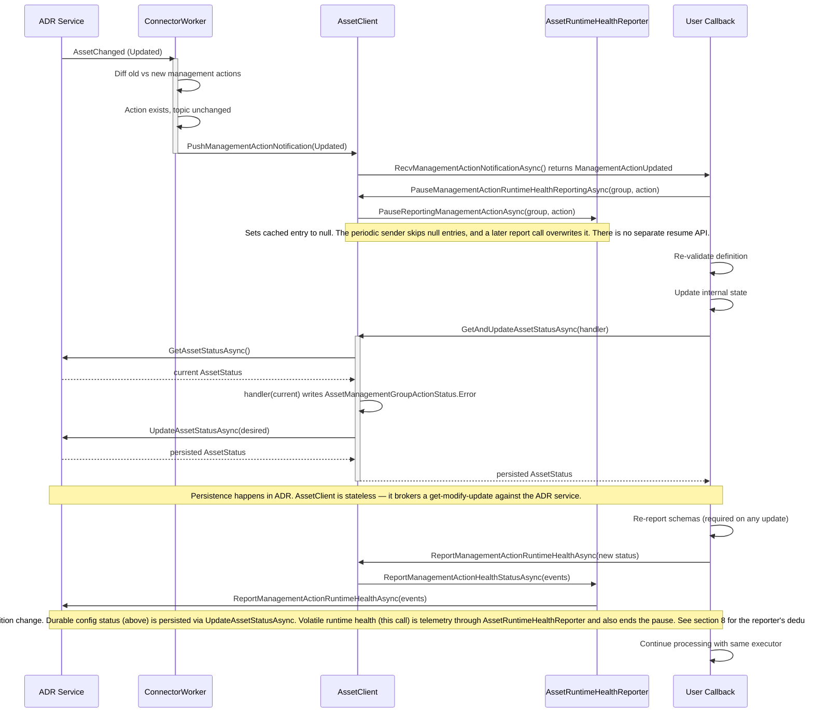

### 5. Lifecycle: Definition Update (New Topic - New Executor)

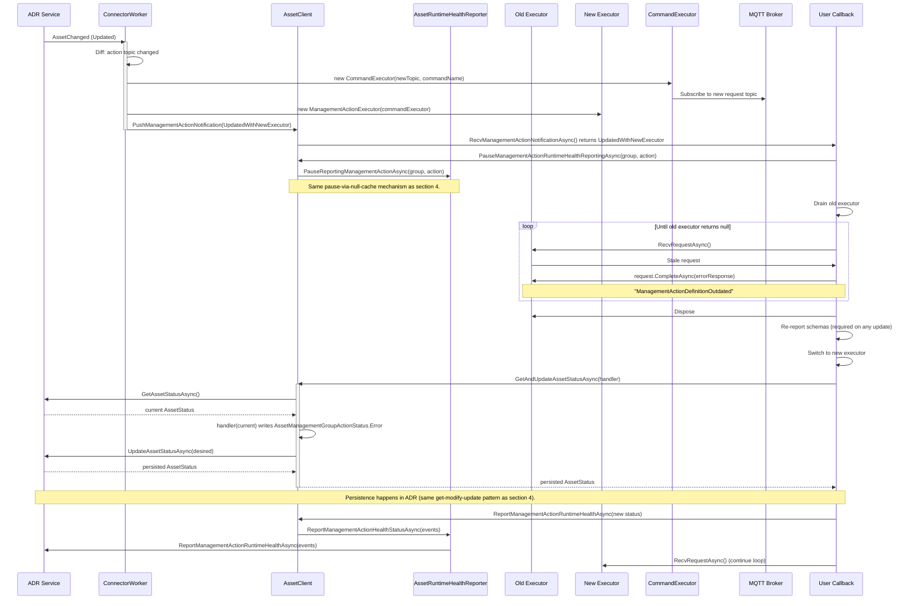

### 6. Lifecycle: Management Action Deleted

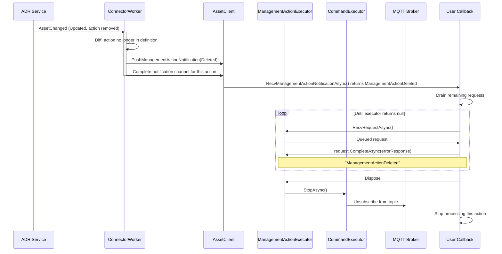

### 7. Lifecycle: Asset Deleted (Cascading Cleanup)

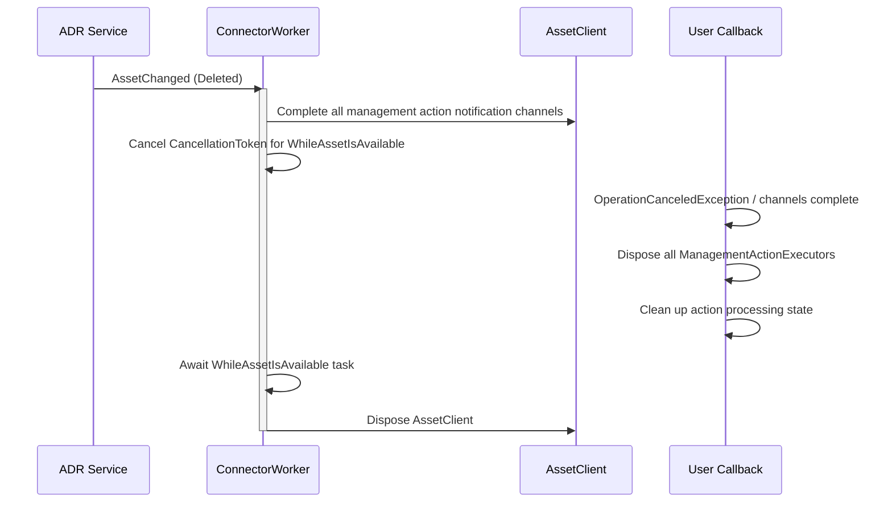

### 8. Health Reporting (Existing — No Changes)

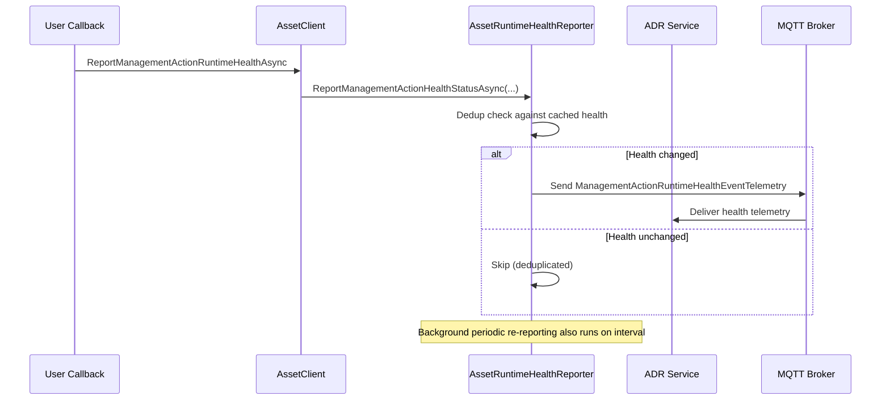

---

## Background & FAQ

> Originally written next to the [`ManagementActionConnector` sample](../../../dotnet/samples/Connectors/ManagementActionConnector/) while it was being built; moved here so the explanations survive the sample being trimmed back to a minimal scratch pad.
>
> All examples below use the **`IManagementActionHandler` + `ManagementActionConnectorWorker`** model (the current public API). When the underlying SDK-level types (`ManagementActionExecutor`, `WhileAssetIsAvailable`, etc.) come up, they're framed as *"the mechanics behind the handler interface"* — useful for understanding what the SDK is doing on your behalf, not as an API users are expected to call directly.

### B1. Who drives the per-action handler? (lifecycle from the SDK side)

User code never starts/stops anything per-action. The flow is:

1. **DI wiring** — `Program.cs` registers `IManagementActionHandlerFactory` and a `BackgroundService` that owns a `ManagementActionConnectorWorker` instance:
   ```csharp
   services.AddSingleton<IManagementActionHandlerFactory, MyHandlerFactory>();
   services.AddHostedService<MyConnectorBackgroundService>();
   ```
   The `BackgroundService.ExecuteAsync` simply does `await _connector.RunConnectorAsync(ct)`.
2. **Host start** — `RunConnectorAsync` calls into the base `ConnectorWorker.ExecuteAsync`. The base worker creates the ADR client wrapper, subscribes to its `DeviceChanged` / `AssetChanged` events, and calls `ObserveDevices()` / `ObserveAssets(...)`. The ADR wrapper watches the mounted ADR config files and raises events when devices/assets appear, update, or disappear.
3. **Asset becomes available** — when ADR reports a created or updated asset, the base `ConnectorWorker` builds an `AssetAvailableEventArgs` (containing the per-asset `AssetClient`, the `Asset`, etc.) and invokes its internal `WhileAssetIsAvailable` delegate on the thread pool. `ManagementActionConnectorWorker` sets that delegate to its own private method in its constructor — that's the single hook by which it intercepts asset lifecycle.
4. **Per-action fan-out** — inside that method, `ManagementActionConnectorWorker` iterates `asset.ManagementGroups[].Actions[]`, calls `IManagementActionHandlerFactory.CreateHandler(...)` for each one, and spawns a per-action loop task that:
   - acquires a `ManagementActionExecutor` via `AssetClient.GetManagementActionExecutorAsync(group, action, ct)`,
   - runs `WhenAny(recvRequest, recvNotification)`,
   - dispatches each request to `HandleCallAsync` / `HandleReadAsync` / `HandleWriteAsync` based on `action.ActionType`,
   - drains and disposes the executor when the action is replaced or deleted.
5. **Cancellation** — when the asset is updated or deleted, or the device goes away, the base worker cancels the per-asset token. The per-action loops observe it, drain in-flight requests with an `ApplicationError` response, dispose handlers via `IAsyncDisposable`, and exit. For a non-deletion update, the base worker re-invokes its hook with the new `Asset` snapshot, and the cycle repeats.

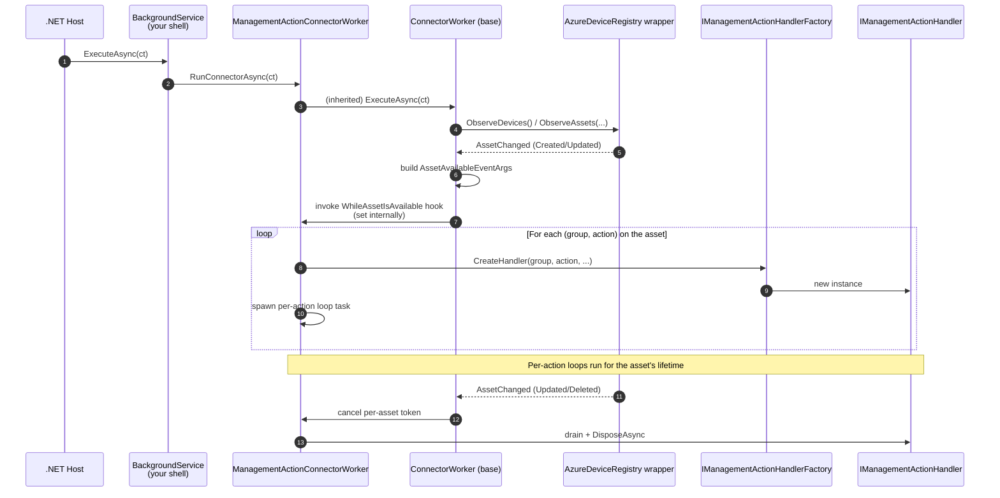

### B2. Where do management actions come from? (Asset-CR data model)

Management actions belong to the **Asset**, not to the connector or the broker. They are part of the Asset's spec in the Azure Device Registry (ADR). They are **authored, not discovered**: whoever deploys the `Asset` custom resource decides which groups and actions exist.

#### Data model

In `dotnet/src/Azure.Iot.Operations.Services/AssetAndDeviceRegistry/Models/`:

- `Asset.ManagementGroups : List<AssetManagementGroup>?` — *"Array of management groups that are part of the asset."*
- `AssetManagementGroup` — `Name`, `Actions`, `DataSource`, `DefaultTopic`, `DefaultTimeoutInSeconds`, `ManagementGroupConfiguration`, `TypeRef`.
- `AssetManagementGroupAction` — `Name`, `ActionType` (`Call | Read | Write`), `TargetUri`, `Topic`, `TimeoutInSeconds`, `ActionConfiguration`, `TypeRef`.

Each action is identified by the tuple **`(assetName, managementGroupName, actionName)`**; the pair `(groupName, actionName)` is the key used internally by the SDK (`"{managementGroupName}::{managementActionName}"`).

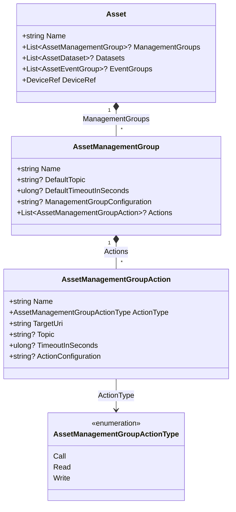

#### How the definitions reach the connector

```mermaid
flowchart LR
    Author["Author / Operator<br/>(kubectl apply)"]
    CR["Asset CR"]
    ADRSvc["ADR Service"]
    Files["Mounted config files<br/>(in connector pod)"]
    Wrapper["AzureDeviceRegistryClient<br/>+ AssetFileMonitor"]
    CW["ConnectorWorker (base)"]
    MACW["ManagementActionConnectorWorker"]
    Factory["IManagementActionHandlerFactory"]

    Author -->|writes YAML| CR
    CR -->|stored by| ADRSvc
    ADRSvc -->|projects| Files
    Files -->|watched by| Wrapper
    Wrapper -->|AssetChanged event| CW
    CW -->|AssetAvailableEventArgs| MACW
    MACW -->|"CreateHandler(group, action, ...)<br/>per Asset.ManagementGroups[*].Actions[*]"| Factory
```

This is the same delivery path already used for `Datasets` and `EventGroups` — management actions just sit alongside them on the `Asset`.

| Concern | Where |
|---|---|
| Defined by | Asset author (YAML / `Asset` CRD) |
| Stored in | Azure Device Registry (ADR) |
| Delivered to connector via | Mounted config files → `AzureDeviceRegistryClient` → `AssetChanged` |
| Surfaced in SDK as | `Asset.ManagementGroups[].Actions[]` on `AssetAvailableEventArgs.Asset`, then per-action via `IManagementActionHandlerFactory.CreateHandler` |
| Owned by | The `Asset` — lifecycle, status, and teardown all follow the asset |
| Identified by | `(managementGroupName, actionName)` within that asset |

### B3. Connector runtime model: tasks, loops, and where `ManagementActionExecutor` lives

> *"Per-asset and per-action tasks "run for the asset's lifetime" — what does that mean? Where does `ManagementActionExecutor` live? Is there a loop inside it, or is it called when an action message arrives?"*

Short answer:

- **No dedicated thread per anything.** Everything is `async` on the .NET thread pool.
- **Per-asset and per-action work runs as long-lived `Task`s.** The SDK does not poll them.
- **`ManagementActionExecutor` has no internal loop.** It is a thin wrapper around `CommandExecutor<byte[], byte[]>`, which is purely **event-driven**: the underlying MQTT client (MQTTnet) invokes a delegate each time a message arrives on the subscribed action topic.
- **The SDK runs the per-action `WhenAny(recvRequest, recvNotification)` loop**; user code only sees `HandleCallAsync` / `HandleReadAsync` / `HandleWriteAsync` calls.

#### B3.1 Task lifecycle

Relevant code (`ConnectorWorker.cs` in the base SDK):

```csharp
Task userTask = Task.Run(async () =>
{
    try
    {
        await using AssetAvailableEventArgs args = new(...);
        await WhileAssetIsAvailable.Invoke(args, assetTaskCancellationTokenSource.Token);
    }
    catch (OperationCanceledException) { /* expected on shutdown/update */ }
});
_assetTasks.TryAdd(key, new(userTask, assetTaskCancellationTokenSource));
```

What this means at the runtime level:

1. `Task.Run` queues the async lambda onto the **thread pool** and returns immediately. The base `ConnectorWorker` does **not** `await` it — it just stores it in `_assetTasks`. That is why the SDK remains responsive to further ADR events.
2. The lambda awaits `WhileAssetIsAvailable.Invoke(...)`, which is the private method on `ManagementActionConnectorWorker` that drives the per-action fan-out described in B1. As long as that method keeps awaiting something (per-action loops, notifications), the state machine stays alive and the `Task` stays in `WaitingForActivation`. No OS thread is pinned — when awaiting, the thread is returned to the pool.
3. When ADR reports that the asset was updated/deleted, `AssetUnavailableAsync` calls `cts.Cancel()` on *that* asset's token. The per-action loops observe it and unwind through their drain logic; the asset task completes; the SDK may then re-invoke `WhileAssetIsAvailable` with the new `Asset` snapshot.

The **per-action** loop inside `ManagementActionConnectorWorker.RunActionLoopAsync` — which user code never sees — looks like this in shape:

```csharp
ManagementActionExecutor? executor = await assetClient.GetManagementActionExecutorAsync(group, action, ct);
while (!ct.IsCancellationRequested)
{
    var recvRequestTask = executor.RecvRequestAsync(ct);
    var recvNotificationTask = assetClient.RecvManagementActionNotificationAsync(group, action, ct);
    var completed = await Task.WhenAny(recvRequestTask, recvNotificationTask);
    if (completed == recvRequestTask)
    {
        var request = await recvRequestTask;
        if (request is null) break; // executor shutdown
        await DispatchToHandler(request, handler, ct); // calls user's HandleCallAsync etc.
    }
    else
    {
        await HandleNotification(await recvNotificationTask, ref executor, ct);
    }
}
```

That's the SDK's loop. The **user's** loop is conceptually just `HandleCallAsync(args, ct) => ...`.

#### B3.2 Where `ManagementActionExecutor` actually lives

`ManagementActionExecutor` wraps `CommandExecutor<byte[], byte[]>` from `Azure.Iot.Operations.Protocol` (with the existing `PassthroughSerializer`):

- **One `CommandExecutor` per management action**, created by `AssetClient.GetManagementActionExecutorAsync` at asset-available time.
- Its `RequestTopicPattern` is taken from `AssetManagementGroupAction.Topic` (falling back to `AssetManagementGroup.DefaultTopic`), with topic tokens resolved against the device / endpoint / asset context.
- `CommandExecutor.StartAsync()` performs an MQTT `SUBSCRIBE` to that topic and registers a handler on `IMqttClient.ApplicationMessageReceivedAsync`.
- `CommandExecutor.StopAsync()` / `DisposeAsync()` unsubscribes and removes the handler.

**There is no loop inside `CommandExecutor`.** When a message arrives:

```csharp
ExtendedResponse<TResp> extended =
    await Task.Run(() => OnCommandReceived(extendedRequest, commandCts.Token))
              .WaitAsync(ExecutionTimeout);
```

That's the entire dispatch. MQTTnet raises `ApplicationMessageReceivedAsync`; the executor's handler parses headers, builds an `ExtendedRequest<TReq>`, and schedules `OnCommandReceived` on the thread pool. `ManagementActionExecutor` plugs into `OnCommandReceived` and pushes the request onto an internal channel that the SDK's per-action loop drains.

So *"loop inside, or called when message arrives?"* is **the latter**. It is an event handler, registered once with the MQTT client, firing per message.

#### B3.3 The full picture — processes, tasks, event sources

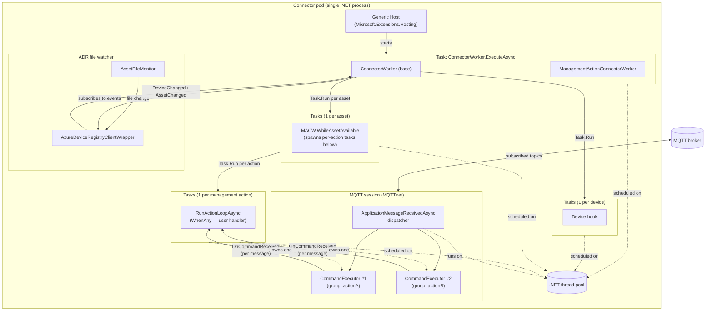

Things to notice:

- Only **one OS-level "loop"** is involved, and it's inside MQTTnet (its network read loop). Everything downstream is callback-driven on the thread pool.
- `ConnectorWorker.ExecuteAsync` is itself just one long-lived task — it mostly sits awaiting ADR events and leader-election changes.
- Asset tasks, and the per-action tasks they spawn, are **independent**: cancelling one does not affect the others.
- A `CommandExecutor` is **not** a task — it's a registration on the MQTT client plus some per-message state. Its "lifetime" is the interval between `StartAsync` and `StopAsync`/`DisposeAsync`.

#### B3.4 Lifetime of a single request

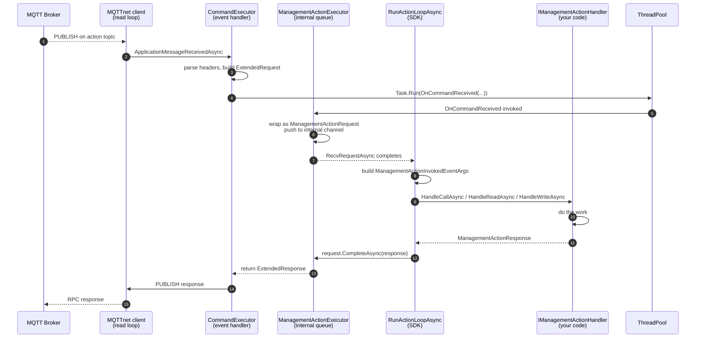

Key points:

- The user method in step 8 is where **all application work happens**. The MQTT dispatcher is not blocked during step 4 onward — `OnCommandReceived` was already handed off to the thread pool.
- Between requests, the per-action loop is **only holding a continuation** on the `WhenAny` await — zero CPU, no threads pinned.
- The `CancellationToken` passed to handler methods is the per-asset token; on cancel, the SDK's loop unwinds, `ManagementActionExecutor.DisposeAsync` runs as part of drain, and the underlying `CommandExecutor` unsubscribes from the broker.

#### B3.5 Recap of "runtime configuration"

| Layer | Count per process | Implementation |
|---|---|---|
| Host | 1 | `Microsoft.Extensions.Hosting` generic host |
| `BackgroundService` shell → `ManagementActionConnectorWorker.RunConnectorAsync` | 1 | long-lived `Task` |
| Per-device tasks | 1 per (device, endpoint) | `Task.Run` on thread pool |
| Per-asset task | 1 per asset | `Task.Run` on thread pool |
| Per-action task (SDK-internal) | 1 per management action | `Task.Run` on thread pool, runs `WhenAny(recvRequest, recvNotification)` |
| MQTT session / network loop | 1 | MQTTnet internal |
| `CommandExecutor` | 1 per management action | event handler on MQTT client |
| `ManagementActionExecutor` | 1 per management action | wraps a `CommandExecutor` + internal request queue |
| `IManagementActionHandler` | 1 per management action | user code, owned by SDK, disposed on action removal |
| `AssetFileMonitor` | 1 | fsnotify or polling watcher |

No custom threads, no spin loops, no timers doing work — just async tasks and MQTT callbacks.

### B4. Do actions have parameters? Where are they defined, how do we access them?

Yes — but there are **two** different things both sometimes called *"parameters"*. Keep them separated:

| Kind | Lives where | Per-invocation or static? | Purpose |
|---|---|---|---|
| **Static action contract** | `AssetManagementGroupAction` fields + registered request/response *message schemas* | Static (part of the asset spec) | Describes the shape of requests/responses, target resource, timeouts |
| **Per-invocation arguments** | MQTT request **payload** (+ content-type, user properties, topic tokens) | Per call | The actual values the caller wants to pass this time |

Only the first kind is stored on the Asset CR. The second kind is carried by each individual MQTT RPC message at runtime and surfaced on `ManagementActionInvokedEventArgs` (which the SDK builds from `ManagementActionRequest` and hands to your handler).

#### B4.1 Static contract — what the Asset CR tells you

From `AssetManagementGroupAction` (see B2 for the full field list), the parameter-ish fields are:

| Field | Type | Role |
|---|---|---|
| `TargetUri` | `string` | Identifies the device-side resource the action targets (e.g. `device://reboot`, an OPC UA node id, a REST path, …). Schema is action-type-specific. |
| `ActionType` | `Call \| Read \| Write` | Tells the connector the RPC shape. `Read` typically has empty request payload + returns the value; `Write` carries the new value in the payload; `Call` is an arbitrary RPC. The SDK uses this to pick `HandleReadAsync` / `HandleWriteAsync` / `HandleCallAsync`. |
| `ActionConfiguration` | `string?` (usually JSON) | Free-form static config for this action (e.g. protocol-specific options, validation hints, defaults). Opaque to the SDK — **your connector interprets it.** |
| `Topic` / group `DefaultTopic` | `string?` | The MQTT topic pattern the executor subscribes to. Not a "parameter" per se, but it's where topic tokens come from. |
| `TimeoutInSeconds` / group `DefaultTimeoutInSeconds` | `ulong?` | Execution time budget. |
| `TypeRef` / group `TypeRef` | `string?` | Optional reference to a reusable action definition / type catalog. |

The **shape of the request/response payload** is *not* a field on `AssetManagementGroupAction`. Instead, two related mechanisms:

- `ReportManagementActionRequestMessageSchemaAsync(group, action, schema)` and `ReportManagementActionResponseMessageSchemaAsync(...)` on `AssetClient` — the connector publishes the JSON schema (or other supported format) to the Schema Registry and records a `MessageSchemaReference` on the asset status. That reference tells the *invoker* what to send, and tells any downstream tooling how to validate. (Schema reporting is **Part 2**, currently stashed in [management-action-part2-stash.md](management-action-part2-stash.md).)
- The status side: `AssetManagementGroupActionStatus.RequestMessageSchemaReference` / `...ResponseMessageSchemaReference` (see `Services/AssetAndDeviceRegistry/Models/AssetManagementGroupActionStatus.cs`).

So:

- **Authors describe** *"this action exists, targets X, uses topic T"* in the Asset CR (`managementGroups[*].actions[*]`).
- **The connector describes the payload shape** at runtime via schema registration.
- **Callers send the actual parameter values** as the request payload per invocation.

#### B4.2 How you access the static contract in code

The static contract is delivered to your **factory**, once per action, at handler-creation time:

```csharp
public IManagementActionHandler CreateHandler(
    string deviceName, Device device, string inboundEndpointName,
    string assetName, Asset asset, string groupName,
    AssetManagementGroupAction action, EndpointCredentials? credentials)
{
    string uri        = action.TargetUri;
    var    kind       = action.ActionType;               // Call | Read | Write
    string? rawCfg    = action.ActionConfiguration;      // JSON string or null
    string? topic     = action.Topic;
    ulong   timeoutS  = action.TimeoutInSeconds ?? 30UL;

    // Parse your own action-specific config schema once, here:
    var cfg = rawCfg is null
        ? new MyActionConfig()
        : JsonSerializer.Deserialize<MyActionConfig>(rawCfg)!;

    // Capture in the handler's constructor — the per-invocation hot path
    // doesn't need to re-parse this on every call.
    return new MyHandler(uri, kind, cfg, timeoutS, credentials);
}
```

Per the design above, `ActionConfiguration` is deliberately opaque — the connector owns its schema.

#### B4.3 How you access per-invocation parameters in code

Per-invocation data arrives on `ManagementActionInvokedEventArgs`:

| Field | Type | What it carries |
|---|---|---|
| `Payload` | `ReadOnlySequence<byte>` | **The actual argument bytes.** Interpret per `ContentType`. For a `Write`, this is the new value. For a `Call`, it's the structured arguments. For a `Read`, typically empty. |
| `ContentType` | `string` | MIME type (`application/json`, `application/cbor`, …). |
| `FormatIndicator` | `MqttPayloadFormatIndicator` | MQTT 5 PFI — text vs. bytes hint. |
| `CustomUserData` | `IReadOnlyDictionary<string,string>` | MQTT 5 user properties the caller set. Useful for metadata / correlation keys. |
| `TopicTokens` | `IReadOnlyDictionary<string,string>` | Values extracted from wildcard segments of the subscribed topic pattern. If your topic is `mgmt/{deviceName}/.../reboot`, the invoker's actual topic might resolve `{deviceName}` → `"thermostat-1"` and you'll find that here. |
| `Timestamp` | `HybridLogicalClock?` | HLC from the invoker, if provided. |
| `InvokerId` | `string?` | Caller identity, if the broker/auth policy exposes it. |
| `GroupName` / `ActionName` / `ActionType` | identification | Which action was invoked (also implicit from which handler method was called). |
| `AssetName` / `DeviceName` | context | Which asset/device this invocation is for. |

Pulling it together inside a handler:

```csharp
public async Task<ManagementActionResponse> HandleCallAsync(
    ManagementActionInvokedEventArgs args, CancellationToken ct)
{
    // 1. Well-known metadata
    string device = args.TopicTokens.TryGetValue("deviceName", out var d) ? d : "?";

    // 2. Caller-sent custom headers
    string? correlation = args.CustomUserData.TryGetValue("x-correlation-id", out var c) ? c : null;

    // 3. The actual arguments — interpret per the registered request schema.
    //    JsonSerializer doesn't take ReadOnlySequence<byte> directly; ToArray() is fine
    //    for small payloads, or use a Utf8JsonReader for large ones.
    var parsed = JsonSerializer.Deserialize<MyRebootArgs>(args.Payload.ToArray());

    // 4. Do the work.
    var result = await _device.RebootAsync(parsed!, ct);

    // 5. Build the response.
    byte[] resultBytes = JsonSerializer.SerializeToUtf8Bytes(result);
    return new ManagementActionResponse
    {
        Payload     = new ReadOnlySequence<byte>(resultBytes),
        ContentType = "application/json",
        CloudEvent  = null,
    };
}
```

#### B4.4 How the two kinds flow together

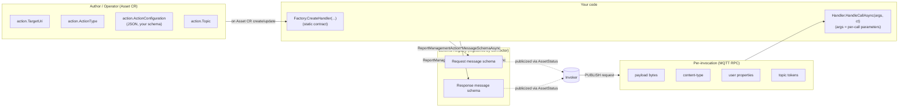

#### B4.5 Cheat-sheet

- **"What parameters does action X accept?"** — answered by the **registered request message schema** (JSON Schema / other), which the connector reports via `ReportManagementActionRequestMessageSchemaAsync` and which ends up as a `MessageSchemaReference` on the asset status.
- **"Which device thing does action X poke?"** — `action.TargetUri` (+ `action.ActionConfiguration` for connector-specific extras).
- **"What did *this particular* caller pass?"** — `args.Payload` (interpreted per `args.ContentType`), plus `args.CustomUserData` and `args.TopicTokens` for sideband metadata.
- **"Where do I write my parsing code?"** — `JsonSerializer.Deserialize<MyArgs>(args.Payload.ToArray())` inside the matching `Handle*Async` method.

### B5. How do I know the payload is `MyRebootArgs`? (type binding)

Because **the connector — not the SDK and not the broker — defines that contract**, and you have two independent clues that tell you which C# type applies to a given `ManagementActionInvokedEventArgs`:

1. **The handler instance identifies the action.** `IManagementActionHandlerFactory.CreateHandler` is called with `(groupName, action)` — at that point you decide what concrete `IManagementActionHandler` to construct, and that handler is bound to *that one action* for its lifetime. So if you decided `device-control::reboot` maps to `MyRebootHandler` whose `HandleCallAsync` deserializes `MyRebootArgs`, there is no ambiguity — the binding is established at construction time.
2. **You published the request's schema to the Schema Registry** (via `AssetClient.ReportManagementActionRequestMessageSchemaAsync(...)`). That schema is the public contract: invokers see it through the asset's status (`RequestMessageSchemaReference`) and serialize accordingly. Your `MyRebootArgs` C# class is just the .NET projection of that schema.

So the flow for picking a deserialization type is always:

```
factory dispatch on (group, action) → handler subclass → C# request type you own → parse args.Payload
```

Nothing on the wire tells you *"this is `MyRebootArgs`"*. There is no self-describing type tag. The binding is by **convention**, rooted in the schema you published and the dispatch decision made by your factory.

#### B5.1 Defense-in-depth checks

Even though the identity comes from the handler, a well-behaved handler does some validation before trusting the payload:

```csharp
public async Task<ManagementActionResponse> HandleCallAsync(
    ManagementActionInvokedEventArgs args, CancellationToken ct)
{
    // (a) Reject wrong content-type — schemas are content-type-specific.
    if (!string.Equals(args.ContentType, "application/json", StringComparison.OrdinalIgnoreCase))
    {
        return new ManagementActionResponse
        {
            Payload     = ReadOnlySequence<byte>.Empty,
            ContentType = "application/json",
            CloudEvent  = null,
            ApplicationError = new ManagementActionApplicationError
            {
                ErrorCode    = "UnsupportedContentType",
                ErrorPayload = $"expected application/json, got {args.ContentType}",
            },
        };
    }

    // (b) Optional: version check via a custom header you defined in your schema.
    if (args.CustomUserData.TryGetValue("x-schema-version", out var v) && v != "1")
    {
        // return ApplicationError("SchemaVersionMismatch", ...);
    }

    // (c) Now it is safe to deserialize to the type you chose for this action.
    MyRebootArgs? parsed;
    try
    {
        parsed = JsonSerializer.Deserialize<MyRebootArgs>(args.Payload.ToArray());
    }
    catch (JsonException ex)
    {
        return new ManagementActionResponse
        {
            Payload     = ReadOnlySequence<byte>.Empty,
            ContentType = "application/json",
            CloudEvent  = null,
            ApplicationError = new ManagementActionApplicationError
            {
                ErrorCode    = "InvalidPayload",
                ErrorPayload = ex.Message,
            },
        };
    }

    // ... continue with parsed ...
}
```

#### B5.2 What if I want one handler class for many actions?

Two clean options:

1. **One handler class per action (recommended)** — the factory dispatches on `(group, action)`:
   ```csharp
   public IManagementActionHandler CreateHandler(..., string groupName, AssetManagementGroupAction action, ...)
       => (groupName, action.Name) switch
       {
           ("device-control", "reboot")       => new RebootHandler(...),
           ("device-control", "set-setpoint") => new SetpointHandler(...),
           _ => new UnknownActionHandler(groupName, action.Name),
       };
   ```
   Each handler owns its own request/response types and is unambiguous.

2. **One generic handler with an internal table** — pass `(groupName, actionName)` into the handler's constructor, and dispatch on `args.GroupName` / `args.ActionName` in the handler:
   ```csharp
   record ActionBinding(Type RequestType, Func<object, CancellationToken, Task<object>> Handle);

   private static readonly Dictionary<(string Group, string Action), ActionBinding> Bindings = new()
   {
       [("device-control", "reboot")]       = new(typeof(MyRebootArgs),   async (p, c) => await HandleRebootAsync((MyRebootArgs)p, c)),
       [("device-control", "set-setpoint")] = new(typeof(MySetpointArgs), async (p, c) => await HandleSetpointAsync((MySetpointArgs)p, c)),
   };
   ```
   The payload bytes are still opaque until you deserialize them against the type the binding tells you to use.

#### B5.3 Diagram: where the type binding actually lives

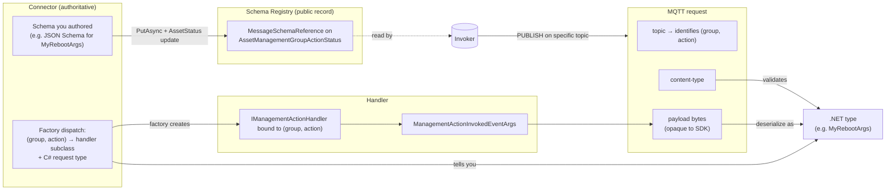

#### B5.4 TL;DR

- The SDK hands you `ReadOnlySequence<byte>` plus a `ContentType`. It does **not** know, and cannot tell you, what .NET type to deserialize into.
- The **(group, action) identity of the handler** is what decides the type; that's the whole point of the per-action factory dispatch.
- The **schema you publish** is what makes that contract observable to callers.
- Treat `MyRebootArgs` as *"the .NET representation of the schema I registered for `device-control::reboot`"*. It's a convention you own.

### B6. Relationship between assets, asset "shapes", connector deployments, and connector binaries

> *"There's sort of a many-to-many relationship between Asset and Connector — the same Asset (type, probably) like robot A can have many versions deployed, and many Connectors could be deployed for each robot version."*

The intuition is right, but the many-to-many actually lives at a specific level. Pulling the concepts apart makes the whole topology clearer.

#### B6.1 Four distinct entities, not two

| Entity | What it is | Runtime or design-time? |
|---|---|---|
| **Asset instance** (`Asset` CR) | One row in ADR for one physical/logical thing — e.g. `robot-a-line3-unit42`. | Runtime |
| **Asset shape** ("type") | The *schema* of `managementGroups[].actions[]` + conventions on `TargetUri` / `ActionConfiguration`. Not a first-class field — it's by convention. | Stable across many instances, varies across device generations |
| **Connector deployment** | A running Kubernetes Deployment (or similar) of a specific connector image. Has replicas, possibly leader election. | Runtime |
| **Connector binary** | The compiled image. Contains the `(group, action) → handler subclass + request/response types` table — the *"what the bytes mean"* code. | Design-time, built once, then versioned |

#### B6.2 The actual cardinalities

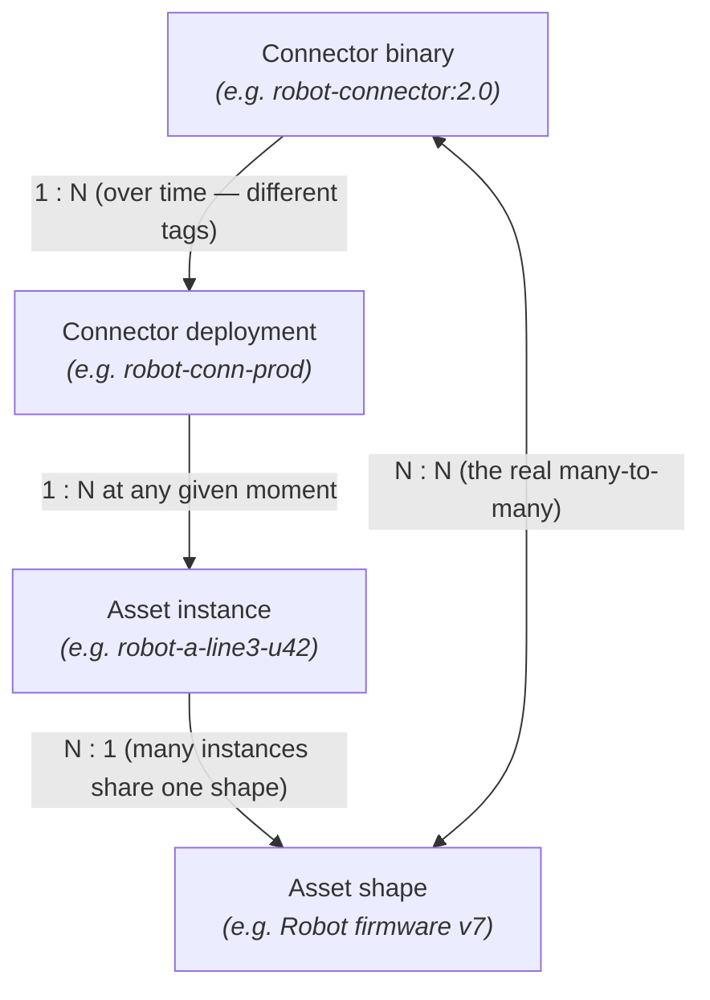

| Relationship | Cardinality | Why |
|---|---|---|
| Connector binary ↔ Connector deployment | **1 : N** over time | You can run `:1.2` in staging and `:2.0` in prod from the same image repo. |
| Connector deployment ↔ Asset instance | **1 : N** at any given moment | ADR routes each asset to exactly one connector deployment (via the device's inbound-endpoint connector reference). |
| Asset instance ↔ Asset shape | **N : 1** | Many `robot-a-*` rows all follow the same `managementGroups` layout. |
| **Asset shape ↔ Connector binary** | **N : N** | **This is the many-to-many you're sensing.** One binary can serve several shapes (v6 + v7); one shape can be served by several binary versions as it evolves. |

So the "many-to-many" lives at the **shape ↔ binary** level, not at runtime. At runtime, an individual asset instance is owned by a single connector deployment at a time.

#### B6.3 Independent versioning on each side

Both axes version independently — that's what makes it *feel* like a mess until you separate them.

```
Asset shape            Connector binary
─────────────          ─────────────────
Robot v6  ──────────▶  robot-connector:1.2  (handles v6 only)
          ──────────▶  robot-connector:1.3  (handles v6 + v7)
Robot v7  ──────────▶  robot-connector:1.3
          ──────────▶  robot-connector:2.0  (handles v7 + v8)
Robot v8  ──────────▶  robot-connector:2.0
```

Operational consequences:

1. **One binary can support multiple shapes.** Your factory's `(group, action) → handler` dispatch just needs entries for every `(shape, action)` combination you care about. Unknown pairs → return a sentinel handler that replies with `ManagementActionApplicationError { ErrorCode = "UnknownAction" }`.
2. **Multiple binary versions can coexist.** Deploy `:2.0` alongside `:1.3` and migrate asset instances one at a time by editing each device's connector reference — standard blue/green, not AIO-specific.

#### B6.4 The fence: what you cannot do without a code change

| Want to … | How |
|---|---|
| Support a new firmware revision that added an action | Ship a new connector binary version with an added factory dispatch entry + handler class. |
| Deprecate an old action | Leave the handler in place (returns `ApplicationError("Deprecated")`), remove from the asset CR template, then remove the handler in a later release once no CRs reference it. |
| Run v1 and v2 of the same connector in one cluster | Two Deployments, each with its own image tag. Route assets by editing the `Device` CR's connector reference. |
| Split a shape across several binaries | Usually not worth it — dispatch on `(group, action)` inside one binary, optionally using a shape marker in `ActionConfiguration` or asset metadata. |
| Support a genuinely unknown future shape with no code change | **Not possible by design.** The payload type binding is code. Build a generic passthrough handler if you need it (e.g. one that forwards `ReadOnlySequence<byte>` to a known device URL), but that's your own protocol, not an SDK feature. |

"Shape" is part of the connector's contract, even though ADR delivers instances of it dynamically. ADR controls *topology* (which assets exist, which topics they listen on); the connector binary controls *protocol* (what the bytes of each named action mean).

#### B6.5 Mental model: compare to Kubernetes services

- **Kubernetes** scales pods up/down, moves services between nodes, adds or removes replicas — the *deployment topology* is dynamic.
- **The REST endpoints each service exposes** — `POST /reboot`, with a specific JSON body — are **static per binary**; changing them requires a new image.

Management actions work the same way. ADR is the "Kubernetes" of the asset world (topology, routing, lifecycle). The connector binary is the "service" (fixed protocol contract). The `(group, action)` name is the stable URL-equivalent; the message schema is the JSON body contract.

#### B6.6 TL;DR

- **Runtime ownership is 1 : N** — one connector deployment owns many assets; each asset is owned by exactly one deployment at a time.
- **The real many-to-many is shape ↔ binary**, and both sides version independently.
- The SDK does **not** magically adapt to new shapes without a code change. *"Shape"* is part of the connector's contract, delivered by ADR but meaningful only to the code that was built to handle it.

---

## Open Questions

1. **BypassPayload / raw passthrough in CommandExecutor:** Does `CommandExecutor<TReq, TResp>` support a raw byte[] passthrough mode (no serialization), or do we need a no-op serializer? The Rust side uses `BypassPayload` for this.
   - **RESOLVED: Already supported.** Use `CommandExecutor<byte[], byte[]>` with the existing `PassthroughSerializer` (found in `Services/StateStore/Generated/Common/` and `samples/Protocol/TestEnvoys/`). Bytes pass through unchanged in both directions. Content-Type and Format Indicator metadata flow through `CommandRequestMetadata` / `CommandResponseMetadata` separately from the serializer, so the serializer's hardcoded `application/octet-stream` default is harmless — it gets overridden by the metadata objects. The user reads content-type from `ManagementActionRequest.ContentType` and sets it on `ManagementActionResponse.ContentType`.

2. **Topic extraction:** How to derive the MQTT request topic from `AssetManagementGroupAction.Topic` / `AssetManagementGroup.DefaultTopic`? The Rust side has `try_executor_topic_from_management_topics()`. Need to understand the topic format and how it maps to `CommandExecutor`'s `RequestTopicPattern`.
   - **RESOLVED: Dynamic topic configuration at runtime.** The topic comes from the asset definition: `AssetManagementGroupAction.Topic` with fallback to `AssetManagementGroup.DefaultTopic` (fallback not yet implemented in Rust, but should be in .NET). The `CommandExecutor` supports setting `RequestTopicPattern` at construction time without the `[CommandTopic]` attribute — so `ManagementActionExecutor` creates a `CommandExecutor<byte[], byte[]>` and configures topic properties dynamically. `TopicTokenMap` is populated with known values (device name, endpoint, etc.), and unresolved tokens become `+` (MQTT wildcard). The executor subscribes to `$share/{ServiceGroupId}/{resolved topic}`.

3. **Notification channel internals:** `AssetClient.RecvManagementActionNotificationAsync()` needs an internal delivery mechanism. `Channel<T>` is the natural choice but has no codebase precedent. Alternative: `SemaphoreSlim` + queue, or `TaskCompletionSource` chain.
   - **Decision: `Channel<ManagementActionNotification>` (Option A).**
   - `ConnectorWorker` pushes notifications via `_channel.Writer.TryWrite()`, user consumes via `_channel.Reader.ReadAsync()` inside `RecvManagementActionNotificationAsync()`. `Writer.Complete()` signals end-of-life (deletion). Internal-only — the user never sees the channel, only the `RecvManagementActionNotificationAsync()` method. Each management action gets its own channel, keyed by `"{groupName}::{actionName}"` in `AssetClient._managementActionChannels`.
   - Alternatives considered:
     - `TaskCompletionSource` chain: simpler but fragile — doesn't handle queuing if multiple notifications arrive before user reads; needs manual synchronization; easy to get wrong.
     - `SemaphoreSlim` + `ConcurrentQueue<T>`: uses patterns already in the codebase (`SemaphoreSlim` is in `AssetClient`), but reinvents `Channel<T>` with more code and more edge cases (disposal, completion signaling).
   - Rationale: `Channel<T>` is a standard BCL type (`System.Threading.Channels`) purpose-built for async producer-consumer. It handles queuing, cancellation, completion, and thread safety out of the box. No new NuGet dependency. The lack of codebase precedent is a weak objection — it's internal-only plumbing.

4. **Health reporting ownership:** Health reporting currently lives on `AssetClient`. With management action functionality now also on `AssetClient`, the user naturally has access to `ReportManagementActionRuntimeHealthAsync()` alongside the new management action methods.
   - **RESOLVED: No change needed.** The user already has `AssetClient` from `AssetAvailableEventArgs` in the `WhileAssetIsAvailable` callback. Since management action execution methods are now on `AssetClient` too, the user has unified access to both health reporting and action execution from the same object. No separate event args or client needed.

5. **Concurrency model for updates:** When `AssetChanged` fires with updated management actions, `ConnectorWorker` needs to diff old vs. new action definitions to determine which actions were added/removed/updated. This diffing logic needs to be defined.
   - **DEFERRED.** Requires decisions on: where to cache old asset definitions, what fields to compare (topic only vs full definition), and how to handle non-topic changes. Will resolve during implementation.
