# Management Action .NET Implementation — Design

**Date:** 2026-04-14  
**Prerequisite:** [Gap Analysis](management-action-gap-analysis.md)

---

## Class Diagrams

### Simplified: Relationships Overview

New types in green. Shows only how types relate — no internal details.

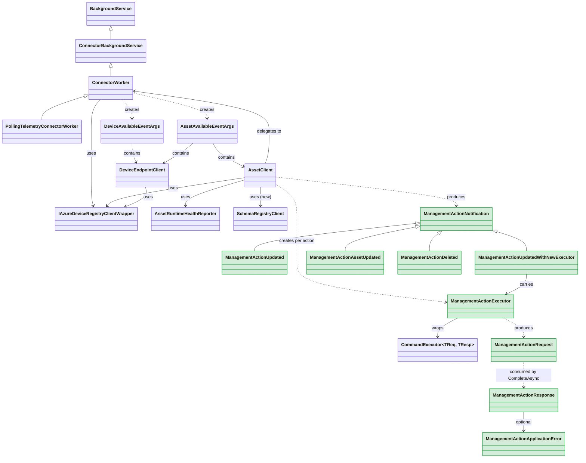

### Detailed: Full Class Members

New types are marked with `<<new>>`. Existing types shown for context.

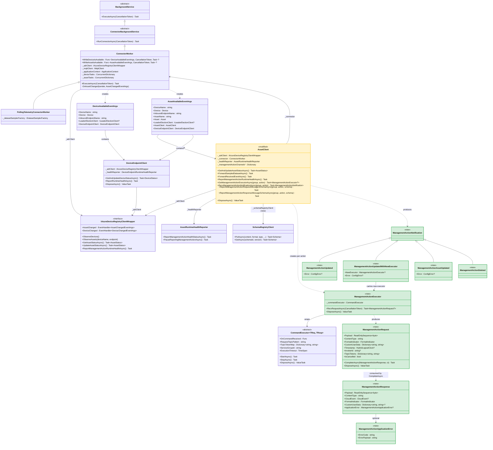

**Legend:** Green = new types. Yellow = modified existing types. Members marked with `*` are new additions.

---

## Architecture Overview

The management action execution pipeline spans three existing .NET layers. New management action methods are added directly to the existing `AssetClient` (which already handles health reporting). No new callback surface on `ConnectorWorker` is needed — management action executors and notifications are accessed through `AssetClient` within the existing `WhileAssetIsAvailable` callback.

```
┌─────────────────────────────────────────────────────────────┐
│  User Code (connector implementation)                       │
│  WhileAssetIsAvailable callback (existing)                  │
│    - receives AssetAvailableEventArgs (contains AssetClient) │
│    - processes mgmt action requests via AssetClient           │
│    - reports schemas via AssetClient                          │
│    - runs until CancellationToken fires (deleted/shutdown)   │
└────────────────────────┬────────────────────────────────────┘
                         │ uses
┌────────────────────────▼────────────────────────────────────┐
│  Azure.Iot.Operations.Connector                             │
│                                                             │
│  New types:                                                 │
│  ┌─────────────────────────────────────────────────────┐    │
│  │ ManagementActionExecutor                             │    │
│  │  - RecvRequestAsync() -> ManagementActionRequest?    │    │
│  │  - wraps CommandExecutor<byte[], byte[]>              │    │
│  └─────────────────────────────────────────────────────┘    │
│  ┌─────────────────────────────────────────────────────┐    │
│  │ ManagementActionRequest                              │    │
│  │  - CompleteAsync(ManagementActionResponse)            │    │
│  │  - IsCancelled, Payload, ContentType, etc.           │    │
│  └─────────────────────────────────────────────────────┘    │
│  ┌─────────────────────────────────────────────────────┐    │
│  │ ManagementActionResponse (record)                    │    │
│  │  - required Payload, ContentType, CloudEvent         │    │
│  │  - optional CustomUserData, FormatIndicator          │    │
│  │  - optional ApplicationError                         │    │
│  └─────────────────────────────────────────────────────┘    │
│  ┌─────────────────────────────────────────────────────┐    │
│  │ ManagementActionApplicationError (record)            │    │
│  │  - ErrorCode, ErrorPayload                           │    │
│  └─────────────────────────────────────────────────────┘    │
│  ┌─────────────────────────────────────────────────────┐    │
│  │ ManagementActionNotification (enum/union)            │    │
│  │  - Updated, UpdatedWithNewExecutor,                  │    │
│  │    AssetUpdated, Deleted                             │    │
│  └─────────────────────────────────────────────────────┘    │
│                                                             │
│  Modified types:                                            │
│  ┌─────────────────────────────────────────────────────┐    │
│  │ AssetClient (extended)                               │    │
│  │  + GetManagementActionExecutorAsync()                │    │
│  │  + RecvManagementActionNotificationAsync()           │    │
│  │  + ReportManagementActionRequestMessageSchemaAsync() │    │
│  │  + ReportManagementActionResponseMessageSchemaAsync()│    │
│  │  + _managementActionChannels (internal state)        │    │
│  │  + _schemaRegistryClient (new dependency)            │    │
│  └─────────────────────────────────────────────────────┘    │
│  ┌─────────────────────────────────────────────────────┐    │
│  │ ConnectorWorker (minor changes)                      │    │
│  │  ~ Injects SchemaRegistryClient into AssetClient     │    │
│  │  ~ Pushes mgmt action notifications to AssetClient   │    │
│  └─────────────────────────────────────────────────────┘    │
└────────────────────────┬────────────────────────────────────┘
                         │ depends on
┌────────────────────────▼────────────────────────────────────┐
│  Azure.Iot.Operations.Services                              │
│                                                             │
│  Existing types used (no changes expected):                 │
│  - IAzureDeviceRegistryClient / AzureDeviceRegistryClient   │
│  - SchemaRegistryClient (PutAsync for schema registration)  │
│  - AssetRuntimeHealthReporter (management action health)    │
│  - AssetStatus, AssetManagementGroupStatus,                 │
│    AssetManagementGroupActionStatus                         │
│  - MessageSchemaReference                                   │
│  - ManagementActionRuntimeHealthEventTelemetrySender        │
└────────────────────────┬────────────────────────────────────┘
                         │ depends on
┌────────────────────────▼────────────────────────────────────┐
│  Azure.Iot.Operations.Protocol                              │
│                                                             │
│  Existing types used (no changes expected):                 │
│  - CommandExecutor<TReq, TResp> (RPC executor base)         │
│  - ExtendedRequest<T>, ExtendedResponse<T>                  │
│  - CommandResponseMetadata                                  │
│  - ApplicationContext, IMqttPubSubClient                    │
└────────────────────────┬────────────────────────────────────┘
                         │ depends on
┌────────────────────────▼────────────────────────────────────┐
│  Azure.Iot.Operations.Mqtt                                  │
│  - IMqttClient (MQTT connection)                            │
└─────────────────────────────────────────────────────────────┘
```

### System Context: Connector and External Dependencies

Black-box view of a Connector application built on `Azure.Iot.Operations.Connector` and the external systems it communicates with. Captures the object network at deployment scope, without internal class structure. The two AIO services have no special wire protocol of their own — they are reached via in-process proxy clients (`IAzureDeviceRegistryClient`, `SchemaRegistryClient`) that issue RPC over MQTT, so those proxies are shown explicitly to make the object network match reality.

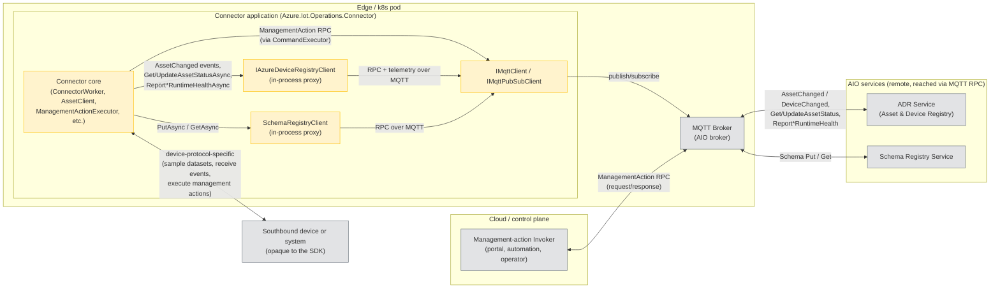

**What flows where:**

| Edge | Direction | Purpose |
|---|---|---|
| Connector core ↔ `IAzureDeviceRegistryClient` | in-process | Proxy for ADR. Subscribes to `AssetChanged` / `DeviceChanged`, exposes `GetAssetStatusAsync` / `UpdateAssetStatusAsync`, and forwards `Report*RuntimeHealth` telemetry. Owned by `ConnectorWorker`; injected into `AssetClient` and `DeviceEndpointClient`. |
| Connector core ↔ `SchemaRegistryClient` | in-process | Proxy for Schema Registry. Exposes `PutAsync` / `GetAsync`. Used by `AssetClient` during `ReportManagementAction{Request,Response}MessageSchemaAsync`. |
| Both proxies ↔ `IMqttClient` | in-process | Both proxies (and the management-action `CommandExecutor`) share the single MQTT client owned by `ConnectorWorker`. |
| MQTT Broker ↔ ADR Service | over MQTT | Materializes the proxy calls as RPC and telemetry on AIO topic conventions. |
| MQTT Broker ↔ Schema Registry Service | over MQTT | Materializes `PutAsync` / `GetAsync` as RPC on AIO topic conventions. |
| Invoker ↔ MQTT | bidirectional | Cloud-side caller publishes management-action RPC requests and receives responses. The connector responds via the same broker. |
| Connector core ↔ Device | bidirectional | Out of scope of the SDK. Each connector implements its own southbound protocol (HTTP polling, Modbus, OPC UA, custom TCP, etc.) and translates it into dataset samples, received events, and management-action invocations. |

**Object-network correspondence:** the in-process proxy boxes are exactly the dependencies declared in the `External Dependencies` table — `IAzureDeviceRegistryClient` and `SchemaRegistryClient` (Azure.Iot.Operations.Services), both running on top of `IMqttPubSubClient` (Azure.Iot.Operations.Protocol). The proxies are co-located with the connector in the same process; ADR and Schema Registry are out-of-process AIO services reached only via MQTT. The southbound `Device` edge has no SDK type — it is whatever the connector author plugs in.

---

## New Types to Introduce

All new types live in **Azure.Iot.Operations.Connector** (the top-level, user-facing layer).

### 1. ManagementActionExecutor

Wraps `CommandExecutor<TReq, TResp>` from the Protocol layer to receive management action RPC requests over MQTT.

```
Dependencies:
  - ApplicationContext (from ConnectorWorker)
  - IMqttPubSubClient (from ConnectorWorker)
  - MQTT topic derived from management action definition
  - Command name: "{managementGroupName}::{actionName}"
```

**Responsibilities:**
- Subscribe to the management action's MQTT request topic
- Receive incoming RPC requests as `ManagementActionRequest`
- Handle graceful shutdown (drain remaining requests)

**Serialization:** Use `CommandExecutor<byte[], byte[]>` with the existing
`PassthroughSerializer` (found in `Services/StateStore/Generated/Common/`
and `samples/Protocol/TestEnvoys/`). Bytes pass through unchanged in both
directions. `ContentType` and `FormatIndicator` flow via
`CommandRequestMetadata` / `CommandResponseMetadata`, not via the
serializer, so the serializer's hardcoded `application/octet-stream`
default is harmless — it is overridden by the metadata objects. No new
`BypassPayload` type is required on the .NET side. See Open Question #1
for full resolution.

### 2. ManagementActionRequest

Represents an incoming management action invocation. Created internally by `ManagementActionExecutor`.

```
Properties (read-only):
  - ReadOnlySequence<byte> Payload  // non-contiguous-friendly; .ToArray() if a byte[] is needed
  - string ContentType
  - FormatIndicator FormatIndicator
  - Dictionary<string, string> CustomUserData
  - HybridLogicalClock? Timestamp
  - string? InvokerId
  - Dictionary<string, string> TopicTokens
  - bool IsCancelled

Methods:
  - Task CompleteAsync(ManagementActionResponse response, CancellationToken ct)
```

**Auto-error on dispose:** If `CompleteAsync` is never called, disposal should send an error response back (matching Rust's Drop impl).

### 3. ManagementActionResponse (record)

```csharp
public record ManagementActionResponse
{
    public required ReadOnlySequence<byte> Payload { get; set; }
    public required string ContentType { get; set; }
    public required CloudEvent? CloudEvent { get; set; }
    public FormatIndicator FormatIndicator { get; set; } = FormatIndicator.UnspecifiedBytes;
    public Dictionary<string, string>? CustomUserData { get; set; }
    public ManagementActionApplicationError? ApplicationError { get; set; }
}
```

### 4. ManagementActionApplicationError (record)

```csharp
public record ManagementActionApplicationError
{
    public required string ErrorCode { get; set; }
    public string ErrorPayload { get; set; } = string.Empty;
}
```

### 5. ManagementActionNotification

C# doesn't have Rust-style enums. Options:
- Abstract base class + derived types (pattern matching via `switch` on type)
- Single class with a `NotificationType` enum + nullable `Executor` property

```csharp
// Option: discriminated union via base class
public abstract record ManagementActionNotification;

public record ManagementActionUpdated(ConfigError? Error) : ManagementActionNotification;
public record ManagementActionUpdatedWithNewExecutor(
    ManagementActionExecutor? NewExecutor, 
    ConfigError? Error) : ManagementActionNotification;
public record ManagementActionAssetUpdated(ConfigError? Error) : ManagementActionNotification;
public record ManagementActionDeleted : ManagementActionNotification;
```

### 6. New Methods on AssetClient (Modifications)

`AssetClient` gains management action methods. Internally, it maintains per-action state (notification channels, cached executors) keyed by `"{managementGroupName}::{managementActionName}"`.

```
New dependencies (injected internally by ConnectorWorker):
  - SchemaRegistryClient (for schema registration)

New internal state:
  - _managementActionChannels : ConcurrentDictionary<string, Channel<ManagementActionNotification>>
  - _schemaRegistryClient : SchemaRegistryClient

New methods (public):
  - Task<ManagementActionExecutor?> GetManagementActionExecutorAsync(
        string managementGroupName, string managementActionName, CancellationToken ct)
        // Returns null if no valid executor exists right now (e.g. the current definition
        // was rejected with a ConfigError). Callers should await
        // RecvManagementActionNotificationAsync for the next definition and retry.
  - Task<ManagementActionNotification> RecvManagementActionNotificationAsync(
        string managementGroupName, string managementActionName, CancellationToken ct)
  - Task ReportManagementActionRequestMessageSchemaAsync(
        string managementGroupName, string managementActionName,
        ConnectorMessageSchema schema, CancellationToken ct)
  - Task ReportManagementActionResponseMessageSchemaAsync(
        string managementGroupName, string managementActionName,
        ConnectorMessageSchema schema, CancellationToken ct)
  - Task ReportManagementActionRequestMessageSchemaReferenceAsync(
        string managementGroupName, string managementActionName,
        MessageSchemaReference schemaRef, CancellationToken ct)
  - Task ReportManagementActionResponseMessageSchemaReferenceAsync(
        string managementGroupName, string managementActionName,
        MessageSchemaReference schemaRef, CancellationToken ct)
```

**Notification delivery:** Internally, `AssetClient` uses `Channel<ManagementActionNotification>` per action. `ConnectorWorker` pushes notifications when ADR raises `AssetChanged` events. The user reads via `RecvManagementActionNotificationAsync()`. `Writer.Complete()` signals deletion.

**Why on AssetClient:** Review feedback — keeping all asset concerns in one place avoids a nested `ManagementActionClient` within `AssetClient`. The user already has `AssetClient` from `AssetAvailableEventArgs` in the `WhileAssetIsAvailable` callback; management action methods are a natural extension of it. The `managementGroupName` + `managementActionName` parameters serve as the action identifier (replacing the per-action client's implicit identity).

---

## Modifications to Existing Types

### AssetClient

See section 6 above for full details. Summary of additions:

```
New dependency:
  + SchemaRegistryClient _schemaRegistryClient

New internal state:
  + ConcurrentDictionary<string, Channel<ManagementActionNotification>> _managementActionChannels

New public methods:
  + GetManagementActionExecutorAsync(groupName, actionName) -> ManagementActionExecutor?
  + RecvManagementActionNotificationAsync(groupName, actionName) -> ManagementActionNotification
  + ReportManagementActionRequestMessageSchemaAsync(groupName, actionName, schema)
  + ReportManagementActionResponseMessageSchemaAsync(groupName, actionName, schema)
  + ReportManagementActionRequestMessageSchemaReferenceAsync(groupName, actionName, ref)
  + ReportManagementActionResponseMessageSchemaReferenceAsync(groupName, actionName, ref)

New internal methods (called by ConnectorWorker):
  + PushManagementActionNotification(groupName, actionName, notification)
  + InitManagementActionChannel(groupName, actionName)
```

### ConnectorWorker

```
Modified methods:
  ~ AssetClient construction:
    Now also injects SchemaRegistryClient into AssetClient.

  ~ OnAssetChanged / AssetAvailable:
    When an asset becomes available (Created/Updated), iterate
    Asset.ManagementGroups[].Actions[] and initialize notification
    channels on the AssetClient. On definition changes, push
    appropriate notifications (Updated, UpdatedWithNewExecutor,
    Deleted) to AssetClient's internal channels.

  ~ AssetUnavailableAsync:
    Complete all management action notification channels on the
    AssetClient being removed (signals deletion to user code).
```

**Key design choice:** Management action lifecycle is scoped to asset lifetime. When an asset is deleted, all its management action notification channels are completed, causing `RecvManagementActionNotificationAsync` to return `ManagementActionDeleted`. When a management action definition changes within an asset update, `ConnectorWorker` pushes the appropriate notification type (Updated or UpdatedWithNewExecutor) to the corresponding channel on `AssetClient`.

---

## External Dependencies

No new NuGet packages required. All dependencies are already present:

| Dependency | Package | Used For |
|---|---|---|
| `CommandExecutor<TReq, TResp>` | Azure.Iot.Operations.Protocol | RPC executor base for receiving requests |
| `SchemaRegistryClient` | Azure.Iot.Operations.Services | Registering request/response schemas |
| `IAzureDeviceRegistryClient` | Azure.Iot.Operations.Services | Asset status get/update for schema refs |
| `AssetRuntimeHealthReporter` | Azure.Iot.Operations.Services | Health reporting (already used) |
| `IMqttPubSubClient` | Azure.Iot.Operations.Protocol | MQTT communication |
| `MQTTnet` | (transitive) | MQTT transport |

---

## Data Flow

### 1. Startup: Management Action Discovery

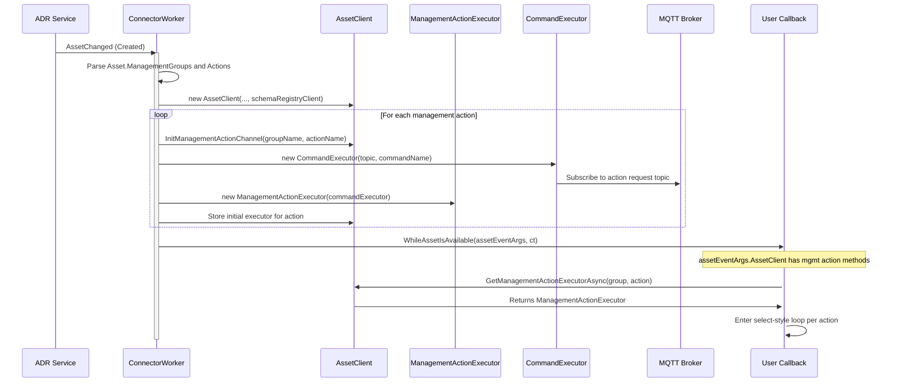

### 2. Inbound: Management Action Request/Response

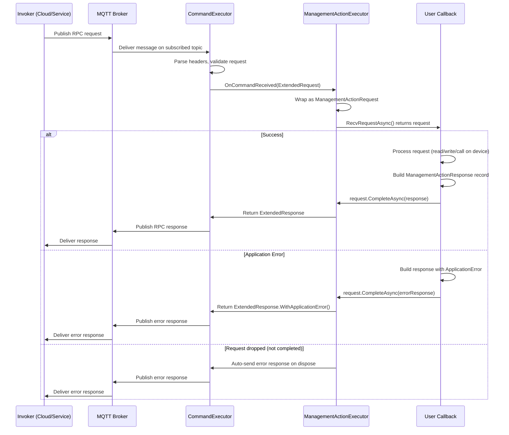

### 3. Schema Registration

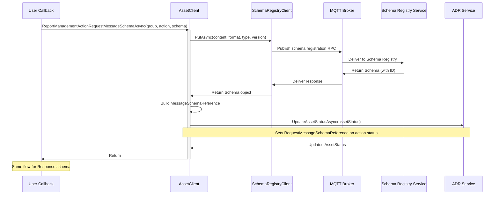

### 4. Lifecycle: Definition Update (Same Topic)

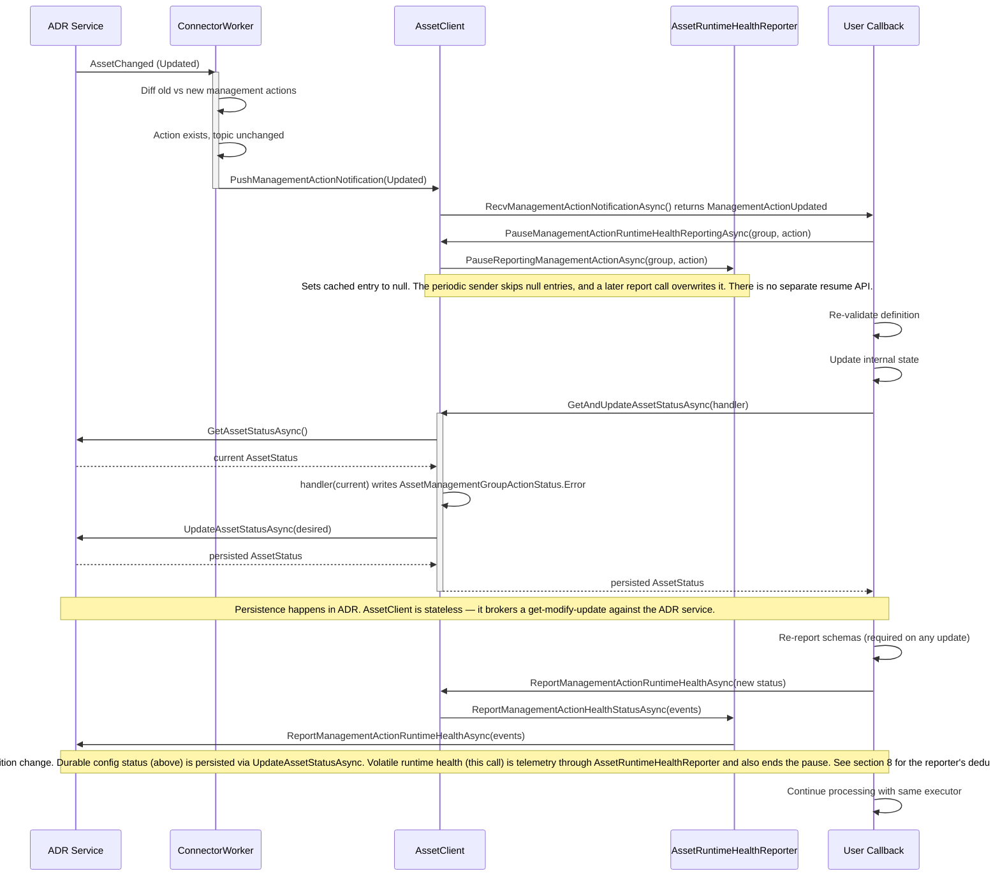

### 5. Lifecycle: Definition Update (New Topic - New Executor)

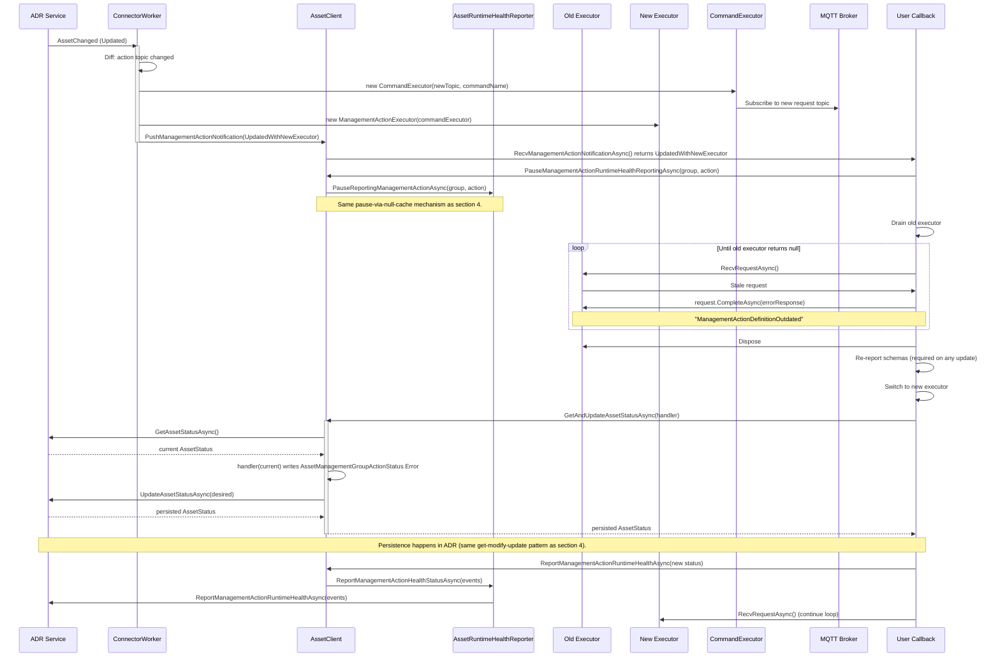

### 6. Lifecycle: Management Action Deleted

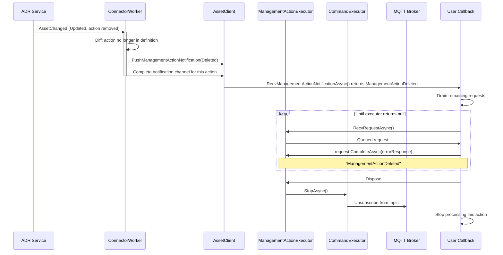

### 7. Lifecycle: Asset Deleted (Cascading Cleanup)

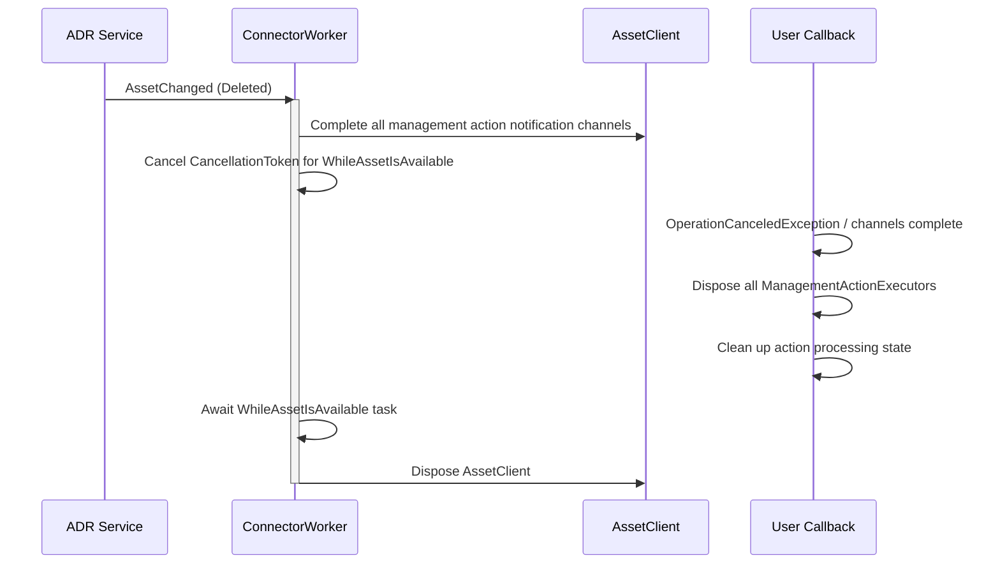

### 8. Health Reporting (Existing — No Changes)

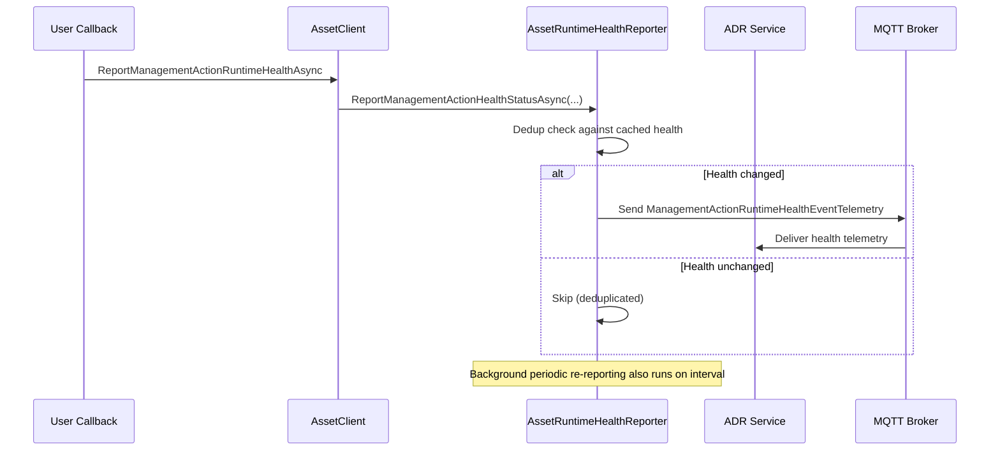

---

## Open Questions

1. **BypassPayload / raw passthrough in CommandExecutor:** Does `CommandExecutor<TReq, TResp>` support a raw byte[] passthrough mode (no serialization), or do we need a no-op serializer? The Rust side uses `BypassPayload` for this.
   - **RESOLVED: Already supported.** Use `CommandExecutor<byte[], byte[]>` with the existing `PassthroughSerializer` (found in `Services/StateStore/Generated/Common/` and `samples/Protocol/TestEnvoys/`). Bytes pass through unchanged in both directions. Content-Type and Format Indicator metadata flow through `CommandRequestMetadata` / `CommandResponseMetadata` separately from the serializer, so the serializer's hardcoded `application/octet-stream` default is harmless — it gets overridden by the metadata objects. The user reads content-type from `ManagementActionRequest.ContentType` and sets it on `ManagementActionResponse.ContentType`.

2. **Topic extraction:** How to derive the MQTT request topic from `AssetManagementGroupAction.Topic` / `AssetManagementGroup.DefaultTopic`? The Rust side has `try_executor_topic_from_management_topics()`. Need to understand the topic format and how it maps to `CommandExecutor`'s `RequestTopicPattern`.
   - **RESOLVED: Dynamic topic configuration at runtime.** The topic comes from the asset definition: `AssetManagementGroupAction.Topic` with fallback to `AssetManagementGroup.DefaultTopic` (fallback not yet implemented in Rust, but should be in .NET). The `CommandExecutor` supports setting `RequestTopicPattern` at construction time without the `[CommandTopic]` attribute — so `ManagementActionExecutor` creates a `CommandExecutor<byte[], byte[]>` and configures topic properties dynamically. `TopicTokenMap` is populated with known values (device name, endpoint, etc.), and unresolved tokens become `+` (MQTT wildcard). The executor subscribes to `$share/{ServiceGroupId}/{resolved topic}`.

3. **Notification channel internals:** `AssetClient.RecvManagementActionNotificationAsync()` needs an internal delivery mechanism. `Channel<T>` is the natural choice but has no codebase precedent. Alternative: `SemaphoreSlim` + queue, or `TaskCompletionSource` chain.
   - **Decision: `Channel<ManagementActionNotification>` (Option A).**
   - `ConnectorWorker` pushes notifications via `_channel.Writer.TryWrite()`, user consumes via `_channel.Reader.ReadAsync()` inside `RecvManagementActionNotificationAsync()`. `Writer.Complete()` signals end-of-life (deletion). Internal-only — the user never sees the channel, only the `RecvManagementActionNotificationAsync()` method. Each management action gets its own channel, keyed by `"{groupName}::{actionName}"` in `AssetClient._managementActionChannels`.
   - Alternatives considered:
     - `TaskCompletionSource` chain: simpler but fragile — doesn't handle queuing if multiple notifications arrive before user reads; needs manual synchronization; easy to get wrong.
     - `SemaphoreSlim` + `ConcurrentQueue<T>`: uses patterns already in the codebase (`SemaphoreSlim` is in `AssetClient`), but reinvents `Channel<T>` with more code and more edge cases (disposal, completion signaling).
   - Rationale: `Channel<T>` is a standard BCL type (`System.Threading.Channels`) purpose-built for async producer-consumer. It handles queuing, cancellation, completion, and thread safety out of the box. No new NuGet dependency. The lack of codebase precedent is a weak objection — it's internal-only plumbing.

4. **Health reporting ownership:** Health reporting currently lives on `AssetClient`. With management action functionality now also on `AssetClient`, the user naturally has access to `ReportManagementActionRuntimeHealthAsync()` alongside the new management action methods.
   - **RESOLVED: No change needed.** The user already has `AssetClient` from `AssetAvailableEventArgs` in the `WhileAssetIsAvailable` callback. Since management action execution methods are now on `AssetClient` too, the user has unified access to both health reporting and action execution from the same object. No separate event args or client needed.

5. **Concurrency model for updates:** When `AssetChanged` fires with updated management actions, `ConnectorWorker` needs to diff old vs. new action definitions to determine which actions were added/removed/updated. This diffing logic needs to be defined.
   - **DEFERRED.** Requires decisions on: where to cache old asset definitions, what fields to compare (topic only vs full definition), and how to handle non-topic changes. Will resolve during implementation.
