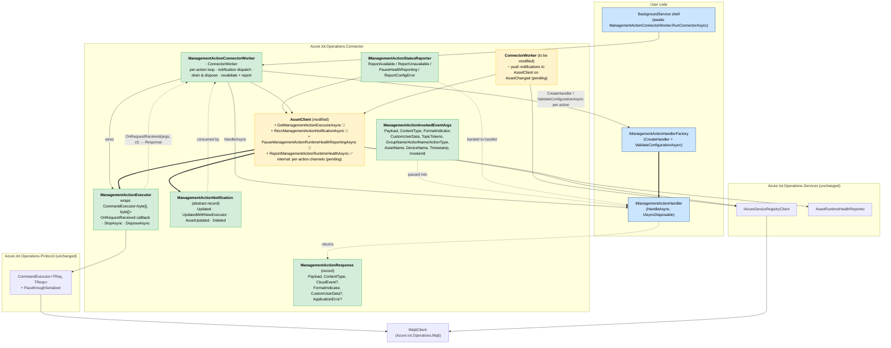
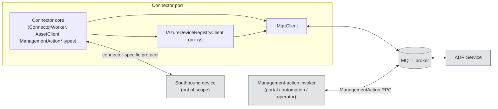
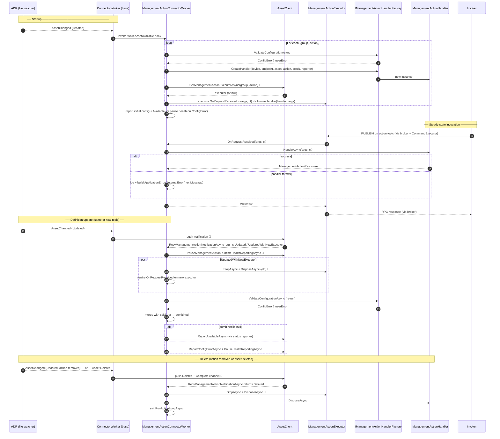

# Management Action .NET Implementation — Design

**Date:** 2026-04-14 (rewritten 2026-05-18 to match code on branch `maxim/management-action`)
**Prerequisite:** [Gap Analysis](management-action-gap-analysis.md)
**Onepager:** [management-action-design-onepager.md](management-action-design-onepager.md)

This document captures the **realized** design. Type signatures, namespaces, and lifecycle semantics here match the .NET sources under `dotnet/src/Azure.Iot.Operations.Connector/`. Open work is called out in [§5 Remaining work](#5-remaining-work).

---

## 1. Implementation status

| Area | Status | Notes |
|---|---|---|
| Public surface in `Azure.Iot.Operations.Connector` | ✅ shipped | `ManagementActionExecutor`, `ManagementActionResponse`, `ManagementActionApplicationError`, `ManagementActionNotification` (+ four variants), `ManagementActionInvokedEventArgs`, `IManagementActionHandler`, `IManagementActionHandlerFactory`, `IManagementActionStatusReporter`, `ManagementActionConnectorWorker`. |
| `ManagementActionConnectorWorker` orchestration | ✅ shipped | Per-action loop, notification dispatch, drain/dispose, exception→`ApplicationError` translation, SDK+user `ConfigError` merge, revalidate-and-report on every update. Calls into the `AssetClient` stubs, so it throws at runtime until those are wired. |
| `AssetClient.ReportManagementActionRuntimeHealthAsync` (batch and per-action) | ✅ shipped | Forwards to `AssetRuntimeHealthReporter`. |
| `AssetClient.GetManagementActionExecutorAsync` | 🚧 `NotImplementedException` | Body deferred. |
| `AssetClient.RecvManagementActionNotificationAsync` | 🚧 `NotImplementedException` | Body deferred. Per-action `Channel<ManagementActionNotification>` not yet allocated. |
| `AssetClient.PauseManagementActionRuntimeHealthReportingAsync` | 🚧 `NotImplementedException` | Forwards to existing `AssetRuntimeHealthReporter.PauseReportingManagementActionAsync` once wired. |
| `ManagementActionExecutor.StopAsync` / `DisposeAsync` | 🚧 `NotImplementedException` | Will wrap the underlying `CommandExecutor<byte[], byte[]>` lifecycle. |
| `ConnectorWorker` notification fan-out into `AssetClient` | ❌ not started | The whole "push notifications when ADR `AssetChanged` fires" path is unwritten. |

The surface shipped on the branch deliberately differs from the original design in three places — they are reflected throughout this document:

1. **Callback model, not pull model.** `ManagementActionExecutor` exposes a `Func<ManagementActionInvokedEventArgs, CancellationToken, Task<ManagementActionResponse>> OnRequestReceived` property. There is no `ManagementActionRequest` type and no `RecvRequestAsync` / `CompleteAsync` pair — the response is the return value of the callback.
2. **One handler method, not three.** `IManagementActionHandler` has a single `HandleAsync(ManagementActionInvokedEventArgs, CancellationToken)`. The `Call` / `Read` / `Write` discriminator is on `ManagementActionInvokedEventArgs.ActionType` for handlers that want to branch.
3. **`IManagementActionStatusReporter` exists.** A narrow, per-action wrapper around `AssetClient`'s status / health surface, handed to handlers by the factory. The factory also has an opt-in `ValidateConfigurationAsync` hook called by the worker at startup and on every definition update.

---

## 2. Architecture

One diagram covers the layering, the new types, the user-implementable surface, and the modifications to existing types.



**Legend.** Blue = user-implemented. Green = new in `Azure.Iot.Operations.Connector`. Yellow = modified existing types. 🚧 = stub (`NotImplementedException`). Heavy arrows (`==>`) = "produces / owns". Dashed arrows = "uses" or "value of".

### Object network at deployment scope

The ADR service is reached via an in-process proxy client (`IAzureDeviceRegistryClient`) that issues RPC over the connector's single `IMqttClient`. Southbound to the actual device is connector-specific.



---

## 3. Public surface (concise reference)

All types live in `Azure.Iot.Operations.Connector`. Source files are linked; method-level XML docs in source are authoritative. Snippets below appear only for types not yet finalized in code or where the contract is subtle.

### 3.1 Already implemented — no snippets

| Type | Shape | Purpose |
|---|---|---|
| `ManagementActionInvokedEventArgs` | class, init-only properties | Carries one invocation's payload + MQTT metadata + asset/device/group/action context into `HandleAsync`. |
| `ManagementActionResponse` | record, init-only | Return value of `HandleAsync` / `OnRequestReceived`. `Payload`, `ContentType` required; `CloudEvent`, `FormatIndicator`, `CustomUserData`, `ApplicationError` optional. |
| `ManagementActionApplicationError` | record | `ErrorCode` (required) + `ErrorPayload` (string, defaults `""`). |
| `ManagementActionNotification` | abstract record + 4 variants | `ManagementActionUpdated(Error)`, `ManagementActionUpdatedWithNewExecutor(NewExecutor, Error)`, `ManagementActionAssetUpdated(Error)`, `ManagementActionDeleted`. |
| `IManagementActionHandler` | interface, `: IAsyncDisposable` | Single method `Task<ManagementActionResponse> HandleAsync(ManagementActionInvokedEventArgs, CancellationToken)`. Branch on `args.ActionType` if needed. |
| `IManagementActionHandlerFactory` | interface | `CreateHandler(device, inboundEndpointName, asset, action, endpointCredentials, statusReporter)` + opt-in `ValueTask<ConfigError?> ValidateConfigurationAsync(...)`. |
| `IManagementActionStatusReporter` / `ManagementActionStatusReporter` | interface + internal impl | Per-action narrow view of `AssetClient`: `ReportAvailableAsync`, `ReportUnavailableAsync`, `PauseHealthReportingAsync`, `ReportConfigErrorAsync`. |
| `ManagementActionConnectorWorker` | `: ConnectorWorker` | Sets `base.WhileAssetIsAvailable`. Iterates `asset.ManagementGroups[].Actions[]`, builds an `ActionContext` per action, runs `RunActionLoopAsync`. See [§4](#4-lifecycle-flows). |
| `AssetClient.ReportManagementActionRuntimeHealthAsync` (batch + per-action) | method | Forwards to `AssetRuntimeHealthReporter.ReportManagementActionHealthStatusAsync`. |

### 3.2 `ManagementActionExecutor`

Thin wrapper over `CommandExecutor<byte[], byte[]>` from `Azure.Iot.Operations.Protocol` with `PassthroughSerializer` (bytes through unchanged; content-type and format indicator carried by `CommandRequest/ResponseMetadata`). One instance per management action; obtained from `AssetClient.GetManagementActionExecutorAsync`.

```csharp
public sealed class ManagementActionExecutor : IAsyncDisposable
{
    // Set once (by the worker on acquire/swap). Invoked once per request; return value is shipped to invoker.
    public Func<ManagementActionInvokedEventArgs, CancellationToken, Task<ManagementActionResponse>>? OnRequestReceived { get; set; }

    public ValueTask StopAsync(CancellationToken ct = default);   // 🚧 unsubscribe; SDK-internal lifecycle step
    public ValueTask DisposeAsync();                              // 🚧 release callback / local queues
}
```

**Lifecycle contract.** `StopAsync` is the SDK's "unsubscribe from broker" call; `DisposeAsync` releases local resources after in-flight callbacks complete (bounded by the underlying `CommandExecutor`'s `ExecutionTimeout`). User code drives neither directly — `ManagementActionConnectorWorker` calls them on swap, delete, asset-unavailable, and shutdown.

### 3.3 New methods on `AssetClient` (🚧 stubs)

```
Task<ManagementActionExecutor?> GetManagementActionExecutorAsync(group, action, ct)
Task<ManagementActionNotification> RecvManagementActionNotificationAsync(group, action, ct)
Task PauseManagementActionRuntimeHealthReportingAsync(group, action, ct)
```

- `GetManagementActionExecutorAsync` returns `null` if no valid executor exists right now (e.g. the current definition was rejected with a `ConfigError`). The caller (`ManagementActionConnectorWorker`) treats `null` as "wait for the next notification, then retry".
- `RecvManagementActionNotificationAsync` is backed by an internal `Channel<ManagementActionNotification>` per action key `"{group}::{action}"`. `Writer.Complete()` signals end-of-life and surfaces as `ManagementActionDeleted` to the caller.
- `PauseManagementActionRuntimeHealthReportingAsync` is the per-action analog of the existing `AssetRuntimeHealthReporter.PauseReportingManagementActionAsync`. The worker calls it on every definition update so the next health event reflects the re-validated definition. There is no separate resume — the next `ReportManagementActionRuntimeHealthAsync` overwrites the null cache entry.


---

## 4. Lifecycle flows

The base `ConnectorWorker` already turns ADR file-watch events into `AssetAvailableEventArgs` and invokes the `WhileAssetIsAvailable` delegate, which `ManagementActionConnectorWorker` sets to its own `WhileAssetAvailableAsync` (see [`ManagementActionConnectorWorker.cs`](../../../dotnet/src/Azure.Iot.Operations.Connector/ManagementActionConnectorWorker.cs)). The diagrams below show only what's new on top of that.

### 4.1 Startup + steady-state invocation + update + delete

One sequence covers the four common cases. The per-action loop is `RunActionLoopAsync` inside the worker; `await assetClient.RecvManagementActionNotificationAsync` is the single suspension point between invocations.



🚧 = touches an `AssetClient` / `ManagementActionExecutor` method currently throwing `NotImplementedException` (see [§1](#1-implementation-status)).

### 4.2 Runtime model (tasks, threads, MQTT callback)

- `ConnectorWorker.ExecuteAsync` is one long-lived async task; it suspends on ADR events and leader-election changes.
- Per-device, per-asset, and per-action work are independent `Task.Run` continuations on the thread pool. Cancelling one does not affect the others.
- `ManagementActionExecutor` has **no internal loop**. The underlying `CommandExecutor` registers a handler on `IMqttClient.ApplicationMessageReceivedAsync`; on each message the executor schedules `OnCommandReceived` (and hence `OnRequestReceived`, and hence `IManagementActionHandler.HandleAsync`) on the thread pool. Between requests no thread is pinned and no CPU is consumed.
- The `CancellationToken` propagated into `HandleAsync` is the per-asset token from `WhileAssetIsAvailable`. It fires when the asset is updated, deleted, or the connector is shutting down; handlers should honor it for device I/O.

| Runtime entity | Count per process | Backed by |
|---|---|---|
| Generic host | 1 | `Microsoft.Extensions.Hosting` |
| `BackgroundService` shell → `RunConnectorAsync` | 1 | long-lived `Task` |
| Per-device tasks | 1 per (device, endpoint) | `Task.Run` |
| Per-asset task | 1 per asset | `Task.Run` |
| Per-action loop (`RunActionLoopAsync`) | 1 per management action | `Task.Run`, awaits notifications |
| MQTT network loop | 1 | MQTTnet internal |
| `CommandExecutor` | 1 per management action | event handler on MQTT client |
| `ManagementActionExecutor` | 1 per management action | wraps one `CommandExecutor` |
| `IManagementActionHandler` | 1 per management action | user code, owned by SDK, disposed on action removal |

---

## 5. Remaining work

Tracked against the items marked 🚧 / ❌ in [§1](#1-implementation-status).

1. **Wire `ManagementActionExecutor` lifecycle (`StopAsync` / `DisposeAsync`).** Build a `CommandExecutor<byte[], byte[]>` with `PassthroughSerializer`, set `RequestTopicPattern` from `AssetManagementGroupAction.Topic` (fallback `AssetManagementGroup.DefaultTopic`), populate `TopicTokenMap` from the device/endpoint/asset context, `StartAsync` to subscribe under `$share/{ServiceGroupId}/{resolved topic}`. `StopAsync` calls through to `CommandExecutor.StopAsync`; `DisposeAsync` awaits in-flight callbacks (bounded by `ExecutionTimeout`).
2. **Allocate the per-action `Channel<ManagementActionNotification>` in `AssetClient`** (keyed by `"{group}::{action}"`). Expose `Reader.ReadAsync` via `RecvManagementActionNotificationAsync`. `Writer.Complete()` surfaces as `ManagementActionDeleted`.
3. **Push notifications from `ConnectorWorker.OnAssetChanged`** into the channel. Diff `Asset.ManagementGroups[].Actions[]` between old and new snapshots; emit `Updated` (definition changed, topic unchanged), `UpdatedWithNewExecutor` (topic changed → build new executor first), `AssetUpdated` (parent asset changed but this action unchanged), `Deleted` (action removed or asset deleted). Caching of the previous asset definition is also new.

---

## Appendix A. Background

Kept for new readers; safe to skip if you've shipped a `ConnectorWorker`-based connector before.

### A1. Who drives the per-action handler?

1. **DI wiring.** `Program.cs` registers `IManagementActionHandlerFactory` and a `BackgroundService` that owns a `ManagementActionConnectorWorker`. The hosted service simply does `await _connector.RunConnectorAsync(ct)`. See [`samples/Connectors/ManagementActionConnector/`](../../../dotnet/samples/Connectors/ManagementActionConnector/).
2. **Host start.** `RunConnectorAsync` enters the base `ConnectorWorker.ExecuteAsync`; the ADR client wrapper begins watching mounted config files and raising `DeviceChanged` / `AssetChanged`.
3. **Asset becomes available.** The base worker builds `AssetAvailableEventArgs` and invokes the `WhileAssetIsAvailable` delegate, which `ManagementActionConnectorWorker` set to its own `WhileAssetAvailableAsync` in its constructor.
4. **Per-action fan-out.** Inside `WhileAssetAvailableAsync`, the worker iterates `Asset.ManagementGroups[].Actions[]`, calls `ValidateConfigurationAsync` + `CreateHandler` per action, and starts `RunActionLoopAsync` for each one.
5. **Cancellation.** On asset update / delete / device-away, the base worker cancels the per-asset token. The per-action loops observe it, drain (in-flight handler invocations get the cancelled token), `DisposeAsync` the executor and the handler, and exit.

### A2. Where do management actions come from?

Management actions belong to the **Asset**, not to the connector or the broker. They are authored as part of the `Asset` CR (Asset custom resource) stored in Azure Device Registry, projected into the connector pod as mounted config files, watched by the ADR file monitor, and surfaced on `Asset.ManagementGroups[].Actions[]` of `AssetAvailableEventArgs.Asset`. Each action is identified by `(assetName, managementGroupName, actionName)`; the SDK keys internal state by `"{group}::{action}"`. See the type definitions in `Azure.Iot.Operations.Services/AssetAndDeviceRegistry/Models/Asset*.cs`.

### A3. "Parameters" — static contract vs per-invocation

Two distinct concepts:

| Kind | Lives where | Per-invocation? |
|---|---|---|
| Static action contract | `AssetManagementGroupAction.{TargetUri, ActionType, ActionConfiguration, Topic, TimeoutInSeconds, TypeRef}` | No — part of the asset spec |
| Per-invocation arguments | MQTT request payload + content-type + user properties + topic tokens | Yes — one MQTT message per call |

The static contract reaches your **factory** via `CreateHandler(device, inboundEndpointName, asset, action, credentials, statusReporter)`. The per-invocation data reaches your **handler** via `ManagementActionInvokedEventArgs`. The handler is responsible for interpreting `args.Payload` against whatever contract the connector author defines for that action. The SDK does not know the .NET type to deserialize into; that binding lives in your handler.

### A4. Type binding for `args.Payload`

There is no self-describing type tag on the wire. The binding from `(group, action)` to a concrete C# request type is established at **factory dispatch time**:

```
factory dispatches on (groupName, action.Name)
  → handler subclass for that action
    → C# request type owned by that handler
      → deserialize args.Payload against it
```

Defense-in-depth checks a robust handler performs: reject unexpected `ContentType`; optionally check a `x-schema-version` user property; wrap deserialization in try/catch and return `ApplicationError("InvalidPayload", …)` on failure.

### A5. Asset shapes and connector binaries

Four entities, not two:

| Entity | What it is |
|---|---|
| Asset instance (`Asset` CR) | One row in ADR for one physical/logical thing |
| Asset shape ("type") | The *schema* of `managementGroups[].actions[]` + conventions on `TargetUri` / `ActionConfiguration`. Not first-class — by convention |
| Connector deployment | A running k8s Deployment of a specific connector image |
| Connector binary | The compiled image — contains the `(group, action) → handler` table |

Cardinalities:

- Connector binary ↔ deployment: 1 : N over time (different tags in different environments).
- Connector deployment ↔ asset instance: 1 : N at any moment (ADR routes each asset to exactly one deployment).
- Asset instance ↔ asset shape: N : 1 (many instances of one shape).
- **Asset shape ↔ connector binary: N : N** — one binary can serve several shapes (v6 + v7); one shape can be served by several binary versions as it evolves. *This is where the "many-to-many" intuition correctly lives.*

The SDK does **not** magically adapt to new shapes without a code change. ADR controls topology; the connector binary controls protocol. A new firmware revision with a new action requires shipping a new image with an added factory dispatch entry + handler class.

---

## Appendix B. Open questions (resolved or deferred)

1. **Raw passthrough in `CommandExecutor`.** *Resolved.* Use `CommandExecutor<byte[], byte[]>` with the existing `PassthroughSerializer` (`Services/StateStore/Generated/Common/`, `samples/Protocol/TestEnvoys/`). Bytes through unchanged. `ContentType` and `FormatIndicator` flow via `CommandRequest/ResponseMetadata`, so the serializer's `application/octet-stream` default is overridden. No new "BypassPayload" type needed on .NET.
2. **Topic extraction.** *Resolved.* `AssetManagementGroupAction.Topic` (fallback `AssetManagementGroup.DefaultTopic`). `CommandExecutor` accepts `RequestTopicPattern` at construction without `[CommandTopic]`. `TopicTokenMap` is populated with known values; unresolved tokens become MQTT `+` wildcards. Subscribe under `$share/{ServiceGroupId}/{resolved topic}`.
3. **Notification channel internals.** *Resolved.* `Channel<ManagementActionNotification>` per action, keyed by `"{group}::{action}"`. Internal-only — exposed only via `RecvManagementActionNotificationAsync`. `Writer.Complete()` signals deletion.
4. **Health reporting ownership.** *Resolved.* Stays on `AssetClient`. Handlers receive a narrow `IManagementActionStatusReporter` bound to one `(group, action)` so they cannot accidentally report against the wrong action.
5. **Diffing concurrency on `AssetChanged`.** *Deferred to implementation* (item 3 in [§5](#5-remaining-work)). Open sub-questions: where to cache previous asset definitions, what fields trigger `UpdatedWithNewExecutor` vs `Updated` (topic is the minimum; service group, timeout, action configuration all candidates), how to coalesce rapid back-to-back changes.


