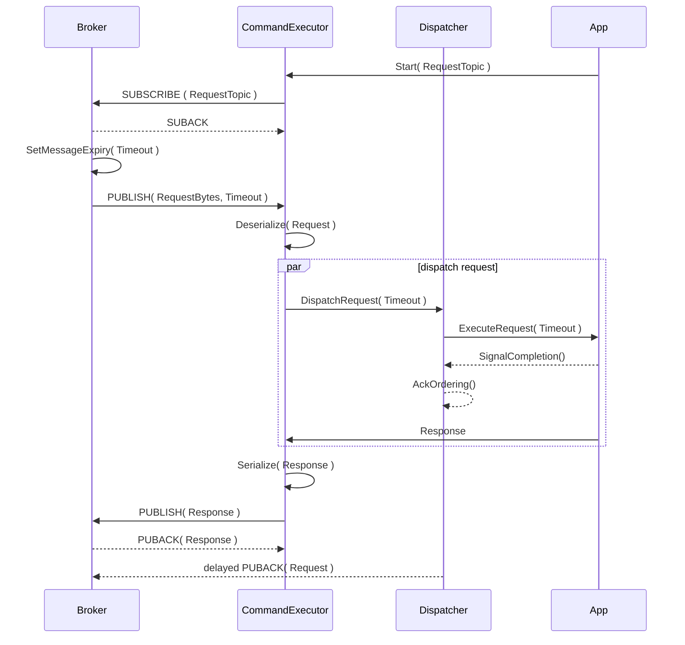
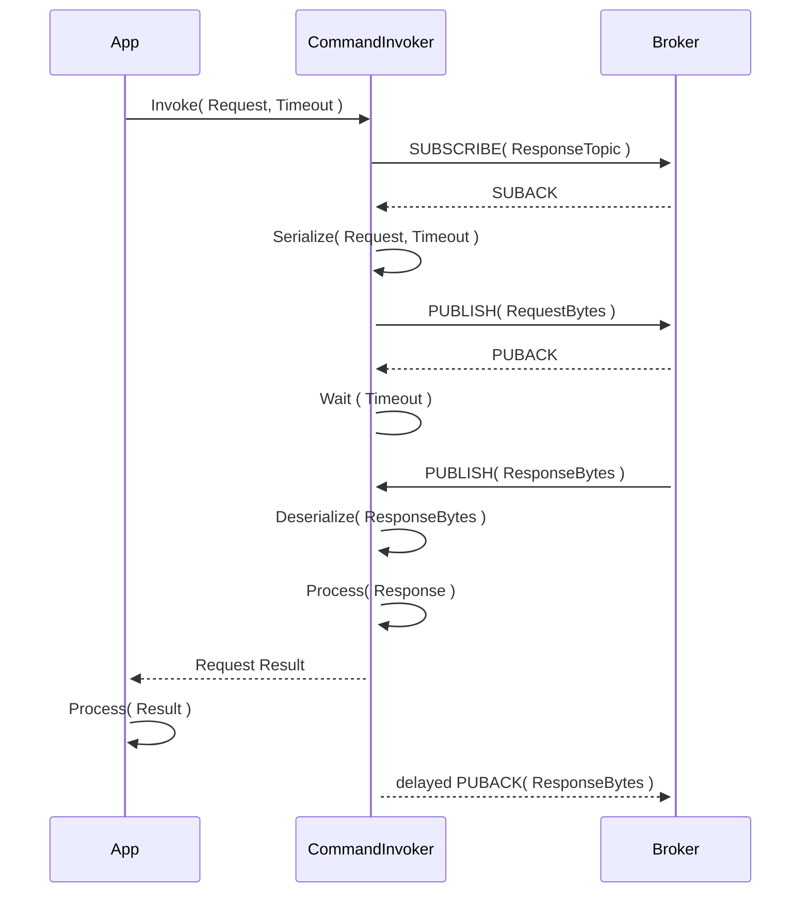

# Commands

Commands build on top of the [RPC protocol](rpc-protocol.md).

## CommandExecutor

The CommandExecutor Binder listens to the Request Topic, deserializes the request and triggers an event that can be implemented by the users application to implement the command. It may be configured to listen to different topics with _wildcards_. Once the command has been executed, the response will be serialized and published to the response topic. The CommandExecutor always uses QoS1, persistent sessions, and _delayed ACKs_ to take advantage of the broker capabilities with persistent sessions and implement guaranteed delivery of method invocations.

> [!NOTE]
>  The Dispatcher also works with an in-memory cache to de-duplicate requests resend on reconnection.

## CommandInvoker

Th CommandInvoker is initiated by the user. It will subscribe to the Response Topic, Serialize the Request and publish a message to the Request Topic. Since the response is not guaranteed, it should be configured with a Timeout. Once the response is received, it will be deserialized and sent back to the client application. A command invoker uses QoS1, persistent session and _delayed ACKs_ to guarantee delivery of request and response.

## The role of server-side data cache

QoS2 differs from QoS1 in which QoS2 guarantees an only-once delivery semantic. QoS2 is almost twice as chatty as QoS2 in terms of messaging, and complex to implement. Some commercial brokers do not implement it. Relying on QoS2 semantic would pose a portability risk, as well create a performance challenge.

For this reason, we elect to utilize QoS1 with a client-provided timeout and a server-side cache to:

1. De-duplicate requests from the point-of-view of the executor!. Replay the same response for request that have already been served within the timeout window.

These are the immediate needs for RPC service. The cache will be later extended with a concept of freshness along the lines of CoAP caching model descripted in RFC 7252 - The Constrained Application Protocol (CoAP) (https://www.rfc-editor.org/rfc/rfc7252.html#page-42).

## Idempotent methods

Please note that CoAP also adopts the concept of _idempotent methods_, defined as methods that always have the _same effect_.

Idempotent methods have special guarantees with regards to cached response data. If a method is idempotent, the response for invoking such method SHOULD always come from data cache. For idempotent methods, it make sense to cache for longer time than the request timeout, because such methods take full advantage of caching for the sake of optimizing performance. For non-idempotent methods instead the cache MUST only serve teh purpose of de-duplicating requests, because for this methods the cache is a helper to achieve QoS2-like guarantees over the timeout window of the client request.

We describe here the high level RPC protocol. 

The [RPC](https://en.wikipedia.org/wiki/Remote_procedure_call) API can be summarized as:

* A Command Invoker to invoke a Remote Procedure, i.e., method or procedure hosted in a different _host_ (a remote host).
* A Command Executor listening for incoming requests.
* A methodology to encode and decode requests and responses the executor and the invoker have to agree on.
* A shared pair of channels the invoker uses to send requests and listen for responses, and the executor uses to listen to requests and send responses (it can be the same channel).

In typical systems, RPC is a point-to-point communication pattern. With MQTT, the RPC protocol introduces one intermediary, the MQTT broker. Please see [RPC Services Overview](../rpc-services.md) for implementation details and opportunities to improve over point-to-point RPC.

## RPC Protocol with MQTT broker

The MQTT RPC protocol is the basis for:

1. All control-plane pattern for Azure IoT Operations SDKs.
1. All messaging patterns that cannot be resolved using Telemetry pattern.
1. A few built-in service for the Azure IoT Operations ecosystem.

Specifically for 2, we need the RPC protocol to create connectors (a.k.a. connectors or adapters) for external data sources that require complex interaction (e.g., Authentication) and caching. Caching specifically is a common requirement that allows an connector to efficiently act as an intermediary between on cluster workloads that participate in pipelined data processing and external data sources that are used to augment the data, e.g., as in the case of data contextualization in manufacturing environments.

The RPC protocol needs to be both dependable and efficient.

The MQTT RPC protocol aims at providing QoS2-like traits at the cost of QoS1, plus a, hopefully, negligible addition, of a response cache on the server side.

### The role of server-side data cache

QoS2 differs from QoS1 in which QoS2 guarantees an only-once delivery semantic. QoS2 is almost twice as chatty as QoS2 in terms of messaging, and complex to implement. Some commercial brokers do not implement it. Relying on QoS2 semantic would pose a portability risk, as well create a performance challenge.

For this reason, we elect to utilize QoS1 with a client-provided timeout and a server-side cache to:

1. De-duplicate requests from the point-of-view of the executor!. Replay the same response for request that have already been served within the timeout window.

These are the immediate needs for RPC service. The cache will be later extended with a concept of freshness along the lines of CoAP caching model descripted in RFC 7252 - The Constrained Application Protocol (CoAP) (https://www.rfc-editor.org/rfc/rfc7252.html#page-42).

### Idempotent methods

Please note that CoAP also adopts the concept of _idempotent methods_, defined as methods that always have the _same effect_.

Idempotent methods have special guarantees with regards to cached response data. If a method is idempotent, the response for invoking such method SHOULD always come from data cache. For idempotent methods, it make sense to cache for longer time than the request timeout, because such methods take full advantage of caching for the sake of optimizing performance. For non-idempotent methods instead the cache MUST only serve teh purpose of de-duplicating requests, because for this methods the cache is a helper to achieve QoS2-like guarantees over the timeout window of the client request.
