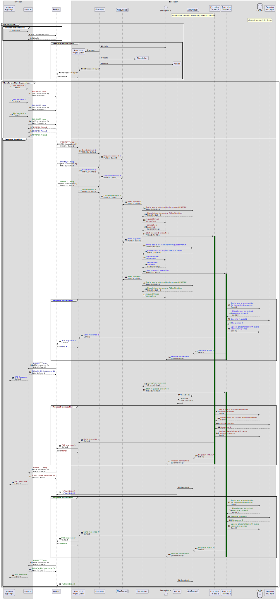
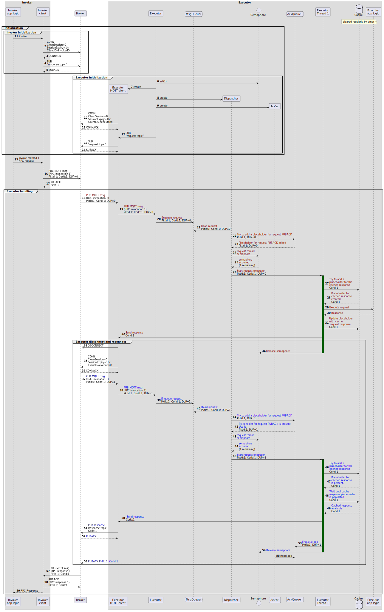
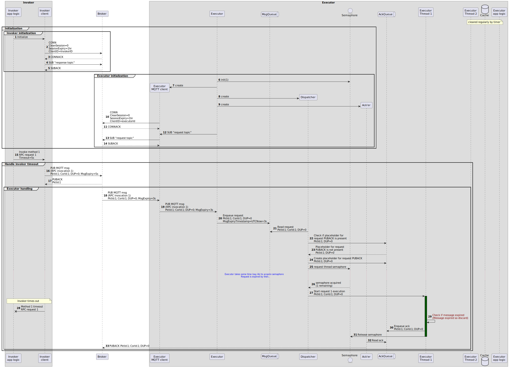

# RPC Protocol

This document contains details for implementing RPC as described here [Command API](command-api.md), when using MQTT protocol/broker as the underlying messaging plane. It lists the interactions of the RPC invokers with the RPC Executors in different scenarios.

> [!NOTE] 
> * The sequence diagrams below omit some details (like parameters such as message expiry, HLCs, etc.) and skip some steps when not relevant, for brevity. 
> * This currently includes only the basic RPC scenarios. It does not including streaming, sending commands to multiple receivers, etc. Those will be added soon.
> * We use PlantUML diagrams here for simplicity, as they were moved from another repo. These will be converted to mermaid to align with the rest of the docs soon. 

## Design

MQTT Semantics:

* Invoker and executor use Persistent sessions and QoS1 for the MQTT communications. 
* They use delayed ACK model - they ACK the PUBLISH only after it has been fully processed. This allows them to be protected from disconnections on the other side - if the executor drops the connection, the invoker doesn't need to worry about it. The executor will receive the request PUBLISH again, without the invoker having to resend it. 
* Because of QoS1 (at-least-once) semantics, there could be duplicates in the system. Both invoker and executor will have dedup logic to handle duplicates. 
* The topics used for request and responses will be as per the [topic structure](topic-structure.md).

Invoker behavior:

* Each invocation request is tied to a task that will complete once the response is available.
* If a message is received (on the invoker's topic) which doesn't have a corresponding task awaited, the message is logged and then discarded.
  
Executor behavior:

* Threading: Executor allows application to specify number of threads to use to execute the requests.
* Request identification: The correlation ID is used as the request identifier - 2 requests with the same correlation ID are expected to be identical. The executor will return the same response for 2 requests with the same correlation ID, without processing the payload of the request. 
 
Caching:
* The RPC implementation uses MQTT with QoS1 (at-least-once) semantics. This implies that in certain scenarios (like disconnects), there will be duplicates in the system - this is in-line with MQTT QoS1 semantics. To avoid the customer applications on the invoker and the executor side to have to deal with the duplicates, we will have caches on both sides which will help de-dup the requests from the system. The caches will use correlation ID as the key and will use a "sliding-window" mechanism, for a configurable period of time (5 mins default). This also protects against non-idempotent operations on the executor. 

## Scenarios

### Basic RPC invocation

This flow covers the basic scenario, where an invoker sends a request to an executor. 

Here is a sequence diagram for this. 

Assumptions: 
* The executor is configured to use 1 thread for executing all requests. This is controlled by a semaphore. 
* The topics used for the request and response, are as per the [topic structure](topic-structure.md).

### Multiple-client invocations

This scenario talks about threading on the executor side. In this scenario, the invoker sends multiple requests to the executor at the same time. 

Scenario:
* Here, the executor is configured to use 2 threads for all requests.
* The invoker makes 3 invoke calls to the executor in parallel (or back-to-back). 
* The executor processes the 3 calls and sends 3 responses back to the invoker.

> [!NOTE] 
> * The 2 threads is "arbitrary" - this can be extended to "n" threads without any hang in the logic on the executor side. 
> * While all requests are made by the same invoker instance here, this can be easily extended to multiple invoker instances without any change the logic on the executor side. 
> * The topics used for the request and response, are as per the [topic doc](topic-structure.md).

### Boundary conditions

Here are the failure cases on the invoker and executor side, that we track. 

#### Invoker disconnects while sending invocation request

* In this scenario, invoker disconnects after sending request PUBLISH but before receiving PUBACK. It reconnects and re-sends the PUBLISH. Assuming the broker got the previous PUB packet, there are 2 PUB packets for the same invocation request - both with same correlation ID, but different publish IDs. 
* The executor uses the cache to de-dup the requests and execute it only once, but two responses are returned. The responses are de-duped on the invoker side. 

> [!NOTE]
> Though the requests are de-duped on the executor side, one response is sent back for every request. This simplifies the scenario when sending the response fails (detailed below). Since disconnects should be rare, the increased network/broker traffic should not be a major concern. 

#### Invoker timeout

* In this scenario, invoker times out waiting for the response, while the executor is still processing it, and re-sends the request PUBLISH. This results in a duplicate PUB for the invoke request, and gets handled in the same way as above. 
* The invoker looks for a response corresponding to a specific correlation ID, not to a specific MQTT Publish. So, the first response on that correlation ID will match, and be processed, and the 2nd one will be discarded. 

#### Executor disconnects before completion of request

* In this scenario, executor disconnects before the request has been fully processed, and a PUBACK for the request has been sent. - In that case, upon reconnection, the broker will resend the request PUB to the executor. The executor will use the cache to de-dup the requests.
* If the response has been sent already, another response will be sent on the response topic, with the same correlation ID. In that case, the invoker will de-dup the responses. 

#### Executor disconnects while sending the response back

This scenario works similar to the one above. Once the connection is re-established - the broker redelivers the request packet.- The executor gets the response from the cache and sends the response on the response topic (without executing the request again).

#### Executor discards expired message request

In this scenario, the executor discards a stale invoke request, based on the message expiry. 

Scenario:
* The application on the invoker sets request expiry to 5s. The invoker sets the message expiry to the same value (5s). That is because typical broker latency is negligible (~10ms).
* The message expiry is updated by the broker when forwarding to the executor (to 3s, assuming it takes the broker 2s to process the message, just as an example). 
* The executor checks the message expiry before starting the request execution. Based on a user set flag, the expired message is discarded without execution and no response is sent back. The default behavior will be to not discard expired messages, and let application on the executor side handle that logic. 
* Invoker also times out.

