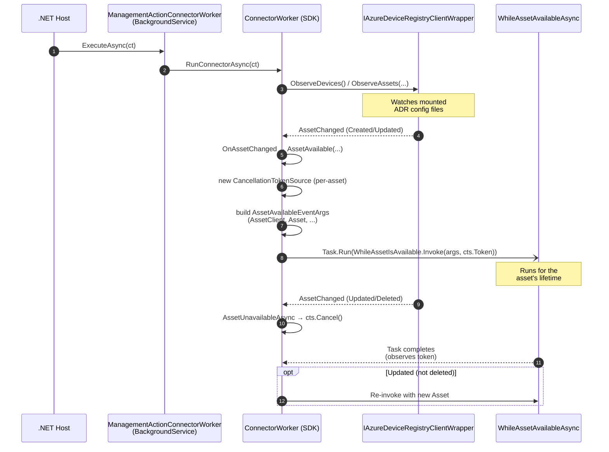
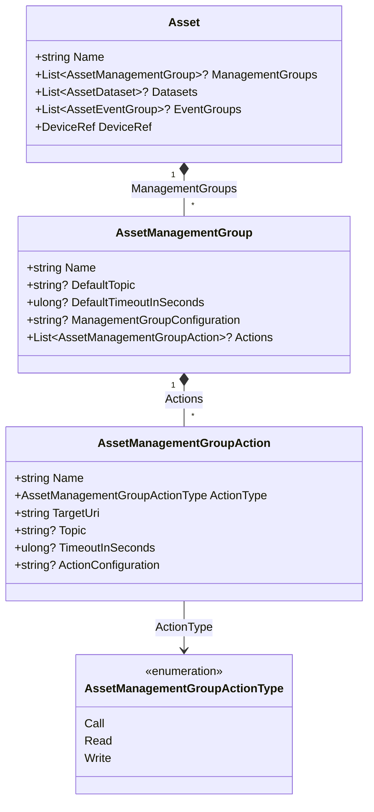
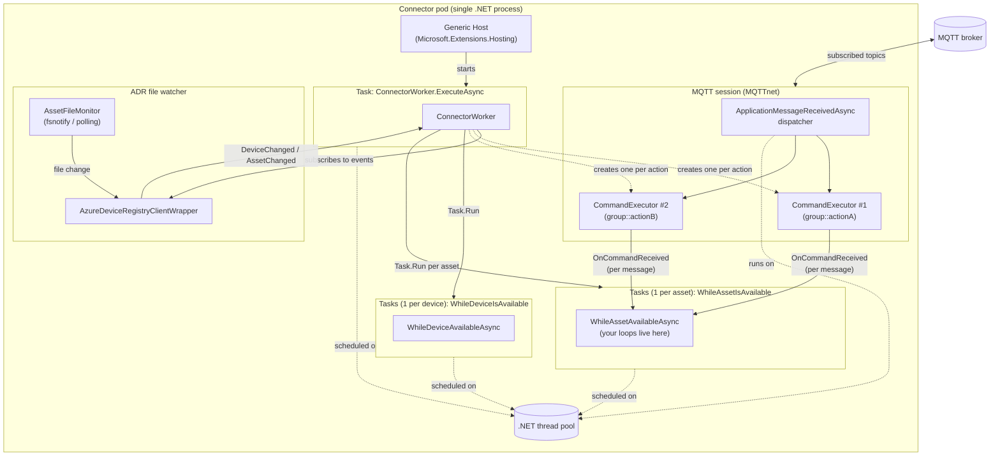
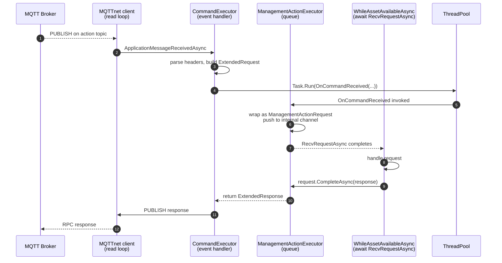
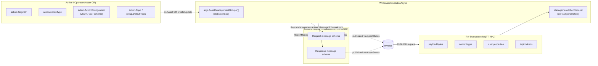
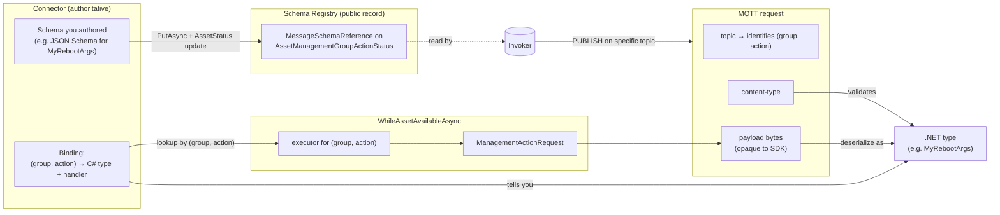
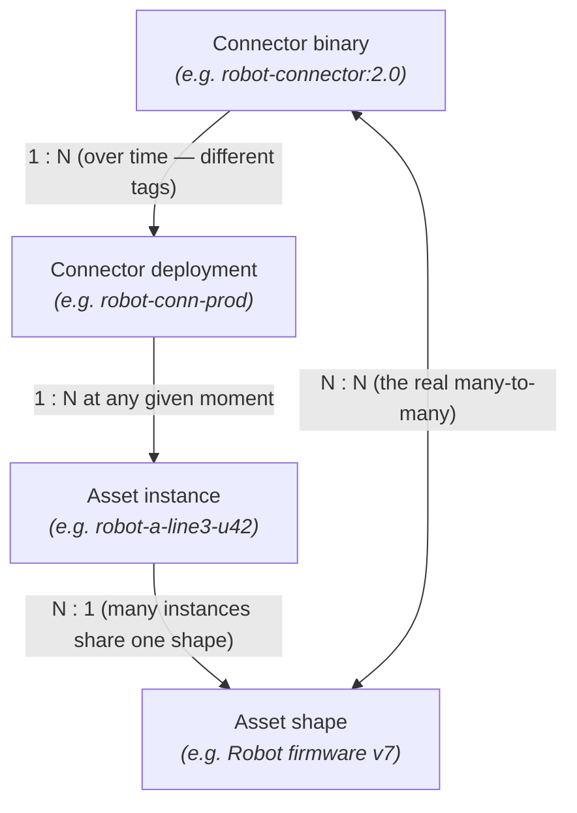

# ManagementActionConnector

Minimal connector sample intended as a scratch pad for the Management Action API
work described in [`management-action-implementation-design.md`](../../../../doc/dev/tmp/management-action-implementation-design.md).

It contains the smallest viable boilerplate to run a `ConnectorWorker`:

- `Program.cs` — host + DI registration.
- `ManagementActionConnectorWorker.cs` — empty `WhileDeviceIsAvailable` /
  `WhileAssetIsAvailable` callbacks, ready to be extended with management action
  executor handling.
- `NoOpMessageSchemaProvider.cs` — placeholder `IMessageSchemaProvider`
  (no dataset/event schemas).
- `appsettings*.json` — default logging config.
- `KubernetesResources/` — test `Device` + `Asset` CRs; the `Asset` declares one
  management group (`device-control`) with one `Call` action (`reboot`). See
  that folder's README for details.

## Run

```powershell
dotnet run --project samples/Connectors/ManagementActionConnector
```

Running outside of the AIO environment will fail while reading MQTT connection
settings — this is expected. Deploy to a cluster (or wire up mock ADR files)
once the Management Action API work is ready to exercise.

---

## Background Q&A

Short answers to the design questions that came up while building this sample.
Kept here so the context survives the chat session.

### 1. Who triggers `WhileAssetAvailableAsync`?

`WhileAssetAvailableAsync` is invoked by the SDK's **`ConnectorWorker`** (in
`src/Azure.Iot.Operations.Connector/ConnectorWorker.cs`), not by user code. This
sample only hands a delegate in via the `WhileAssetIsAvailable` property;
`ConnectorWorker` owns the lifecycle.

The chain:

1. **DI wiring** — `Program.cs` registers `ManagementActionConnectorWorker`
   as a hosted service. Its constructor builds a `ConnectorWorker` and assigns
   our method to the public field:
   ```csharp
   _connector = new ConnectorWorker(...) {
       WhileAssetIsAvailable = WhileAssetAvailableAsync,
   };
   ```
2. **Host start** — the generic host calls `ExecuteAsync` on the background
   service, which calls `_connector.RunConnectorAsync(ct)` →
   `ConnectorWorker.ExecuteAsync`.
3. **ADR observation** — `ConnectorWorker` creates an
   `IAzureDeviceRegistryClientWrapper` via the injected provider, subscribes
   to its `DeviceChanged` / `AssetChanged` events, and calls
   `ObserveDevices()` / `ObserveAssets(...)`. The ADR wrapper watches the
   mounted ADR config files and raises events when devices/assets appear,
   update, or disappear.
4. **`AssetChanged` → `AssetAvailable`** — when ADR reports a created or
   updated asset, `ConnectorWorker`'s `OnAssetChanged` routes to the private
   `AssetAvailable(deviceName, inboundEndpointName, asset, assetName)`
   (ConnectorWorker.cs line ~694).
5. **Callback invoked** — inside `AssetAvailable` (line ~731), a per-asset
   `CancellationTokenSource` is created, an `AssetAvailableEventArgs` is
   built (containing `AssetClient`, `DeviceEndpointClient`, the `Asset`,
   leader-election client, etc.), and `Task.Run` spawns
   `WhileAssetIsAvailable.Invoke(args, cts.Token)` — this is the call into
   `WhileAssetAvailableAsync`.
6. **Cancellation** — when the asset is updated or deleted, or the device
   goes away, `ConnectorWorker` calls `AssetUnavailableAsync`, which cancels
   that per-asset token. Your callback is expected to observe it and return.
   For an update, `ConnectorWorker` then re-invokes the callback with the
   new `Asset` snapshot.

#### Sequence



#### Additional conditions

- If leader election is configured
  (`IConnectorLeaderElectionConfigurationProvider`), the callback runs only
  while this pod is leader; on leadership loss the per-asset token is
  cancelled.
- If `WhileAssetIsAvailable` is left `null`, the `if (WhileAssetIsAvailable != null)`
  guard in `AssetAvailable` skips the invocation entirely.
- The callback runs **per asset**, concurrently with other assets and with
  `WhileDeviceIsAvailable`. Each asset's task is tracked in `_assetTasks`.

---

### 2. Who defines management actions? Do they belong to the Asset?

**Yes — management actions belong to the Asset.** They are part of the
Asset's spec in the Azure Device Registry (ADR). They are **authored, not
discovered**: whoever deploys the `Asset` custom resource decides which
groups and actions exist.

#### Data model (the contract)

In `src/Azure.Iot.Operations.Services/AssetAndDeviceRegistry/Models/`:

- `Asset.ManagementGroups : List<AssetManagementGroup>?` — *"Array of
  management groups that are part of the asset."* (`Asset.cs` line 115)
- `AssetManagementGroup` — `Name`, `Actions`, `DataSource`, `DefaultTopic`,
  `DefaultTimeoutInSeconds`, `ManagementGroupConfiguration`, `TypeRef`.
- `AssetManagementGroupAction` — `Name`, `ActionType` (`Call | Read | Write`),
  `TargetUri`, `Topic`, `TimeoutInSeconds`, `ActionConfiguration`, `TypeRef`.

Each action is identified by the tuple
**`(assetName, managementGroupName, actionName)`**; the pair
`(groupName, actionName)` is the key used internally by the upcoming API
(`"{managementGroupName}::{managementActionName}"`).

#### Relationship diagram



#### Who defines them, and how they reach the connector

```mermaid
flowchart LR
    Author["Author / Operator<br/>(kubectl apply)"]
    CR["Asset CR<br/>(namespaces.deviceregistry.microsoft.com/v1)"]
    ADRSvc["ADR Service"]
    Files["Mounted config files<br/>(in connector pod)"]
    Wrapper["AzureDeviceRegistryClient<br/>+ AssetFileMonitor"]
    CW["ConnectorWorker"]
    User["WhileAssetAvailableAsync<br/>args.Asset.ManagementGroups[*].Actions[*]"]

    Author -->|writes YAML| CR
    CR -->|stored by| ADRSvc
    ADRSvc -->|projects| Files
    Files -->|watched by| Wrapper
    Wrapper -->|AssetChanged event| CW
    CW -->|AssetAvailableEventArgs| User
```



This is exactly the same delivery path already used for `Datasets` and
`EventGroups` — management actions just sit alongside them on the `Asset`.

#### Quick summary

| Concern | Where |
|---|---|
| Defined by | Asset author (YAML / `Asset` CRD) |
| Stored in | Azure Device Registry (ADR) |
| Delivered to connector via | Mounted config files → `AzureDeviceRegistryClient` → `AssetChanged` |
| Surfaced in SDK as | `Asset.ManagementGroups[].Actions[]` on `AssetAvailableEventArgs.Asset` |
| Owned by | The `Asset` — lifecycle, status, and teardown all follow the asset |
| Identified by | `(managementGroupName, actionName)` within that asset |

See `KubernetesResources/mgmt-action-asset-definition.yaml` in this sample
for a concrete single-action Asset CR you can deploy for API experiments.

---

### 3. Connector runtime model: tasks, loops, and where `ManagementActionExecutor` lives

> *"`Task.Run(WhileAssetIsAvailable.Invoke(args, cts.Token))` runs for the
> asset's lifetime — what does that mean? Where does `ManagementActionExecutor`
> live? Is there a loop inside it, or is it called when an action message
> arrives?"*

Short answer:

- **No dedicated thread per anything.** Everything is `async` on the .NET
  thread pool.
- **`WhileAssetIsAvailable` runs as one long-lived `Task`** per asset —
  the task exists until the user delegate returns. The SDK does not poll it.
- **`ManagementActionExecutor` has no internal loop.** It is a thin wrapper
  around `CommandExecutor<byte[], byte[]>`, which is purely **event-driven**:
  the underlying MQTT client (MQTTnet) invokes a delegate each time a
  message arrives on the subscribed action topic.
- **The only loop you typically need is the one you write** inside
  `WhileAssetAvailableAsync`, awaiting `executor.RecvRequestAsync(ct)`.

Details below.

#### 3.1 What does `Task.Run(...)` actually do here?

Relevant code (`ConnectorWorker.cs` ~line 736):

```csharp
Task userTask = Task.Run(async () =>
{
    try
    {
        await using AssetAvailableEventArgs args = new(...);
        await WhileAssetIsAvailable.Invoke(args, assetTaskCancellationTokenSource.Token);
    }
    catch (OperationCanceledException) { /* expected on shutdown/update */ }
});
_assetTasks.TryAdd(key, new(userTask, assetTaskCancellationTokenSource));
```

What this means at the runtime level:

1. `Task.Run` queues the async lambda onto the **thread pool**. It returns
   the `Task` immediately; `ConnectorWorker` does **not** `await` it here —
   it just stores it in `_assetTasks`. That is why the SDK remains responsive
   to further ADR events.
2. The lambda `await`s `WhileAssetIsAvailable.Invoke(...)`, which is your
   `WhileAssetAvailableAsync`. As long as your method keeps `await`ing
   something, the state machine stays alive and the `Task` stays in the
   `WaitingForActivation` state. No OS thread is pinned — when you're
   awaiting, the thread is returned to the pool.
3. **"Runs for the asset's lifetime"** means exactly that: the `Task` stays
   incomplete until your method returns (either normally, by reaching the
   bottom, or by letting the `OperationCanceledException` propagate when the
   token fires).
4. When ADR reports that the asset was updated/deleted,
   `AssetUnavailableAsync` calls `cts.Cancel()` on *that* asset's token.
   Your awaits should observe the token and unwind — then the `Task`
   completes and the SDK may re-invoke `WhileAssetIsAvailable` for the
   updated asset (see Q1).

Typical user-side shape inside `WhileAssetAvailableAsync` for a single action:

```csharp
var executor = await args.AssetClient
    .GetManagementActionExecutorAsync("device-control", "reboot", ct);

while (!ct.IsCancellationRequested)
{
    ManagementActionRequest? request = await executor.RecvRequestAsync(ct);
    if (request is null) break;           // executor shutdown
    await request.CompleteAsync(response, ct);
}
```

The `while` here is your own loop. It awaits the next request; the thread
is free while nothing is pending.

#### 3.2 Where does `ManagementActionExecutor` actually live?

Per the design doc, `ManagementActionExecutor` wraps
`CommandExecutor<byte[], byte[]>` from `Azure.Iot.Operations.Protocol`. The
reference-implementation plan:

- **One `CommandExecutor` per management action**, created by
  `ConnectorWorker` (or by `AssetClient`) at asset-available time.
- Its `RequestTopicPattern` is taken from
  `AssetManagementGroupAction.Topic` (falling back to
  `AssetManagementGroup.DefaultTopic`), with topic tokens resolved against
  the device / endpoint / asset context.
- `CommandExecutor.StartAsync()` performs an MQTT `SUBSCRIBE` to that topic
  and registers a handler on `IMqttClient.ApplicationMessageReceivedAsync`
  (see `CommandExecutor.cs` line 115).
- `CommandExecutor.StopAsync()` / `DisposeAsync()` unsubscribes and removes
  the handler (line 705).

**There is no loop inside `CommandExecutor`.** Look at what happens when a
message arrives (`CommandExecutor.cs` ~line 233):

```csharp
ExtendedResponse<TResp> extended =
    await Task.Run(() => OnCommandReceived(extendedRequest, commandCts.Token))
              .WaitAsync(ExecutionTimeout);
```

That is the entire dispatch. MQTTnet raises
`ApplicationMessageReceivedAsync`; the executor's handler parses headers,
builds an `ExtendedRequest<TReq>`, and schedules `OnCommandReceived` on the
thread pool. `ManagementActionExecutor` plugs into `OnCommandReceived` and
hands the request off to the user's `RecvRequestAsync` queue.

So the answer to *"loop inside, or called when message arrives?"* is **the
latter**. It is an event handler, registered once with the MQTT client,
firing per message.

#### 3.3 The full picture — processes, tasks, event sources



Things to notice:

- Only **one OS-level "loop"** is involved, and it's inside MQTTnet (its
  network read loop). Everything downstream is callback-driven on the
  thread pool.
- `ConnectorWorker.ExecuteAsync` is itself just one long-lived task — it
  mostly sits awaiting ADR events and leader-election changes.
- Asset tasks are **independent**: cancelling one does not affect the
  others. Same for device tasks.
- A `CommandExecutor` is **not** a task — it's a registration on the MQTT
  client plus some per-message state. Its "lifetime" is the interval
  between `StartAsync` and `StopAsync`/`DisposeAsync`.

#### 3.4 Lifetime of a single request



Key points:

- The user loop in step 7 is where **all application work happens**. The MQTT
  dispatcher is not blocked during step 6 onward — `OnCommandReceived` was
  already handed off to the thread pool.
- Between requests, the user task is **only holding a continuation** on the
  `RecvRequestAsync` await — zero CPU, no threads pinned.
- Cancellation token from `WhileAssetIsAvailable` propagates into
  `RecvRequestAsync`; on cancel, it throws `OperationCanceledException` and
  the user loop exits. `ManagementActionExecutor.DisposeAsync` then tears
  down the underlying `CommandExecutor`, which unsubscribes from the broker.

#### 3.5 Recap of "runtime configuration"

| Layer | Count per process | Implementation |
|---|---|---|
| Host | 1 | `Microsoft.Extensions.Hosting` generic host |
| `BackgroundService` → `ConnectorWorker.ExecuteAsync` | 1 | long-lived `Task` |
| `WhileDeviceIsAvailable` tasks | 1 per (device, endpoint) | `Task.Run` on thread pool |
| `WhileAssetIsAvailable` tasks | 1 per asset | `Task.Run` on thread pool |
| MQTT session / network loop | 1 | MQTTnet internal |
| `CommandExecutor` | 1 per management action | event handler on MQTT client |
| `ManagementActionExecutor` | 1 per management action | wraps a `CommandExecutor` + internal request queue |
| `AssetFileMonitor` | 1 | fsnotify or polling watcher |

No custom threads, no spin loops, no timers doing work — just async tasks
and MQTT callbacks.

---

### 4. Do actions have parameters? Where are they defined, how do we access them?

**Yes — but there are two different things both sometimes called
"parameters". Keep them separated:**

| Kind | Lives where | Per-invocation or static? | Purpose |
|---|---|---|---|
| **Static action contract** | `AssetManagementGroupAction` fields + registered request/response *message schemas* | Static (part of the asset spec) | Describes the shape of requests/responses, target resource, timeouts |
| **Per-invocation arguments** | MQTT request **payload** (+ content-type, user properties, topic tokens) | Per call | The actual values the caller wants to pass this time |

Only the first kind is stored on the Asset CR. The second kind is carried
by each individual MQTT RPC message at runtime and surfaced on
`ManagementActionRequest`.

#### 4.1 Static contract — what the Asset CR tells you

From `AssetManagementGroupAction` (see Q2 for the full field list), the
parameter-ish fields are:

| Field | Type | Role |
|---|---|---|
| `TargetUri` | `string` | Identifies the device-side resource the action targets (e.g. `device://reboot`, an OPC UA node id, a REST path, …). Schema is action-type-specific. |
| `ActionType` | `Call \| Read \| Write` | Tells the connector the RPC shape. `Read` typically has empty request payload + returns the value; `Write` carries the new value in the payload; `Call` is an arbitrary RPC. |
| `ActionConfiguration` | `string?` (usually JSON) | Free-form static config for this action (e.g. protocol-specific options, validation hints, defaults). Opaque to the SDK — **your connector interprets it.** |
| `Topic` / group `DefaultTopic` | `string?` | The MQTT topic pattern the executor subscribes to. Not a "parameter" per se, but it's where topic tokens come from. |
| `TimeoutInSeconds` / group `DefaultTimeoutInSeconds` | `ulong?` | Execution time budget. |
| `TypeRef` / group `TypeRef` | `string?` | Optional reference to a reusable action definition / type catalog. |

The **shape of the request/response payload** is *not* a field on
`AssetManagementGroupAction`. Instead, the design uses two related
mechanisms:

- `ReportManagementActionRequestMessageSchemaAsync(group, action, schema)`
  and `ReportManagementActionResponseMessageSchemaAsync(...)` on
  `AssetClient` — the connector publishes the JSON schema (or other
  supported format) to the Schema Registry and records a
  `MessageSchemaReference` on the asset status. That reference tells the
  *invoker* what to send, and tells any downstream tooling how to validate.
- The status side: `AssetManagementGroupActionStatus.RequestMessageSchemaReference`
  / `...ResponseMessageSchemaReference` (see
  `Services/AssetAndDeviceRegistry/Models/AssetManagementGroupActionStatus.cs`).

So:

- **Authors describe*: "this action exists, targets *X*, uses topic *T*"**
  in the Asset CR (`managementGroups[*].actions[*]`).
- **The connector describes the payload shape** at runtime via schema
  registration.
- **Callers send the actual parameter values** as the request payload per
  invocation.

#### 4.2 How you access the static contract in code

Inside `WhileAssetAvailableAsync`, everything is on `args.Asset`:

```csharp
foreach (var group in args.Asset.ManagementGroups ?? [])
foreach (var action in group.Actions ?? [])
{
    string uri        = action.TargetUri;
    var    kind       = action.ActionType;               // Call | Read | Write
    string? rawCfg    = action.ActionConfiguration;      // JSON string or null
    string? topic     = action.Topic ?? group.DefaultTopic;
    ulong   timeoutS  = action.TimeoutInSeconds
                        ?? group.DefaultTimeoutInSeconds
                        ?? 30UL;

    // Parse your own action-specific config schema:
    var cfg = rawCfg is null
        ? new MyActionConfig()
        : JsonSerializer.Deserialize<MyActionConfig>(rawCfg)!;

    // ... build executor, start processing ...
}
```

Per the design doc, `ActionConfiguration` is deliberately opaque — the
connector owns its schema. A SQL connector might put `{ "procedure":
"sp_restart", "params": [...] }`; an OPC UA connector might put node
ids; the `reboot` sample in this repo just uses `'{}'`.

#### 4.3 How you access per-invocation parameters in code

Per-invocation data arrives as a `ManagementActionRequest` (see design
§2). The fields that carry caller input:

| Field | What it carries |
|---|---|
| `Payload : byte[]` | **The actual argument bytes.** Interpret per `ContentType`. For a `Write`, this is the new value. For a `Call`, it's the structured arguments. For a `Read`, typically empty. |
| `ContentType : string` | MIME type (`application/json`, `application/cbor`, …). |
| `FormatIndicator : FormatIndicator` | MQTT 5 PFI — text vs. bytes hint. |
| `CustomUserData : Dictionary<string,string>` | MQTT 5 user properties the caller set. Useful for metadata / correlation keys. |
| `TopicTokens : Dictionary<string,string>` | Values extracted from wildcard segments of the subscribed topic pattern. If your topic is `mgmt/{deviceName}/.../reboot`, the invoker's actual topic might resolve `{deviceName}` → `"thermostat-1"` and you'll find that in here. |
| `Timestamp : HybridLogicalClock?` | HLC from the invoker, if provided. |
| `InvokerId : string?` | Caller identity, if the broker/auth policy exposes it. |

Pulling it together:

```csharp
ManagementActionRequest request = await executor.RecvRequestAsync(ct);
if (request is null) return;

// 1. Well-known metadata
string device = request.TopicTokens.TryGetValue("deviceName", out var d) ? d : "?";

// 2. Caller-sent custom headers
string? correlation = request.CustomUserData.GetValueOrDefault("x-correlation-id");

// 3. The actual arguments — interpret per the registered request schema
var payload = request.ContentType switch
{
    "application/json" => JsonSerializer.Deserialize<MyRebootArgs>(request.Payload),
    _ => throw new NotSupportedException(request.ContentType),
};

// 4. Do the work, then answer
await request.CompleteAsync(new ManagementActionResponse {
    Payload     = JsonSerializer.SerializeToUtf8Bytes(new { ok = true }),
    ContentType = "application/json",
    CloudEvent  = null,
}, ct);
```

#### 4.4 How the two kinds flow together



#### 4.5 Cheat-sheet

- **"What parameters does action X accept?"** — answered by the
  **registered request message schema** (JSON Schema / other), which the
  connector reports via `ReportManagementActionRequestMessageSchemaAsync`
  and which ends up as a `MessageSchemaReference` on the asset status.
- **"Which device thing does action X poke?"** — `action.TargetUri`
  (+ `action.ActionConfiguration` for connector-specific extras).
- **"What did *this particular* caller pass?"** — `request.Payload`
  (interpreted per `request.ContentType`), plus `request.CustomUserData`
  and `request.TopicTokens` for sideband metadata.
- **"Where do I write my parsing code?"** — inside
  `WhileAssetAvailableAsync`, right after `await executor.RecvRequestAsync(ct)`.

---

### 5. In the example, how do I know the payload is `MyRebootArgs`?

Because **the connector — not the SDK and not the broker — defines that
contract**, and you have two independent clues that tell you which C#
type applies to a given `ManagementActionRequest`:

1. **The executor identifies the action.** You obtained it via
   ```csharp
   var executor = await args.AssetClient
       .GetManagementActionExecutorAsync("device-control", "reboot", ct);
   ```
   Every `ManagementActionRequest` that comes out of *that* executor's
   `RecvRequestAsync` is, by construction, an invocation of
   `device-control::reboot`. So if you already decided that `reboot`'s
   input type is `MyRebootArgs`, there is no ambiguity — the `(group,
   action)` tuple is your dispatch key.
2. **You published the request's schema to the Schema Registry** (via
   `AssetClient.ReportManagementActionRequestMessageSchemaAsync(...)`).
   That schema is the public contract: invokers see it through the asset's
   status (`RequestMessageSchemaReference`) and serialize accordingly. Your
   `MyRebootArgs` C# class is just the .NET projection of that schema.

So the flow for picking a deserialization type is always:

```
executor identity → C# request type you own → parse request.Payload
```

Nothing on the wire tells you "this is `MyRebootArgs`". There is no
self-describing type tag. The binding is by **convention**, rooted in the
schema you published and the action name you bound the executor to.

#### 5.1 Defense-in-depth checks

Even though the identity comes from the executor, a well-behaved handler
does some validation before trusting the payload:

```csharp
ManagementActionRequest request = await executor.RecvRequestAsync(ct);
if (request is null) return;

// (a) Reject wrong content-type — schemas are content-type-specific.
if (!string.Equals(request.ContentType, "application/json", StringComparison.OrdinalIgnoreCase))
{
    await request.CompleteAsync(new ManagementActionResponse {
        Payload     = Array.Empty<byte>(),
        ContentType = "application/json",
        CloudEvent  = null,
        ApplicationError = new ManagementActionApplicationError {
            ErrorCode    = "UnsupportedContentType",
            ErrorPayload = $"expected application/json, got {request.ContentType}",
        },
    }, ct);
    return;
}

// (b) Optional: version check via a custom header you defined in your schema
if (request.CustomUserData.TryGetValue("x-schema-version", out var v) && v != "1")
{
    /* reject with SchemaVersionMismatch */
}

// (c) Now it is safe to deserialize to the type you chose for this action
MyRebootArgs? parsed;
try
{
    parsed = JsonSerializer.Deserialize<MyRebootArgs>(request.Payload);
}
catch (JsonException ex)
{
    await request.CompleteAsync(/* application error with ex.Message */, ct);
    return;
}
```

#### 5.2 What if I route many actions through the same code?

If you prefer a single `Task` that multiplexes several actions, make the
dispatch explicit — keep a table of `(group, action) → type + handler`:

```csharp
record ActionBinding(Type RequestType, Func<object, CancellationToken, Task<object>> Handle);

var bindings = new Dictionary<(string Group, string Action), ActionBinding>
{
    [("device-control", "reboot")] =
        new(typeof(MyRebootArgs),
            async (p, c) => await HandleRebootAsync((MyRebootArgs)p, c)),

    [("device-control", "set-setpoint")] =
        new(typeof(MySetpointArgs),
            async (p, c) => await HandleSetpointAsync((MySetpointArgs)p, c)),
};
```

Then, for each executor you created, when a request arrives you look up
the binding by the `(group, action)` pair that **you already know**
(because you created that executor yourself). The payload bytes are still
opaque until you deserialize them against the type the binding tells you
to use.

#### 5.3 Diagram: where the type binding actually lives



#### 5.4 TL;DR

- The SDK hands you `byte[]` plus a `ContentType`. It does **not** know,
  and cannot tell you, what .NET type to deserialize into.
- The **(group, action) identity of the executor** is what decides the
  type; that's the whole point of having a separate executor per action.
- The **schema you publish** is what makes that contract observable to
  callers.
- Treat `MyRebootArgs` as "the .NET representation of the schema I
  registered for `device-control::reboot`". It's a convention you own.

---

### 6. Relationship between assets, asset "shapes", connector deployments, and connector binaries

> *"There's sort of a many-to-many relationship between Asset and Connector —
> the same Asset (type, probably) like robot A can have many versions
> deployed, and many Connectors could be deployed for each robot version."*

The intuition is right, but the many-to-many actually lives at a specific
level. Pulling the concepts apart makes the whole topology clearer.

#### 6.1 Four distinct entities, not two

| Entity | What it is | Runtime or design-time? |
|---|---|---|
| **Asset instance** (`Asset` CR) | One row in ADR for one physical/logical thing — e.g. `robot-a-line3-unit42`. | Runtime |
| **Asset shape** ("type") | The *schema* of `managementGroups[].actions[]` + conventions on `TargetUri` / `ActionConfiguration`. Not a first-class field — it's by convention. | Stable across many instances, varies across device generations |
| **Connector deployment** | A running Kubernetes Deployment (or similar) of a specific connector image. Has replicas, possibly leader election. | Runtime |
| **Connector binary** | The compiled image. Contains the `(group, action) → C# type + handler` table — the *"what the bytes mean"* code. | Design-time, built once, then versioned |

#### 6.2 The actual cardinalities



| Relationship | Cardinality | Why |
|---|---|---|
| Connector binary ↔ Connector deployment | **1 : N** over time | You can run `:1.2` in staging and `:2.0` in prod from the same image repo. |
| Connector deployment ↔ Asset instance | **1 : N** at any given moment | ADR routes each asset to exactly one connector deployment (via the device's inbound-endpoint connector reference). |
| Asset instance ↔ Asset shape | **N : 1** | Many `robot-a-*` rows all follow the same `managementGroups` layout. |
| **Asset shape ↔ Connector binary** | **N : N** | **This is the many-to-many you're sensing.** One binary can serve several shapes (v6 + v7); one shape can be served by several binary versions as it evolves. |

So the "many-to-many" lives at the **shape ↔ binary** level, not at runtime.
At runtime, an individual asset instance is owned by a single connector
deployment at a time.

#### 6.3 Independent versioning on each side

Both axes version independently — that's what makes it *feel* like a mess
until you separate them.

```
Asset shape            Connector binary
─────────────          ─────────────────
Robot v6  ──────────▶  robot-connector:1.2  (handles v6 only)
          ──────────▶  robot-connector:1.3  (handles v6 + v7)
Robot v7  ──────────▶  robot-connector:1.3
          ──────────▶  robot-connector:2.0  (handles v7 + v8)
Robot v8  ──────────▶  robot-connector:2.0
```

Operational consequences:

1. **One binary can support multiple shapes.** The `(group, action) → Type + Handler`
   dispatch table just needs entries for every `(shape, action)` combination
   you care about. Unknown pairs → reply with
   `ManagementActionApplicationError { ErrorCode = "UnknownAction" }`.
2. **Multiple binary versions can coexist.** Deploy `:2.0` alongside `:1.3`
   and migrate asset instances one at a time by editing each device's
   connector reference — standard blue/green, not AIO-specific.

#### 6.4 The fence: what you cannot do without a code change

| Want to … | How |
|---|---|
| Support a new firmware revision that added an action | Ship a new connector binary version with an added entry in the dispatch table. |
| Deprecate an old action | Leave the handler in place (returns `ApplicationError("Deprecated")`), remove from the asset CR template, then remove the handler in a later release once no CRs reference it. |
| Run v1 and v2 of the same connector in one cluster | Two Deployments, each with its own image tag. Route assets by editing the `Device` CR's connector reference. |
| Split a shape across several binaries | Usually not worth it — dispatch on `(group, action)` inside one binary, optionally using a shape marker in `ActionConfiguration` or asset metadata. |
| Support a genuinely unknown future shape with no code change | **Not possible by design.** The payload type binding is code. Build a generic passthrough action if you need it (e.g. `raw-call` that forwards `byte[]` to a known device URL), but that's your own protocol, not a SDK feature. |

"Shape" is part of the connector's contract, even though ADR delivers
instances of it dynamically. ADR controls *topology* (which assets exist,
which topics they listen on); the connector binary controls *protocol*
(what the bytes of each named action mean).

#### 6.5 Mental model: compare to Kubernetes services

- **Kubernetes** scales pods up/down, moves services between nodes, adds or
  removes replicas — the *deployment topology* is dynamic.
- **The REST endpoints each service exposes** — `POST /reboot`, with a
  specific JSON body — are **static per binary**; changing them requires
  a new image.

Management actions work the same way. ADR is the "Kubernetes" of the asset
world (topology, routing, lifecycle). The connector binary is the
"service" (fixed protocol contract). The `(group, action)` name is the
stable URL-equivalent; the message schema is the JSON body contract.

#### 6.6 Exercising this in the sample

With the single asset CR in `KubernetesResources/mgmt-action-asset-definition.yaml`
you're at the simplest point on the matrix — one instance, one shape, one
binary. To exercise other points:

| Scenario | How |
|---|---|
| Many instances sharing a shape | Copy the asset CR, bump `metadata.name`, apply multiple times. The same pod will get `AssetAvailable` for each and spawn per-asset tasks. |
| Two binary versions side by side | Build two image tags; deploy two Deployments; point different `Device` CRs at each. |
| Shape evolution over time | `kubectl edit` the asset CR and add/remove/rename a `managementGroups[].actions[]` entry. You'll see `ManagementActionUpdated` / `…UpdatedWithNewExecutor` / `ManagementActionDeleted` fire in your handler (design doc §4 / §5 / §6). |

#### 6.7 TL;DR

- **Runtime ownership is 1 : N** — one connector deployment owns many
  assets; each asset is owned by exactly one deployment at a time.
- **The real many-to-many is shape ↔ binary**, and both sides version
  independently.
- The SDK does **not** magically adapt to new shapes without a code
  change. "Shape" is part of the connector's contract, delivered by ADR
  but meaningful only to the code that was built to handle it.

