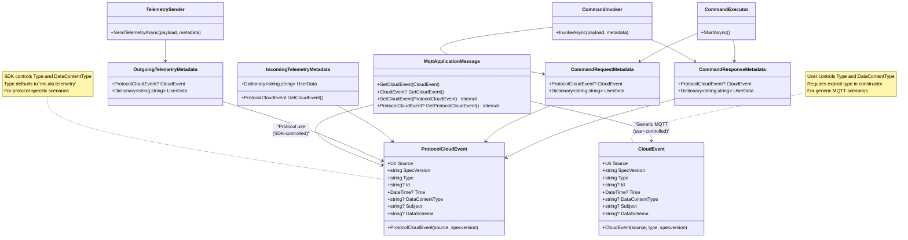
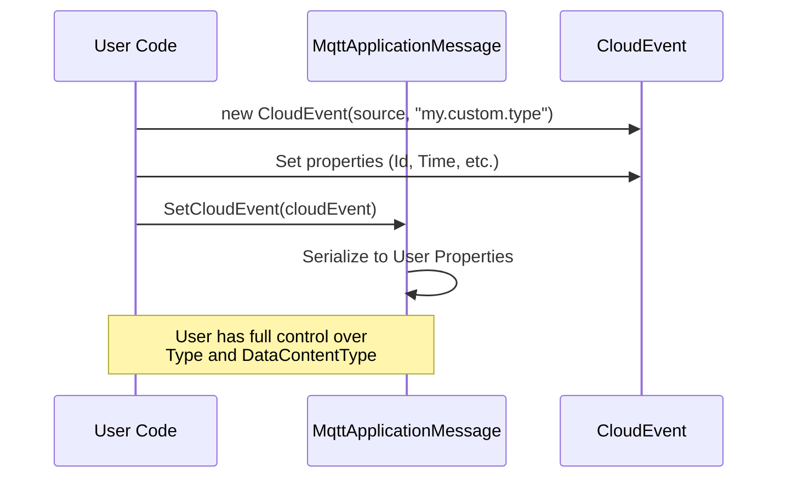
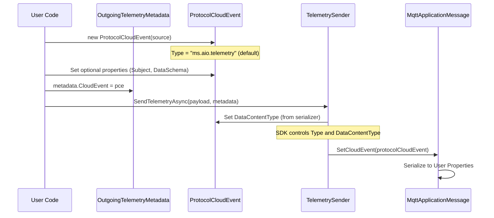
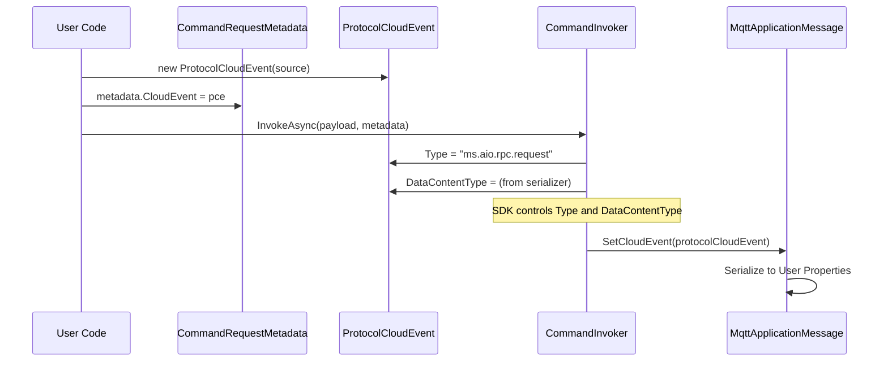

# CloudEvent Architecture

This document describes the dual CloudEvent implementation in Azure IoT Operations Protocol SDK.

## Overview

The SDK provides two CloudEvent classes to handle different usage scenarios:

1. **CloudEvent** - For generic MQTT scenarios where users control all properties
2. **ProtocolCloudEvent** - For protocol-specific scenarios where the SDK controls Type and DataContentType

## Class Diagram



## Usage Scenarios

### Generic MQTT Usage (CloudEvent)



### Protocol Telemetry Usage (ProtocolCloudEvent)



### Protocol RPC Usage (ProtocolCloudEvent)



## Property Control Matrix

| Property | CloudEvent | ProtocolCloudEvent |
|----------|-----------|-------------------|
| **Source** | User sets in constructor | User sets in constructor |
| **Type** | User sets in constructor (required) | SDK sets based on context (default: "ms.aio.telemetry") |
| **SpecVersion** | User sets (defaults to "1.0") | User sets (defaults to "1.0") |
| **Id** | User sets or auto-generated | User sets or auto-generated |
| **Time** | User sets or auto-generated | User sets or auto-generated |
| **DataContentType** | User sets (public setter) | SDK sets from serializer (internal setter) |
| **Subject** | User sets (optional) | User sets (optional) |
| **DataSchema** | User sets (optional) | User sets (optional) |

## Design Rationale

### Why Two Classes?

1. **Type Safety**: Compile-time enforcement prevents users from accidentally modifying SDK-controlled properties in protocol contexts
2. **Clear Intent**: Separate classes make it obvious which usage pattern applies
3. **Flexibility**: Generic CloudEvent supports custom MQTT scenarios outside the protocol framework
4. **SDK Control**: ProtocolCloudEvent ensures consistent behavior across telemetry and RPC operations

### Internal Setters

The `Type` and `DataContentType` properties in `ProtocolCloudEvent` use `internal set` to:
- Prevent external modification by user code
- Allow SDK components to set appropriate values based on context
- Use `InternalsVisibleTo` for trusted assemblies (e.g., Azure.Iot.Operations.Connector)

### Default Values

- **ProtocolCloudEvent.Type**: Defaults to `"ms.aio.telemetry"`, overridden by:
  - TelemetrySender: keeps default `"ms.aio.telemetry"`
  - CommandInvoker: sets to `"ms.aio.rpc.request"`
  - CommandExecutor: sets to `"ms.aio.rpc.response"`

- **ProtocolCloudEvent.DataContentType**: Automatically set from the payload serializer's content type

## Migration Guide

For code using the old single CloudEvent class in protocol contexts:

### Before
```csharp
var metadata = new OutgoingTelemetryMetadata
{
    CloudEvent = new CloudEvent(new Uri("aio://device"), "ms.aio.telemetry")
};
```

### After
```csharp
var metadata = new OutgoingTelemetryMetadata
{
    CloudEvent = new ProtocolCloudEvent(new Uri("aio://device"))
    // Type is automatically "ms.aio.telemetry"
    // DataContentType is set by SDK from serializer
};
```

### Generic MQTT Usage (Unchanged)
```csharp
var cloudEvent = new CloudEvent(
    source: new Uri("aio://device"),
    type: "com.example.custom"
);
cloudEvent.DataContentType = "application/json";
message.SetCloudEvent(cloudEvent);
```
